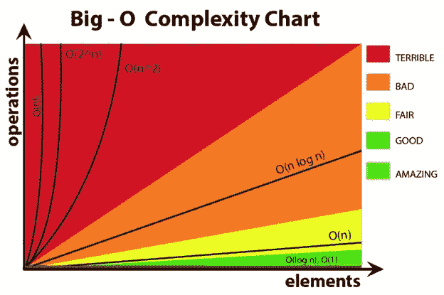

# 计算机算法中的空间和时间复杂性

> 原文：<https://towardsdatascience.com/space-and-time-complexity-in-computer-algorithms-a7fffe9e4683?source=collection_archive---------0----------------------->

## 计算机科学中的时空权衡让你的生活更轻松


阿里安·达尔维什在 [Unsplash](https://unsplash.com?utm_source=medium&utm_medium=referral) 上拍摄的照片

在这篇文章中，我将讨论由 Juris Hartmanis 和 Richard E. Stearns 开发的[计算复杂性](https://en.wikipedia.org/wiki/Computational_science)来分析算法的难度。

我们都知道，人类天性渴望寻找一种有效的方式来组合他们的日常任务。创新和技术背后的主导思维过程是通过提供解决人们可能遇到的问题的方法来使人们的生活更加轻松。同样的事情也发生在计算机科学和数字产品领域。我们编写的算法效率高，占用内存少，性能更好。

**时间复杂度**是算法执行每组指令所花费的时间。当一个简单的问题可以用不同的方法解决时，选择最有效的算法总是更好。

**空间复杂度**通常指算法消耗的内存量。它由两个不同的空间组成；*辅助空格* 和*输入空格*。

时间因素通常比空间因素更重要。

> 注意:—在计算机编程中，你可以使用 256MB 来解决一个特定的问题。如果创建一个大于 10⁸的数组，将会出现错误。此外，您不能创建大小为 10⁶的数组，因为分配给函数的最大空间是 4MB。我们必须定义一个全局来解决这个问题。

虽然它们看起来微不足道，但这些因素在决定一个计算机程序如何被开发、设计以及它如何给用户的生活增加价值方面是至关重要的。记住，时间就是金钱。

## 创建一个好的算法需要什么？


作者图片

一个好的算法是在执行过程中花费较少的时间并节省空间的算法。理想情况下，我们必须在空间和时间之间找到一个中间点，但我们可以满足于平均水平。让我们看看一个简单的算法，找出两个数字的总和。

```
**Step #01:** Start.**Step #02:** Create two variables (a & b).**Step #03:** Store integer values in ‘a’ and ‘b.’ -> **Input****Step #04:** Create a variable named ‘Sum.’**Step #05:** Store the sum of ‘a’ and ‘b’ in a variable named ‘Sum’ -> **Output****Step #06:** End.
```

它就像看起来一样简单。

> **注:** —如果你是一个游戏玩家，你会知道游戏的平均大小(在硬盘中)与日俱增，加载时间也在缩短。同样，在网站中，加载时间显著减少，其服务器的存储空间与日俱增。因此，正如我们之前讨论的，就空间&时间而言，时间在任何软件的开发阶段都起着至关重要的作用。

根据尼尔·帕特尔进行的[研究](https://neilpatel.com/blog/loading-time/)，

> " 47%的消费者希望网站加载时间不超过两秒钟."

你可以在网上找到很多复杂的算法。这可能是为什么几乎所有的大公司都在研究和编写这些复杂的指令集上投入大量资金的原因。

以下是在算法的长期使用中起重要作用的因素:

1.  **效率**——我们已经讨论过在创建一个好的算法时效率有多重要。是效率减少了计算时间，产生了快速输出。
2.  **有限性** —算法必须在完成指定数量的步骤后终止。否则，它将使用更多的内存空间，这被认为是一个不好的做法。如果无限循环或递归继续下去，可能会出现堆栈溢出和越界情况。
3.  **正确性** —一个好的算法应该产生正确的结果，而不管所提供的输入的大小。

## 时间复杂度有多重要？

时间复杂度与输入大小密切相关。随着输入大小的增加，运行时间(即算法运行所需的时间)也会增加。

**举例:**考虑一个排序算法。

假设我们有一组名为 A = {10，5，21，6，9}的数字，

有许多算法可以对给定的数字进行排序。但并不是所有的都有效率。为了找出最有效的方法，我们必须对每个算法进行计算分析。

**Leonardo Galler 和 Matteo Kimura 对** [**LAMFO 做了一项关于“*排序算法*的最精细的研究**](https://lamfo-unb.github.io/2019/04/21/Sorting-algorithms/)


[LAMFO 基准](https://lamfo-unb.github.io/2019/04/21/Sorting-algorithms/)

以下是图表中的一些重要观察结果

*   这个测试展示了五种最常用的排序算法:**快速排序、插入排序、冒泡排序、外壳排序和堆排序。**
*   用于执行该任务的编程语言是 Python，输入的大小范围从 2500 到 50000。
*   结果是:*“尽管列表很长，外壳排序和堆排序算法执行得很好，另一方面，我们发现插入排序和冒泡排序算法要差得多，大大增加了计算时间。请参见上图中的结果。”*
*   在对任何算法进行分析之前，我们必须检查它是否稳定。理解我们的数据是进行成功分析的最重要部分。

## **渐近符号介绍(变得简单)**

如果你不是来自计算机科学背景，你可能会发现这个概念比通常要复杂一点。别担心！我掩护你。

那么，什么是渐近符号呢？

简单地说，它告诉我们一个算法与另一个算法相比有多好。

我们不能直接并排比较两种算法。这在很大程度上取决于我们用于比较的工具和硬件，例如操作系统、CPU 型号、处理器代等。即使我们为运行在同一个系统上的两个算法计算时间和空间，它们的时间和空间复杂度也可能受到系统环境微妙变化的影响。

因此，我们用 [**渐近分析**](https://en.wikipedia.org/wiki/Asymptotic_analysis) 来比较空间和时间复杂度。它根据两种算法在输入大小的增量或减量方面的性能变化来分析这两种算法。

主要有三种渐近符号:

1.  大-哦(O)符号。
2.  大ω符号。
3.  大 Theta(θ)符号—广泛使用。

## **Big-Oh/ Big-O (O)符号**

1894 年，Paul Bachmann 引入了 big-O 符号。他在关于逼近函数的讨论中轻率地引入了这个符号。

```
**From the definition:** O(g(n)) = {f(n): there exist positive constants c and n0 such that 0 <= f(n) <= c*g(n) for all n >=n0}
```

这里‘n’给出了上限值。如果一个函数是 O(n)，那么它也是 O(n)，O(n)。

这是渐近分析中最常用的符号。它定义了一个函数的上限，即算法所用的最大时间或算法的最坏情况时间复杂度。换句话说，它给出了相应输入的最大输出值(big-O)。



[作者麦迪逊·斯坦克维奇](https://dev.to/madisonstankevich/big-o-notation-a-brief-overview-for-the-beginner-1o13)

## **大ω(**ω**)符号:**

```
**From the definition:** The function f (n) is Ω(g(n)) if there exist positive numbers c and N, such that f (n) ≥ cg(n) for all n ≥ N.
```

它定义了函数的下限，即算法所用的最小时间。它给出了相应输入的最小输出值(大ω)。


[图由黑客地球](https://www.hackerearth.com/practice/basic-programming/complexity-analysis/time-and-space-complexity/tutorial/)

## 大θ符号:

```
**From the definition:** f(n) is Θ(g(n)) if there exist positive numbers c1, c2, and N such that c1g(n) ≤ f (n) ≤ c2g(n) for all n ≥ N
```

它定义了函数的下限和上限，即，对于给定的输入值，它存在于两个、大多数和至少边界处。


[图由黑客地球](https://www.hackerearth.com/practice/basic-programming/complexity-analysis/time-and-space-complexity/tutorial/)

> 注:— Big-O 以≤定义，ω以≥定义；=包含在两个不等式中。它提出了一种限制可能的下限和上限的方法。这个限制是通过**大θ符号实现的。**

## **渐近分析中的最佳情况、最差情况和平均情况:**


作者图片

1.  **最佳情况:**它定义为允许算法在最短时间内完成语句执行的条件。在这种情况下，执行时间充当算法时间复杂度的下限。
2.  **平均情况:**在平均情况下，我们得到每个可能的输入组合的运行时间之和，然后取平均值。在这种情况下，执行时间充当算法时间复杂度的下限和上限。
3.  **最坏情况:**它定义为允许一个算法在最大时间内完成语句执行的条件。在这种情况下，执行时间充当算法时间复杂度的上限。

刚开始编程的时候，空间和时间复杂度的概念一直是我的敲门砖。所以今天，我想就这两个因素如何显著影响算法进行一个简单的讨论。

## 参考

*   一个算法的空间复杂度— [今晚研究](https://www.studytonight.com/data-structures/space-complexity-of-algorithms)
*   为什么时间复杂性是必不可少的，什么是时间复杂性？— [伟大的学习](https://www.mygreatlearning.com/blog/why-is-time-cohttps:/www.mygreatlearning.com/blog/why-is-time-complexity-essential/mplexity-essential/)
*   时空复杂性— [黑客地球](https://www.hackerearth.com/practice/basic-programming/complexity-analysis/time-and-space-complexity/tutorial/)
*   理解算法的时间和空间复杂度完全指南— [学习码流](https://livecodestream.dev/post/complete-guide-to-understanding-time-and-space-complexity-of-algorithms/)
*   如何提高页面速度— [尼尔·帕特尔](https://neilpatel.com/blog/speed-is-a-killer/)
*   排序算法— [LAMFO](https://lamfo-unb.github.io/2019/04/21/Sorting-algorithms/)

谢谢你读了这个故事，再见。如果您对此有任何想法、反馈或建议，请随时发表评论！

如果你喜欢我的作品，想要支持我，那么请使用[这个链接](https://areebamerriam.medium.com/membership)注册成为一名媒体会员，每月只需 5 美元，你的一部分费用将支持我们作家，让我们不断创造惊人的内容。或者，你可以[给我买一杯☕️咖啡](https://www.buymeacoffee.com/areeba.merriam/wishlist)。如果你这样做了，万分感谢。🙂