# 空间划分和 KD 树

> 原文：<https://towardsdatascience.com/space-partitioning-and-kd-trees-7b0e12b368d0?source=collection_archive---------15----------------------->

## [实践教程](https://towardsdatascience.com/tagged/hands-on-tutorials)

## 加速建模和最近邻搜索

在疫情开始的时候，我给[写了一篇帖子](/building-population-models-in-python-57f9e174d27d)，讨论用 Python 构建流行病学模型，着眼于制作简单的动画视觉效果——这是《华盛顿邮报》和 3Blue1Brown 在他们关于疫情的热门帖子中使用的图形的快速版本。

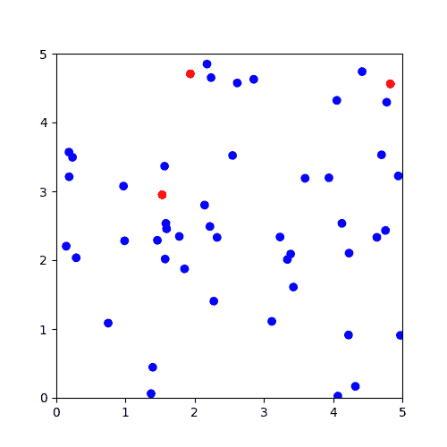

一个玩具流行病学模型，红点代表受感染的个体

当时，我的重点主要是使用 Matplotlob 的动画库来构建视觉效果，因此我很快拼凑出的用于制作模型的代码并不是很好。我的意思是，模型本身并不特别有趣 3Blue1Brown 的格兰特·桑德森(Grant Sanderson)做了大量脑力劳动，用不同的参数和模型设置进行实验，以收集真正的见解，我只是揭开了一些技术方面的帷幕——但代码效率低下，如果我试图扩大模型的规模，这将成为一个真正的问题。

正如你所想象的，流行病学模型中最重要的一步可能是建立疾病传播的模型。对于我们建模的每个时间段，我们的模型需要确定当前未感染的脆弱人群是否会从当前已感染的人群感染疾病。在我们上次建立的简单模型中，这包括检查在给定的传播半径内是否有任何受感染的个体，这就是挑战所在。计算机不一定有直观的方式来判断哪些人可能彼此靠近，特别是当我们对四处移动的人进行建模时，计算机所能做的就是选择两个人并检查他们之间的距离。为了保证它没有错过任何可能的成对个体，它可能需要检查许多对个体，这些个体实际上没有接近到足以发生传播。

保证捕捉到每一个可能的配对的最简单的方法是对每一个个体进行循环，这是可行的，但是随着模型规模的增长，最终需要大量的操作，因为随着模型中个体数量的增长，需要检查的配对数量也呈指数增长。尽管检查一对个体之间的距离可能相对较快，但如果您的模型中有成千上万的个体，要检查的配对数量将会非常多，无论如何该过程可能会花费大量时间。

眼前的问题是，我们如何减少这些操作的数量，而不冒错过任何可能的传输的风险。我将探索一种涉及空间划分的策略。事实证明，这不仅与我们在此讨论的建模类型相关，还与各种其他计算领域相关，包括计算机图形学和一些数据科学算法，如“最近邻”类型的模型，该模型涉及搜索训练数据中的点以找到离新点最近的点的类似任务。我们将从一个简单但仍然相当有效的空间分区方法开始，讨论它的一些局限性，然后探索一种略有不同的方法，空间分区树，以及如何在这个和其他数据科学应用程序中使用它们。

**简单的空间隔断**

为了激励我们正在做的事情，让我们想象一下手头的任务。回想一下，我们一开始试图模拟一种假设的疾病从受感染的个体传播到脆弱的个体。我们可以这样想象我们模型的初始阶段，红点代表受感染的个体，蓝点代表未受感染的个体:

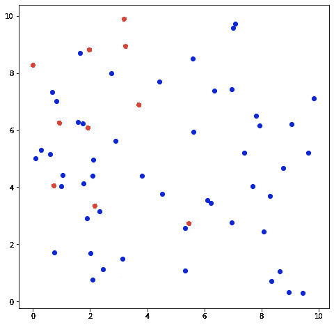

简单 SIR 模型的开始

受感染的个体有一定的概率将疾病传播给在一定半径内的任何当前易受感染的个体。我们可以把可能的感染范围加入到我们的可视化中:

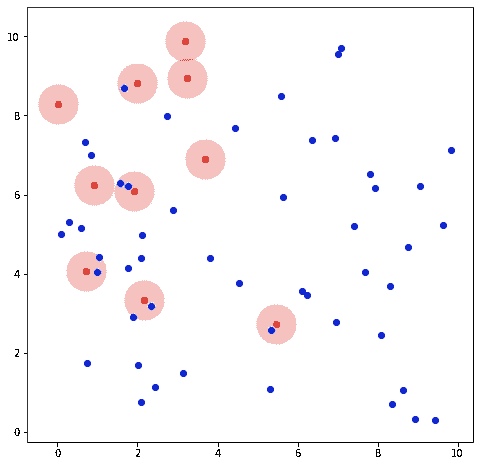

每一个被感染的个体都代表着对某一半径范围内的易感者的威胁

在这个模型的初始阶段，一些易受感染的个体与所有受感染的个体安全地保持距离，尽管有些没有。我们可以非常清楚地看到这一点，但是我们如何让计算机，它不能使用我们的视觉直觉，来确认一个易感个体是否靠近一个受感染的个体？计算机唯一能做的就是计算两个人之间的距离，并检查这个距离是否短到足以在感染半径之内。计算机需要将任何给定的个体与群体中的所有其他个体进行核对吗？

你可能会想，虽然不检查一堆距离是不可能的，但是有些配对我们应该可以不用计算就能扔掉，比如两个人*明显*不在一起。也许我们可以将图表分成象限，例如，像这样:

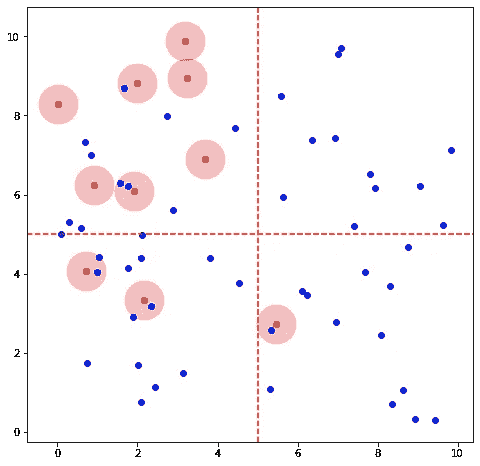

将个人分成象限

我们还没有完全弄清楚谁可能靠近谁，但至少我们可以说，左上角的人不太可能靠近右下角的人。这样，我们只需要对照同一象限中的其他个体来检查每个个体，而不是对照模型中的所有其他个体。您可能会发现这种策略的一个挑战，即一些个体靠近象限的边缘，如果两个不同象限中的个体都靠近这两个象限之间的边界，则有可能在它们之间获得传播。我们可以通过将这些边缘案例分配到两个象限来克服这一点——一个是他们实际所在的象限，另一个是他们离得足够近，可以想象他们可能会与其中的个人进行交互的象限。您也可以将这看作是将四个正方形中的每一个都扩展一点，这样它们就占据了图形的四分之一多一点，并且在它们的边缘有一点重叠:

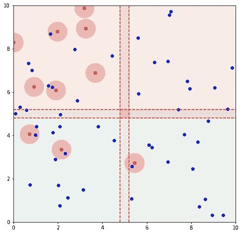

“象限”略大于图表的四分之一

这是建模空间的一个简单、统一的网格划分，我们可以用它来大大提高建模的速度。现在，对于我们建模的每个时间步，首先我们忽略所有的个体，并将他们分配到一个象限(或者如果他们在边界附近，分配到多个象限)。然后当我们检查可能的传播时，计算机只需要检查每个象限内个体之间的距离。我们在建模过程中增加了另一个步骤，即确定每个人处于哪个象限，但我们在建模的传输检查步骤中减少了更多的计算量。

即使是这种最简单的网格分区也能显著提高速度。当我在之前构建的生成视觉效果的模型上实现了这样一个简单的分区时，我将所需的时间减少了一半以上。在一定程度上，增加我们划分空间的扇区数量可以进一步改善这个时间。

当然，这种策略也有一些缺点。第一个是所有这种空间分区策略所固有的，即它们需要更多的内存，因为现在除了我们的模型在本地内存中需要的任何其他内容之外，我们还需要存储某种表或目录来跟踪每个人所在的扇区。我们基本上是以牺牲内存使用为代价来换取模型的速度。对于这些小玩具流行病学模型，这是一个很小的问题。对于一个更大、更复杂的模型或计算机图形应用程序，内存可能是一种紧张的资源，这可能是一个重要的考虑因素。

第二个问题与这种空间划分方法更为相关，即这种性质的统一网格不一定是划分空间的有效方式。考虑一下在我们的示例中，如果您增加分区的数量来创建一个 6×6 的网格，会发生什么情况:

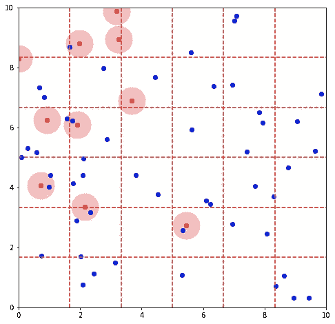

被分成 36 个扇区空间

一方面，这看起来甚至比象限图更好——在任何给定的部门中只有少数几个个体，因此您需要检查的个体组合的数量应该总是相当低的。但是这种划分在其他方面是低效的。由于个体在空间中的随机放置，一些扇区具有比其他扇区相对更多的个体，而一些扇区完全是空的。如果我们在 3d 空间中有一个模型，或者如果我们在具有更多变量的数据集上执行分区，这种低效率在具有更多维度的情况下会成为一个更大的问题。变量越多，数据集就越稀疏，像这样的统一网格可能就越不合理。

**KD 树**

我们可以克服这种低效率的方法之一，同时引入一些其他的好处，就是使用一种更智能的方法来划分空间，这种方法可能不会给我们一个统一的网格。一种常见的方法是 KD 树算法。该算法首先在数据集中选择一个轴，找到沿该轴所有点的中值，然后沿该轴创建一个拆分。在我们的例子中，假设我们从 x 轴开始。我们找到中间的 x 值，并沿着它放入一条分割线:

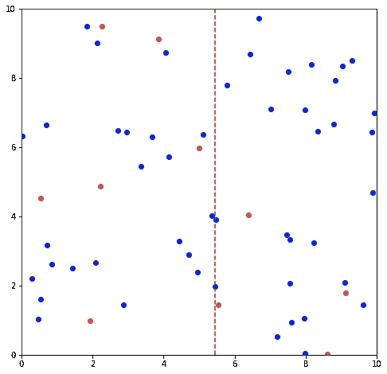

我们 KD 树中的第一个部分

您会注意到这条线在图表中心的右侧一点，随机生成的点恰好在图表的右侧更密集一点，因此中间 x 值在图表中心的上方一点。现在，对于这条线任一侧的每个区域，我们切换到 y 轴，并使用区域内点的中间 y 值，以相同的方式再次划分空间:

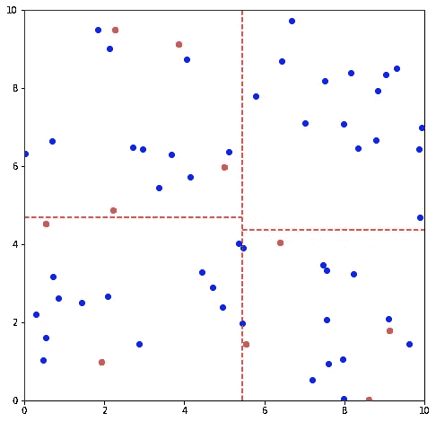

第二个 KD 分区，这次是沿着 y 轴

我们可以以这种方式继续，交换轴并细分每个空间。下面是下一层划分的样子:

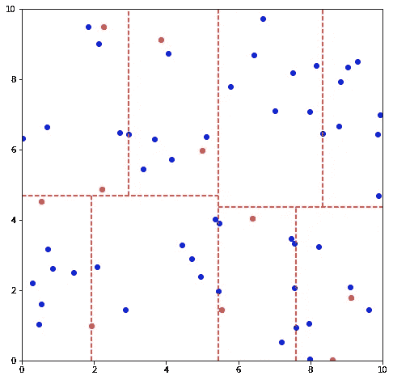

沿着 x 轴的另一个分割

下一个是:

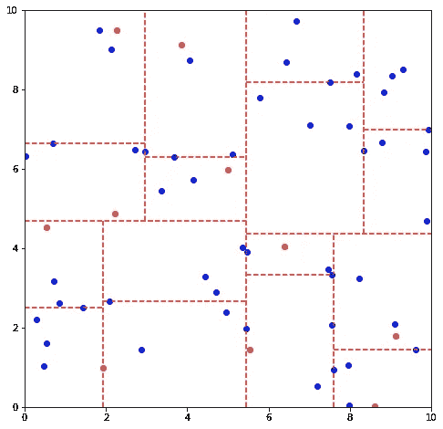

这种空间的最终划分可能比我们简单、统一的网格看起来更杂乱。但是这种方法有两个主要的好处。首先，生成的分区是“平衡的”——我们创建的每个子区域内都有大致相等数量的点，随着数据集中维度数量的增加，这一特性变得越来越有用。第二是这个算法很自然的创建了一个树形数据结构。KD 树算法创建的并不是真正的网格，而是一系列嵌套的阈值。在我们划分的第一步中，x 值高于阈值的点进入右侧区域，而 x 值低于阈值的点进入左侧区域。在每个后续区域中，在 y 方向上有一个新的阈值，依此类推。对于计算机来说，树形数据结构比网格数据结构更容易完成某些任务。这种树结构就是为什么 KD 树对于像 KNN 模型这样的搜索算法如此有用。让我们看看它们是如何工作的。

**KNN 的 KD 树**

让我们考虑一个稍微不同的用例。假设我们有一些点的集合，我们用 KD 树将它们分开:

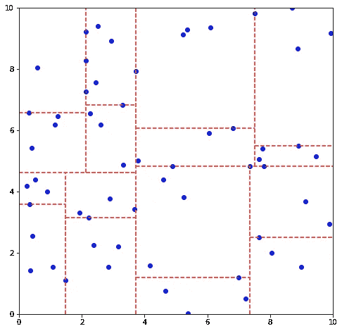

新数据集的 KD 树分区

现在，我们引入一个新的点，一个目标点，我们将尝试估算它的值。这就是，用红色标出的:

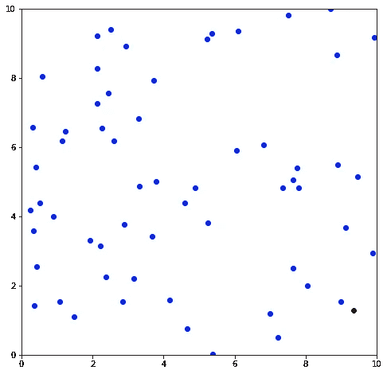

新点离哪个点最近？

计算机面临的问题是，原始数据集中的哪些点最接近新的目标点。与我们之前的建模练习一样，我们希望避免计算机需要检查所有原始点和目标点之间的距离。KD 分区的树形特性帮助我们有效地缩小搜索范围。我们可以简单地沿着树开始，看看我们的新目标点在哪里。首先，沿着 x 轴有一个分区；目标点位于它的右侧:

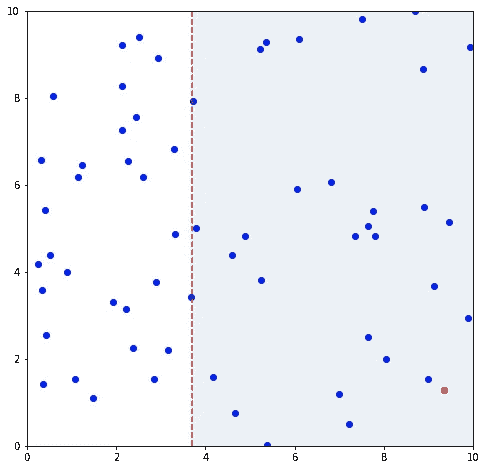

我们沿着树向下走到第一个分区的右边

接下来，沿 y 轴的一个分区，新点位于该分区下方:

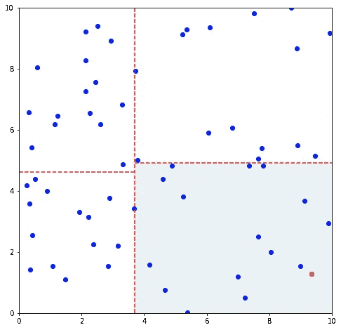

向下到第二个分区的左侧

另一个 x 轴分区:

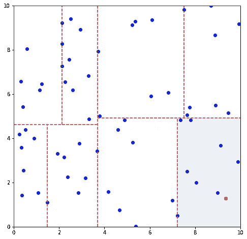

以此类推:

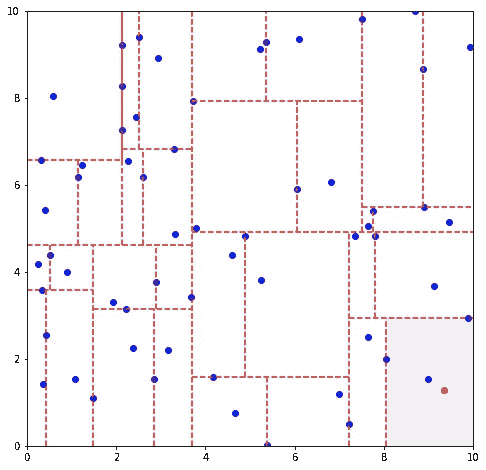

找到目标点在树中的位置不需要检查它和许多点之间的距离，只需要将其 x 和 y 坐标与四个或五个阈值进行比较。因此，该树被证明是缩小可能的点以找到最近邻居的非常有用的工具。

当然，这有点复杂，如果目标点落在其中一个阈值附近，最近的邻居点可能落在树的不同分支上的阈值的另一侧。这确实意味着，当在树中搜索最近的邻居时，您可能需要偶尔遍历树来检查边界另一侧的区域。然而，在这些情况下，该树也可以帮助您快速排除整个区域/子树；区域内的任何点都不会比阈值更接近目标点，因此，如果区域之间的分界线比当前区域内最近的迄今识别的邻居离目标更远，我们可以排除相邻区域内的所有点。

当你适应一个模型时，这实质上是一个 KNN 实现，比如常用的 sklearn 包中的那个。该实现使用类似 KD 树的东西来划分训练数据。当使用模型来预测新点的值时，模型的任务实际上是以尽可能省时的方式在训练数据中搜索离每个新点最近的点，这是使用树来完成的。

**球树**

搜索算法使用另一种常见的空间划分树，它以稍微不同的方式达到类似的目的。这是球树算法，将点分组为嵌套的“球”或球体。它是这样工作的:首先，确定所有点的质心。接下来，找到离这个质心最远的点，这将是我们图中的第一个“孩子”。质心和这个点之间的距离是第一个球的“半径”,这个球集中没有一个点离质心的距离超过这个半径。集合中离第一个孩子最远的点是我们的第二个孩子。从那里开始，每个更远的点根据哪个更近与第一个或第二个孩子分组。使用上面的数据，我们可以像这样可视化第一个分组:

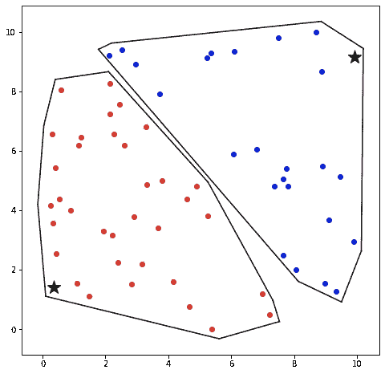

球树算法的第一分区，其中两个孩子被标记为星形

然后，我们可以迭代地继续这个过程，通过找到质心并将子节点定义到以下组中，将每个球分成另外两个球:

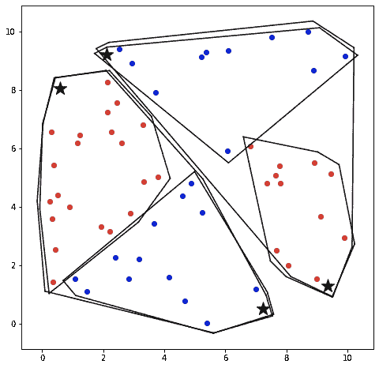

进一步的细分

再说一遍:

当然，我们可以通过进一步细分来继续这个过程。这些嵌套的分组看起来更像重叠的圆圈，但是为了让视觉效果更清晰，我在每个分组周围画了更紧密的边界形状。与 KD 树策略一样，这创建了一个树结构，尽管它是不平衡的。与 KD 树中区域之间的分界线的距离给了我们一种方法来测试和检查我们是否需要在一个区域内搜索一个可能的邻居，或者取消整个区域的资格，在球树中不同球体的半径和到质心的距离也是如此。