# 用 Python 可视化数据的 5 种非常规方法

> 原文：<https://towardsdatascience.com/spaceborn-visualizations-69058ad6c2df?source=collection_archive---------34----------------------->

## 应用于 UFO 数据集的“太空出生”可视化


[来自 Unsplash](https://unsplash.com/photos/qrysiGC3sFY)

虽然条形图、直方图、散点图、折线图和箱线图是显示数据并从中发现模式的广泛而有效的工具，但还有其他图形，虽然不太流行，但对于创建优秀的可视化效果仍然非常有用。在本文中，我们将探讨以下几个问题:

*1。茎图
2。字云
3。树形图
4。文氏图
5。蜂群剧情*。

为了让我们的实验更有趣，我们将把它们应用到另一种不太为人所知的物体上:那些不明飞行物🛸.为此，我们将使用 Kaggle 数据集[1969 年至 2019 年在北美报道的 UFO 目击事件](https://www.kaggle.com/fireballbyedimyrnmom/ufo-sightings-1969-to-2019)。

首先，我们将导入数据集并进行一些必要的清理。省份缩写是根据[美国](https://en.wikipedia.org/wiki/List_of_states_and_territories_of_the_United_States)和[加拿大](https://en.wikipedia.org/wiki/Provinces_and_territories_of_Canada)对应的维基百科页面整理出来的。

```
**import** pandas **as** pd
**import** numpy **as** np 

df = pd.read_csv('nuforc_reports.csv')

print('Number of UFO sightings:', len(df), '\n')
print(df.columns.tolist())**Output:**Number of UFO sightings: 88125 

['summary', 'city', 'state', 'date_time', 'shape', 'duration', 'stats', 'report_link', 'text', 'posted', 'city_latitude', 'city_longitude']
```

**数据清洗:**

```
*# Leaving only the necessary columns*
df = df[['city', 'state', 'date_time', 'shape', 'text']]

*# Removing rows with missing values*
df = df.dropna(axis=0).reset_index(drop=True)

*# Fixing an abbreviation duplication issue*
df['state'] = df['state'].apply(**lambda** x: 'QC' **if** x=='QB' **else** x)

*# Creating a list of Canadian provinces*
canada = ['ON', 'QC', 'AB', 'BC', 'NB', 'MB',
          'NS', 'SK', 'NT', 'NL', 'YT', 'PE']  

*# Creating new columns: `country`, `year`, `month`, and `time`*
df['country'] = df['state'].apply(\
                  **lambda** x: 'Canada' **if** x **in** canada **else** 'USA')
df['year'] = df['date_time'].apply(**lambda** x: x[:4]).astype(int)
df['month'] = df['date_time'].apply(**lambda** x: x[5:7]).astype(int)
df['month'] = df['month'].replace({1: 'Jan', 2: 'Feb', 3: 'Mar', 
                                   4: 'Apr', 5: 'May', 6: 'Jun',
                                   7: 'Jul', 8: 'Aug', 9: 'Sep', 
                                   10: 'Oct', 11: 'Nov', 12: 'Dec'})
df['time'] = df['date_time'].apply(**lambda** x: x[-8:-6]).astype(int)

*# Dropping an already used column*
df = df.drop(['date_time'], axis=1)

*# Dropping duplicated rows*
df = df.drop_duplicates().reset_index(drop=True)

print('Number of UFO sightings after data cleaning:', len(df), '\n')
print(df.columns.tolist(), '\n')
print(df.head(3))**Output:**Number of UFO sightings after data cleaning: 79507 

['city', 'state', 'shape', 'text', 'country', 'year', 'month', 'time']          city  state     shape                                    
0     Chester     VA     light 
1  Rocky Hill     CT    circle
2      Ottawa     ON  teardrop

                                      text country  year  month time
0 My wife was driving southeast on a fa...     USA  2019    Dec   18
1 I think that I may caught a UFO on th...     USA  2019    Mar   18
2 I was driving towards the intersectio...  Canada  2019    Apr    2
```

现在我们有一个清理过的数据集，其中包括 1969 年至 2019 年发生在美国和加拿大的 79，507 起 UFO 目击事件。结果显示，其中绝大多数(96%)与美国有关:

```
round(df['country'].value_counts(normalize=True)*100)**Output:**USA       96.0
Canada     4.0
Name: country, dtype: float64
```

让我们最终开始我们的飞碟学实验。

# 1.茎图

stem 图代表一种修改过的条形图。事实上，它是条形图(特别是那些有很多条的，或者有相似长度的条的)和饼图的很好的替代品，因为它有助于最大化图表的数据-墨水比率，使其更可读和更容易理解。

为了创建一个茎图，我们可以使用`stem()`函数，或者`hlines()`和`vlines()`函数。`stem()`功能在从基线到 *y* 的每个 *x* 位置绘制垂直线，并在那里放置一个标记。

我们将开始创建一个基本的每月 UFO 事件的柱状图，只添加一些常见的 matplotlib 定制。对于经典(水平)stem 图，我们可以使用`stem()`或`vlines()`，结果是一样的。

```
**import** matplotlib.pyplot **as** plt
**import** seaborn **as** sns

*# Creating a series object for UFO occurences by month, in %*
months = df['month'].value_counts(normalize=True)\
           [['Jan', 'Feb', 'Mar', 'Apr', 'May', 'Jun', 
             'Jul', 'Aug', 'Sep', 'Oct', 'Nov', 'Dec']]*100

*# Defining a function for creating and customizing a figure in matplotlib (will be used for the next 3 plots)*
**def** **create_customized_fig**():
    fig, ax = plt.subplots(figsize=(12,6))
    plt.title('UFO occurences by month, %', fontsize=27)
    plt.ylim(0,15)
    plt.xticks(fontsize=20)
    plt.yticks(fontsize=20)
    ax.tick_params(bottom=False)
    sns.despine()
    **return** ' '

*# PLOTTING*
create_customized_fig()

*# Creating a stem plot*
plt.stem(months.index, months) 

*# ALTERNATIVE WAY TO CREATE A STEM PLOT*
*# plt.vlines(x=months.index, ymin=0, ymax=months)*
*# plt.plot(months.index, months, 'o')*

plt.show()
```

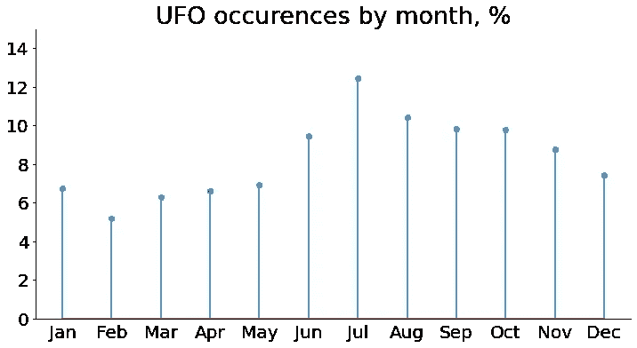

作者图片

我们看到，美国和加拿大的大多数 UFO 目击事件都与夏秋季节有关，7 月份最多，约为 12%,而在冬春季节活动要少得多，2 月份最少，为 5%。

调整茎图有几个可选参数:

*   `linefmt`–定义垂直线属性(颜色或线条样式)的字符串。线条可以是实线(`'-'`)、虚线(`'--'`)、点划线(`'-.'`)、虚线(`':'`)，或者根本没有线条。
*   `markerfmt`–定义杆头标记属性的字符串:`'o'`、`'*'`、`'D'`、`'v'`、`'s'`、`'x'`等。，包括没有标记的`' '`。
*   `basefmt`–定义基线属性的字符串。
*   `bottom`–基线的 y 位置。

让我们将它们应用到我们的情节中:

```
*# Creating and customizing a figure in matplotlib*
create_customized_fig()*# Creating and customizing a stem plot*
plt.stem(months.index, months, 
         linefmt='C2:',   *# line color and style*
         markerfmt='D',   
         basefmt=' ') plt.show()
```

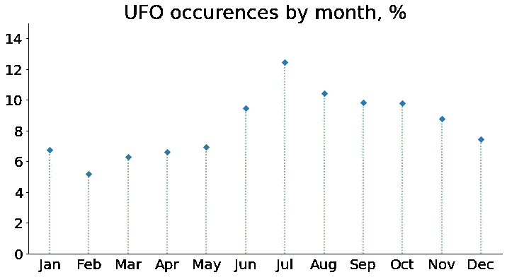

作者图片

还有一些其他属性，如`linewidth`和`markersize`，没有包含在`stem()`函数的标准关键字参数中。为了调优它们，我们必须创建`markerline`、`stemlines`和`baseline`对象:

```
*# Creating and customizing a figure in matplotlib*
create_customized_fig()*# Creating `markerline`, `stemlines`, and `baseline` objects*
*# with the same properties as in the code above*
markerline, stemlines, baseline = plt.stem(months.index, months, 
                                           linefmt='C2:', 
                                           markerfmt='D', 
                                           basefmt=' ') *# Advanced stem plot customization*
plt.setp(markerline, markersize=10)      
plt.setp(stemlines, 'linewidth', 5)      
markerline.set_markerfacecolor('yellow') plt.show()
```

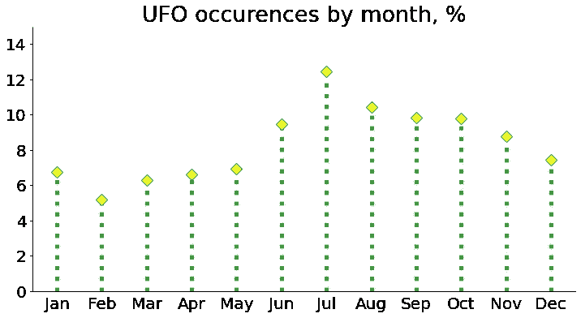

作者图片

最后，我们可以考虑创建一个竖干图。然而，在这种情况下，我们不能再使用`stem()`函数，因为它只画垂直线。相反，我们可以将`hlines()`与`plot()`结合使用。除了必要的参数`y`、`xmin`、`xmax`外，我们还可以调整可选参数`color`和`linestyle` ( `'solid'`、`'dashed'`、`'dashdot'`、`'dotted'`)。此外，我们在`plot()`函数本身中有很多选项可以调整，包括颜色、标记和线条。

让我们为 UFO 形状频率分布创建一个垂直茎图，以检查一些形状是否比其他形状更常见:

```
*# Creating a series of shapes and their frequencies 
# in ascending order*
shapes = df['shape'].value_counts(normalize=True,
                                  ascending=True)*100fig, ax = plt.subplots(figsize=(12,9))*# Creating a vertical stem plot*
plt.hlines(y=shapes.index, 
           xmin=0, xmax=shapes, 
           color='slateblue',
           linestyle='dotted', linewidth=5)
plt.plot(shapes, shapes.index, 
         '*', ms=17, 
         c='darkorange')plt.title('UFO shapes by sighting frequency, %', fontsize=29)
plt.xlim(0,25)
plt.yticks(fontsize=20)
plt.xticks(fontsize=20)
ax.tick_params()
sns.despine()
plt.show()
```

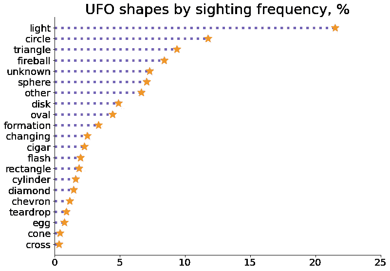

作者图片

我们看到不明飞行物，根据他们的目击者，可以采取各种各样令人难以置信的形式，包括钻石，雪茄，人字形，泪珠，和十字架。然而，最常见的形式(22%)被描述为光。

在这里，垂直干图看起来是一个更好的选择，因为形状的名称相当长，在水平图中它们会垂直翻转，降低了它们的可读性。

提醒一下，为了创建水平茎图，我们可以使用类似的函数`vlines()`来代替`stem()`。除了“镜像”的必要参数`x`、`ymin`和`ymax`外，所有参数与`hlines()`相同。

有了 stem 剧情定制就够了。让我们了解一下我们的朋友外星人的其他情况。

# 2.词云

词云是一种文本数据可视化，其中每个词的大小表示其频率。使用它，我们可以在任何文本中找到最重要的单词。

我们来分析一下美国目击者给出的所有目击 UFO 的描述。为此，我们将安装并导入`wordcloud`库(*安装:* `pip install wordcloud`)，并创建一个基本图形:

```
**from** wordcloud **import** WordCloud, STOPWORDS*# Gathering sighting descriptions from all American witnesses*
text = ''
**for** t **in** df[df['country']=='USA'].loc[:, 'text']:
    text += ' ' + tfig = plt.subplots(figsize=(10,10)) *# Creating a basic word cloud*
wordcloud = WordCloud(width=1000, height=1000, 
                      collocations=False).generate(text)plt.title('USA collective description of UFO', fontsize=27)
plt.imshow(wordcloud)
plt.axis('off')
plt.show()*# Saving the word cloud*
wordcloud.to_file('wordcloud_usa.png')
```

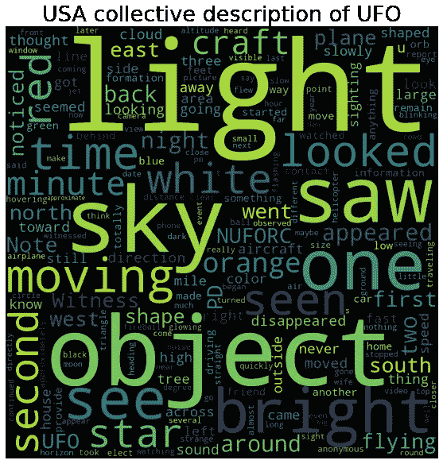

作者图片

最常见的词是*光*、*物*、*天*，其次是*亮*、*时*、*动*、*白*、*红*、*工艺*、*星*。在出现频率最高的词中，有一些低信息量的词，如*一*、*二*、*见*、*见*、*见*、*见*等。我们可以假设美国目击者大多观察到白色或红色的明亮的飞行器物体，在天空中移动并发光。

在上面的单词 cloud 中，我们使用了以下参数:

*   `width`和`height`——字云画布的宽度和高度。
*   `collocations`–是否包含两个单词的搭配。我们将它设置为`False`以避免结果图中的单词重复。

要向我们的词云添加更多高级功能，我们可以使用以下参数:

*   `colormap`–matplotlib 颜色图，用于为每个单词绘制颜色。
*   `background_color`–文字云背景色。
*   `stopwords`–从分析中排除的单词。该库已经有内置的`STOPWORDS`列表，其中包含一些低信息量的单词，如 *how* 、 *not* 、 *the* 等。这个列表可以用用户单词列表来补充，或者用它来替换。
*   `prefer_horizontal`–尝试水平拟合与垂直拟合的次数之比。如果该参数小于 1，算法将尝试旋转不适合的单词。
*   `include_numbers`–是否包含数字作为短语(默认为`False`)。
*   `random_state`–用于总是复制相同云的种子号。
*   `min_word_length`–一个单词必须包含最少数量的字母。
*   `max_words`–单词云中显示的最大单词数。
*   `min_font_size`和`max_font_size`–用于显示文字的最大和最小字体大小。

有了这些新的信息，让我们创建一个更好的词云。我们将为单词和背景颜色添加一个颜色图，将最大单词数从 200(默认)减少到 100，只考虑 3+字母的单词(以避免出现像 *u* 和 *PD* 这样的单词)，允许更多的垂直单词(0.85 而不是默认的 0.9)，从分析中排除一些低信息量的单词，并确保单词云的可复制性。

然而，这一次，我们很想知道加拿大人对 UFO 的集体看法:

```
*# Gathering sighting descriptions from all Canadian witnesses*
text = ''
for t in df[df['country']=='Canada'].loc[:, 'text']:
    text += ' ' + t*# Creating a user stopword list*
stopwords = ['one', 'two', 'first', 'second', 'saw', 'see', 'seen',
             'looked', 'looking', 'look', 'went', 'minute', 'back', 
             'noticed', 'north', 'south', 'east', 'west', 'nuforc',
             'appeared', 'shape', 'side', 'witness', 'sighting', 
             'going', 'note', 'around', 'direction', approximately',
             'still', 'away', 'across', 'seemed', 'time']fig = plt.subplots(figsize=(10,10)) *# Creating and customizing a word cloud*
wordcloud = WordCloud(width=1000, height=1000, 
                      collocations=False,
                      colormap='cool',
                      background_color='yellow',
                      stopwords=STOPWORDS.update(stopwords), 
                      prefer_horizontal=0.85,
                      random_state=100,
                      max_words=100,
                      min_word_length=3).generate(text)plt.title('Canadian collective description of UFO', fontsize=27)
plt.imshow(wordcloud)
plt.axis('off')
plt.show()*# Saving the word cloud*
wordcloud.to_file('wordcloud_canada.png')
```

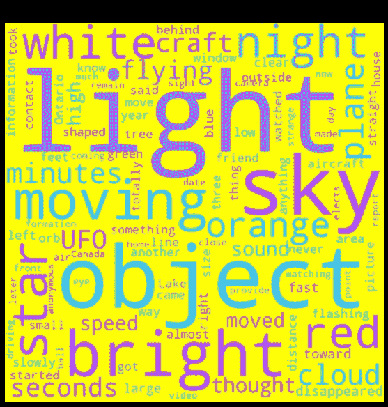

作者图片

加拿大人给出的描述似乎与美国人的描述颇为相似，只是增加了一些其他的常用词:*橙色*、*飞机*、*夜晚*、*分钟*、*秒钟*、*云*、*飞行*、*速度*、*声音*。我们可以假设加拿大人目击了明亮的白色、红色或橙色的飞行器物体，大部分是在晚上，在空中移动/飞行，发出光，可能还有声音。起初，这些物体看起来像星星、飞机或云，整个过程持续了几秒钟到几分钟。

加拿大和美国的集合描述之间的差异可以通过在停用词表中添加更多的词来部分解释。或者，也许，“加拿大”外星人真的更橙色，更像飞机或云，更吵闹😀

# 3.树形图

树形图是一组嵌套矩形的分层数据的可视化，其中每个矩形的面积与相应数据的值成比例。换句话说，树状图显示了整个数据的组成，是饼状图的一个很好的替代品。

让我们来看看美国哪些州是 UFO 特别喜欢去的地方。我们将安装并导入`squarify`库(*安装* : `pip install squarify`，并创建一个基本的树形图:

```
**import** squarify*# Extract the data*
states = df[df['country']=='USA'].loc[:, 'state'].value_counts()fig = plt.subplots(figsize=(12,6))*# Creating a treemap*
squarify.plot(sizes=states.values, label=states.index)plt.title('UFO sighting frequencies by state, the USA', fontsize=27)
plt.axis('off')
plt.show()
```

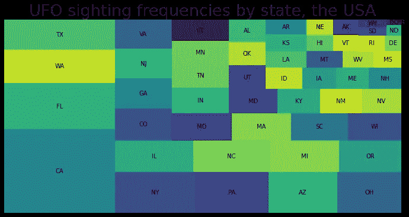

作者图片

看起来加州是美国真正的外星基地！紧随其后的是佛罗里达州、华盛顿州和得克萨斯州，而哥伦比亚特区和波多黎各地区很少被不明飞行物访问。

上面使用的参数`sizes`和`label`代表`squarify`的数字输入和相应的标签文本。可以调整的其他参数:

*   `color`–矩形颜色的用户列表，
*   `alpha`–调节色彩强度的参数，
*   `pad`–是否画出中间有小间隙的矩形，
*   `text_kwargs`–关键字参数字典(`color`、`fontsize`、`fontweight`等)。)来调整标签文本属性。

让我们检查在什么时候看到的外星人最多/最少，同时练习可选参数:

```
**import** matplotlib*# Extracting the data*
hours = df['time'].value_counts()*# Creating a list of colors from 2 matplotlib colormaps 
# `Set3` and `tab20`*
cmap1 = matplotlib.cm.Set3
cmap2 = matplotlib.cm.tab20
colors = []
**for** i **in** range(len(hours.index)):
    colors.append(cmap1(i))
    **if** cmap2(i) **not** **in** colors:
        colors.append(cmap2(i))

fig = plt.subplots(figsize=(12,6))*# Creating and customizing a treemap*
squarify.plot(sizes=hours.values, label=hours.index,
              color=colors, alpha=0.8, 
              pad=True,
              text_kwargs={'color': 'indigo',
                           'fontsize': 20, 
                           'fontweight': 'bold'})plt.title('UFO sighting frequencies by hour', fontsize=27)
plt.axis('off')
plt.show()
```

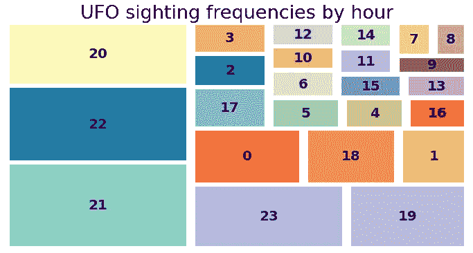

作者图片

我们数据集中的受访者大多在 20:00 到 23:00 的时间范围内观察到 UFO，或者更一般地，从 19:00 到午夜。最不容易发生不明飞行物的时间是 07:00-09:00。然而，这并不一定意味着一天中的某些时段“缺乏外星人”，相反，可以更务实地解释:通常人们在晚上下班后有自由时间，而在早上，大多数人都要去工作，有点太沉浸在他们的想法中，以至于没有注意到他们周围有趣的现象。

# 4.文氏图

维恩图显示了几个数据集之间的关系，其中每个组显示为一个面积加权的圆圈，圆圈的重叠部分(如果有)表示相应数据集之间的交集及其大小。在 Python 中，我们可以使用`matplotlib-venn`库为 2 或 3 个数据集创建维恩图。对于第一种情况，软件包提供了`venn2`和`venn2_circles`功能，对于第二种情况提供了–`venn3`和`venn3_circles`功能。

让我们在 UFO 数据集的两个子集上练习这个工具。例如，我们希望提取过去 5 年(在我们的数据集上下文中是指从 2015 年到 2019 年，含 2015 年和 2019 年)在北美发生的所有十字形和雪茄形 UFO 目击事件(为简单起见，我们从现在起将它们称为十字形和雪茄形)的数据，并检查是否有一些城市在此期间观察到了这两种形状。让我们安装并导入`matplotlib-venn`库(*安装:* `pip install matplotlib-venn`)，为十字架和雪茄创建一个基本的维恩图:

```
from matplotlib_venn import **# Creating the subsets for crosses and cigars*
crosses = df[(df['shape']=='cross')&\
             (df['year']>=2015)&(df['year']<=2019)].loc[:, 'city']
cigars = df[(df['shape']=='cigar')&\
            (df['year']>=2015)&(df['year']<=2019)].loc[:, 'city']fig = plt.subplots(figsize=(12,8))*# Creating a Venn diagram*
venn2(subsets=[set(crosses), set(cigars)], 
      set_labels=['Crosses', 'Cigars'])plt.title('Crosses and cigars by number of cities, 2015-2019', 
          fontsize=27)
plt.show()
```

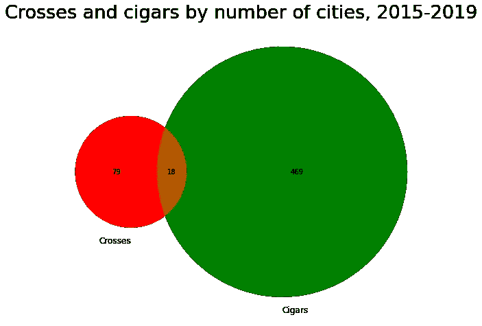

作者图片

从 2015 年到 2019 年(含)，北美有 18 个城市注册了十字架和雪茄。在 79 个城市中，只观察到十字(从这两个形状)，在 469 个城市中，只观察到雪茄。

现在，我们将从我们的系列中添加一个更奇特的 UFO 形状——钻石——并对维恩图进行一些定制。前面，我们已经使用了一个不言自明的可选参数`set_labels`。此外，我们可以增加`venn2()`和`venn3()`功能:

*   `set_colors`–圆的颜色列表，将根据该列表计算交叉点的颜色。
*   `alpha`–调节色彩强度的参数，默认为 0.4。

其他两个功能-`venn2_circles()`和`venn3_circles()`-用于使用参数`color`、`alpha`、`linestyle`(或`ls`)和`linewidth`(或`lw`)调整圆的周长。

```
*# Creating a subset for diamonds*
diamonds = df[(df['shape']=='diamond')&\
              (df['year']>=2015)&(df['year']<=2019)].loc[:, 'city']*# Creating a list of subsets*
subsets=[set(crosses), set(cigars), set(diamonds)]fig = plt.subplots(figsize=(15,10))*# Creating a Venn diagram for the 3 subsets*
venn3(subsets=subsets, 
      set_labels=['Crosses', 'Cigars', 'Diamonds'],
      set_colors=['magenta', 'dodgerblue', 'gold'],
      alpha=0.3)*# Customizing the circumferences of the circles* 
venn3_circles(subsets=subsets,
              color='darkviolet', alpha=0.9, 
              ls='dotted', lw=4)plt.title('Crosses, cigars, and diamonds \nby number of cities, 2015-2019', fontsize=26)
plt.show()
```

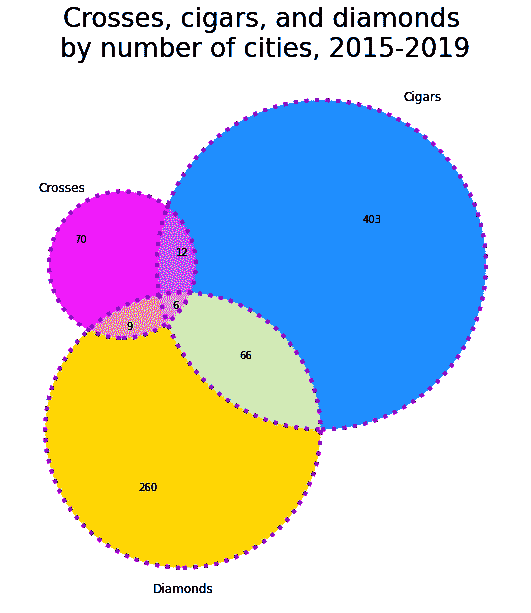

作者图片

因此，在感兴趣的时间段内，北美有 6 个城市注册了所有 3 种形状，66 个城市只注册了雪茄和钻石，260 个城市只注册了钻石，等等。让我们检查这 6 个城市所有 3 种形状的共同点:

```
print(set(crosses) & set(cigars) & set(diamonds))**Output:**{'Albuquerque', 'Rochester', 'Staten Island', 'Lakewood', 'Savannah', 'New York'}
```

他们都位于美国。

维恩图可以通过`get_patch_by_id()`方法进一步美化。它允许我们通过 id 选择任何一个图区域，并改变它的颜色(`set_color()`)、透明度(`set_alpha()`)、改变文本(`set_text()`)和调整字体大小(`set_fontsize()`)。对于双圆维恩图，id 的可能值为`'10'`、`'01'`、`'11'`，对于三圆维恩图，id 的可能值为`'100'`、`'010'`、`'001'`、`'110'`、`'101'`、`'011'`、`'111'`。这些值背后的逻辑如下:

*   数字的数量反映了圆圈的数量，
*   每个数字按照它们的赋值顺序代表一个数据集(子集)，
*   1 表示该区域中数据集的**存在**，而 0–不存在**。**

**例如，`'101'`与第一个和第三个数据集所在的区域相关，而第二个数据集在三圆图中不存在，即与第一个和第三个圆的交点(不包括第二个)相关。在我们的示例中，它是十字-菱形交叉，相当于在感兴趣的时间段内只观察到这两种形状的 9 个城市。**

**让我们试着改变文氏图中相交区域的颜色，并在只代表一个形状的区域中添加短文本而不是数字。此外，为了让它更有趣，让它不只是一个无聊的文本，而是一些反映每个形状的 ASCII 艺术符号:**

```
fig = plt.subplots(figsize=(15,10))*# Assigning the Venn diagram to a variable*
v = venn3(subsets=subsets, 
          set_labels=['Crosses', 'Cigars', 'Diamonds'],
          set_colors=['magenta', 'dodgerblue', 'gold'],
          alpha=0.3)*# Changing the color of the intersection zones*
v.get_patch_by_id('111').set_color('white')
v.get_patch_by_id('110').set_color('lightgrey')
v.get_patch_by_id('101').set_color('lightgrey')
v.get_patch_by_id('011').set_color('lightgrey')*# Changing text and font size*
v.get_label_by_id('100').set_text('✠')
v.get_label_by_id('100').set_fontsize(25)
v.get_label_by_id('010').set_text('(̅_̅_̅_̅(̅_̅_̅_̅_̅_̅_̅_̅_̅̅_̅()~~~')
v.get_label_by_id('010').set_fontsize(9)
v.get_label_by_id('001').set_text('♛')
v.get_label_by_id('001').set_fontsize(35)*# Customizing the circumferences of the circles*
venn3_circles(subsets=subsets,
              color='darkviolet', alpha=0.9, 
              ls='dotted', lw=4)plt.title('Crosses, cigars, and diamonds \nby number of cities, 2015-2019', fontsize=26)
plt.show()
```

**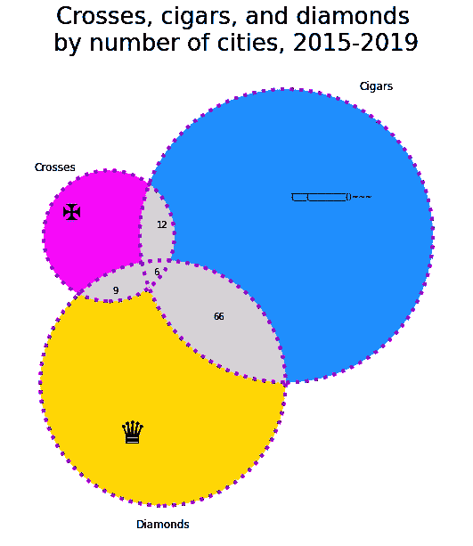**

**作者图片**

**最后，可以单独调整任何圆，将`venn3_circles()`方法的结果赋给一个变量，然后通过索引引用这些圆(在三圆维恩图的情况下为`0`、`1`或`2`)。这里使用的方法是不言自明的，类似于上面讨论的方法:`set_color()`、`set_edgecolor()`、`set_alpha()`、`set_ls()`和`set_lw()`。**

**让我们强调一下钻石的圆圈(每个人都喜欢钻石！🙂💎)**

```
*##### PREVIOUS CODE #####
*  
fig = plt.subplots(figsize=(15,10)) *# Assigning the Venn diagram to a variable* 
v = venn3(subsets=subsets, 
          set_labels=['Crosses', 'Cigars', 'Diamonds'],
          set_colors=['magenta', 'dodgerblue', 'gold'],
          alpha=0.3) *# Changing the color of the intersection zones* v.get_patch_by_id('111').set_color('white') v.get_patch_by_id('110').set_color('lightgrey') v.get_patch_by_id('101').set_color('lightgrey') v.get_patch_by_id('011').set_color('lightgrey') *# Changing text and font size* 
v.get_label_by_id('100').set_text('✠') v.get_label_by_id('100').set_fontsize(25) v.get_label_by_id('010').set_text('(̅_̅_̅_̅(̅_̅_̅_̅_̅_̅_̅_̅_̅̅_̅()~~~') 
v.get_label_by_id('010').set_fontsize(9) v.get_label_by_id('001').set_text('♛') v.get_label_by_id('001').set_fontsize(35) *##### NEW CODE #####* *# Assigning the Venn diagram circles to a variable* 
c = venn3_circles(subsets=subsets,
                  color='darkviolet', alpha=0.9,
                  ls='dotted', lw=4) *# Changing the circle for diamonds by index* 
c[2].set_color('gold') 
c[2].set_edgecolor('darkgoldenrod') 
c[2].set_alpha(0.6) 
c[2].set_ls('dashed') 
c[2].set_lw(6) plt.title('Crosses, cigars, and diamonds \nby number of cities, 2015-2019', fontsize=26) 
plt.show()
```

**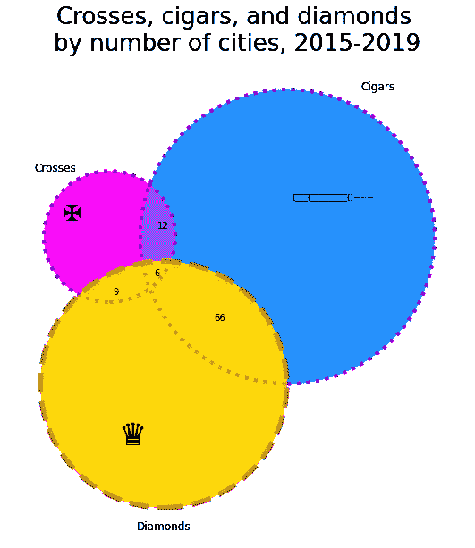**

**作者图片**

# **5.群体图**

**虽然其更著名的“相对”箱线图在显示总体分布统计数据方面很棒，而不太为人所知的 violin 图描述了一个或几个类别的数据分布，但被低估的 swarm 图提供了关于数据集的一些附加信息。也就是说，它给了我们一个概念:**

*   **样本大小，**
*   **一个数值变量在一个或多个类别中的总体分布，**
*   **各个观察值在分布中的确切位置。**

**群图中的点沿着分类轴以相互靠近但不重叠的方式进行调整。因此，该图仅在数据点数量相对较少的情况下工作良好，而对于较大的样本，violin 图更合适(对于它们，正好相反，需要足够数量的数据点以避免误导估计)。此外，正如我们很快会看到的，群体图有利于区分来自不同组的单个数据点(最佳不超过 3 组)。**

**虫群图可以很好地替代或补充盒图或小提琴图。**

**让我们从 UFO 数据集中提取几个相对较小的子集，为它们创建群体图，并将它们与盒子图和小提琴图进行比较。特别地，我们可以从美国和加拿大选择一个州，提取两个州的所有圆锥形或圆柱形 UFO 目击事件，并观察相应的数据点分布(从 1969 年到 2019 年)。从我们的树状图实验中，我们记得美国最大数量的 UFO 目击事件发生在加利福尼亚。现在让我们来看看加拿大的领导者:**

```
df[df['country']=='Canada'].loc[:, 'state'].value_counts()[:3]**Output:**ON    1363
BC     451
AB     369
Name: state, dtype: int64
```

**因此，我们将选择美国的加利福尼亚和加拿大的安大略作为我们进一步绘图的候选。首先，让我们提取数据并为其创建基本的蜂群图，叠加在相应的箱线图上进行比较:**

```
*# Extracting the data for cylinders and cones 
# from California and Ontario*
CA_ON_cyl_con = df[((df['state']=='CA')|(df['state']=='ON'))&\
                   (df['shape']=='cylinder')|(df['shape']=='cone'))]fig = plt.subplots(figsize=(12,7))
sns.set_theme(style='white')*# Creating swarm plots*
sns.swarmplot(data=CA_ON_cyl_con, 
              x='year', y='state', 
              palette=['deeppink', 'blue'])*# Creating box plots*
sns.boxplot(data=CA_ON_cyl_con, 
            x='year', y='state', 
            palette=['palegreen', 'lemonchiffon'])plt.title('Cylinders and cones in California and Ontario',  
          fontsize=29)
plt.xlabel('Years', fontsize=18)
plt.ylabel('States', fontsize=18)
sns.despine()
plt.show()
```

**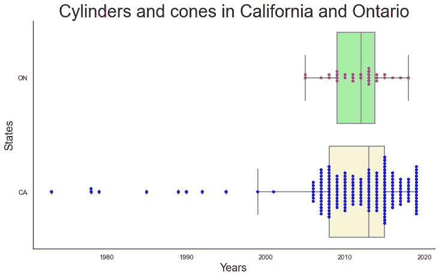**

**作者图片**

**我们可以在这里作出以下观察:**

*   **由于所讨论的数值变量(`year`)是一个整数，所以数据点是对齐的。**
*   **这两个子集在样本量上有很大不同。在蜂群图上可以清楚地看到这一点，而箱形图隐藏了这一信息。**
*   **加州的子集严重左倾，包含许多离群值。**
*   **没有一个箱线图给我们一个关于底层数据分布的概念。在加利福尼亚子集的情况下，群图显示，有许多圆锥形或圆柱形 UFO 与分布的第三个四分位数以及最近的 2019 年有关。**
*   **我们肯定应该在我们的“愿望清单”中加入区分每个子集的圆柱和圆锥的可能性。**

**因此，我们的下一步将是:**

*   **为了从可视化中排除异常值并在 x 轴上放大它，**
*   **将`hue`参数添加到群体图，能够显示第二个分类变量(`shape`)。**

```
fig = plt.subplots(figsize=(12,7))*# Creating swarm plots*
sns.swarmplot(data=CA_ON_cyl_con, 
              x='year', y='state', 
              palette=['deeppink', 'blue'], 
              hue='shape')*# Creating box plots*
sns.boxplot(data=CA_ON_cyl_con, 
            x='year', y='state', 
            palette=['palegreen', 'lemonchiffon'])plt.title('Cylinders and cones in California and Ontario', 
          fontsize=29)
plt.xlim(1997,2020)
plt.xlabel('Years', fontsize=18)
plt.ylabel('States', fontsize=18)
plt.legend(loc='upper left', frameon=False, fontsize=15)
sns.despine()
plt.show()
```

**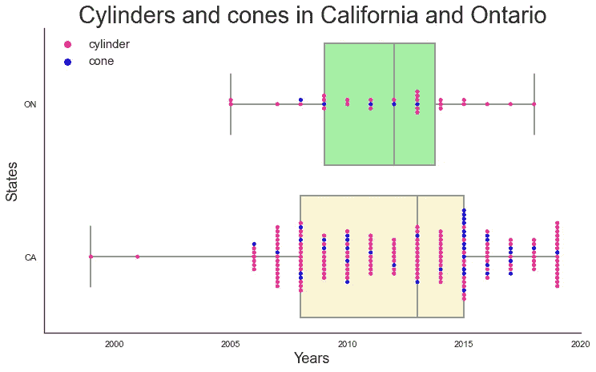**

**作者图片**

**现在两个群体图显示，这两个子集的 UFO 占主导地位的大部分是圆柱。对于加利福尼亚州的子集，我们可以区分圆柱形/圆锥形不明飞行物特别频繁出现的年份:2008 年，2015 年和 2019 年。此外，在 2015 年，我们观察到了一次意想不到的球果繁荣，尽管它们总体上要罕见得多。**

**现在让我们把箱线图分开，比较每个子集的 swarm 和 violin 图。不过，这一次，我们将使用下面的一些参数对虫群图进行更多的自定义:**

*   **`order`，`hue_order`–绘制分类变量的顺序。如果我们创建一个类似上面的虫群盒混合图(或虫群小提琴)，我们必须将这个顺序也应用到第二种类型的图。**
*   **`dodge`–将其分配给`True`将沿分类轴分离不同色调等级的条带(如果适用)。**
*   **`marker`、`color`、`alpha`、`size`、`edgecolor`、`linewidth`–标记样式(`'o'`默认)、颜色、透明度、半径(5 默认)、边缘颜色(`'gray'`默认)、边缘宽度(0 默认)。**
*   **`cmap`–色彩映射表名称。**

```
fig = plt.subplots(figsize=(12,7))*# Creating and customizing swarm plots*
sns.swarmplot(data=CA_ON_cyl_con, 
              x='year', y='state', 
              palette=['deeppink', 'blue'], 
              hue='shape',
              marker='D',              
              size = 8,
              edgecolor='green',
              linewidth = 0.8)*# Creating violin plots*
sns.violinplot(data=CA_ON_cyl_con, 
               x='year', y='state', 
               palette=['palegreen', 'lemonchiffon'])plt.title('Cylinders and cones in California and Ontario', fontsize=29)
plt.xlim(1997,2020)
plt.xlabel('Years', fontsize=18)
plt.ylabel('States', fontsize=18)
plt.legend(loc='upper left', frameon=False, fontsize=15)
sns.despine()
plt.show()
```

**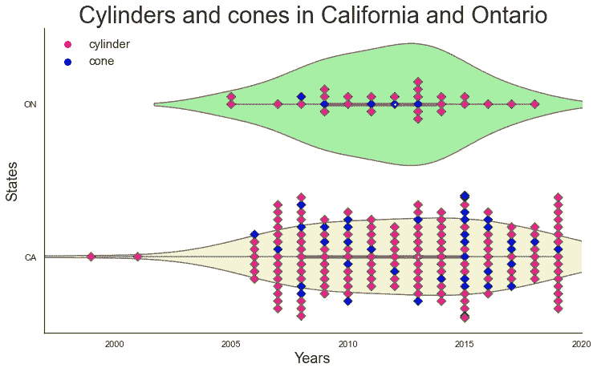**

**作者图片**

**在这里我们可以做出如下观察:**

*   **与盒图一样，小提琴图不能反映两个子集的样本大小。**
*   **小提琴图没有区分圆柱和圆锥。**

**我们可以通过创建分组的 violin 图来解决最后一个问题(使用参数`split`和`hue`)。然而，考虑到我们的子集已经相当小，分割它们以创建分组的 violin 图将导致每个部分的样本大小和数据密度进一步减少，使这些图更不具有代表性。因此，在这种情况下，群体图看起来是一个更好的选择。**

# **结论**

**总之，我们已经探索了五种很少使用的绘图类型，它们的应用情况、限制、替代、定制方式以及分析结果图的方法。此外，我们已经调查了一点神秘的不明飞行物世界。**

**如果碰巧，现在有一些外星生物正在阅读这篇文章，那么我要感谢他们不时地造访我们的星球。请下次也来我的国家，也许我能更好地想象你👽🎨。**

**亲爱的读者，谢谢你的关注。我希望你喜欢我的文章，并找到对你有用的东西。**

**如果你喜欢这篇文章，你也可以发现下面这些有趣的:**

**[](https://betterprogramming.pub/read-your-horoscope-in-python-91ca561910e1) [## 如何用 Python 阅读你的星座运势

### 用 Python 找乐子

better 编程. pub](https://betterprogramming.pub/read-your-horoscope-in-python-91ca561910e1) [](/bar-plots-alternatives-specific-types-9d10ef250e5) [## 条形图:备选方案和特定类型

### 何时以及是否使用它们

towardsdatascience.com](/bar-plots-alternatives-specific-types-9d10ef250e5) [](https://medium.com/geekculture/creating-a-waterfall-chart-in-python-dc7bcddecb45) [## 用 Python 创建瀑布图

### 做这件事最简单的方法

medium.com](https://medium.com/geekculture/creating-a-waterfall-chart-in-python-dc7bcddecb45)**