# 空间:如何在公共场合展示你的 ML Web 应用程序演示

> 原文：<https://towardsdatascience.com/spaces-how-to-showcase-your-ml-web-app-demo-in-public-3a701772959?source=collection_archive---------23----------------------->

## 使用 Spaces、Streamlit 和 Transformers 构建和部署一个简单的机器翻译 web 应用程序


在 [Unsplash](https://unsplash.com/s/photos/gallery?utm_source=unsplash&utm_medium=referral&utm_content=creditCopyText) 上由 [Alvan Nee](https://unsplash.com/@alvannee?utm_source=unsplash&utm_medium=referral&utm_content=creditCopyText) 拍摄的照片

我认为每个人都同意，能够构建有意义的项目是我们需要在我们的投资组合中拥有的先决条件，以便在我们想要进入数据科学角色时脱颖而出。

幸运的是，现在有很多库、框架和平台，让我们更容易部署和向其他人展示我们的项目和投资组合。空格就是其中之一。

在这篇文章中，我将向您展示在 Spaces 上部署和展示您的 ML web 应用程序演示是多么容易。具体来说，我们将创建一个简单的机器翻译应用程序，使用预训练的变形金刚模型并简化它，然后最终在 Spaces 上部署该应用程序。

下面是我们将在本文中构建的机器翻译应用程序的示例。

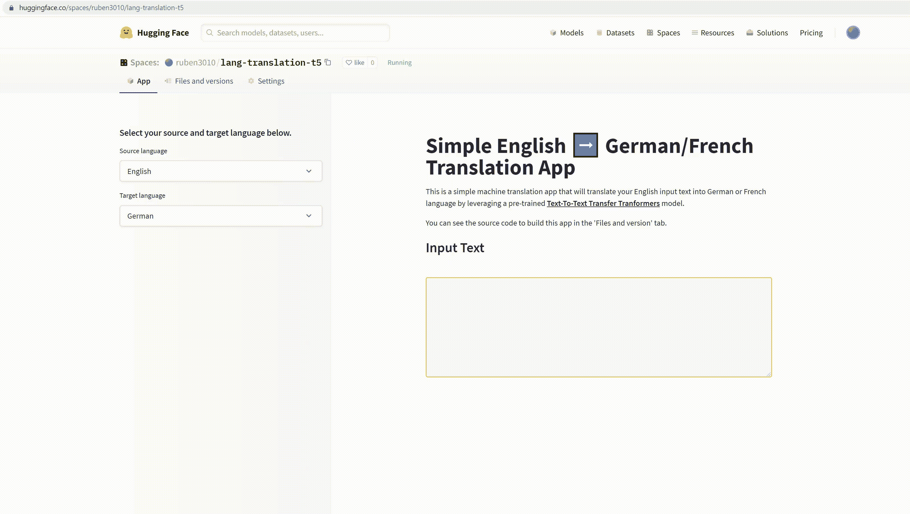

作者图片

当然，你可以自己玩这个简单的 ML 应用程序 [**这里**](https://huggingface.co/spaces/ruben3010/lang-translation-t5) 。

很有趣，对吧？其他人可以通过访问您的共享空间链接来玩您的 ML 应用程序。在本文中，我将一步一步地指导您如何在 Spaces 上构建这个简单的 ML 应用程序。

但是在我们深入研究实现之前，让我们简单地讨论一下空间。

# 什么是空间？

Spaces 是拥抱脸创建的一个平台，让你可以直接在你的个人资料上部署机器学习应用程序。要创建应用程序本身，您有两个选择:要么使用 Streamlit，要么使用 Gradio。

Spaces 将存储 git repo 中的所有源代码以及数据集和模型，因此您可以使用 *git-lfs* 保存像预训练模型一样的大文件。对于每个环境，您还将获得 16 GB 的 RAM 和 8 个 CPU 内核。

虽然 Spaces 是由 Hugging Face 创建的，但是您可以使用现有的各种包和库创建任何符合您兴趣的 ML 应用程序。因此，在构建自己的 ML 应用程序时，您可以尽可能地发挥创造力。

现在，让我们首先创建构建机器翻译的代码。

# 用变形金刚构建机器翻译

为了创建机器翻译，我们不需要从头开始构建和训练模型。相反，我们将使用一个预先训练好的变形金刚模型。在加载模型后，我们可以开始用英语编写我们的输入文本，然后模型会将其翻译成德语或法语。

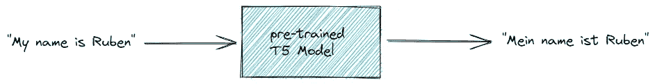

作者图片

我们将要使用的预训练模型是 T5 模型，它是**T**ext-**T**o-**T**ext**T**transfer**T**transformers 的缩写。我们要用变形金刚库加载这个模型，所以确保你先安装它。

```
pip install transformers
```

接下来，我们可以用下面的代码加载预先训练好的模型。

T5 使我们能够完成不同的 NLP 任务，如文本翻译、文本摘要、文本分类，甚至回归任务。由于它的多功能性，我们需要添加一个前缀来告诉 T5 模型应该执行哪些任务。

因为我们希望模型翻译文本，所以我们需要添加一个前缀，如下所示:

```
translate English to {target_language}
```

其中 T5 型号支持的`target_language`是德国、法国和罗马尼亚。

除了加载模型之外，请注意，在上面的代码中，我们还从 T5 模型中加载了一个预训练的标记器。

这个标记器负责将我们的输入文本转换成 T5 模型期望的输入的所有必要转换。使用这个记号赋予器，我们的输入文本将被转换成一系列记号，然后每个记号将被转换成它的 id 表示。

然后，来自记号赋予器的输出将被馈入 T5 模型。下面是一个例子，说明我们如何提供输入文本，由预先训练的分词器进行分词。

这是我们从上面的`output`变量中得到的:

*   `input_ids` —这是我们输入文本中每个单词的 id 表示。
*   `attention_mask` —这是一个二进制掩码，告诉 T5 哪个单词是真实单词，哪个只是填充。注意力屏蔽是我们 T5 模型的可选输入。

接下来，我们应该调用模型，用`generate()`函数预测 tokenizer 的输出，如下所示:

最后，我们需要将 T5 模型的预测解码回文本表示，如下所示:

这就是所有的步骤！很简单吧？

T5 模型一次只能翻译一个句子，所以如果我们有一个由几个句子组成的文本，我们需要将文本分割成一个句子列表。我们可以通过 NLTK 库中的`sent_tokenize()`函数轻松做到这一点。然后，我们用 T5 分词器对列表中的每个句子进行分词，如上所示。

下面是在我们将 NLTK 集成到机器翻译中之后，使用预训练的 T5 模型构建机器翻译的完整代码实现。

接下来，让我们用 Streamlit 创建我们的应用程序。

# 使用 Streamlit 构建 ML 应用程序

Spaces 目前支持两个 SDK 或库，我们可以选择来构建应用程序:要么使用 Streamlit，要么使用 Gradio。在本文中，我们将使用 Streamlit 来实现这一目的。如果你以前没有用过 Streamlit，那么我推荐你去看看，因为它真的很简单易学。使用 Streamlit，您不必处理前端开发和路由。

要使用 Streamlit，请确保首先 pip 安装它(如果您尚未安装)。

```
pip install streamlit
```

作为第一步，让我们定义一个函数来加载我们预先训练的 T5 模型，然后在函数定义上方放置一个缓存装饰器`st.cache()`。

缓存装饰器在这里非常重要，因为我们不希望我们的应用程序在每次用户使用我们的应用程序时都持续运行函数来加载我们的 T5 模型。

之前我们已经用预训练的 T5 模型建立了我们的机器翻译，但是你可能会注意到一切都是硬编码的。到目前为止，我们对输入文本和目标语言进行了硬编码。

使用 Streamlit，我们需要让用户自己输入文本。此外，如果他们可以选择输入文本应该翻译成哪种语言，是德语还是法语，那就更好了。

现在让我们创建一个交互式特性，让用户在侧边栏中选择目标语言。由于用户只能选择德语或法语，因此选择框将是实现这一目的的完美小部件。我们可以使用 Streamlit 中的`st.selectbox`来创建一个选择框小部件。

为了使应用程序不那么空洞，我们可以用`st.title`为我们的应用程序创建一个标题，并用`st.write`创建普通文本来解释应用程序。你可以随意添加任何你想要的东西，尽你所能发挥你的创造力。点击 查看 Streamlit [**上提供的完整 API。**](https://docs.streamlit.io/library/api-reference)

现在我们需要创建另一个交互式特性，让用户键入他们想要翻译的输入文本。要做到这一点，来自 Streamlit 的`st.text_area`小部件将是完美的选择。

最后，用户的输入将按照我们在上一节中实现的相同步骤进行处理。

下面是使用 Streamlit 构建我们的机器翻译应用程序的完整代码实现。

我们把上面的脚本保存为`app.py`。现在，让我们尝试运行 web 应用程序。

要在您的电脑上运行 streamlit 应用程序，您需要打开终端或 anaconda 提示符。然后，在终端中，转到保存`app.py`的目录。在目录中，您可以键入以下内容:

```
streamlit run app.py
```

运行上面的命令后，应该会弹出一个新窗口，显示如下截图所示的应用程序。

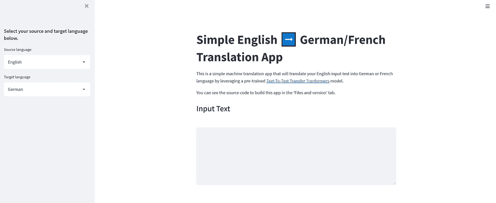

作者图片

请注意，到目前为止，我们已经成功地用 Streamlit 构建了我们的 web 应用程序，但是我们只能在我们的计算机上本地运行它。现在是我们公开展示我们的 web 应用程序的时候了，这样其他人就可以玩它了。

这就是我们需要空间的地方。

# 部署带空格的 ML 应用程序

正如我在文章开头提到的，在 Spaces 上部署您的 ML 应用程序非常容易。我们所需要的先决条件是一个拥抱脸帐户。

如果你还没有账户，你可以直接在[拥抱脸网站](https://huggingface.co/join)上注册一个新的。接下来，您需要提供您的电子邮件地址和密码来完成注册。

如果一切顺利，那么在您登录到您的新帐户后，您将看到以下页面。

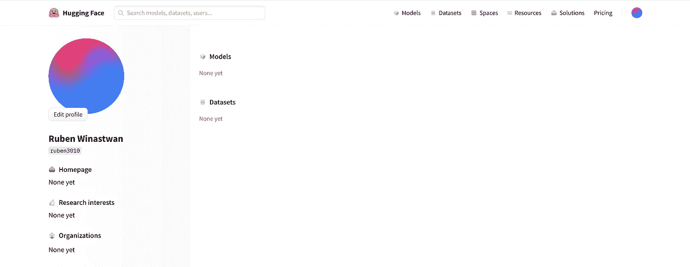

作者图片

要创建新空间，您可以转到导航栏右上角的个人资料图片，然后选择“*新空间*”。

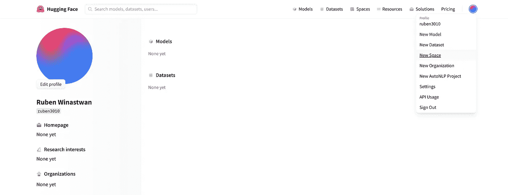

作者图片

接下来，您可以为您的 ML 应用程序创建名称，选择构建 web 应用程序的库，并选择您的应用程序是公开还是仅私有。因为我们使用 Streamlit 来构建我们的 web 应用程序，所以您需要选择 Streamlit 作为 SDK，如下所示。最后，点击*创建空间*。

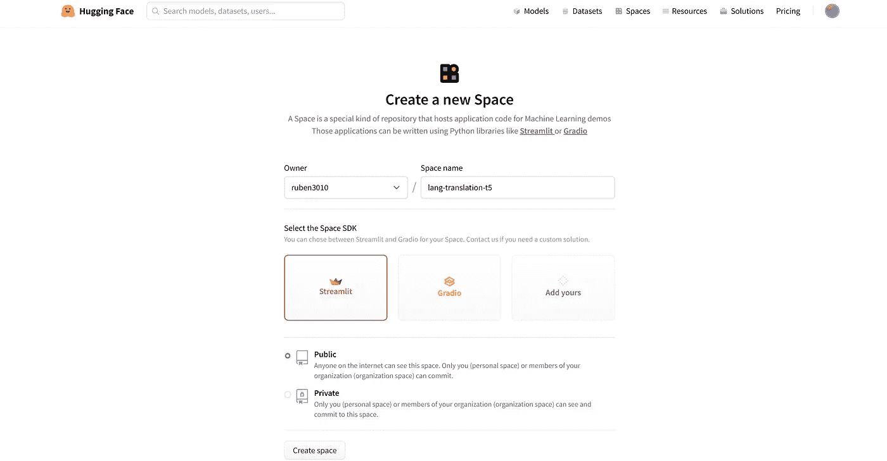

作者图片

现在，您应该会看到您的共享空间的登录页面，如下所示。

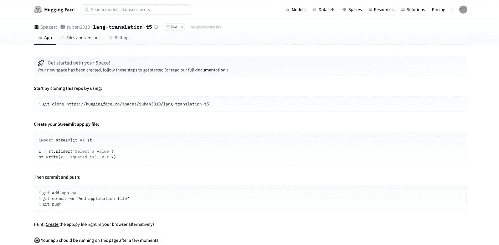

作者图片

这个页面实际上是一个 git repo，为了在我们的空间上部署我们的机器翻译 web 应用程序，我们需要添加两个附加文件:

*   **requirements.txt** —这是一个文本文件，包含我们构建应用程序所需的所有依赖项或库。
*   **app.py** —这是我们在上一节刚刚创建的 Streamlit 脚本。

将这两个文件添加到我们的空间页面非常简单。首先，我们来创建`requirements.txt`。

为此，我们需要点击'*文件和版本*选项卡，然后点击'*添加文件*并选择'*创建新文件*'。

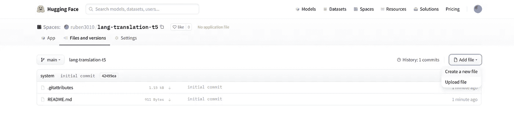

作者图片

接下来，将文件命名为`requirements.txt`，然后列出运行我们的应用程序所需的所有库。在这个简单的机器翻译应用程序中，我们需要 Transformers、Streamlit、PyTorch 和 NLTK，所以我们必须将它们包含在`requirements.txt`中。最后，点击*提交新文件*。

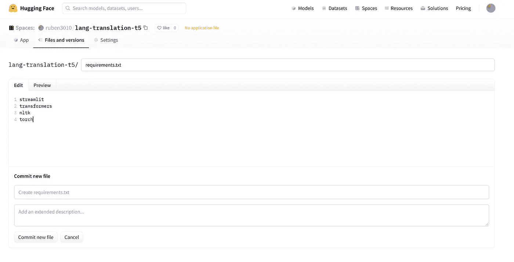

作者图片

到目前为止我们已经创建了`requirements.txt`。现在我们需要创建`app.py`作为最后一步。创建该文件有两个选项:

*   您可以创建一个新文件，将该文件命名为`app.py`，然后将我们实现的所有代码粘贴到该文件中，以使用上面的 Streamlit 构建应用程序。为此，点击“*添加文件*”，然后选择“*创建新文件*”，步骤与上面的`requirements.txt`相同。
*   或者，您可以将我们在上一节中实现的`app.py`脚本直接上传到这个“*文件和版本*”选项卡中。为此，单击“*添加文件*，然后选择“*上传文件*”。

在下面的截图中，我们用第一个选项创建了`app.py`。所以我们将这个文件命名为`app.py`,并将我们之前实现的所有代码粘贴到这个文件中。之后，点击“*提交新文件*”。

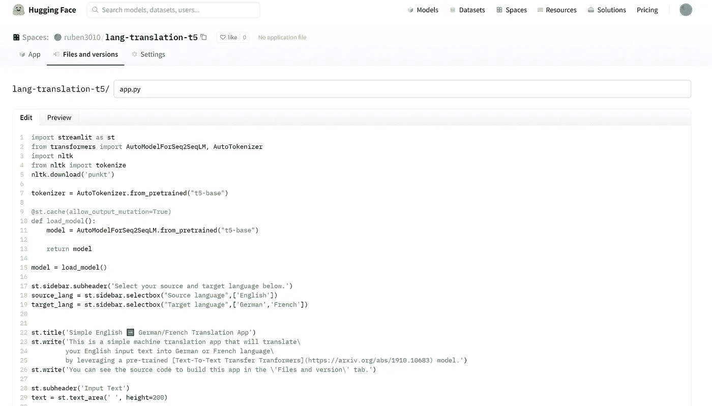

作者 Imae

就是这样！如果您点击“*应用*”选项卡，您将看到我们的简单机器翻译应用现已上线，其他人也可以访问。您可以通过共享共享空间的链接向其他人展示您的 ML 应用程序。

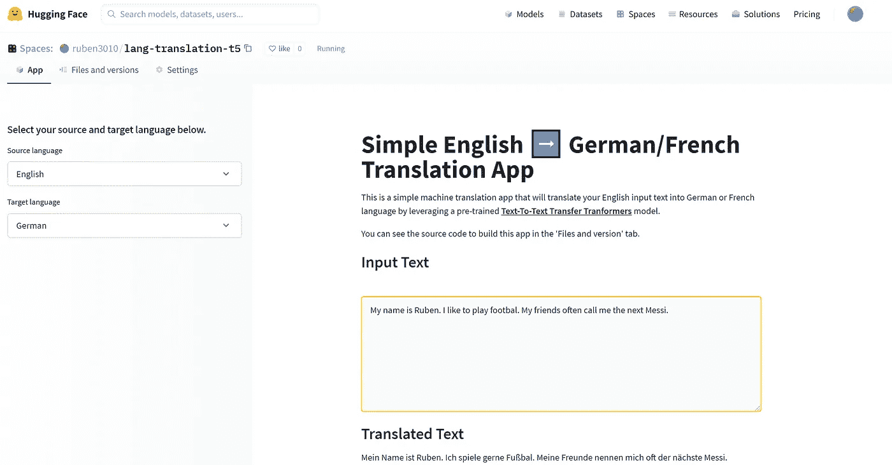

作者图片

# 结论

在本文中，现在您知道在 Spaces 上向其他人展示您的机器学习项目是多么容易和简单。

有一些库和平台使我们能够展示我们的创造力和技能，以执行端到端的机器学习项目，从数据收集开始，直到模型部署。

特别是 Spaces，你可以构建和部署任何符合你兴趣的机器学习应用程序，它不一定是关于机器翻译的。我希望这篇文章对你建立和扩展你的投资组合项目有所帮助。

如果你想更深入地探索太空，你可以阅读它的文档。

像往常一样，你可以在这里 **找到本文[中实现的源代码。](https://github.com/marcellusruben/All_things_medium/tree/main/Spaces_Translation_App)**