# SMS 消息中的垃圾邮件检测

> 原文：<https://towardsdatascience.com/spam-detection-in-sms-messages-3322e03300f5?source=collection_archive---------13----------------------->

## 真实短信垃圾邮件检测综述

# 介绍

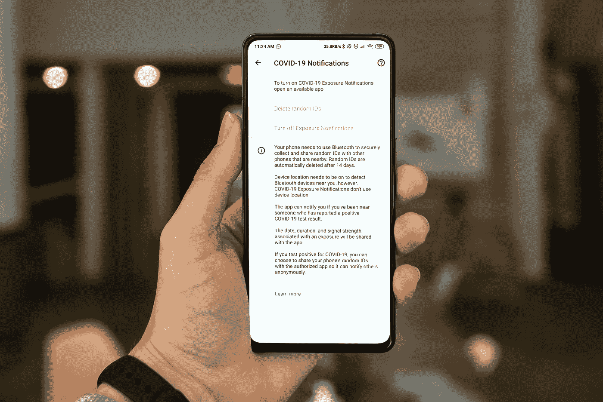

米卡·鲍梅斯特在 [Unsplash](https://unsplash.com?utm_source=medium&utm_medium=referral) 上的照片

本文中的每一项都是在一个跨越多个国家的**大型社交应用**的背景下考虑的。用户可以向任何号码发送一定数量的免费短信，在互联网连接非常有限、移动数据费用非常高的地区，这被证明是一项非常好的服务。

这当然吸引了骗子和欺诈者的注意，他们看到了非常便宜地吸引许多人关注他们有问题的业务的机会，这导致许多人试图滥用该平台。

该模型和相关程序是针对这种情况开发的，以保持应用程序中用户体验的质量。

本文中描述的模型和程序是在 [XpertAI](http://www.xpertai.com) 内与 Filippo Monari 合作完成的。

> Discalimer:出于隐私原因，本文中显示的示例是原始示例的修改版本，保留了感兴趣的属性，以便分析垃圾邮件检测。

**什么是垃圾邮件，为什么要阻止垃圾邮件**

垃圾邮件是以电子方式发送的不请自来且不受欢迎的消息，其内容可能是恶意的。垃圾电子邮件通过互联网发送/接收，而垃圾短信通常通过移动网络传输。我们将发送垃圾邮件的用户称为“垃圾邮件制造者”。用户发送 SMS 消息通常非常便宜(如果不是免费的话),这使得它对不正当的利用很有吸引力。用户通常认为 SMS 是比其他来源(例如电子邮件)更安全、更值得信赖的通信形式，这一事实进一步加剧了这种情况。

垃圾消息对用户的危险是多方面的:不受欢迎的广告、私人信息的暴露、成为欺诈或金融阴谋的受害者、被引诱进入恶意软件和网络钓鱼网站、无意中接触到不适当的内容等。对于网络运营商来说，垃圾短信导致运营成本增加。

> 在所研究的案例中，垃圾邮件是用户的烦恼，因此不利于服务质量，在这个过程中损害了品牌。这可能会导致投诉，收视率低，甚至失去用户，更不用说用户被骗。

**与垃圾邮件的区别**

下表总结了电子邮件和短信中垃圾邮件的主要区别。

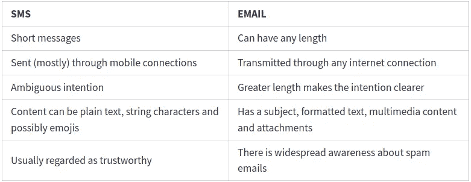

垃圾短信与垃圾邮件

**垃圾邮件发送者的行为**

垃圾邮件发送者试图通过发送不同数量的垃圾邮件来测试运营商的反垃圾邮件基础设施，以确定是否存在数量障碍。对于他们来说，使用多个号码发送消息是非常常见的，这就排除了号码阻止作为防止垃圾邮件的策略。这种情况需要某种基于内容的过滤，这种过滤不仅依赖于音量，还依赖于 SMS 本身的内容。

**服务中垃圾邮件过滤的状态**

在项目开始时，针对垃圾邮件发送者的行动仅包括禁止在发送 SMS 的数量方面超过固定的每日和每小时阈值的用户。当时没有基于内容的过滤，也没有任何基于用户元数据的考虑。这是一个基于规则的系统，很容易绕过，利用的数据很少。

**困难**

*   没有公开的垃圾短信大数据集。即使有，也不能指望在这些数据集上的训练会在我们的环境中转化为良好的表现。因此，除了从流入系统的真实数据构建自定义数据集之外，别无选择。
*   缺少将 SMS 日志转换为结构化的干净数据集的管道。
*   该应用程序在许多国家和语言中可用，增加了另一层复杂性。
*   最终模型必须部署并集成到应用程序的当前基础设施中，采取必要的预防措施，以避免导致高成本和消息传递延迟。
*   标签的主观标准:屏蔽宗教宣传可以吗，即使它不是为了欺诈或骗局？如果这个消息被传播给成千上万的用户呢？
*   消息不明确:人们甚至很难区分真正的消息和垃圾邮件。

**例句**

以下是基于真实邮件的示例(并非所有邮件都是垃圾邮件):

> -你的包裹正在等待递送📥bit.ly/xxxxxxx
> 
> 你的手指有多快？立即测试！->[https://play.google.com/store/apps/details?idxxxxxxx)](https://play.google.com/store/apps/details?idxxxxxxx](https://play.google.com/store/apps/details?idxxxxxxx)_)
> 
> -晚上好，先生，恢复愉快。我今天打了你的电话，但是你没有接。请把钱转到我的账户上。
> 
> -我用 PayTree 送你到€ 25 日注册与我的链接索赔，然后得到€30 万赠送基金:[https://palmpay.site/QXAfLgKsPhKA](https://palmpay.site/QXAfLgKsPhKA](https://palmpay.site/QXAfLgKsPhKA)_)
> 
> -2021 年 4 月 22 日，您的手机支付账户收到了来自约翰·卡彭特(+1)111111111 的 150 美元。发件人:交易 ID: 2901380912。为了成功提款，Ecobank 将联系您进行更多查询。
> 
> -关注此链接加入我的 WhatsApp 群:[http://unnoficial _ WhatsApp . com/download](http://unnoficcial_whatsapp.com/download_)
> 
> -请检查并发送给我，我的成绩 100 级第三年。姓名:约翰-保罗吉莉安 Jambaya 电子邮件:【johnpaulGillianJ@gmail.com】T2Jamb 注册号:49851407SA 公制号码。YU/14/6337 密码:2352246811678。我会付钱给你。

# 数据收集、提取和解析

照片由[西格蒙德](https://unsplash.com/@sigmund?utm_source=medium&utm_medium=referral)在 [Unsplash](https://unsplash.com?utm_source=medium&utm_medium=referral) 上拍摄

在这里，我们介绍了所采取的措施和部署的系统，以便从负责向最终用户发送 SMS 的运营商提供的非结构化日志中构建合适的数据集。每次发送短信都会产生大量数据，但这些数据无法以原始形式使用。

从它们的 S3 存储中收集日志，解密并解析，以便从 SMS 消息中分离日志的元数据。在此阶段，消息被分类为*发送*、*接收*、 *OTP* 和*失败。* OTP 代表**一次性密码**，由 app 发送进行注册登录，失败表示发送时报错。不同于垃圾邮件，OTP 还遭受其他类型的欺诈，这可能是另一篇文章的主题。

之后，执行另一个解析步骤，以提取消息体、元信息(如发送者的电话号码)、区分群组和对等消息，并将实际消息体与自动生成的内容(如链接到应用下载的页脚或指向服务主页的超链接)分开。接下来是从 UTF-16_LE 编码中解码 SMS 字符串，这被发现比其他可用的替代方法效果更好。

流水线的最后处理步骤包括使用[快速文本](https://fasttext.cc/)模型来检测消息的语言以及作为所选语言的样本的概率分数。

最后，处理后的消息存储在另一个 S3 存储桶中，该存储桶连接到 Athena 表(通过使用 Crawler 每天更新)，这些表提供了一种浏览解析后的消息和在数据集上运行 SQL 查询的便捷方式。由于数据量巨大(数百万条消息)，解析步骤是在运行 Spark 应用程序的集群上执行的。

下图描述了已部署的 ETL 管道，用于收集和处理构建数据集所需的日常日志:

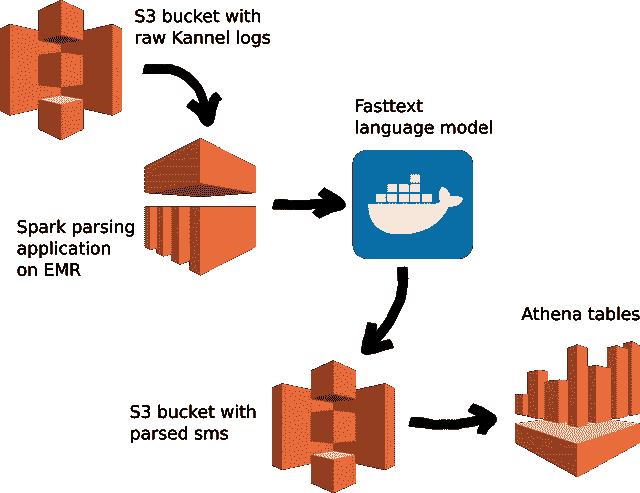

用于创建消息数据集的管道

# **建模**

由[迈克尔·泽兹奇](https://unsplash.com/@lazycreekimages?utm_source=medium&utm_medium=referral)在 [Unsplash](https://unsplash.com?utm_source=medium&utm_medium=referral) 上拍摄的照片

垃圾邮件检测问题可以用几种方法解决，从非常简单的(如一袋单词)到非常复杂的(完整的 NLP 模型)。
我们决定采用一种中间方法，对邮件的许多特征进行分析，并输入到机器学习算法中，以发现有助于区分垃圾邮件和非垃圾邮件的潜在模式。

**问题类型**

> 垃圾邮件分类历来被认为是一个二元分类问题。这就是我们的方法揭示其最原始的方面:我们放弃了二元分类问题，转而支持回归问题，其目标是预测消息的垃圾邮件概率。

稍后，这些垃圾邮件概率将与一个阈值进行比较，这将导致以下操作:

*   允许消息
*   允许消息并存储警告计数器
*   阻止消息
*   阻止消息和用户

**型号类型**

选择的模型架构是 [**XGBoost**](https://xgboost.readthedocs.io/en/stable/) ，一个基于[梯度增强](https://en.wikipedia.org/wiki/Gradient_boosting)技术的优化分布式梯度增强库。它被设计成高效的*、*灵活的*和*便携的*，被认为是只有数字特征的表格数据的最佳执行者之一。*

*XGBoost 是一个集合模型，由一系列弱学习者组成(至少比随机猜测要好),这些弱学习者作为一个“委员会”一起工作，比单独提供更好的预测。由于新的学习者被顺序地添加到组中，以关注前一个学习者的最大错误，这些相对于简单的“投票”得到了改进。这些弱学习器通常是决策树，其工作方式是沿着选定的特征在某些值上分割数据集。*

*即使该问题现在是目标在 0 和 1 之间的回归问题，我们仍然使用输出概率的二元分类的 ***二元:逻辑*** 损失来训练模型。*

***贴标程序***

> *手动标记数千条消息是不可行的，更不用说数百万条了。很明显，在项目开始时，产生一个具有正确标签的精心策划的数据集将是需要克服的最大障碍，事实也的确如此。*

*为了解决这个问题，我们想出了一个基于非常简单的原则的方法:垃圾邮件经常以高频率的突发发送。这源于这样一个事实，即垃圾邮件发送者希望让他们的内容，无论是欺诈，骗局，宣传或其他任何东西。这个想法是从一个有序的消息列表开始，其排序参数我们称之为**垃圾邮件分数**。这将表示对消息发送次数的一些计算，并且有许多可能的选择。最简单的方法是简单地对给定消息的出现次数进行计数，但是通过考虑例如:多少不同的用户在多少不同的日子里发送相同的消息，连续消息之间的时间差等等，这可以变得更复杂(不一定更好)。
最后，每条消息都会有一个关联的**垃圾邮件分数**，用于确定垃圾邮件概率。*

***从分数到概率***

*一旦我们有了有序的消息列表，我们需要将垃圾邮件分数转换成垃圾邮件概率。这些概率的范围从 0 到 1，并作为我们的监督学习问题的标签。*

> *注意:我们非正式地使用了术语**概率**，因为垃圾邮件概率并不代表邮件是垃圾邮件的实际概率，除非模型经过校准，但事实并非如此。*

*将垃圾邮件分数从 0 转换到+∞的最直接方法是对这些值应用位移的 sigmoid 曲线。这将确保我们的值始终位于[0，1]范围内。*

*更详细地说，过程如下。由于垃圾邮件分数的范围非常大，我们首先取对数来获得**日志垃圾邮件分数**。由于有一个唯一的 sigmoid 通过 2 个不同的点，一旦我们选择了对 *(q1，p1) (q2，p2)* ，我们就已经确定了将垃圾邮件分数转换为垃圾邮件概率的 sigmoid 函数。这些对代表**(百分比，概率)**超过日志垃圾邮件分数。*

*使用这些参数，可以拟合以下形式的 S 形曲线:*

*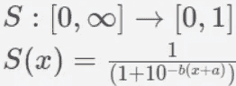*

*通过确定 *a* 和 *b* 的值，使 s 形线通过之前选择的线对。*

> *注意，当 x 趋于无穷大时，S 趋于 1，对于所有 x，S(x) > 0。*

*最后，日志垃圾邮件分数通过 sigmoid 函数传递，以获得用于训练的每封邮件的垃圾邮件概率。*

*在我们的例子中，我们选择(0.75，0.05)和(0.99，0.90)来拟合乙状结肠。这意味着我们已经决定，所有邮件中较低的 75%的垃圾邮件概率最多为 5%，而最低的 99%的邮件的垃圾邮件概率为 90%或更低。*

*尽管它们不在实际建模范围内，但这 4 个值可以被视为管道的*超参数*，因为它们有助于标签的获取，从而强烈影响训练的有效性。
为这些参数选择错误的值会将所有垃圾邮件概率聚集在一个值周围，这甚至可能导致无法获得任何有意义的训练。不幸的是，设置这些参数高度依赖于数据，因为不同的数据集会有不同数量的垃圾邮件。*

***分数分布***

*以下是垃圾邮件日志分数按特定百分比的分布情况:*

*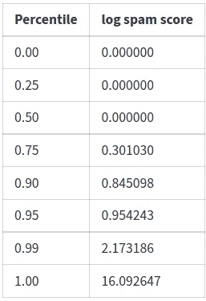*

*下图显示了左侧 y 轴上的垃圾邮件日志分数计数。请注意 y 轴上的对数刻度，值 0(对应于发送一次的消息)是目前最常见的值。还显示了指示垃圾邮件日志分数百分比的垂直线。*

*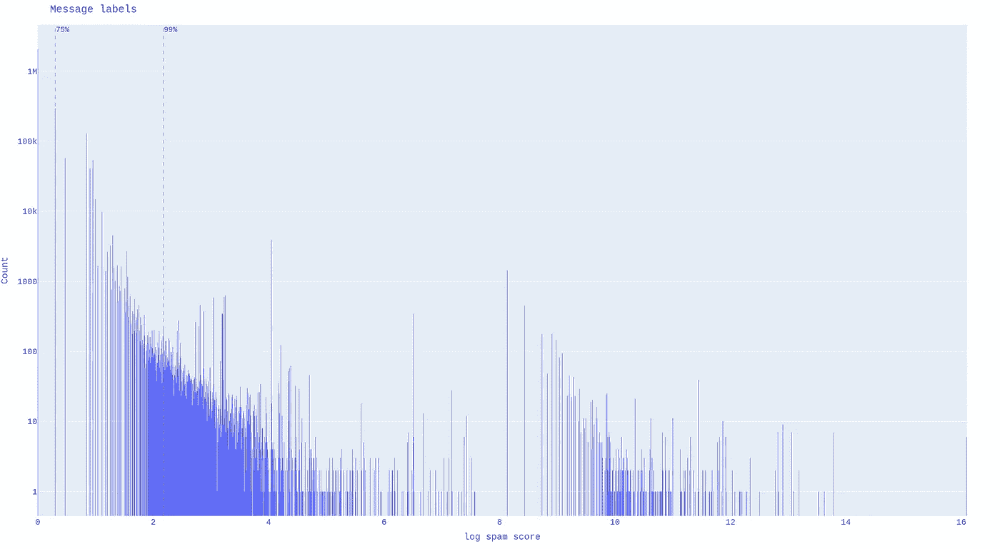*

*日志垃圾邮件分数在训练集上的分布*

*接下来，显示垃圾邮件概率。图中显示了用于拟合 sigmoid 函数的点，以及一些示例消息和它们被分配的垃圾邮件分数。*

*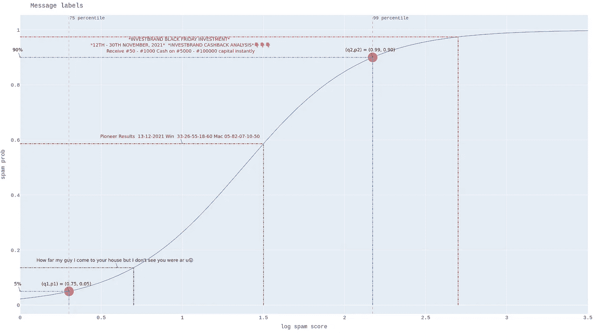*

*基于通过 sigmoid 函数传递的消息及其对应的指定垃圾邮件概率的示例*

***标签的改进***

*即使前面描述的标记选择是明智的，但在某些情况下，邮件频率本身并不是垃圾邮件得分的良好衡量标准。这些情况包括垃圾邮件，它们遵循相同的模式，但可能在 URL 的数字或字符上有细微的变化。
此外，诸如“*早安*”等非常常见的消息也将被赋予较高的垃圾邮件分值。考虑到最小消息长度，这个问题在很大程度上得到了缓解。
最后，合法的广播消息(如群体事件或公告)会被发送几次，这将赋予它们中等的垃圾邮件概率。然而，这可能是一个合理的标签，因为它可以帮助模型学习为大量不纯粹是垃圾邮件的消息分配中间概率。*

*为了改进一些标签，我们引入了一些非常简单的硬编码规则，用于我们绝对确定某个消息是否是垃圾邮件的情况。在前一种情况下，我们人为地增加消息发送次数的值，以便能够重用当前的管道，而在后一种情况下，假设消息已经发送了一次。*

***把问题当作倒退来处理的后果***

*重要的是要注意，当决定放弃二进制分类问题，而是将其重新定义为输出垃圾邮件概率的回归问题时，我们在结果中引入了一个基础结构，即消息不仅仅是垃圾邮件/垃圾邮件，而是有一个垃圾邮件等级来反映消息的垃圾程度。
这种结构在其他分类问题中可能毫无意义，在某些情况下甚至会恶化性能。然而，在我们的问题中，模型基于预测的垃圾邮件概率产生的额外“排序”实际上是一种优势，因为它可以在分类中提供一些麻烦。
换句话说，接收到中等垃圾邮件概率的消息可以反映该消息的模糊性，并且可以被保存以供人类稍后检查，而明显是垃圾邮件/ham 的消息将累积到 1/0，并且实际概率值变得有些不相关。*

***语言***

*由于短信来自一个多国消息应用程序，这些消息的语言当然是多种多样的。英语和法语是第一和第二广泛使用的语言，但也发现了数十种其他语言，包括阿拉伯语、汉语和非洲当地语言。
输入到模型中的一些特征对语言也有很强的依赖性。这意味着，为了使用它们，我们需要一个管道来计算任何语言的这些特征(每种语言的数据量最小，以使模型学习任何有意义的东西),以将问题限制在一种语言上，在我们的例子中是英语。鉴于垃圾邮件绝大多数是用英文写的，可能是因为垃圾邮件发送者试图扩大受众范围，因此只分析英文邮件似乎是明智的选择。我们使用 60%作为接受语言检测的最低置信度。
尽管如此，语言不可知模型也是一种选择，其中仅考虑独立于文本语言的特征，尽管由于许多特征的损失，预测能力可能降低。
必须澄清的是，短信的语言是根据消息的*干净*版本进行评估的。在这个上下文中，clean 意味着一个*标记化的*，消息的小写版本，其中一些特征被替换为占位符(参见建模部分末尾的一些示例)。*

***消息长度***

*大多数真实消息很短，而大多数垃圾消息明显长于平均长度。这是因为垃圾邮件需要包含某种方法，以 URL、电子邮件、电话号码的形式引诱消息的接收者。因此，通过仅考虑超过特定长度的消息来节省训练和推断时间的资源是有意义的。*

*最小消息长度的合理范围是 30 到 50 个字符，因为垃圾消息中的 URL、电话号码和电子邮件占据了许多字符。这可能因问题和生成消息的上下文而异。垃圾邮件发送者在注意到对策被应用后缩短和缩写他们的消息是很常见的。这可能需要修改最小消息长度，需要在现在更大的数据集上重新训练模型。*

***特色工程***

*术语*特征*指的是所考虑的 SMS 消息的特征、质量和/或属性。在许多情况下，一些特征值是很少出现的概念，因此只提取它们的计数，而不是实际内容。由于可处理内容的稀缺性，特征工程在垃圾短信检测中起着非常重要的作用。*

*做出的第一个决定是删除原始(未处理)长度少于 40 个字符的任何消息。接下来，随着特征被提取，内容逐渐被清除，直到获得消息的最终干净的“标记化”版本，其中仅留下字符。
对于手头的问题，使用了以下特征:*

*   *垃圾词(见下一节)*
*   *消息的一般 ***特征***
    —长度
    —清理前后的字数及其比率
    —平均字长*
*   ***特定概念**的出现次数及占总字数的比例。
    —电子邮件地址
    —通用网址
    —时间
    —工作日/月份
    —电话号码
    —宗教词汇和内容*
*   ***特定字符**
    —大写字符
    —货币符号
    —数字
    —标点符号(星号、感叹号/问号、标签等)的出现次数及占字符总数的比例。)
    —消息中不同字符的数量*

*还使用了其他不常用的功能。*

> *需要注意的是，在模型的训练阶段，并不是所有这些功能都会用到。根据结果和新数据的引入，较新的模型迭代可能具有不同的特性。*

***垃圾词汇***

*这组单词被选择来为每个消息生成与它们相关联的特征。
这些功能包括:*

*   *邮件中的垃圾邮件字数*
*   *独特的垃圾词*
*   *垃圾词与非垃圾词的比率*
*   *统计垃圾邮件单词出现次数的个人特征*

*起初，垃圾邮件单词是根据它们在垃圾邮件中出现的次数来选择的。这当然会导致一些正常的单词被认为是垃圾单词，而且从结果来看，这需要付出不值得的努力。因此，基于对最常见的垃圾邮件消息和这些单词可能携带的信息的简单观察，为模型选择了一组 20 个手动选择的单词。这些垃圾词的例子有*金钱*、*免费*、*赢*等。*

> *重要提示:尽管名称如此，这些词并不意味着垃圾邮件的嫌疑。模型使用它们来创建与每个单词相关联的特征。*

***模型评估***

*每个监督训练模型将测量通过比较真实和预测标签获得的损失。通常，垃圾邮件检测是一个分类问题，因此用于评估模型性能的指标是常见的指标，如**准确度、召回率、精确度、f1 值**。在我们的例子中，我们可以依赖模型用于训练的损失函数，但它不是人类可以解释的。*

> *因此，由于缺乏完全验证的标签，模型的评估是通过在训练的任何阶段都没有使用的测试集上人工检查模型的预测来完成的。该集合包含特别选择的消息。*

*在每个评估步骤都进行了定性考虑，通过改变训练参数的特征集、调试流水线中的步骤和改进标记，模型的最终责任得到了纠正或显著降低。*

# ***其他需要考虑的事情***

***运行时间和成本***

*每次调用 Lambda([AWS 定价](https://aws.amazon.com/lambda/pricing))并运行模型时，将模型作为 AWS Lambda 运行都会产生成本。计费金额基于使用的内存和运行时间。部署的模型非常轻量级和快速，每次运行使用不到 1000Mb，占用不到 10ms。对于未处理的消息，即那些因为太短而没有通过模型的消息，官方或非英语)运行时间大约为 2 毫秒。作为参考，在一天中有 80k 条未处理的消息和 27k 条消息通过模型，总成本大约为四分之一美元。*

***硬编码规则***

*在有些情况下，垃圾邮件发送者的活动量如此之大，以至于必须在短时间内交付快速而完整的解决方案。这意味着需要做出妥协，一个纯粹的、正统的 ML 解决方案必须给更多的 *ah-hoc* 方法留有余地。例如，在一个小时内看到数以千计的消息以前所未见的模式流入后，简单地阻止前 20 个字符与该消息中看到的字符完全相同的消息的硬编码解决方案似乎是一个合理的临时解决方案。稍后将有时间将这些消息添加到训练集，重新训练和重新部署。*

***固定消息***

*相当一部分消息是由应用程序本身生成的，作为对所提供内容的推广。此时的一个选项是将这些消息包括在模型的训练中，并给它们分配 0 垃圾邮件概率。然而，我们已经选择将这些消息从训练中完全排除，并且它们也不会在推断时被模型评估。因为它们包含预先已知的字符串模式，所以在将输入提供给模型之前设置一个简单的过滤器可以防止对它们进行评估，这对交付时间几乎没有影响。*

***更新型号***

*几乎可以保证，在模型部署之后，反对垃圾邮件的斗争不会结束。无论有多少单元测试和集成测试，当模型被部署在真实的环境中时，错误和意外的行为几乎肯定会出现。这些错误包括破坏模型(例如，不正确的消息解析、错误的字符串编码、错误的数据格式输入数据等。)到最无害的(例如，正则表达式中未考虑的边缘情况、时区差异)。*

***垃圾邮件发送者报复***

*垃圾邮件发送者可以非常坚定地让他们的“内容”被理解，一旦他们发现我们意识到他们的企图，他们就会改变他们的行为。
他们将测试系统以确定适当的检查和阻止，以便绕过它们，如果系统依赖记忆或固定规则，则稍微修改他们的消息，测试消息长度和消息量的阈值等。*

*以下是一个非常活跃且持续的垃圾邮件发送者的示例:*

> *-请将您的姓氏发送到[tommadeira128@gmail.com](mailto:tommadeira128@gmail.com)以获得在您的姓氏上发现的无人认领的资金。
> -请将您的姓氏发送到[tommadeira128777@gmail.com](mailto:tommadeira128777@gmail.com)领取您的无人认领基金
> -在您的姓氏上发现了一笔无人认领的基金将您的姓氏发送到[tommasmad173@gmail.com](mailto:tommasmad173@gmail.com)进行索赔和验证，以及有关该基金的更多查询。
> -[tommasmaderira25@gmail.com](mailto:tommasmaderira25@gmail.com)进行核实和索赔
> -将您的姓氏发送到[tommadeira128128@gmail.com](mailto:tommadeira128128@gmail.com)4 索赔
> -请将您的姓氏 2[tommade25@gmail.com](mailto:tommade25@gmail.com)发送给一笔在您的姓氏上发现的无人认领的资金
> -Snd ur 1 name 2[tommadeira777@gmail.com](mailto:tommadeira777@gmail.com)4 ur 检测到的遗产
> -姓氏 2[tommadeira128@gmail.com](mailto:tommadeira128@gmail.com)4 一笔在您的姓氏上发现的无人认领的资金
> -您的姓氏 2*

> *垃圾邮件发送者的报复需要定期更新模型，以包括新的垃圾邮件模式，希望使发送垃圾邮件变得如此困难，以至于垃圾邮件发送者投入的时间回报不再有利可图。*

***部署***

*一旦模型被训练完成，它就被打包成一个 docker 映像。这个图像然后被上传到 AWS，并作为 Lambda 函数在它自己的容器中运行。这种类型的无服务器部署具有许多优势，因为它非常易于扩展和更新，并且允许随时随地调用该模型，而无需担心服务器和基础架构。*

*对于我们的应用程序，每当消息请求到达 XMPP 消息服务时，就会调用该模型。如果消息的内容超过了最小长度，那么它将被发送到模型，该模型将确定消息的语言并对其内容运行垃圾邮件预测器。然后，该模型将返回一个 json 文件，其输出包括语言、时间戳、调试特性(如果需要)以及垃圾邮件概率。*

***总结***

*下图总结了训练垃圾邮件模型及其在真实环境中的集成所涉及的步骤。*

*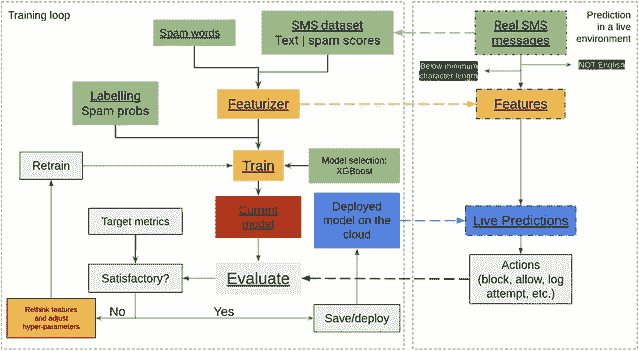*

*训练和开发垃圾邮件检测系统的工作流程*

*空格之间的虚线表示来自训练和预测管道的交互。*

1.  *真实数据将为模型的未来迭代提供信息*
2.  *在训练阶段定义的特征提取器必须在真实环境中完全相同。否则，模型要么抛出不兼容错误，要么产生意想不到的结果。*
3.  *在训练之后，一个令人满意的模型被部署到一个真实的环境中。首先，在*影子*模式下测试一段时间，在不中断服务的情况下获得评估指标。推理时间也在这个阶段被测试。一段时间后，模型被完全引入到生产环境中。*
4.  *引入模型后获得的结果应该被记录和保存，以获得性能测量。根据这些，我们可以决定你重新培训和重新部署。预计当新的 SMS 分布偏离训练集中的分布时，性能会随着时间而恶化。*

# *结果*

**

*由[卢克·切瑟](https://unsplash.com/@lukechesser?utm_source=medium&utm_medium=referral)在 [Unsplash](https://unsplash.com?utm_source=medium&utm_medium=referral) 上拍摄的照片*

> *总的来说，有可能实现一个模型能够相当好地识别垃圾邮件，而不惩罚正常的消息。该模型似乎正在推广训练集中没有的模式。简单的垃圾邮件案例很容易被检测到，在这些案例中，相对于之前已经看到的垃圾邮件，只有一个数字或一个单词发生了变化。*

*还有一个非常有趣的消息排序，其中非明确垃圾邮件的消息被分配中间概率。通过仅在这些不明确的消息上进行人工标记，这使得为模型的下一次迭代产生更好的标签变得容易。
此外，几乎没有误报，这意味着正常邮件几乎不会被阻止。*

***基于垃圾邮件概率的后续行动***

*一旦模型返回垃圾邮件概率，就可以对发件人和邮件采取行动。
一种选择是在模型之外包含一些硬编码的逻辑(比如当前基于消息频率的逻辑)。*

*例如:*

1.  *设置预定义的百分位数 Q1 和 Q2，并获得对应于这些百分位数的垃圾邮件概率的阈值 T1 和 T2。这些值将根据目标是 ***召回*** (最大限度地检测垃圾邮件)还是*(最大限度地提高正确标记为垃圾邮件的邮件的百分比)而变化，并且应该由最好具有领域知识的产品所有者来决定。**
2.  **跟踪和记录垃圾邮件概率超过 T1 和 T2 的消息、消息的发送者和接收者。**
3.  **如果消息超过 T1，有几个选项:**

**app 推广——暂时什么都不做**

**—在发送消息之前用确认按钮提示用户，以避免出现多条消息**

**—直接阻止消息，而不通知用户

4。如果消息是关于 T2 的，考虑与前一种情况相似(但更严格)的选项。

5。对通过 T1 和 T2 发送消息的用户进行计数**

> **N 注:最好说分位数而不是实际阈值，因为重新训练模型会改变某个分位数所在的阈值。因此，分位数提供了一种跨时间和不同模型迭代对消息进行分类的更稳定的方式。**

****使用垃圾邮件概率****

**在模型被训练的上下文中解释模型的结果是很重要的。如建模部分所述，标签是通过根据一些手动选择的标准拟合一个 s 形曲线而获得的。因此，结果应该用那个标准来理解。0.1 的垃圾邮件概率可能看起来很低，但在我们的情况下，它高于所有邮件的 70%。事实上，只有 10%的邮件被分配了高于 0.5 的垃圾邮件概率。**

**对垃圾邮件概率采取的任何行动都应该考虑这个训练参数。一种方法是考虑基于给定百分比的垃圾邮件概率而不是固定数字来设置阈值。例如，将阈值设置为只有 1%的邮件超过的垃圾邮件概率值。这当然需要了解真实邮件(测试集)中垃圾邮件分数的分布情况，但是如果这些值来自相同的来源，并且发生在不久之前，那么用来自训练集的值来近似它是合理的。**

**在任何情况下，当决定如何解释垃圾邮件概率时(例如当选择阈值时)，建议考虑在评估阶段使用的选定消息。**

****例题****

**下面是一些邮件解析、特征提取和垃圾邮件概率预测的例子。仅显示了一小部分功能。**

***例 1:垃圾 app 推广***

**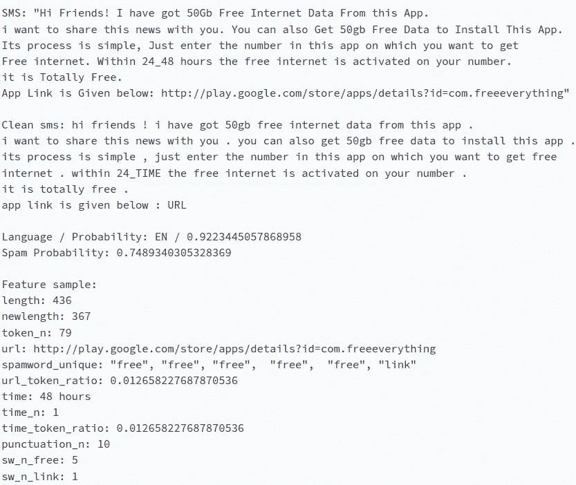**

**示例 2:应用推广消息、解析和特征提取**

***示例 2:正常消息***

**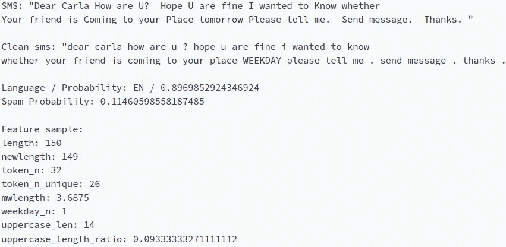**

**示例 2:普通消息、解析和特征提取**

***示例 3:带有表情符号的普通消息***

**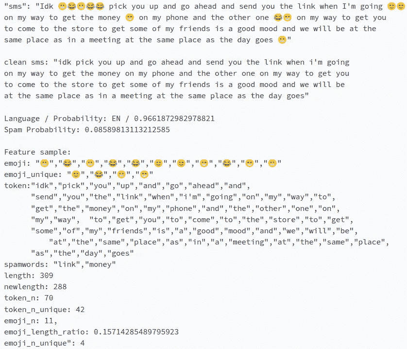**

**示例 3:带有表情符号的普通消息、解析和特征提取**

***例 4:可疑企业的垃圾邮件。***

**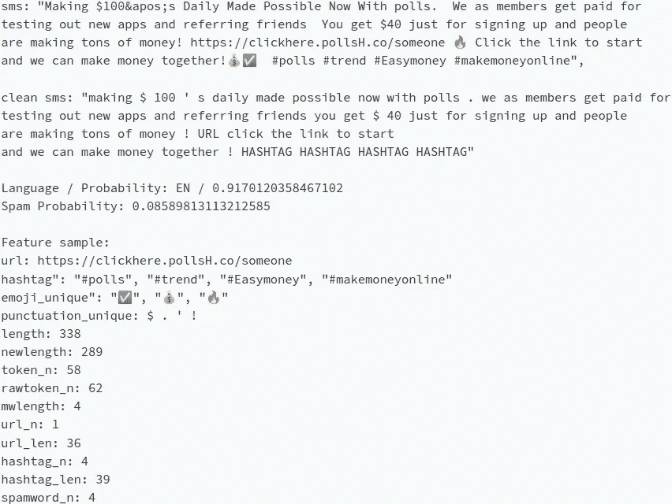**

**示例 4:垃圾消息、解析和特征提取**

**可以看出，消息 1 和 4 最有可能是垃圾邮件，它们被给予高垃圾邮件概率，尽管消息 4 的概率可能更高。这可能是该模型第一次发现这种模式，但它仍然检测到一些与垃圾邮件相关的模式，因此垃圾邮件的概率几乎高于所有邮件的 90%。
根据为训练选择的参数，消息 2 和 3 被正确地分配了非常低的垃圾邮件概率。**

# **结论**

****外卖****

*   **基于频率的自动标注允许合理地创建标注数据集。**
*   **垃圾邮件检测可以被重新构建为回归问题，并且添加的垃圾邮件概率结构提供了更精细的分类。**
*   **该模型成功地检测出在训练集上看不到的新垃圾邮件模式。**
*   **标签越好，结果越好。**
*   **垃圾邮件概率不应该在真空中解释，而应该在问题和分析数据集的上下文中解释。**
*   **在云上运行这个模型是非常便宜的，因为它速度快，内存使用少。**

****可能的改进****

**任何机器学习项目都有改进的空间，这个项目也不例外。这些是一些可能的预测影响。**

***在当前框架内***

1.  **改进标签。这是迄今为止最重要的事情。数据的质量与预测的质量高度相关。一些可能性是:
    —在特征提取之后使用消息聚类将相似的消息分组在一起，并且手动标记该组的代表。然后，该标签将共享给组中的所有数据点。
    —想出更好的标签试探法。
    —利用外部数据，如发件人、承运人、位置等。，识别垃圾邮件发送者并将其所有邮件标记为垃圾邮件。
    —如果有助于训练，请使用其他来源的垃圾邮件数据(小心)。
    —更多手动贴标。**

**2.尝试不同的模型架构并调整超参数。**

**3.模型校准，以便垃圾邮件概率实际上代表一个*数学定义的概率*。**

***当前框架外***

**包括除了 SMS 内容之外的信息可以提供辅助变量，以帮助决定在 SMS 运行通过模型之后对其采取何种动作。用户元数据，如应用程序的使用期限、消息频率、以前被阻止的消息数等，应该是对仅根据短信内容计算的垃圾邮件概率的很大补充。**

**垃圾邮件概率只是其中一个组成部分的集成框架将通过减少误报数量(从仅在一定数量的警告后阻止)来增强模型的实用性，不评估来自已知合法用户的消息，并及时阻止重复的垃圾邮件发送者使用该应用程序。**