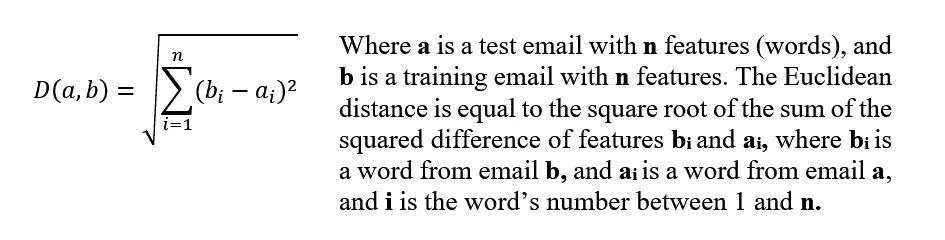
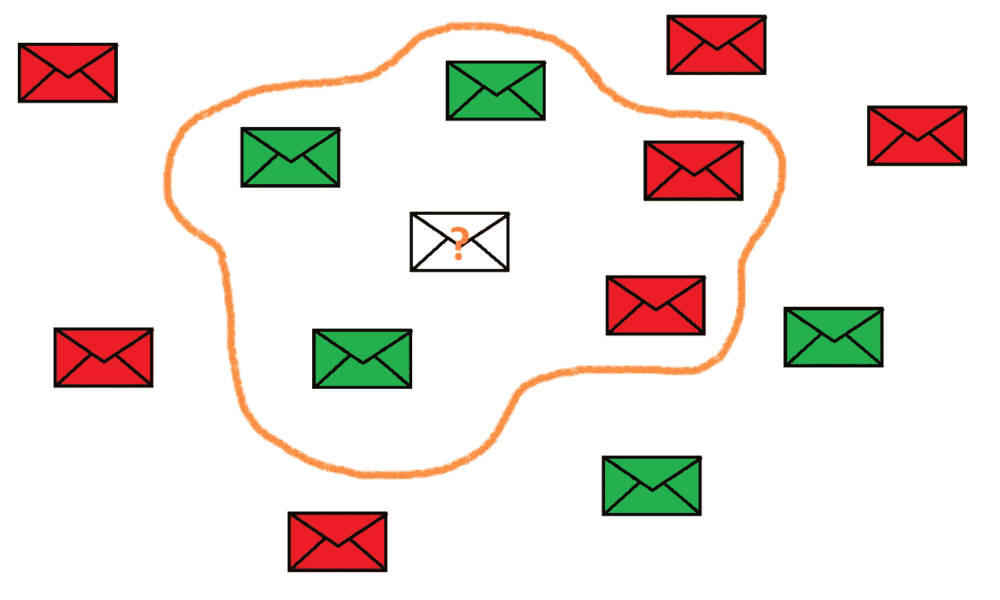
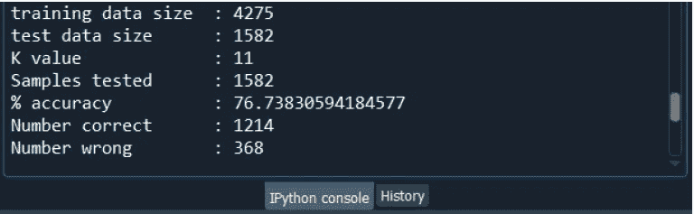

# KNN 垃圾邮件分类器—从零开始(Python)

> 原文：<https://towardsdatascience.com/spam-email-classifier-with-knn-from-scratch-python-6e68eeb50a9e?source=collection_archive---------4----------------------->

## 使用 Python 实现 KNN 算法对垃圾邮件进行分类的分步指南


马特·里德利在 [Unsplash](https://unsplash.com?utm_source=medium&utm_medium=referral) 上的照片

# 什么是 KNN？

KNN 是一种非常简单的监督学习算法。然而，与传统的监督学习算法(如多项式朴素贝叶斯算法)不同，KNN 没有独立的训练阶段，也没有基于训练模型预测测试数据标签的阶段。相反，实时地将每个测试数据项的特征与每个训练数据项的特征进行比较，然后选择 K 个最接近的训练数据项，并且将其中最频繁的类别给予测试数据项。

在电子邮件分类(垃圾邮件或 ham)的上下文中，要比较的特征是每封电子邮件中单词的频率。欧几里德距离用于确定两个电子邮件之间的相似性；距离越小，越相似。算法中使用的欧几里德距离公式如下:



作者图片

一旦计算了测试电子邮件和每个训练电子邮件之间的欧几里德距离，就以升序(从最近到最远)对距离进行排序，并且选择 K 个最近的相邻电子邮件。如果大部分是垃圾邮件，则测试电子邮件被标记为垃圾邮件，否则，它被标记为垃圾邮件。



作者图片

在上面的例子中，K = 5；我们正在将我们想要分类的电子邮件与最近的 5 个邻居进行比较。在这种情况下，5 封电子邮件中有 3 封被分类为 ham(非垃圾邮件)，2 封被分类为垃圾邮件。因此，未知的电子邮件将被赋予多数人的类别:火腿。现在我们已经看到了 KNN 是如何工作的，让我们继续使用代码实现分类器！

# 履行

为了快速了解我们将用 Python 编写什么，编写伪代码总是一个好的做法:

```
1\. Load the spam and ham emails2\. Remove common punctuation and symbols3\. Lowercase all letters4\. Remove stopwords (very common words like pronouns, articles, etc.)5\. Split emails into training email and testing emails6\. For each test email, calculate the similarity between it and all training emails
    6.1\. For each word that exists in either test email or training email, count its frequency in both emails
    6.2\. calculate the euclidean distance between both emails to determine similarity7\. Sort the emails in ascending order of euclidean distance8\. Select the k nearest neighbors (shortest distance)9\. Assign the class which is most frequent in the selected k nearest neighbours to the new email
```

## 数据集

垃圾邮件和 ham(普通电子邮件)的电子邮件数据集是从“安然-垃圾邮件数据集”中获得的。可以在 Enron2 下的[http://NLP . cs . aueb . gr/software _ and _ datasets/Enron-Spam/index . html](http://nlp.cs.aueb.gr/software_and_datasets/Enron-Spam/index.html)找到。我们使用的数据集包含 5857 封电子邮件。每封电子邮件都存储在一个文本文件中，文本文件被划分并存储在两个文件夹中，ham 文件夹和 spam 文件夹。这意味着电子邮件已经被标记。每个文本文件都将被程序加载，每封邮件都将被读取并存储为一个字符串变量。字符串中的每个不同的单词都将被视为一个特征。

## 使用的库

```
import os
import string
from nltk.corpus import stopwords
from sklearn.model_selection import train_test_split
from sklearn.metrics import accuracy_score
import numpy as np
```

**os** 打开并读取文件的库。
**字符串**为标点符号列表
**停用词**包含停用词列表。
**train_test_split** 将数据拆分成训练和测试数据。
**accuracy_score** 计算算法的准确度。
**numpy** 允许高级数组操作。

## 加载数据

```
def load_data():
    print("Loading data...")

    ham_files_location = os.listdir("dataset/ham")
    spam_files_location = os.listdir("dataset/spam")
    data = []
```

返回一个文件夹中所有文件名的列表。这用于检索每个 ham 和 spam 文件夹中文本文件的所有文件名，并将它们分别存储在 ham_files_location 和 spam_files_location 中。数据是存储每个电子邮件文本及其相应标签的列表。

```
 # Load ham email
    for file_path in ham_files_location:
        f = open("dataset/ham/" + file_path, "r")
        text = str(f.read())
        data.append([text, "ham"])

    # Load spam email
    for file_path in spam_files_location:
        f = open("dataset/spam/" + file_path, "r")
        text = str(f.read())
        data.append([text, "spam"])
```

我们遍历 ham 文本文件名列表，使用 open()打开一个文件，然后使用 str(f.read())将电子邮件文本作为一个字符串读取并存储在变量文本中。由文本构成的列表和相应的标签“ham”被附加到列表数据。

```
 data = np.array(data)

    print("flag 1: loaded data")
    return data
```

列表数据被转换成一个 numpy 数组，以便以后更好地操作该数组。然后返回数据。

## 数据预处理

```
# Preprocessing data: noise removaldef preprocess_data(data):
    print("Preprocessing data...")

    punc = string.punctuation           # Punctuation list
    sw = stopwords.words('english')     # Stopwords list
```

punc 保存一个标点和符号列表
sw 保存一个 nltk.corpus 库中的停用词列表

```
 for record in data:
        # Remove common punctuation and symbols
        for item in punc:
            record[0] = record[0].replace(item, "")
```

对于 data 中的每条记录，对于 punc 中的每项(符号或标点)，用空字符串替换该项，以从记录[0](电子邮件文本字符串)中删除该项。

```
 # Lowercase all letters and remove stopwords 
        splittedWords = record[0].split()
        newText = ""
        for word in splittedWords:
            if word not in sw:
                word = word.lower()
                newText = newText + " " + word        record[0] = newText

    print("flag 2: preprocessed data")        
    return data
```

对电子邮件文本记录[0]使用 split()方法返回电子邮件中所有单词的列表。遍历单词列表，如果单词不在停用词列表中，将其设置为小写，并将该单词添加到 newText。新文本将包含电子邮件，但没有停用词。newText 被分配回记录[0]。预处理完每个记录[0]后，返回干净的数据。


预处理电子邮件之前和之后

## 将数据分成训练集和测试集

数据集分为训练集(73%)和测试集(27%)。

```
# Splitting original dataset into training dataset and test datasetdef split_data(data):
    print("Splitting data...")

    features = data[:, 0]   # array containing all email text bodies
    labels = data[:, 1]     # array containing corresponding labels
    print(labels)
    training_data, test_data, training_labels, test_labels =\
        train_test_split(features, labels, test_size = 0.27, random_state = 42)

    print("flag 3: splitted data")
    return training_data, test_data, training_labels, test_labels
```

首先，有必要将电子邮件文本放在一个自己的数组中，并将标签放在另一个自己的数组中。因此，电子邮件文本存储在特征中，标签存储在标签中。然后使用 train_test_split 方法将数据拆分为 training_data、test_data、training_labels 和 test_labels。随机状态被设置为 42，以确保出于测试目的获得相同的随机洗牌输出。拆分后，将返回 training_data、test_data、training_labels 和 test_labels。

## KNN 算法

**get_count()函数**

```
def get_count(text):
    wordCounts = dict()
    for word in text.split():
        if word in wordCounts:
            wordCounts[word] += 1
        else:
            wordCounts[word] = 1

    return wordCounts
```

该函数获取一个电子邮件文本，并使用 split()将其拆分。统计电子邮件中每个单词的出现频率，并保存在 wordCounts 中，这是字典数据类型。然后返回字典字数。

**欧几里得 _ 差分()函数**

```
def euclidean_difference(test_WordCounts, training_WordCounts):
    total = 0
```

这个函数接受一个测试邮件的字数字典 test_WordCounts 和另一个训练邮件的字典 training_wordCounts。total 存储测试和训练电子邮件中单词频率的平方差之和。

```
 for word in test_WordCounts:
        if word in test_WordCounts and word in training_WordCounts:
            total += (test_WordCounts[word] - training_WordCounts[word])**2
```

首先，我们迭代测试电子邮件字典中的单词。对于每个单词，有三种情况。第一种情况是它同时存在于测试邮件和培训邮件中。在这种情况下，total 会随着单词在测试电子邮件和培训电子邮件中出现频率的平方差而增加。

```
 del training_WordCounts[word]
```

然后，从训练电子邮件字典中删除常用单词，以加速下一个 for 循环

```
 else:
            total += test_WordCounts[word]**2
```

第二种情况是这个词只出现在测试邮件中。在这种情况下，没有必要找出差异(因为它的频率在训练邮件中是 0)，所以我们只需将单词的平方频率加到总数中。

```
 for word in training_WordCounts:
            total += training_WordCounts[word]**2
```

最后一种情况是这个词只在培训邮件里。由于我们在前面的 for 循环中删除了所有常用单词，因此我们只需循环遍历训练电子邮件字典，并将每个单词的频率平方添加到 total 中。

```
 return total**0.5
```

最后，total 的平方根(每个单词的频率的平方差的和的平方根)作为 double 返回。这是欧几里德距离计算函数的结尾。

**get_class()函数**

```
def get_class(selected_Kvalues):
    spam_count = 0
    ham_count = 0
```

该函数接受所选的 K 个最近邻居的列表，以确定当前测试电子邮件的类别。spam_count 和 ham_count 分别存储每个“spam”标签和“ham”标签在 K 个选定的最近邻居中的出现频率。

```
 for value in selected_Kvalues:
        if value[0] == "spam":
            spam_count += 1
        else:
            ham_count += 1
```

使用 for 循环，对于 K 个选定值中的每个值，如果标签值[0]等于“spam ”,则 spam_count 递增 1。否则，ham_count 递增 1。

```
 if spam_count > ham_count:
        return "spam"
    else:
        return "ham"
```

在 for 循环之后，如果 spam_count 大于 ham_count，则表示当前测试邮件有更大的倾向是垃圾邮件，因此返回一个字符串“spam”作为预测标签。否则，字符串“ham”将作为预测标签返回。

**knn_classifier()函数**

```
def knn_classifier(training_data, training_labels, test_data, K, tsize):
    print("Running KNN Classifier...")

    result = []
    counter = 1
```

这是 KNN 分类器函数。它接收训练邮件、训练标签、测试数据、K 值，以及原始 27%测试邮件中要测试的测试邮件的数量。结果是包含预测标签的列表。计数器将仅用于显示目的，以指示程序运行时的进度。

```
 # word counts for training email
    training_WordCounts = [] 
    for training_text in training_data:
            training_WordCounts.append(get_count(training_text))
```

由于训练集是恒定的，我们可以一劳永逸地统计每封训练邮件中的词频。因此，对于训练数据中的每个电子邮件文本，使用 get_count()获得其词频字典。然后，将该词典添加到要存储的 training_WordCounts 列表中。

```
 for test_text in test_data:
        similarity = [] # List of euclidean distances
        test_WordCounts = get_count(test_text)  # word counts for test email
```

现在，对于测试数据中的每封测试邮件，都执行以下操作。声明了空列表相似性。它将存储当前测试电子邮件和每个培训电子邮件之间的欧几里德距离。然后，使用 get_count()获得测试邮件的词频词典。

```
 # Getting euclidean difference 
        for index in range(len(training_data)):
            euclidean_diff =\
                euclidean_difference(test_WordCounts, training_WordCounts[index])
            similarity.append([training_labels[index], euclidean_diff])
```

因为我们已经有了所有训练邮件和当前测试邮件的词频词典。我们可以继续使用迭代 x 次的 for 循环来计算当前测试电子邮件和每个训练电子邮件之间的欧几里德距离，其中 x 等于训练数据集的大小。在每次迭代之后，计算的欧几里德距离连同训练电子邮件的相应标签一起被附加到相似性列表。

```
 # Sort list in ascending order based on euclidean difference
        similarity = sorted(similarity, key = lambda i:i[1])
```

在存储了所有欧几里得距离之后。我们基于第二列，即基于欧几里德距离(从最近到最远)，以升序对相似性列表进行排序。

```
 # Select K nearest neighbours
        selected_Kvalues = [] 
        for i in range(K):
            selected_Kvalues.append(similarity[i])
```

现在，由于相似性列表已经排序，我们可以使用简单的 for 循环轻松地将最近的 K 个邻居添加到 selected_Kvalues 列表中。

```
 # Predicting the class of email
        result.append(get_class(selected_Kvalues))
```

最后，在进入下一封测试邮件之前。我们使用 get_class()来确定当前测试电子邮件的类别。现在，我们已经到了一次迭代的末尾，下一次迭代可以开始分类下一封测试邮件了。

```
 return result
```

一旦所有的测试邮件都被分类，并且 for 循环已经到达它的末端，那么包含预测标签列表的结果列表将被返回。

**main()函数**

```
def main(K):
    data = load_data()
    data = preprocess_data(data)
    training_data, test_data, training_labels, test_labels = split_data(data)
```

这是程序开始运行的主要功能。这是所有东西放在一起的地方。主函数接受 K 值。首先，使用 load_data()加载所有电子邮件，然后存储在 data 中。然后使用 preprocess_data()对电子邮件进行预处理，并再次存储在数据中。然后使用 split_data()将数据拆分为 training_data、test_data、training_labels 和 test_labels。

```
 tsize = len(test_data)
```

tsize 指定了测试电子邮件的数量(在原始的 27%测试数据中)来预测它们的标签。目前，tsize 被设置为等于整个测试电子邮件集。

```
 result = knn_classifier(training_data, training_labels, test_data[:tsize], K, tsize) 
    accuracy = accuracy_score(test_labels[:tsize], result)
```

现在，调用 knn_classifier()函数来预测测试电子邮件的标签。返回的预测标签列表存储在结果中。之后，使用 sklearn 库中的 accuracy_score()方法计算准确度。此方法将实际标签列表 test_labels 与预测标签列表结果进行比较。

```
 print("training data size\t: " + str(len(training_data)))
    print("test data size\t\t: " + str(len(test_data)))
    print("K value\t\t\t\t: " + str(K))
    print("Samples tested\t\t: " + str(tsize))
    print("% accuracy\t\t\t: " + str(accuracy * 100))
    print("Number correct\t\t: " + str(int(accuracy * tsize)))
    print("Number wrong\t\t: " + str(int((1 - accuracy) * tsize)))
```

这些行显示运行的详细信息，如训练数据大小、测试数据大小、K 值、测试的样本数量、百分比准确度、正确识别的电子邮件数量以及错误识别的电子邮件数量。

```
main(11)
```

最后，这一行通过调用 main 函数启动程序，并赋予它 K 值(在本例中是 11)。

# 产出和结论



输出

这是上面解释的所有代码的最终输出。可以看出，使用 KNN 算法将电子邮件分类为垃圾邮件和垃圾邮件，K 值为 11，测试数据大小为 1582，其准确率为 76.7%。虽然不是最好的，但还是令人满意的。需要注意的一个缺点是，对 1582 封邮件进行分类需要很长时间。这主要是由于高时间复杂度，这是在计算测试电子邮件和训练电子邮件之间的欧几里德差时三个嵌套 for 循环的结果。

你可以在我的 Github 库[这里](https://github.com/abdelrahman46/Spam-Filtering-KNN/blob/0e4e373d2839be4fd48a7a8556d741579ee5737b/SpamFiltering_KNN_AlgorithmCode.py)找到完整的源代码。