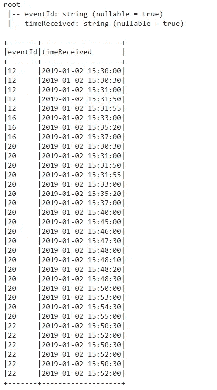
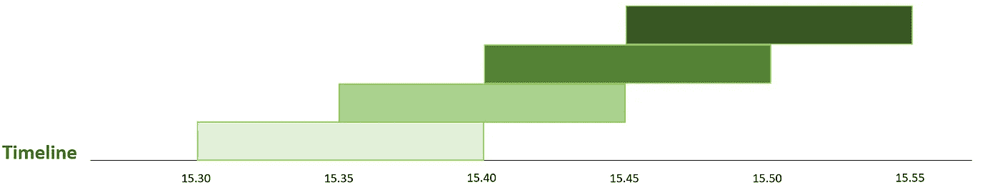

# Spark 3.2:流数据的会话窗口特性

> 原文：<https://towardsdatascience.com/spark-3-2-session-windowing-feature-for-streaming-data-e404d92e267?source=collection_archive---------9----------------------->

## Spark 3.2 的大数据实施

## 在 Spark 3.2 上用 PySpark 实现会话窗口


[来源](https://pixabay.com/photos/apartments-architecture-balconies-1845884/)

最新版本的 Spark 3.2 发布于 2021 年 10 月 13 日[ [1](https://spark.apache.org/downloads.html) ]。除了在不同主题上的改进之外，

现有的用于流数据处理的窗口框架仅提供翻转和滑动窗口，如 Spark 技术文档[ [2](https://link.springer.com/chapter/10.1007/978-1-4842-7383-8_7) ]中所强调的。在术语中，有一个额外的窗口操作，称为会话窗口。

与其他两种窗口方法不同，会话窗口没有固定的窗口开始和结束时间。会话窗口的创建取决于定义的会话周期，该周期可以是静态的或动态的。

在会话窗口的静态版本中，特定时间段内发生的事件被视为一个会话窗口。当会话窗口在指定时间段内没有收集事件时，它将停止。

在会话窗口的动态版本中，周期可能会因事件而异。

对于每种窗口方法，您可以在接下来的章节中找到 PySpark 语言的相应实现。对于开发平台和编程语言，将分别使用 Google Colab 和 PySpark。

## Java 安装

在安装 Spark 3.2 之前，最初，我们需要安装 Java 的匹配版本。使用下面的脚本，您可以设置 Java 8 版本。

```
!apt-get install openjdk-8-jdk-headless -qq > /dev/null
```

## **火花 3.2。安装**

完成适当版本的 Java 安装后，就可以开始 Spark 3.2 的安装了。以下脚本将帮助您设置 Spark 3.2。版本[ [3](https://spark.apache.org/downloads.html) ]。

```
!wget -q [https://archive.apache.org/dist/spark/spark-3.2.0/spark-3.2.0-bin-hadoop2.7.tgz](https://archive.apache.org/dist/spark/spark-3.2.0/spark-3.2.0-bin-hadoop2.7.tgz)
```

当安装成功结束时，您需要在以下脚本的帮助下提取 spark 文件。

```
!tar xf spark-3.2.0-bin-hadoop2.7.tgz
```

Java 和 Spark 3.2 的安装。完了。下一步是为它们分配环境变量。如果你使用 Google Colab，你可以像下面这样设置路径环境。

```
import osos.environ["JAVA_HOME"] = "/usr/lib/jvm/java-8-openjdk-amd64"
os.environ["SPARK_HOME"] = "/content/spark-3.2.0-bin-hadoop2.7"
```

出于测试目的，您可以像下面的脚本一样运行 *findspark* 库。

```
import findspark
findspark.init()
```

# 窗口函数的类型

随着最新的更新，Spark 3.2 包含三种独特类型的窗口功能，如*翻滚*、*滑动、*和*会话*。为了能够单独测试它们，应使用最新的 spark 版本创建 Spark 会话。

以下脚本使用 Google Colab 环境中的所有本地核心创建一个会话。

```
from pyspark.sql import SparkSessionspark = SparkSession.builder.master("local[*]").getOrCreate()
```

为了测试 Spark 的版本，*。版本*功能可以为 spark 会话执行。

```
spark.version
```

## 火花会话初始化

为了能够应用窗口函数，需要一个 spark 会话和一个样本数据帧。示例 spark 会话可以初始化为下面的代码片段。

```
from pyspark.sql import SparkSessionspark = SparkSession.builder.master("local[*]").getOrCreate()
spark.version
```

示例数据可以用下面的脚本生成。

```
# Sample Data is generated for windowing exampleswindowingData = (("12", "2019-01-02 15:30:00"),("12",  "2019-01-02 15:30:30"),
("12",  "2019-01-02 15:31:00"),
("12",  "2019-01-02 15:31:50"),
("12",  "2019-01-02 15:31:55"),
("16",  "2019-01-02 15:33:00"),
("16",  "2019-01-02 15:35:20"),
("16",  "2019-01-02 15:37:00"),
("20",  "2019-01-02 15:30:30"),
("20",  "2019-01-02 15:31:00"),
("20",  "2019-01-02 15:31:50"),
("20",  "2019-01-02 15:31:55"),
("20",  "2019-01-02 15:33:00"),
("20",  "2019-01-02 15:35:20"),
("20",  "2019-01-02 15:37:00"),
("20",  "2019-01-02 15:40:00"),
("20",  "2019-01-02 15:45:00"),
("20",  "2019-01-02 15:46:00"),
("20",  "2019-01-02 15:47:30"),
("20",  "2019-01-02 15:48:00"),
("20",  "2019-01-02 15:48:10"),
("20",  "2019-01-02 15:48:20"),
("20",  "2019-01-02 15:48:30"),
("20",  "2019-01-02 15:50:00"),
("20",  "2019-01-02 15:53:00"),
("20",  "2019-01-02 15:54:30"),
("20",  "2019-01-02 15:55:00"),
("22",  "2019-01-02 15:50:30"),
("22",  "2019-01-02 15:52:00"),
("22",  "2019-01-02 15:50:30"),
("22",  "2019-01-02 15:52:00"),
("22",  "2019-01-02 15:50:30"),
("22",  "2019-01-02 15:52:00"))columns = ["eventId", "timeReceived"]windowing_df = spark.createDataFrame(data = windowingData, schema = columns)windowing_df.printSchema()windowing_df.show(truncate=False)
```



样本数据帧的输出(归作者所有)

## 翻滚窗口

滚动窗口可以被表示为一组相等划分的、相邻的时间段，而没有任何交叉间隔。输入的数据可以服从于单独的窗口。

```
from pyspark.sql.functions import *tumblingWindows = windowing_df.withWatermark("timeReceived", "10 minutes").groupBy("eventId", window("timeReceived", "10 minutes")).count()tumblingWindows.show(truncate = False)
```


翻滚窗口的输出(归作者所有)

在时间轴上观察时，窗口可以被视为一个序列，一个接一个以静态方式排列，如下图所示。


时间轴上的滚动窗口(归作者所有)

## 推拉窗

当时间跨度包含比窗口范围更短的间隔时，滑动窗口可以具有交叉的时间段。在这种情况下，可以在多个窗口中找到带有时间戳的项目。

```
from pyspark.sql.functions import *slidingWindows = windowing_df.withWatermark("timeReceived", "10 minutes").groupBy("eventId", window("timeReceived", "10 minutes", "5 minutes")).count()slidingWindows.show(truncate = False)
```


滑动窗口的输出(归作者所有)

当在时间线上观察时，当与具有作为滚动窗口的静态方式的主滑动窗口的长度相比时，根据时间范围的长度，窗口可以重叠或不重叠。



时间轴上的滑动窗口(归作者所有)

## 会话窗口

通过相对于输入项目类型的窗口大小，会话窗口可以包含动态长度的性质。

会话窗口从单个数据点开始，如果在间隔期内已经收集了即将到来的元素，则该窗口会变宽。

当最后一个项目被接受时，如果在间隔期内没有项目被确认，则会话窗口结束。此功能允许用户在选定时间段内没有高级事件注入时对事件进行聚类，该时间段在官方文章中也描述为非活动期[ [4](https://databricks.com/blog/2021/10/12/native-support-of-session-window-in-spark-structured-streaming.html) ]。

在现实世界中，会话窗口的逻辑作为超时事件运行。在某个特定的时间间隔内，您应该执行一个活动，否则，现有的会话会在足够长的时间过去后关闭。在记录了额外活动的情况下，可以延长会话周期。

对于会话窗口的具体用法，可以描述为用即将到来的事件创建一个会话窗口，在超时周期内持续收集的事件将被添加到当前会话中。

```
from pyspark.sql.functions import *sessionWindows = windowing_df.withWatermark("timeReceived", "10 minutes").groupBy("eventId", session_window("timeReceived", "5 minutes")).count()sessionWindows.show(truncate = False)
```


会话窗口的输出(归作者所有)

获得的每个事件都能够增加会话超时的范围。有了这个特性，与其他两种窗口方法相比，会话窗口的时间周期可以被认为不是静态的。

对于上面添加的特定示例，可以观察到 id 为 20 的事件，会话窗口流在指定时间段后关闭，并在新元素被确认时再次开始。


时间轴上的会话窗口(归作者所有)

## 会话窗口的动态间隔期

会话窗口功能有一个额外的特性，称为*动态间隙持续时间*，如 Databricks 博客文章[ [4](https://databricks.com/blog/2021/10/12/native-support-of-session-window-in-spark-structured-streaming.html) 中所述。当被请求时，会话的周期可以具有各种值。具有重叠行为的会话可以被分组到单个会话中。此会话的总持续时间将等于交叉事件持续时间的总和。

您可以按事件 Id、会话窗口对数据进行分组，并通过为最新的 Spark 3.2 [ [5](https://spark.apache.org/docs/latest/structured-streaming-programming-guide.html) ]编程指南中描述的 ***session_window()*** 函数插入两个值，使用以下脚本计算其出现次数。

```
windowedCountsDF = windowing_df.withWatermark("timeReceived", "10 minutes").groupBy(windowing_df.eventId, **session_window**(windowing_df.timeReceived, \
when(windowing_df.eventId == "20", "10 seconds").when(windowing_df.eventId == "12","30 seconds").otherwise("10 minutes"))).count()windowedCountsDF.show(100, truncate = False)
```


会话窗口的动态间隔期的输出(归作者所有)

# 结论

在文献中，存在三种主要的窗口功能。具有静态方式的是**翻滚**和**滑动**窗口，这在以前版本的 Spark 3.2 中已经可用。Spark 3.2 [ [6](https://spark.apache.org/releases/spark-release-3-2-0.html) ]的最新版本现在提供了动态的**会话** windows 功能。

你可以在 [Google Colab 环境](https://colab.research.google.com/drive/1XPmatY-6SdZ6GPdItUAzSPj4Ops0BoYO?usp=sharing)中找到完整的 PySpark 脚本代码。

非常感谢您的提问和评论！非常感谢您的阅读！

# 参考

1.  [火花释放 3.2.0](https://spark.apache.org/releases/spark-release-3-2-0.html)
2.  [结构化流媒体节目指南](https://spark.apache.org/docs/latest/structured-streaming-programming-guide.html)
3.  [高级火花流](https://link.springer.com/chapter/10.1007/978-1-4842-7383-8_7)