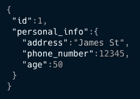
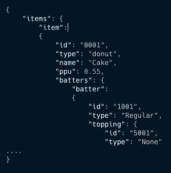

# 火花 3。嵌套字段不再嵌套

> 原文：<https://towardsdatascience.com/spark-3-nested-fields-not-so-nested-anymore-9b8d34b00b95?source=collection_archive---------11----------------------->

## 关于嵌套字段的重要更改


照片由 [Mrg Simon](https://unsplash.com/@mrsmrg?utm_source=unsplash&utm_medium=referral&utm_content=creditCopyText) 在 [Unsplash](https://unsplash.com/s/photos/nest?utm_source=unsplash&utm_medium=referral&utm_content=creditCopyText) 上拍摄

**Spark 3.1.1** 发布带来了很多新东西！

例如，查看为这个[版本](https://issues.apache.org/jira/browse/SPARK-33005)完成的所有与 Kubernetes 相关的任务。

正如你可能从这篇文章的标题中想象的那样，我们不会谈论 Kubernetes，而是嵌套字段*。*

如果您使用 Spark 的时间足够长，那么您肯定会做一些使用深度嵌套字段的噩梦。

让我们从头开始。

> 什么是嵌套字段？

嵌套字段是包含其他字段或对象的字段。

例如:



> 如何在 Spark 中管理嵌套字段？

在 Spark 中，处理它们总是有点问题。

假设 id=1 的人已经把他的地址从“詹姆斯街”改成了“圣彼得街”，现在你需要更新它。

因为在 Spark 中不能直接修改嵌套字段，所以需要重新构建整个结构，这样才不会丢失其他字段。

大概是这样的:

```
df
  .withColumn("personal_info",
  *struct*(
    *lit*("**St Peter**"),
    *col*("personal_info.phone_number"),
    *col*("personal_info.age")))
```

> 嗯，好吧，但是我现在如何在 Spark 中管理嵌套字段呢？

嗯，在这个新的 3.1.1 版本中，引入了一个名为***with field****的新方法。*

*让我们打个招呼😁*

*从 Spark 3.1.1 开始，我们将能够像这样改变嵌套字段:*

```
*df
  .withColumn("personal_info",
    'personal_info.withField("address", *lit*("**St Peter**")))*
```

*好多了，对吧？我们不需要重建整个对象，我们只需要引用我们想要改变的字段就可以了！*

*让我们看一个更复杂的例子。*

*我们的新输入 JSON 如下(为了简单起见，我避免了一些括号)*

**

*我将打印 Spark 模式，让输入数据更加清晰。*

```
*root
 |-- items: struct (nullable = true)
 |    |-- item: struct (nullable = true)
 |    |    |-- batters: struct (nullable = true)
 |    |    |    |-- batter: struct (nullable = true)
 |    |    |    |    |-- id: string (nullable = true)
 |    |    |    |    |-- topping: struct (nullable = true)
 |    |    |    |    |    |-- id: string (nullable = true)
 |    |    |    |    |    |-- type: string (nullable = true)
 |    |    |    |    |-- type: string (nullable = true)
 |    |    |-- id: string (nullable = true)
 |    |    |-- name: string (nullable = true)
 |    |    |-- ppu: double (nullable = true)
 |    |    |-- type: string (nullable = true)*
```

*现在我们需要从**置顶**字段中更改 **id** ，该字段嵌套很深，我们需要导航:*

> **物品- >物品- >面糊- >面糊- >浇头- > id**

*来达到这个值。*

*在 Spark 3.1.1 之前，这将是一个真正的难题，但现在就像这样简单:*

```
*df
  .withColumn("items",
    *col*("items")
      .withField("item.batters.batter.topping.id", *lit*(**12**)))*
```

*如果我们打印结果，我们可以看到新的 id 不再是 **5001** 而是 **12** :*

```
*+----------------------------------------------------------+
|items                                                     |
+----------------------------------------------------------+
|{{{{1001, {**12**, None}, Regular}}, 0001, Cake, 0.55, donut}}|
+----------------------------------------------------------+*
```

*就是这样！酷吧？*

> *…那么删除嵌套字段呢？*

*好消息！我们也可以放弃他们。让我们删除刚刚更改过的字段，为此，我们需要调用 ***dropFields:****

```
*df
  .withColumn("items",
    *col*("items")
      .dropFields("item.batters.batter.topping.id"))*
```

*让我们再次打印输出:*

```
*+------------------------------------------------------+
|items                                                 |
+------------------------------------------------------+
|{{{{1001, {None}, Regular}}, 0001, Cake, 0.55, donut}}|
+------------------------------------------------------+*
```

*还有成功！ **id** 不见了。*

*在这一点上，你可能会问…*

> *我可以同时修改一列和删除一列吗？*

*答案是肯定的！*

```
*df
 .withColumn("items",
   *col*("items")
     .withField("item.batters.batter.topping.id", *lit*(12))
     .dropFields("item.batters.batter.topping.type"))*
```

*如果我们打印结果和模式，我们可以看到 ***id*** 是 12，而 ***topping.type*** 不见了:*

```
*+----------------------------------------------------+
|items                                               |
+----------------------------------------------------+
|{{{{1001, {12}, Regular}}, 0001, Cake, 0.55, donut}}|
+----------------------------------------------------+root
 |-- items: struct (nullable = true)
 |    |-- item: struct (nullable = true)
 |    |    |-- batters: struct (nullable = true)
 |    |    |    |-- batter: struct (nullable = true)
 |    |    |    |    |-- id: string (nullable = true)
 |    |    |    |    |-- topping: struct (nullable = true)
 |    |    |    |    |    |-- id: integer (nullable = false)
 |    |    |    |    |-- type: string (nullable = true)
 |    |    |-- id: string (nullable = true)
 |    |    |-- name: string (nullable = true)
 |    |    |-- ppu: double (nullable = true)
 |    |    |-- type: string (nullable = true)*
```

## *结论*

*Spark 发展很快，以前不可能的事情现在可能会发生，跟上时代总是好的，不仅是 Spark，而是每项技术。*

*毫无疑问，对于所有使用深度嵌套字段的人来说，这将改变游戏规则。*