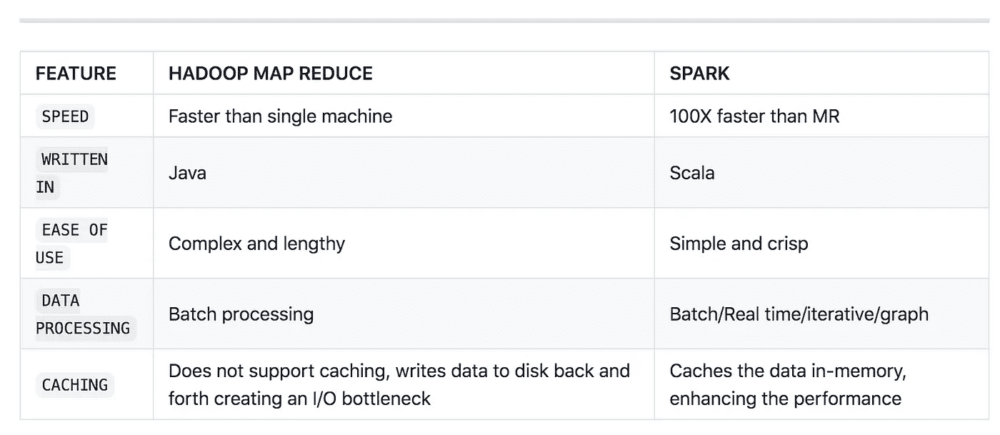
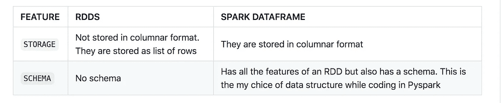
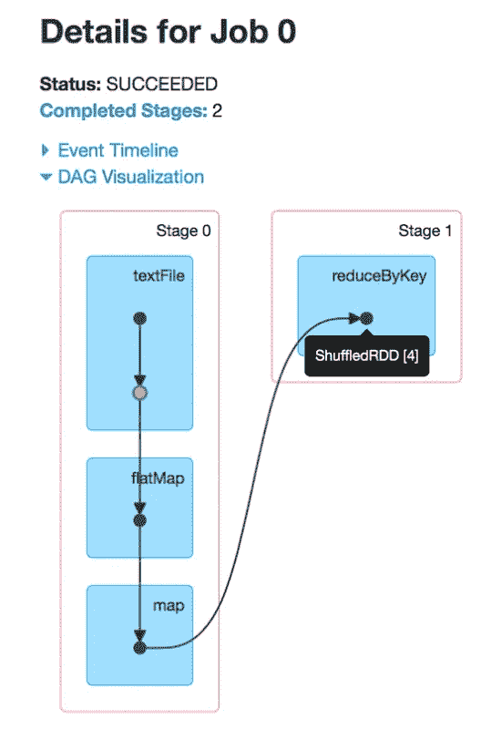
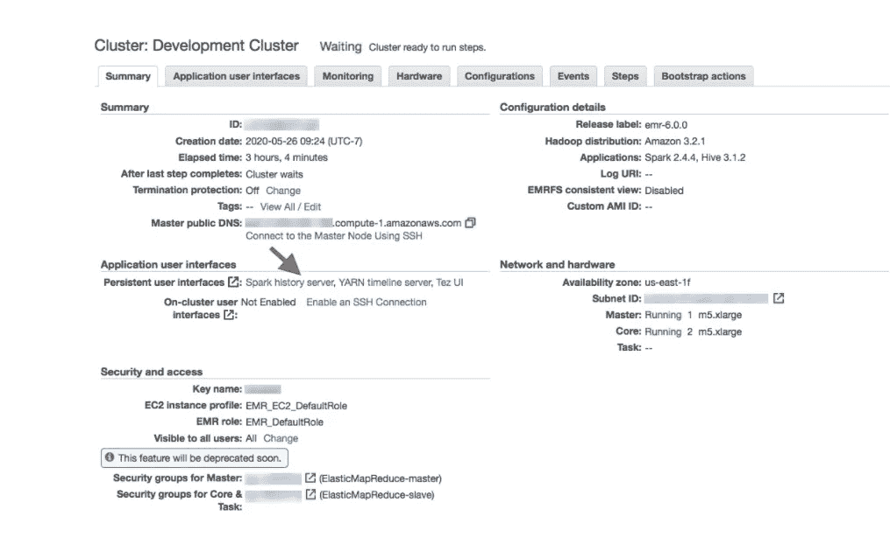
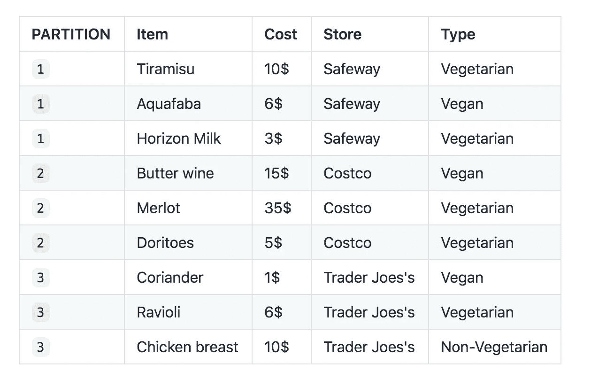

# 把它提高一个档次

> 原文：<https://towardsdatascience.com/spark-it-up-a-notch-70d8864a896e?source=collection_archive---------20----------------------->

## Apache Spark 的基本细节

我花了大约一年的时间来学习和实现与 Spark 相关的各种微妙之处。在这个系列中，从这篇文章开始，我将尝试记录我在 Spark 中遇到的不同场景，并解释它的用例。


照片由[杰兹·蒂姆斯](https://unsplash.com/@jeztimms?utm_source=medium&utm_medium=referral)在 [Unsplash](https://unsplash.com?utm_source=medium&utm_medium=referral) 上拍摄

# 什么是火花？

> Apache Spark 是一个用于大规模数据处理的开源统一分析引擎。Spark 提供了一个接口，通过隐式数据并行和容错对整个集群进行编程。

`Note` : `Spark is not a programming language`。它是一个通用的分布式数据处理引擎。Spark 是用函数式编程语言 Scala 编写的。幸运的是，Spark 有一个很棒的 Python 集成，叫做 PySpark(这是我最常用的)，它让我可以以任何我想要的方式与框架交互。

# 为什么是火花？

Spark 是许多大数据相关问题的一站式解决方案。Spark 的一些常见用例有:

1.  批处理(ETL)
2.  实时，几乎是实时。
3.  ML 和深度学习

运行 spark(在集群模式下)最简单的方法是在现有的 Hadoop 集群上使用 AWS EMR，使用 YARN 作为资源管理器。

# 是什么让 spark 如此特别？

这是一个简单的三重回答。

*   速度
*   易用性
*   统一的引擎

# 传统 Hadoop map-reduce 和 Spark 的差异

对于那些传统上从事 map-reduce 或 Hadoop 的人来说，你可能想知道为什么是 Spark？从速度到书写的容易程度，Spark 都有很大的优势。一些明显的差异是:



# Spark 和分布式计算术语

大多数技术都伴随着过多的术语和术语，T2 也不例外。首先:

*   分区数据
*   RDDS
*   数据帧
*   容错
*   谱系图
*   懒惰评估
*   在内存计算中
*   转换
*   行动
*   火花工作

# 分区数据、RDD 和数据帧

分区只不过是存储在集群中一个节点上的一个原子数据块。分区的存在主要是为了促进 Apache Spark 中的并行性。Apache Spark 中的 RDDS 是分区的集合。RDD 是 Apache Spark 的基本数据结构和构建块。

**RDDS** 是:

*   弹性分布式数据集
*   不可变的对象集合
*   逻辑分区

**词源**:

*   **弹性**:由于它们的不变性和谱系图(DAG)
*   **分布式**:由于内置分区
*   **数据**:哦，他们确实保存了一些数据！！

关于 RDD，需要注意的一点是它没有模式。它们不是存储在列结构或表格中。数据只是一行一行地存储在其中，并以类似于列表的方式显示(类似于行列表—例如-->[row(…)])



举例说明一个`Data-frames have schema`:

```
>>>from pyspark.sql.types import StringType,StructField,StructType,IntegerType>>>food_schema = StructType([StructField("FoodName",StringType(),True),
StructField("Cost",IntegerType(),True)])>>>food = [("Tiramisu",10),("Doritos",5),("Merlot",15)]
>>>rdd = spark.sparkContext.parallelize(food)
>>>df = sqlContext.createDataFrame(rdd,food_schema)>>> df.printSchema()
root
|-- FoodName: string (nullable = true)
|-- Cost: integer (nullable = true)>>> df.show()
+--------+----+
|FoodName|Cost|
+--------+----+
|Tiramisu|  10|
| Doritos|   5|
|  Merlot|  15|
+--------+----+
```

举例说明一个`RDDs don’t have schema is a actually a list`:

```
>>> food = [("Tiramisu",10),("Doritos",5),("Merlot",15)]
>>> rdd = spark.sparkContext.parallelize(food)
>>> food_collect = rdd.collect()>>> food_collect.printSchema()
Traceback (most recent call last):
File "<stdin>", line 1, in <module>
AttributeError: 'list' object has no attribute 'printSchema'>>> food_collect
[('Tiramisu', 10), ('Doritos', 5), ('Merlot', 15)]
```

# 容错和谱系图

顾名思义，它基本上是一种 Apache Spark 能够容忍一定数量错误的机制。这意味着系统必须能够在出现故障时**优雅地继续正常工作**,而不必束手就擒。故障可能是任何事情，如节点故障或任何网络干扰。

Apache Spark 中的容错围绕着 RDDs 的概念。这种自我恢复的特性是 Apache Spark 的决定性优势之一。对于这个 Apache Spark 使用了谱系图/**D**directed**A**cyclic**G**图。这不过是构成程序本身的一系列逻辑步骤；这就是我所说的“逻辑执行计划”。因此，如果一个节点崩溃，集群管理器会找出是哪个节点——并获得关于该节点在谱系图中应该做什么的所有信息，并将它分配给另一个节点，以便在同一时间同一地点继续处理。这个新节点将在 RDD 的同一个分区上运行。由于这个新节点，没有数据丢失

DAG 看起来像这样:



DAG 可以在 **AWS EMR** 控制台上的**火花历史服务器**中找到



# 懒惰评估

> **懒惰在一般情况下有负面含义，但在 Spark** 中没有

顾名思义，可以肯定地说 Spark 可能很懒，但效率极高。除非触发一个动作，否则它不会开始执行。转换本质上是懒惰的——Spark 跟踪对哪个记录调用了什么转换(使用 DAG ),并且只有在对数据调用了某个操作时才会执行它们(例如，打印数据集的前 5 行)。因此，Spark 确保除非绝对需要，否则不会加载和处理数据。


照片由[伊莫·威格曼](https://unsplash.com/@macroman?utm_source=medium&utm_medium=referral)在 [Unsplash](https://unsplash.com?utm_source=medium&utm_medium=referral) 上拍摄

> 这类似于老师决定在课堂上提问。集体不回答也是班里的规定，只有被特别指着问的时候才回答。现在假设老师问一群学生什么是`**5 times 9**`。如果`**Apache Spark**` 是那个班的学生，只有当老师说`**Apache Spark, what is the answer**`——注意`**what is the answer**`——相当于`**action**`时，他/她才会用大脑计算`**5 times 9**`

```
>>>from pyspark.sql.types import StringType,StructField,StructType,IntegerType>>>food_schema = StructType([StructField("FoodName",StringType(),True),
StructField("Cost",IntegerType(),True)])>>>food = [("Tiramisu",10),("Doritos",5),("Merlot",15)]
>>>rdd = spark.sparkContext.parallelize(food)
>>>df = sqlContext.createDataFrame(rdd,food_schema)>>> df.show() 
```

> **注意** : df.show() —下面是动作。当您第一次执行这段代码时，您会注意到需要几毫秒才能得到一个答案；这说明它被懒散地评价了。

# 转换

火花变换基本上是在 RDD 上执行的一个函数或一组函数，以获得新的 RDD。注意，转换返回新的 rdd，因为 rdd 是不可变的。转换本质上是懒惰的，这意味着只有当一个**【动作】**被调用时，转换才会得到**【执行】**。两个最基本的转换是:map()和 filter()

有`**two types**`的变换:

*   **窄转换**计算单个分区中的记录所需的所有元素都驻留在父 RDD 的`single partition`中。这意味着分区的子集可以用来计算我们想要的任何结果。《出埃及记》map()，mapPartition()，flatMap()，filter()，union()

看待这个问题的一种方式是——不管出于什么原因，如果变换过滤函数可以是:



1.  显示物品在`Coriander`的记录
2.  给我看看所有价格高于 5 美元的项目
3.  显示所有食物名称以字母`s`结尾的项目
4.  显示所有的`Vegetarian`或`Vegan`选项。

现在，如果注意上面的每个过滤函数，它们中的每一个都可以应用于每个分区(`1`、`2`、`3`)，而不依赖于其他分区，并且结果数据集将是预期的。这些被称为转换。

下面是几个例子来说明:

**创建数据:**

```
>>> food_schema = StructType([StructField("FoodName",StringType(),True),
StructField("Cost",IntegerType(),True),
StructField("Store",StringType(),True),
StructField("Type",StringType(),True)])>>> food = [
("Tiramisu",10,"Safeway","Vegetarian"),
("Aquafaba",6,"Safeway","Vegan"),
("Horizon Milk",4,"Safeway","Vegetarian"),
("Butter Wine",15,"Costco","Vegan"),
("Doritos",5,"Costco","Vegetarian"),
("Kirkland Merlot",35,"Costco","Vegetarian"),
("Coriander",1,"Trader Joe's","Vegan"),
("Ravioli",6,"rader Joe's","Vegetarian"),
("Chicken Breast",10,"rader Joe's","Non-Vegetarian")]>>> rdd = spark.sparkContext.parallelize(food)
>>> df = sqlContext.createDataFrame(rdd,food_schema)
>>> df.show()+---------------+----+------------+--------------+
|       FoodName|Cost|       Store|          Type|
+---------------+----+------------+--------------+
|       Tiramisu|  10|     Safeway|    Vegetarian|
|       Aquafaba|   6|     Safeway|         Vegan|
|   Horizon Milk|   4|     Safeway|    Vegetarian|
|    Butter Wine|  15|      Costco|         Vegan|
|        Doritos|   5|      Costco|    Vegetarian|
|Kirkland Merlot|  35|      Costco|    Vegetarian|
|      Coriander|   1|Trader Joe's|         Vegan|
|        Ravioli|   6| rader Joe's|    Vegetarian|
| Chicken Breast|  10| rader Joe's|Non-Vegetarian|
+---------------+----+------------+--------------+
```

**过滤数据:**

1.  显示物品所在的记录`Coriander`

```
>>> df.filter(df["FoodName"]=="Coriander").show()
+---------+----+------------+-----+
| FoodName|Cost|       Store| Type|
+---------+----+------------+-----+
|Coriander|   1|Trader Joe's|Vegan|
+---------+----+------------+-----+
```

2.给我看看所有价格高于 5 美元的项目

```
>>> df.filter(df["Cost"]>=5).show()
+---------------+----+-----------+--------------+
|       FoodName|Cost|      Store|          Type|
+---------------+----+-----------+--------------+
|       Tiramisu|  10|    Safeway|    Vegetarian|
|       Aquafaba|   6|    Safeway|         Vegan|
|    Butter Wine|  15|     Costco|         Vegan|
|        Doritos|   5|     Costco|    Vegetarian|
|Kirkland Merlot|  35|     Costco|    Vegetarian|
|        Ravioli|   6|rader Joe's|    Vegetarian|
| Chicken Breast|  10|rader Joe's|Non-Vegetarian|
+---------------+----+-----------+--------------+
```

3.显示所有的`Vegetarian`或`Vegan`选项。

```
>>> df.filter((df.Type == "Vegetarian") | (df.Type == "Vegan")).show()
+---------------+----+------------+----------+
|       FoodName|Cost|       Store|      Type|
+---------------+----+------------+----------+
|       Tiramisu|  10|     Safeway|Vegetarian|
|       Aquafaba|   6|     Safeway|     Vegan|
|   Horizon Milk|   4|     Safeway|Vegetarian|
|    Butter Wine|  15|      Costco|     Vegan|
|        Doritos|   5|      Costco|Vegetarian|
|Kirkland Merlot|  35|      Costco|Vegetarian|
|      Coriander|   1|Trader Joe's|     Vegan|
|        Ravioli|   6| rader Joe's|Vegetarian|
+---------------+----+------------+----------+
```

4.显示所有食物名称以字母`s`结尾的项目

```
>>> df.where(df.FoodName.like("%s")).show()
+--------+----+------+----------+
|FoodName|Cost| Store|      Type|
+--------+----+------+----------+
| Doritos|   5|Costco|Vegetarian|
+--------+----+------+----------+
```

*   **宽转换**计算单个分区中的记录所需的所有元素可以驻留在父 RDD 的`many partitions`中。这意味着分区的子集不能用于计算我们想要的任何结果。这意味着将在分区之间进行数据移动以执行更广泛的转换——因为数据是围绕着它移动的，所以也称为混洗转换。

《出埃及记》groupByKey()、aggregateByKey()、aggregate()、join()、repartition()

举与上面相同的例子:

1.  假设我们需要找出 a `Vegetarian`、`Vegan`和`Non Vegetarian`花费的总成本。
2.  或者，我们希望按商店顺序查找商品及其价格。

总量:

```
>>> from pyspark.sql import functions as F
>>> df.groupBy("Type").agg(F.sum("Cost").alias("Total cost spent")).show()
+--------------+----------------+
|          Type|Total cost spent|
+--------------+----------------+
|Non-Vegetarian|              10|
|    Vegetarian|              60|
|         Vegan|              22|
+--------------+----------------+
```

窗口功能:

```
>>> df.select("Store","FoodName","Cost",F.rank().over(Window.partitionBy("Store").orderBy("Cost")).alias("Cost ranking by store")).show()
+------------+---------------+----+---------------------+
|       Store|       FoodName|Cost|Cost ranking by store|
+------------+---------------+----+---------------------+
|      Costco|        Doritos|   5|                    1|
|      Costco|    Butter Wine|  15|                    2|
|      Costco|Kirkland Merlot|  35|                    3|
|Trader Joe's|      Coriander|   1|                    1|
| rader Joe's|        Ravioli|   6|                    1|
| rader Joe's| Chicken Breast|  10|                    2|
|     Safeway|   Horizon Milk|   4|                    1|
|     Safeway|       Aquafaba|   6|                    2|
|     Safeway|       Tiramisu|  10|                    3|
+------------+---------------+----+---------------------+
```

> **注意:由于** `**shuffling**`，与窄变换相比，宽变换是昂贵的操作

# 行动

如上所述，`transformations`导致了`new RDD`的形成。现在`actions`相反，`do not`。一个动作触发了一个执行——这意味着它启动了 Spark 的`laze evaluation`。 ***还记得老师问全班一个问题的例子吗？*(如果没有访问*部分懒评* )**

动作是负责将数据从执行器发送到驱动程序的动作。执行器是负责执行任务的节点，驱动程序是维护和协调任务执行的 JVM 进程。

《出埃及记》count()，collect()，take(n)，top()，foreach()

# 结论

我希望这篇文章能让您对 Spark 有所了解。在我看来，Spark 玩起来超级好玩和酷。今天我就讲到这里，并期待接下来的帖子，包括**示例、用例以及火花调优**。

再见。