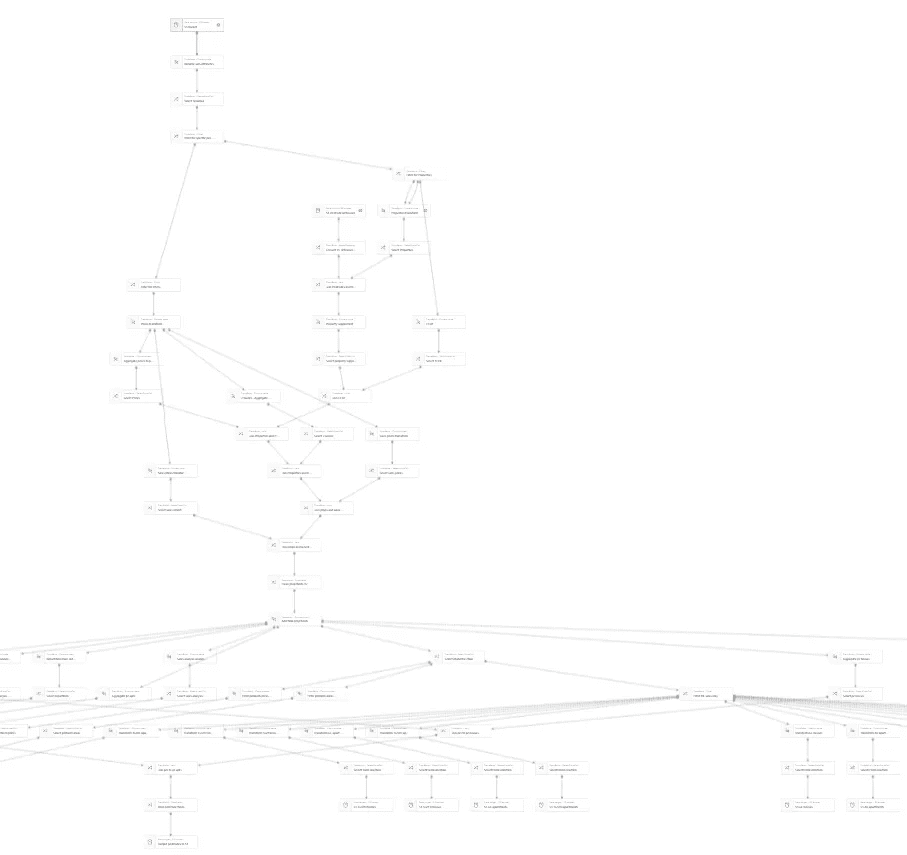

# AWS 胶水上的火花 MLlib

> 原文：<https://towardsdatascience.com/spark-mllib-in-aws-glue-1416b3b5ffe6?source=collection_archive---------23----------------------->

## 机器学习

## 准备就绪的 AWS 上的分布式 ML

AWS 力推 Sagemaker 作为其机器学习平台。然而，Spark 的 MLlib 是一个全面的库，它在 AWS Glue 上本地运行分布式 ML——并为他们的主要 ML 平台提供了一个可行的替代方案。

Sagemaker 的一大优势是，它可以通过 Jupyter 笔记本轻松支持实验。但是操作您的 Sagemaker ML 可能很困难，特别是如果您需要在管道的开始包含 ETL 处理。在这种情况下，[运行在 AWS Glue 上的 Apache Spark 的 MLlib](https://spark.apache.org/docs/latest/ml-guide.html) 可能是一个很好的选择——就其本质而言，它可以立即操作化，与 ETL 预处理集成，并准备好在生产中用于端到端的机器学习管道。

> 就其本质而言，[AWS Glue]是**立即可操作的，与 ETL 预处理集成，并随时可用于端到端机器学习管道的生产中**

[AWS Glue](https://docs.aws.amazon.com/glue/index.html) 是一个托管 Spark ETL 平台，用于通过分布式机器处理大量数据。MLlib 是 Spark 2.4 的一部分，Spark 2.4 是 AWS Glue 的默认版本。在 AWS Glue 中使用 MLlib 不需要添加库。



AWS Glue Studio 图表显示了通过 ETL 的数据流(图片由作者提供)

## ETL 预处理到训练和推理一气呵成

作为一个分布式 ETL 平台，AWS Glue(通过 Spark)允许您轻松地执行大规模的数据预处理。Glue Studio 提供了一个很好的 UI 来构建有向无环图，这些图表示每个预处理步骤中的数据流(参见上图中的示例)。从图形用户界面，您可以重命名字段，转换类型，过滤记录和删除列。然而，一些更复杂的数据处理活动需要添加“自定义转换”。需要自定义转换的操作包括:

1.  运行 MLlib 函数，如 [TF-IDF](https://spark.apache.org/docs/latest/ml-features.html#tf-idf) 或模型，如随机森林或[梯度提升树](https://spark.apache.org/docs/latest/ml-classification-regression.html#gradient-boosted-tree-regression)算法
2.  聚合值，例如生成计数、平均值和总和值
3.  复杂的列转换，如一键编码或连接值

在使用 ETL 转换执行预处理和特征化之后，您需要训练您的数据。要在 AWS Glue 中访问 MLlib，您只需要添加导入语句，就可以开始了。下面是如何使用 PySpark 在 AWS Glue Studio 自定义转换中训练回归决策树模型的示例:

```
# Get the dataframe. Ensure there's a 'features' column.
df = dfc.select(list(dfc.keys())[0]).toDF()# Get the logger for Cloudwatch Logs
logger = glueContext.get_logger()from pyspark.ml import Pipeline
from pyspark.ml.regression import DecisionTreeRegressor
from pyspark.ml.evaluation import RegressionEvaluator
*# Split data into training and test sets* (trainingData, testData) = df.randomSplit([0.7, 0.3])

*# Create a DecisionTree model.* dt = DecisionTreeRegressor(featuresCol="features")*# Create a pipeline to wrap the DecisionTree* pipeline = Pipeline(stages=[dt])*# Train model.* model = pipeline.fit(trainingData)

*# Make predictions.* predictions = model.transform(testData)

*# Select (prediction, true label) and compute test error* evaluator = RegressionEvaluator(
    labelCol="label", predictionCol="prediction", metricName="rmse")
rmse = evaluator.evaluate(predictions)
logger.info("Root Mean Squared Error (RMSE) on test data = %g" % rmse)
```

在上面的代码中，均方根误差(RMSE)被记录到 Cloudwatch 日志中。要使用模型进行预测，最简单的选择是使用相同的自定义转换，并在看不见的推理数据的数据帧上运行 *model.transform* 。为了使用这些预测，您需要在一个 *DynamicFrameCollection* 中从自定义转换中返回它们(参见本文底部的代码片段)。

## 在 AWS Glue 中运行 MLlib 的技巧

在 AWS Glue 中运行 Spark 的 MLlib 时，需要注意一些问题:

1.  实验可能是缓慢而困难的。迭代和调试可能会令人沮丧，因为每个作业至少需要一分钟来运行。实验时，在缩减的数据集上运行以加快过程(仍然需要 1 分钟以上)。把工人减少到 2 个，用 G.1X 省钱。禁用书签和重试。
2.  为了帮助调试，您可以从您的定制转换中注销信息到 Cloudwatch。你必须进入 Cloudwatch 上的 [/aws-glue/jobs/logs-v2](https://console.aws.amazon.com/cloudwatch/home?region=us-east-1#logsV2:log-groups/log-group/$252Faws-glue$252Fjobs$252Flogs-v2) 日志组，然后打开以'-driver '结尾的日志流来查看注销的值。下面是 Glue Studio 定制转换的 PySpark 示例，设置了 Cloudwatch 日志记录。
3.  AWS Glue 开发人员端点可能有助于实验和调试。这些允许您在 Spark 集群上运行开发笔记本，并在编写代码时加速开发迭代。主要缺点是价格昂贵(可能需要 5-15 分钟来启动集群)。请注意，它们是按秒计费的，因此可能比直接执行作业要贵得多。一种选择是在学习 Spark 时使用开发人员端点，然后在熟悉编写 Spark 代码后直接在 AWS Glue 中执行作业。
4.  虽然您可以在与特性化 ETL 相同的作业中运行 ML 训练和预测，但是您可能希望将它们分成两个作业。通过将它们分成两个作业，您可以分离它们的配置。AWS Glue 提供了两种工作器类型:G.1X 和 G.2X。您可能会发现 G.1X 对于 ETL 来说已经足够了，但是 G.2X 可能更适合 ML 训练和推理，因为每个工作器都有两倍的可用内存。
5.  只有批量推理可以在 AWS Glue 上工作——实时推理在这里不是一个选项。将 Sagemaker 端点用于该用例。
6.  AWS Glue 上的 MLlib 允许您轻松地重新训练整个数据集，然后在单个作业中执行推理。训练可能是最昂贵的步骤，但是，在批量推断之前，通过再训练，您可以从更好的预测中受益
7.  尝试使用本地 Spark 数据帧和库，而不是例如 Pandas 数据帧。这将允许您更好地利用 Spark 的分布式功能。
8.  MLlib 中有两种可用的 API——基于数据帧的 API 和基于 RDD 的 API。您应该尽可能使用基于数据框架的方法。同样，尽量避免使用用户定义的函数(UDF)。UDF 和基于 RDD 的功能都比本地数据帧方法慢。
9.  *SparseVector* 是一种表示稀疏数据集(即具有大量列且大多数值为零的数据源)的有效方式。一个常见的例子是执行自然语言处理时 TF-IDF 的输出。使用 *SparseVector* 列可以避免向 dataframe 添加成百上千的列(这很可能会导致您的作业因内存不足或超时而失败)。
10.  由 MLlib 创建的某些 dataframe 列类型如果不先转换为整数或字符串，就无法写出自定义转换。当这种情况发生时，您可能会得到一个错误，如“*调用 o341 . todf . org . Apache . spark . ml . Lina LG . vector udt @ 3 bfc 3 ba 7(org . Apache . spark . ml . Lina LG . vector udt 的类)*时出错”。
11.  在 AWS 中，从 S3 读取数据比从其他数据源/目的地读取数据要容易得多。直接连接到数据库可能比它的价值更麻烦。
12.  您很可能需要使用 Glue 爬虫来学习您在 S3 上的模式。每次数据发生变化时，您都需要重新运行 crawler。使用 S3 路径/键中的分区键和 AWS Glue“S3 数据源”输入节点上的分区谓词来过滤特定日期的数据。
13.  JSON 和 CSV 在开发时可能是有用的数据类型，因为您可以看到输入和输出。然而，它们又慢又大。对于生产，考虑切换到拼花格式的输入和输出。
14.  将 *SparseVector* 列(已经转换为字符串)导出到 CSV 会导致无效的 CSV 结构。拼花格式可以替代。
15.  注意区分新的基于数据框架的 API 和旧的基于 RDD 的 API。确保导入正确的类。在 PySpark 中，你应该导入' *pyspark.ml.linalg* '而不是' *pyspark.mllib.linalg* '来访问更新的 API。如果您混淆了类型，您可能会得到奇怪的错误，如" *IllegalArgumentException:'要求失败:列特征必须是 struct 类型< type:tinyint，size:int，indexes:array<int>，values:array<double>>，但实际上是 struct < type:tinyint，size:int，indexes:array<int>，values:array<double>>*。这两个值看起来是一样的，但是区别在于它们使用了来自错误 API 的对象的不兼容版本。

## 能否将 AWS 胶水与 Sagemaker 整合？

是的，通过 AWS Glue 的 Spark ETL 可以与 Amazon Sagemaker 集成。典型的工作流可能是:

1.  使用 Jupyter 笔记本在 Sagemaker 中试验和训练模型
2.  通过从 Sagemaker 笔记本中部署一个批量推理模型来生产模型
3.  在 AWS Glue 中使用 ETL 进行生产化预处理和特征化
4.  计划/触发批处理推理模型在 AWS Glue ETL 完成后运行

上述方法似乎是 AWS 服务的最佳用途。然而，在走这条路之前，你确实需要注意一些事情。例如，有些列类型在 Spark MLlib 和 Sagemaker 模型之间不兼容。例如，Sagemaker XGBoost 要求其输入为特定格式，并且不能从 Spark 读取 *SparseVector* 列。

## 注销到 Cloudwatch 的示例

下面是 AWS Glue Studio 上的 PySpark 自定义转换示例，用于注销到 [/aws-glue/jobs/logs-v2](https://console.aws.amazon.com/cloudwatch/home?region=us-east-1#logsV2:log-groups/log-group/$252Faws-glue$252Fjobs$252Flogs-v2) 日志流下的“ *-driver* ”日志流。

```
def MyTransform (glueContext, dfc) -> DynamicFrameCollection:
     **logger = glueContext.get_logger()**
     df = dfc.select(list(dfc.keys())[0]).toDF()
     **logger.info("Number of df rows:" + str(df.count()))**
     dyf = DynamicFrame.fromDF(df, glueContext, "df")  
     return DynamicFrameCollection({"CustomTransform": dyf}, glueContext)
```

## 在传递自定义转换之前转换 dataframe 列的示例

如果不先将一些 MLlib 列类型转换为字符串或整数，则在尝试从自定义转换返回 dataframe 时会出现错误。VectorUDT 是一种“用户定义类型”的列，通常由 MLlib 转换生成。下面是一个在返回之前将列转换为字符串的示例。

```
# Cast VectorUDT column to String
rescaledData=rescaledData.withColumn("features",rescaledData["features"].cast("String"))# Reduce the number of columns being returned
rescaledData = rescaledData.selectExpr("labels", "features")# Convert from Spark dataframe to AWS Glue DynamicFrame
dyf_out = DynamicFrame.fromDF(rescaledData, glueContext, "rescaledData") # Wrap the DynamicFrame in a DynamicFrameCollection and return
return DynamicFrameCollection({"CustomTransform": dyf_out}, glueContext)
```