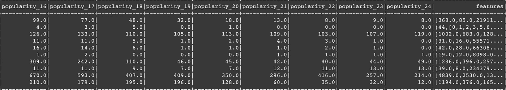
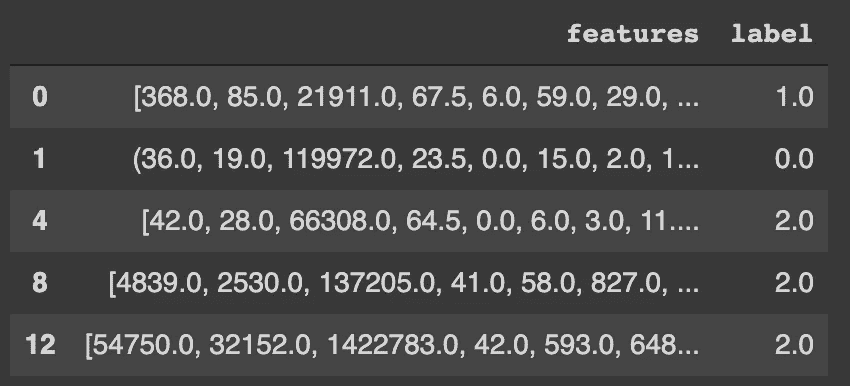
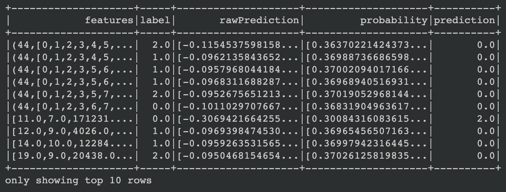
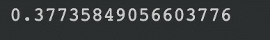
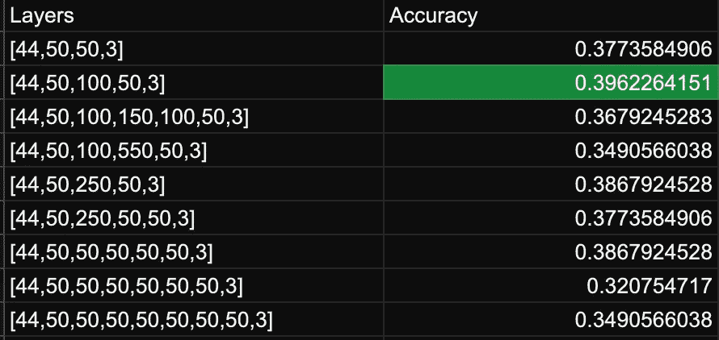

# 用于兴趣点分类的火花多层感知器分类器

> 原文：<https://towardsdatascience.com/spark-multilayer-perceptron-classifier-for-poi-classification-99e5c68b4a77?source=collection_archive---------15----------------------->

## 使用 Spark 深度学习模型将兴趣点分类为机场、公交车站和火车站


尼克·奥瓦尔在 [Unsplash](https://unsplash.com/s/photos/space?utm_source=unsplash&utm_medium=referral&utm_content=creditCopyText) 上拍摄的照片

***注*** *:本文是关于交通 POI 数据分类系列文章的第三篇。* [*第一篇文章*](/poi-classification-using-visit-and-popularity-metrics-part-1-ae5e94f92077) *试图使用各种机器学习模型将记录分类为机场、公交车站和火车站。* [*第二篇文章*](/pca-lda-and-svd-model-tuning-through-feature-reduction-for-transportation-poi-classification-8d20501ee255) *的中心思想是使用特征约简算法来调整第一篇文章中的模型，以提供更高的精度。查看这些文章，了解该项目在寻找 POI 数据分类的最佳方法方面是如何发展的。*

本文将使用 Spark MLlib 包——特别是多层感知器分类器，使用步行交通模式对来自 [SafeGraph](http://Safegraph.com) 的 POI 记录进行正确分类。SafeGraph 是一家数据提供商，为数百家企业和类别提供 POI 数据。它向学术界免费提供数据。对于这个项目，我选择使用 SafeGraph 模式数据将记录分类为不同的兴趣点。模式数据的模式可以在这里找到:[模式信息](https://docs.safegraph.com/v4.0/docs/places-schema#section-patterns)

# Spark 简介

Apache Spark 是一个开源框架，旨在处理大数据。该框架之所以出名，是因为它能够通过使用并行(或分布式)计算来大幅提高性能并减少运行时间。

**为什么要火花 MLlib？**

1.  支持 Statsmodels 和 Scikit-Learn 等软件包支持的许多流行的机器学习算法
2.  允许构建复杂的机器学习管道
3.  允许保存和重用算法和 ML 管道
4.  支持分布式计算技术，通过将任务分成块并将其分配给多个节点并行执行，极大地减少了运行时间并提高了所有算法的性能

Spark MLlib 确实是一个非常有趣和简单易懂的包，可以在很短的时间内提供一些非常有趣的见解，在运行时和性能方面提供了最好的东西。

**火花深度学习**

MLlib 包很少容纳深度学习。从 Spark 3.0 开始，该包不支持许多深度学习模型，而是更专注于回归、分类和聚类的概念。这个缺点的一个例外是多层感知器分类器。

**为什么是多层感知器分类器？**

MLlib 包中的每个分类模型都有其优点和缺点，不同的数据可能需要使用不同的模型来获得最大的效率。MLPC 优于 Spark MLlib 包中提供的其他监督分类算法，因为它能够自行查找要素之间的相关性。此外，分类器适用于多类分类，并且不需要像传统算法(如 Spark 接口中的 SVM 算法)那样多的预处理和管道创建。最后，对于足够大和足够多样化的数据集，MLPC 算法可以比大多数分类器表现得更好。

有了这个介绍，让我们看看火花 MLPC 分类器是否能比本系列第 1 部分中的分类器表现得更好


由[胡安乔·科雷拉](https://unsplash.com/@corella?utm_source=unsplash&utm_medium=referral&utm_content=creditCopyText)在 [Unsplash](https://unsplash.com/s/photos/land-and-sky?utm_source=unsplash&utm_medium=referral&utm_content=creditCopyText) 上拍摄的照片

在我们开始深度学习之前，我们必须首先加载数据。这个特殊的步骤在本系列的第一篇文章和第二篇文章中都有涉及。满足本文需求的数据加载和预处理的基本步骤是:

在我们进入特征缩减概念的第一步之前，我们必须首先加载我们将用于这个项目的数据:加载数据的过程可以在[笔记本](https://colab.research.google.com/drive/1A6ZZ0WZX3v4N5sN4pU5Yz_gxx2gThVqd?usp=sharing)中找到，并且已经在系列的[第一部分中详细解释。就我们的目的而言，所需要的只是对所采取的步骤和结果数据框架的简要概述:](/poi-classification-using-visit-and-popularity-metrics-part-1-ae5e94f92077)

1.  删除不必要的列- ['parent_safegraph_place_id '，' placekey '，' safegraph_place_id '，' parent_placekey '，' parent_placekey '，' safegraph_brand_ids '，' brands '，' poi_cbg']
2.  创建地面实况列，将每个记录建立为机场、汽车站、机场或未知
3.  删除未知记录以清除无法识别的记录
4.  使用 pyspark 水平分解 JSON 字符串的列
5.  阵列的水平分解列
6.  使用 Sklearn LabelEncoder 包转换类列

作为这些转换的结果，输出的数据如下所示，并具有以下各列:


**Raw_visit_counts:** 在日期范围内，我们的小组中对此兴趣点的访问次数。

**Raw_visitor_counts:** 在日期范围内从我们的面板访问该兴趣点的独立访问者的数量。

**Distance_from_home:** 访客(我们已确定其住所的访客)离家的中间距离，以米为单位。

**中值 _ 停留:**中值最小停留时间，以分钟为单位。

**分时段停留(分解为< 5，5–10，11–20，21–60，61–120，121–240):**键是分钟的范围，值是在该持续时间内的访问次数

**Popularity_by_day(分解到周一至周日):**一周中的某一天到日期范围内每天(当地时间)的访问次数的映射

**Popularity_by_hour(分解为 Popularity _ 1-Popularity _ 24):**一天中的某个小时到当地时间日期范围内每小时的访问次数的映射。数组中的第一个元素对应于从午夜到凌晨 1 点的时间

**Device_type(分解为 ios 和 Android):** 使用 Android 和 IOS 的 POI 的访客数量。仅显示至少包含 2 个设备的设备类型，包含少于 5 个设备的任何类别都报告为


照片由[阿鲁迪巴 S](https://unsplash.com/@aldebarans?utm_source=unsplash&utm_medium=referral&utm_content=creditCopyText) 在 [Unsplash](https://unsplash.com/s/photos/space?utm_source=unsplash&utm_medium=referral&utm_content=creditCopyText)

# POI 记录的深度学习分类

现在数据已经准备好了，我们可以开始深度学习方面了。

Spark MLlib 包执行 ML 函数的方式与用 Sci-kit Learn 等包编写的传统代码片段略有不同。该软件包要求使用**矢量汇编器**转换器将所有用于预测的特征编译成一列单独的矢量。这要求事先将标注列与要素列分开，这一步预处理的代码如下所示:

**步骤 1:将标签列与特征列分离，并将熊猫 DF 转换为火花 DF**

```
from pyspark.ml.classification import MultilayerPerceptronClassifierfrom pyspark.ml.evaluation import MulticlassClassificationEvaluatorlabel = transportation_df[‘Class’]transportation_df = spark.createDataFrame(transportation_df)transportation_df.show(5)
```

**第二步:使用矢量汇编程序创建特征列**

```
from pyspark.ml.feature import VectorAssemblertransportation_df = transportation_df.drop(‘Class’)assembler = VectorAssembler().setInputCols(transportation_df.columns[1:]).setOutputCol(“features”)transportation_df = assembler.transform(transportation_df)transportation_df.show(10)
```

这样做的最终结果应该是将所有特性都编译到一个列中，如下所示:



从这里开始，下一步是将这些数据与标签列结合起来。因为不再需要其他列(它们已经被编译到 features 列中)，所以运行我们的模型只需要 features 和 label 列

```
transportation_df = transportation_df.toPandas()features = transportation_df[‘features’]features_df = pd.DataFrame(data = {‘features’: features})features_df = features_df.loc[~features_df.index.duplicated(), :]label_df = pd.DataFrame(data = {‘label’: label})label_df = label_df.loc[~label_df.index.duplicated(), :]transportation_df = pd.concat([features_df, label_df], axis= 1).dropna()transportation_df.head()
```



下一步是将数据分成训练和测试数据:

```
transportation_df = spark.createDataFrame(transportation_df)trainSet, testSet = transportation_df.randomSplit([0.8, 0.2])
```

现在是时候创建分类器模型了。该模型有许多我们需要了解和调整的超参数，以便最大限度地提高模型性能:

**Tol:** 该参数指的是收敛容差或权重开始向预测答案收敛的值。该参数的默认值是. 000001。该参数的较小值可能会导致过度拟合，而较大值可能会导致更精确的结果

**种子:**模型随机生成值的随机种子

**Blocksize:** 该参数是指模型每次迭代将包含的记录数。该参数的默认值是 128。较大的块大小将导致过度拟合，而较小的块大小将以运行时间为代价提供更精确的结果

**步长:**该参数是指模型的学习速率。该参数的默认值是. 03。较小的步长将以较大的运行时间为代价得到更精确的模型，而较大的步长将导致过拟合

**Layers:** 也许是所有超参数中最重要的，这个参数指的是这个模型中将要出现的层数和每层的节点数。第一个图层必须始终是数据中存在的要素的数量，最后一个图层必须始终是可用的输出标注的数量。在这个图层阵列中必须至少有一个隐藏图层。

考虑到这些需求，让我们看看 MLPC 模型的代码:

```
layers = [44,50,50,3]mlpc = MultilayerPerceptronClassifier(layers = layers, solver=’gd’, tol=.0000001, stepSize=.00001, blockSize= 30).setLabelCol(“label”).setFeaturesCol(“features”).setSeed(20).setMaxIter(500)model = mlpc.fit(trainSet)
```

这里，我们制作了一个具有两个隐藏层的神经网络，每个隐藏层有 50 个节点。该模型使用梯度下降来训练，并且具有非常高的收敛容限和步长。让我们看看结果:

```
result = model.transform(testSet)result.show(10)
```



```
from pyspark.ml.evaluation import MulticlassClassificationEvaluatorevaluator = MulticlassClassificationEvaluator(labelCol = ‘label’, predictionCol = ‘prediction’, metricName = ‘accuracy’)mlpacc = evaluator.evaluate(result)mlpacc
```



整体精度…不令人满意，但这是我们必须用这些数据运行的许多实验中的第一个，以便找到最有效的层数和节点数来提供更好的结果。下表列出了尝试的图层和精度。如果您想尝试这段代码，请不要犹豫，查看笔记本并亲自运行它。



这项实验的直接收获是:

1.  更多的隐藏层不一定意味着更好的准确性
2.  更深的隐藏层不一定意味着更好的准确性

从上表中我们可以看出，当模型保持简单而不是复杂时，它的性能最好。尽管如此，我们看到这个特定数据集的准确性仅仅超过了来自系列第一部分[的高斯朴素贝叶斯模型。为什么会这样呢？好吧，简单的答案就是数据的不平衡。从](/poi-classification-using-visit-and-popularity-metrics-part-1-ae5e94f92077) [SafeGraph](http://safegraph.com) 中提取该数据时，使用了三个 NAICS 码来检索数据，输出的数据严重不平衡，机场记录的数量几乎是公交车站记录数量的 4 倍。这种不平衡已经成为贯穿本系列的一个问题，并对我们根据数据训练的许多模型的结果产生了不利影响。为了纠正这种不平衡，对不同类别的数据进行了随机抽样，但这样做会导致机场和火车站的数据代表性不足，从而仍然损害了模型的准确性。

# 结论

不管结果如何，这篇文章通过 MLPC 模型介绍了 Spark 深度学习的概念。本文展示了 Spark 为创建深度学习模型带来的便利，并进一步展示了在真实世界数据集(如 SafeGraph 模式数据)上使用这样一个复杂模型的优点和缺点。

在本系列的下一篇也是最后一篇文章中，我们将研究集成分类在这种模式数据上的应用，并看到使用多层分类器有助于提供最佳结果。

***提问？***

我邀请你在 [SafeGraph 社区](https://www.safegraph.com/academics)的 **#safegraphdata** 频道问他们，这是一个面向数据爱好者的免费 Slack 社区。获得支持、共享您的工作或与 GIS 社区中的其他人联系。通过 SafeGraph 社区，学者们可以免费访问美国、英国和加拿大 700 多万家企业的数据。