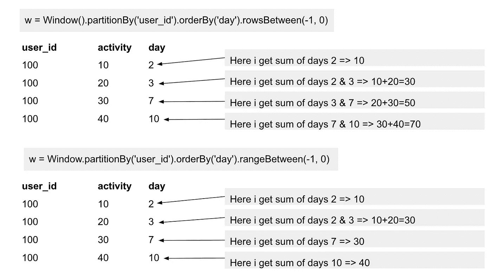

# Spark SQL 102 —聚合和窗口函数

> 原文：<https://towardsdatascience.com/spark-sql-102-aggregations-and-window-functions-9f829eaa7549?source=collection_archive---------5----------------------->

## Spark 中的分析函数，适合初学者。


波格丹一世·卡伦科在 [Unsplash](https://unsplash.com/s/photos/windows?utm_source=unsplash&utm_medium=referral&utm_content=creditCopyText) 上的照片

数据聚合是许多数据分析中的重要步骤。这是一种如何减少数据集并计算各种指标、统计数据和其他特征的方法。一个相关但稍微高级一些的主题是窗口函数，它允许基于具有所谓框架的窗口对数据计算其他分析和排序函数。

这是最近的[文章](/a-decent-guide-to-dataframes-in-spark-3-0-for-beginners-dcc2903345a5)的延续，在文章中我们描述了什么是数据帧以及 Spark SQL 中的转换一般是如何工作的。在这里，我们将深入研究聚合和窗口函数，它们是两组特定的转换，它们密切相关，但正如我们将看到的，它们之间有一个重要的区别，这是很好理解的。

对于代码，我们将使用 PySpark API，这是撰写本文时的最新版本 3 . 1 . 2(2021 年 6 月)。

# 整个数据帧的聚合

让我们从最简单的聚合开始，这是一种将整个数据集简化为一个数字的计算。这可能类似于数据帧中的总行数或某个特定列中值的总和/平均值。为此，我们可以直接在数据帧上使用 *agg()* 函数，并以逗号分隔的方式将聚合函数作为参数传递:

```
from pyspark.sql.functions import count, sumdf.agg(count('*'))df.agg(count('*'), sum('price'))df.agg(
  count('*').alias('number_of_rows'),
  sum('price').alias('total_price')
)
```

请注意，第一个示例的输出是一个具有单行和单列的数据帧，它只是一个由数据帧表示的数字。在第二个示例中，输出是一个具有单行和两列的数据帧，每个聚合函数对应一列。在最后一个示例中，我们可以看到每个聚合也可以使用 *alias()* 函数进行重命名。

# 基于组的聚合

通常，我们需要计算聚合，不是针对整个数据帧，而是针对每组行单独计算，其中组被定义为在特定列中具有相同值的行。例如，假设一个信用卡交易数据集，其中每一行都是唯一的交易，但不同的行可能属于同一个用户(持卡人)。这里，为每个用户单独计算聚合可能是有用的，对于这种聚合，我们可以使用 *groupBy* 转换:

```
(
  df
  .groupBy('user_id')
  .agg(count('*').alias('number_of_transactions'))
)
```

同样，我们在这里使用的是 *agg* 函数，我们可以传入任何聚合函数，例如 *count* 、 *countDistinct* 、 *sum* 、 *avg* / *mean* 、 *min* 、 *max* 、 *first* 、 *last* 、 *collect_list* 、*注意，如果我们不重命名聚合的结果，它将有一个默认名称，在 *count* 函数的情况下是 *count(1)* 。*

或者，我们可以直接在 *groupBy* 之后调用聚合函数，如下所示

```
(
  df
  .groupBy('user_id')
  .count()
)
```

注意，使用这种语法的缺点是不能使用*别名()*直接重命名聚合的结果，因为这里 count 函数返回一个数据帧，所以*别名*将应用于整个数据帧。因此重命名必须由另一个转换来处理，比如带有 ColumnRenamed('count '，' new_name') 。同样，这里你一次只能调用一个聚集函数，而带有 *agg* 的语法允许你同时调用任意多个函数。其他在*分组后被*调用的功能参见[文档](https://spark.apache.org/docs/latest/api/python/reference/pyspark.sql.html#grouping)。

这些 *groupBy* 转换的一个重要属性是，输出数据帧将只包含在 *groupBy()* 中指定为参数的列和聚合结果。所以如果我们调用 *df.groupBy('user_id ')。count()* ，无论 df 有多少字段，输出都只有两列，分别是 *user_id* 和 *count* 。此外，输出数据帧所代表的行数将更少，或者在边际情况下，与原始 *df* 中相同。边际情况对应于分组列的所有值都不同的情况，因此每个组只有一行。正如我们将看到的，这将与窗口函数不同。

# 基于带框架的窗口的聚合

窗口函数是一组函数，也可以在一组行上调用，就像我们在前面的例子中看到的那样。然而，还是有一些不同之处。首先，在调用窗口函数之后，数据集不会被缩减-所有行和所有列都将在输出数据帧中，并且计算将被添加到新列中。将应用该函数的行组再次由特定列(或列的列表)给出，对于该特定列，行具有相同的值，并且该组被称为*窗口*。此外，窗口函数更加灵活，因为有时您不想将函数应用于整个窗口，而是只应用于窗口中行的子集，即所谓的帧。最后，窗口也可以排序，因为一些功能(所谓的排序功能)需要它。让我们看看窗口函数的语法:

```
from pyspark.sql import Windoww = Window().partitionBy('user_id')df.withColumn('number_of_transactions', count('*').over(w))
```

正如你所看到的，我们首先使用函数*partition by()*定义窗口——这类似于 *groupBy()* ，所有在指定列中具有相同值的行(这里是 *user_id* )将形成一个窗口。然后我们向数据帧添加一个新列，在这里我们调用指定窗口的窗口函数。

## 排名功能

这是一组特定的窗口函数，需要对窗口进行排序。作为一个具体的例子，考虑函数 [*row_number()*](https://spark.apache.org/docs/latest/api/python/reference/api/pyspark.sql.functions.row_number.html#pyspark.sql.functions.row_number) ，它告诉您窗口中的行数:

```
from pyspark.sql.functions import row_numberw = Window.partitionBy('user_id').orderBy('transaction_date')df.withColumn('r', row_number().over(w))
```

其他排名功能例如有 [*排名*](https://spark.apache.org/docs/latest/api/python/reference/api/pyspark.sql.functions.rank.html#pyspark.sql.functions.rank) *()* 或 [*密集 _ 排名*](https://spark.apache.org/docs/latest/api/python/reference/api/pyspark.sql.functions.dense_rank.html#pyspark.sql.functions.dense_rank) *()* 。

## 指定框架

如上所述，一些功能可以应用于窗口中的行的子集。一个典型的用例是计算值的累积和，其中帧将指定我们希望从窗口的开始直到当前行应用该函数。此外，很明显，帧中各行的顺序很重要，因为如果各行的顺序不同，累积和将具有不同的形状。可以使用以下两个函数之一来指定帧:

*   <https://spark.apache.org/docs/latest/api/python/reference/api/pyspark.sql.Window.rowsBetween.html#pyspark.sql.Window.rowsBetween>
*   *[*rangeBetween()*](https://spark.apache.org/docs/latest/api/python/reference/api/pyspark.sql.Window.rangeBetween.html#pyspark.sql.Window.rangeBetween)*

*这两个函数都有两个参数:帧的开始和结束，它们可以指定如下:*

*   *window . unbounded 前进，window . unbounded 跟随-从头到尾的整个窗口*
*   *Window.unboundedPreceding，Window.currentRow 从窗口的开头到当前行，这用于累计和*
*   *使用数值，例如，0 表示*当前值*，但是其他值的含义可以根据帧功能*行之间* / *范围之间*而不同。*

*为了理解和*之间的*行和*之间的*范围之间的区别，让我们看看下面的例子，其中我们有三列， *user_id* 、 *activity* 和 *day* ，我们想对每个用户的活动求和:***

```
df.withColumn('activity_sum', sum('activity').over(w))
```

我们将按*日*对窗口进行排序，并使用间隔(-1，0)来指定帧。我们将会看到，这两个函数的区间有不同的含义。在图像的右侧，您可以看到每种情况下的求和结果(为了简单起见，我们在图像中只为 id 为 100 的用户显示一个窗口):



作者图片

在 *rowsBetween* 的情况下，在每一行上，我们对当前行和前一行(如果存在)的活动求和，这就是 interval (-1，0)的含义。另一方面，在 *rangeBetween* 的情况下，在每一行上，我们首先需要通过从 *day* 列中的值减去值 1 来计算将要求和的行的范围。例如，在第 3 行上，我们有 7–1 = 6 导致间隔(6，7)，我们应该合计所有符合此间隔的*日*列中的值的行，在我们的例子中，它只是当前行，因为没有*日* =6 的行。

如您所见，在 *rangeBetween* 的情况下，我们排序所依据的列需要是某种数字类型，因为 Spark 需要对该列中的值进行一些运算。在之间的*行中不存在这种限制。*

要提及其他一些窗口功能，请参见例如:

*   [*引()*](https://spark.apache.org/docs/latest/api/python/reference/api/pyspark.sql.functions.lead.html#pyspark.sql.functions.lead)
*   [*【滞后()】*](https://spark.apache.org/docs/latest/api/python/reference/api/pyspark.sql.functions.lag.html#pyspark.sql.functions.lag)
*   [ntile()](http://ntile(n))
*   [*【第 n _ value()】*](https://spark.apache.org/docs/latest/api/python/reference/api/pyspark.sql.functions.nth_value.html#pyspark.sql.functions.nth_value)
*   [*【cume _ dist()*](https://spark.apache.org/docs/latest/api/python/reference/api/pyspark.sql.functions.cume_dist.html#pyspark.sql.functions.cume_dist)

## 值得知道的重要事情

*   对窗口进行排序会改变帧— **这可能不直观** —对经过排序的窗口计算 *sum* 会导致与未经排序的窗口相比不同的结果。更多细节，请查看我的另一篇[文章](/did-you-know-this-in-spark-sql-a7398bfcc41e)，我在那里展示了一个例子。
*   这两种转换， *groupBy* 和 *window* 都需要特定的分区，如果分区不存在，它们将导致洗牌——数据需要以这样的方式重新组织，即一个组/窗口中的所有行都需要放在一个分区中。然而，不同之处在于，使用 *groupBy* ，Spark 将首先部分聚合数据，然后混洗缩减的数据集，而*窗口*将混洗整个数据集。
*   如果我们不向 *partitionBy* 函数传递任何参数，并将窗口指定为 *w = Window()。partitionBy()* ，整个数据集将变成一个大窗口，所有数据将被混洗到单个分区，这可能会导致性能问题，因为所有数据都将放在集群中的单个节点上。

# 结论

在本文中，我们讨论了聚合和窗口函数，它们是非常常用的转换，尤其是在数据分析师中。我们讨论了调用 *groupBy* 和 *Window.partitionBy* 的区别，我们已经看到了如何在窗口上指定框架的不同选项。