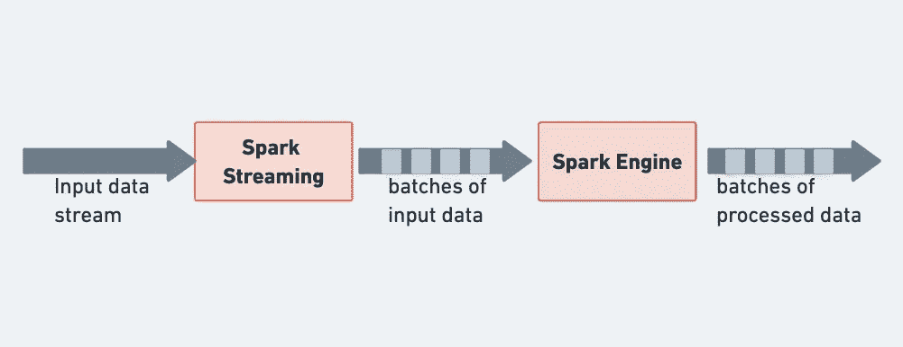
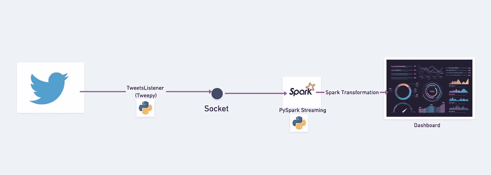
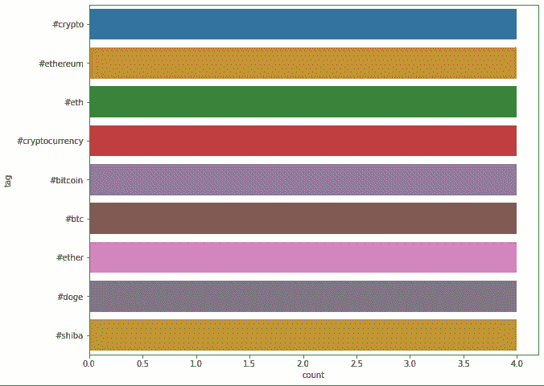

# 使用 Python 的 Spark 流

> 原文：<https://towardsdatascience.com/spark-streaming-with-python-5144cfc8b883?source=collection_archive---------23----------------------->

## Pyspark 流管道入门指南


照片由 [JJ 英](https://unsplash.com/@jjying?utm_source=unsplash&utm_medium=referral&utm_content=creditCopyText)在 [Unsplash](https://unsplash.com/@jjying?utm_source=unsplash&utm_medium=referral&utm_content=creditCopyText)

Apache Spark 流相当受欢迎。由于其集成技术，Spark Streaming 在数据流质量和综合方法方面优于以前的系统。

Python 和 Spark 流在一起使用时会给行业巨头带来奇迹。网飞是一个优秀的 Python/Spark 流媒体代表:这个流行的流媒体平台背后的人们已经发表了多篇文章，讲述他们如何使用该技术来帮助我们更好地享受网飞。让我们从基础开始。

# 什么是 spark 流，它是如何工作的？

Spark 平台包含各种模块，包括 Spark 流。Spark 流是一种分析“无界”信息的方法，有时也称为“流”信息。这是通过将其划分为微批处理并允许在多个批处理上执行窗口来实现的。

Spark 流接口是一个 Spark API 应用程序模块。Python，Scala，Java 都支持。它允许您以容错和灵活的方式处理真实的数据流。Spark 引擎获取数据批次，并批量生成最终结果流。

# 什么是流式数据管道？

这是一种允许数据从一个位置平滑且自动地移动到另一个位置的技术。这项技术消除了该公司的许多典型问题，如信息泄漏、瓶颈、多个数据冲突和重复创建条目。

流数据管道是可伸缩地实时处理数千个输入的数据管道架构。结果是，您将能够收集、分析和保留大量数据。该功能支持实时应用、监控和报告。


*图片由*[*agency followeb*](https://unsplash.com/@olloweb?utm_source=unsplash&utm_medium=referral&utm_content=creditCopyText)*on*[*Unsplash*](https://unsplash.com/s/photos/concepts?utm_source=unsplash&utm_medium=referral&utm_content=creditCopyText)

# Spark 的流架构。



*作者提供的 Spark 流架构图*

Spark 流的主要结构是逐批离散时间流。微批处理不断地被分配和分析，而不是一次一个项目地通过流处理管道。因此，数据根据可访问的资源和位置分发给员工。

当数据被接收时，它被接收机分成 RDD 部分。因为 rdd 确实是 Spark 数据集的一个关键抽象，所以转换成 rdd 可以使用 Spark 脚本和工具进行分组分析。

# 现实生活中的火花流示例(Twitter Pyspark 流)

在这个解决方案中，我将构建一个流管道，从互联网上获取特定关键字(Ether)的推文，并对这些实时推文执行转换，以获取与其相关的其他热门关键字。



来自作者的真实生活火花流示例架构异想天开的图

## 视频教程

从 [Anuj Syal](https://www.youtube.com/channel/UCO8XsgcjqArk_mAd1VGBMfg?sub_confirmation=1) 开始，不到 12 分钟就有 Python 的火花流

# 第一步:使用 tweepy 传输推文

```
import tweepy
from tweepy import OAuthHandler
from tweepy import Stream
from tweepy.streaming import StreamListener
import socket
import json

# Set up your credentials
consumer_key=''
consumer_secret=''
access_token =''
access_secret=''

class TweetsListener(StreamListener):

  def __init__(self, csocket):
      self.client_socket = csocket

  def on_data(self, data):
      try:
          msg = json.loads( data )
          print( msg['text'].encode('utf-8') )
          self.client_socket.send( msg['text'].encode('utf-8') )
          return True
      except BaseException as e:
          print("Error on_data: %s" % str(e))
      return True

  def on_error(self, status):
      print(status)
      return True

def sendData(c_socket):
  auth = OAuthHandler(consumer_key, consumer_secret)
  auth.set_access_token(access_token, access_secret)

  twitter_stream = Stream(auth, TweetsListener(c_socket))
  twitter_stream.filter(track=['ether'])

if __name__ == "__main__":
  s = socket.socket()         # Create a socket object
  host = "127.0.0.1"     # Get local machine name
  port = 5554                 # Reserve a port for your service.
  s.bind((host, port))        # Bind to the port

  print("Listening on port: %s" % str(port))

  s.listen(5)                 # Now wait for client connection.
  c, addr = s.accept()        # Establish connection with client.

  print( "Received request from: " + str( addr ) )

  sendData( c )
```

# 步骤 2:编码 PySpark 流管道

```
# May cause deprecation warnings, safe to ignore, they aren't errors
from pyspark import SparkContext
from pyspark.streaming import StreamingContext
from pyspark.sql import SQLContext
from pyspark.sql.functions import desc
# Can only run this once. restart your kernel for any errors.
sc = SparkContext()ssc = StreamingContext(sc, 10 )
sqlContext = SQLContext(sc)
socket_stream = ssc.socketTextStream("127.0.0.1", 5554)
lines = socket_stream.window( 20 )
from collections import namedtuple
fields = ("tag", "count" )
Tweet = namedtuple( 'Tweet', fields )
# Use Parenthesis for multiple lines or use \.
( lines.flatMap( lambda text: text.split( " " ) ) #Splits to a list
  .filter( lambda word: word.lower().startswith("#") ) # Checks for hashtag calls
  .map( lambda word: ( word.lower(), 1 ) ) # Lower cases the word
  .reduceByKey( lambda a, b: a + b ) # Reduces
  .map( lambda rec: Tweet( rec[0], rec[1] ) ) # Stores in a Tweet Object
  .foreachRDD( lambda rdd: rdd.toDF().sort( desc("count") ) # Sorts Them in a DF
  .limit(10).registerTempTable("tweets") ) ) # Registers to a table.
```

# 步骤 3:运行 Spark 流管道

*   打开“终端”并运行 TweetsListener，开始播放推文

`python TweetsListener.py`

*   在 Jupyter notebook 启动 spark 流上下文中，这将让传入的 tweets 流进入 spark 流管道，并执行步骤 2 中所述的转换

`ssc.start()`

# 步骤 4:查看实时输出

从 spark `tweets`中注册的临时表在图表/仪表板上绘制实时信息。该表将每 3 秒更新一次推文分析

```
import time
from IPython import display
import matplotlib.pyplot as plt
import seaborn as sns
# Only works for Jupyter Notebooks!
%matplotlib inline 

count = 0
while count < 10:
    time.sleep( 3 )
    top_10_tweets = sqlContext.sql( 'Select tag, count from tweets' )
    top_10_df = top_10_tweets.toPandas()
    display.clear_output(wait=True)
    plt.figure( figsize = ( 10, 8 ) )
#     sns.barplot(x='count',y='land_cover_specific', data=df, palette='Spectral')
    sns.barplot( x="count", y="tag", data=top_10_df)
    plt.show()
    count = count + 1
```

出局:



作者输出的屏幕截图

# 火花流的一些优点和缺点

既然我们已经完成了构建 spark 流管道的实际解决方案，让我们列出使用这种方法的一些优点和缺点。

**优点**

*   对于困难的工作，它提供了非凡的速度。
*   对故障的敏感性。
*   在云平台上，执行起来很简单。
*   支持多种语言。
*   与主要框架的集成。
*   连接各种类型数据库的能力。

**缺点**

*   需要大量的存储空间。
*   很难使用、调试和掌握。
*   缺少文档和指导资源。
*   数据的可视化并不令人满意。
*   处理少量数据时反应迟钝
*   只有少数机器学习技术。

# 结论

Spark Streaming 确实是一种收集和分析大量数据的技术。在不久的将来，流数据可能会变得更加流行，所以您应该现在就开始了解它。请记住，数据科学不仅仅是构建模型；它还需要管理一个完整的管道。

本文讨论了 Spark 流的基础知识，以及如何在真实数据集上使用它。我们建议您使用另一个样本或实时数据，将我们学到的一切付诸实践。

*最初发表于*[*【https://anujsyal.com】*](https://anujsyal.com/spark-streaming-with-python)*。*