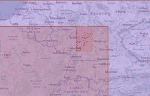

# 借助 SAP HANA 云实现空间匿名化

> 原文：<https://towardsdatascience.com/spatial-anonymization-with-sap-hana-cloud-1f3582ec0d1e?source=collection_archive---------32----------------------->

## 使用 k-匿名和地理散列来匿名化个人位置数据

*如何隐藏个人数据，同时保留有价值的见解。【图片由* [*盖拉格斯奇*](https://unsplash.com/@heylagostechie?utm_source=unsplash&utm_medium=referral&utm_content=creditCopyText) *上* [*下*](https://unsplash.com/?utm_source=unsplash&utm_medium=referral&utm_content=creditCopyText)

*在处理个人位置数据时，您很快会遇到关于数据隐私和匿名化的问题。由于全球疫情和许多不同的方法进行接触追踪，这个话题在去年得到了相当多的媒体报道。幸运的是，对于新冠肺炎接触者追踪，已经有了不使用任何位置数据的工作机制。例如，德国的 Corona-Warn-App 利用了蓝牙令牌的交换。*

*但是，在许多情况下，您可能希望利用公司中现有的位置数据。**由于隐私问题、用户选择退出或法规，例如**[**GDPR**](https://en.wikipedia.org/wiki/General_Data_Protection_Regulation)**，您通常无法处理这些数据、利用其价值并获得进一步的见解。**一个例子可能是有针对性的营销活动，在这种活动中，确定个人的确切位置并不太重要，但了解活动的大致“区域”却很有帮助。现在的技术问题是，如何恰当地将一个确切的位置推广到一个区域，并在匿名化方面保持一定的保证？*

*您可能已经知道，SAP HANA 支持[空间数据类型](https://cutt.ly/saphanaspatial)以及[数据匿名化](https://blogs.sap.com/2021/02/18/spotlight-data-anonymization-in-sap-hana-cloud/)算法。在这篇博客中，我不会深入讨论这两者的细节——至少不会超过必要的程度。已经有很多博客描述了背后的概念(点击链接获取更多信息)。相反，我将重点介绍如何将空间处理与匿名化概念相结合，并向您展示如何在 SAP HANA 中实现空间匿名化。*

*我将通过一个例子来解释这种方法。这里的问题是，任何例子都涉及数据集。这个 per 定义是一个隐私敏感的数据集，否则匿名化没有多大意义。这是因为这些数据集很难在网上找到(*…至少是那些我会用在博客条目上的数据集*)。因此，我给你们举的例子，可能看起来有点牵强。*

**那是因为它确实是。**

# *数据集*

*我将使用来自科学出版物【1】的[数据集。数据集包括纽约和东京大约 10 个月的 Foursquare 签到记录。我现在将使用纽约部分。除了签入数据之外，还有一个数据集，其中包含进行签入的一些用户的一些详细信息。](https://sites.google.com/site/yangdingqi/home/foursquare-dataset)*

*我们将使用的数据字段如下:*

*   ***RECORD _ ID**【INTEGER】
    一个 ID，我在导入时创建的*
*   ***USER_ID** 【整数】
    链接到用户资料*
*   ***loc 4326**【ST _ GEOMETRY(4326)】
    检入位置*
*   ***UTC_TIME** 【时间戳】
    签到时间*

*然后是第二个数据集，包含一些用户简档的一些数据:*

*   ***用户标识**【整数】
    用户的唯一标识*
*   ***性别**【NVARCHAR(6)】
    男/女*
*   ***TWITTER_FRIENDS** 【整数】
    TWITTER 好友数量*
*   ***TWITTER_FOLLOWER** 【整数】
    TWITTER 关注者的数量*

*如你所见，这个数据集*已经*看起来相当匿名。所以我们来构造一个狂野的故事。*

# *虚构的故事*

*假设我可以访问这个数据集，也许我是一名在公司工作的数据科学家。我们还假设用户档案数据更丰富一些，实际上至少包含了个人的 Twitter 账号。当然，我是邪恶的——这是每个好故事需要的盐。*

*在餐厅里，我旁边的桌子上，有人在谈论一些非常好吃的饼干，那人在家里。我可以看到这个人正在 Foursquare 上签到。*

****描绘这一幕。****

**

*我真的需要得到那个人的 Twitter 账号来发一条推文，我知道有人会喜欢尝试这些饼干。我知道 ***时间******报到地点*** 和那个人。因为我可以访问签到数据库，所以我可以很容易地过滤出相应的签到并检索那个人的个人资料！**邪恶的笑声***

# *解决方案*

*声音构造？也许吧。然而，重新识别是一个问题，并已在现实生活中表现出来——如已经在 2006 年与搜索记录:[https://en.wikipedia.org/wiki/AOL_search_data_leak](https://en.wikipedia.org/wiki/AOL_search_data_leak)*

*那么，数据集的所有者可以做些什么来防止这种攻击，同时仍然保持数据本身的价值呢？在现实世界中，您可以认为我是数据科学家，所有者是数据库管理员。管理员喜欢限制所有的数据访问，而数据科学家只想访问几乎所有的数据。提供一个既能安全使用又能保持洞察力和相关性的数据集不是很好吗？*

*实现这一点的一个方法是概括数据。因此，我们不显示具体的位置，而是提供一个粗略的区域，不显示具体的时间戳，而是提供一个时间跨度。SAP HANA 有一个内置的匿名化算法，称为[k-anonymous](https://en.wikipedia.org/wiki/K-anonymity)，它可以自动概括数据，同时在匿名化方面提供一定的保证。*

*最简单的方法是用我们的例子来解释这一点:当我使用参数 *k=3* 应用 k-anonymous，并对结果集应用相同的时间、位置和性别查询时，**我保证检索到至少 3 个签到记录。***

*虽然[有大量的材料](https://blogs.sap.com/2021/02/18/spotlight-data-anonymization-in-sap-hana-cloud/)，解释这如何在 SAP HANA 上使用数字或分类数据，但我今天将向您展示，**如何将位置和时间维度添加到算法中。***

# *空间等级*

*这才是问题的关键！为了使用数据库字段进行匿名化，您需要定义数据的层次结构。对于空间数据，当然有一些明显的层次结构。对于 SAP 总部的位置，可能的层级是:*

**确切地点>沃尔多夫(城市)>巴登-符腾堡州>德国(国家)**

*这种等级制度(至少)有两个缺点:*

*   *它不是数据驱动的，您必须手动将所有层次结构建模为数据的一部分*
*   *它是静态的，不是精细的颗粒。概括的每一步都会导致大量信息的丢失。*

*一种数据驱动的定义位置数据层次的方法是使用所谓的[离散全球网格系统(DGGS)](https://en.wikipedia.org/wiki/Discrete_global_grid) 或更简单的[地理哈希](https://en.wikipedia.org/wiki/Geohash)。*

*幸运而非巧合的是，SAP HANA 为 HANA2 SPS05 和 HANA 云提供了地理哈希的数据库内处理。您可以从几何图形生成[几何图形，并将它们转换回](https://help.sap.com/viewer/bc9e455fe75541b8a248b4c09b086cf5/2020_04_QRC/en-US/3ffbdaed72f14eb7906bcfcaf85dba70.html)[点](https://help.sap.com/viewer/bc9e455fe75541b8a248b4c09b086cf5/2020_04_QRC/en-US/bb14c898ec0a42d6a5402e7fdf451edf.html)或[几何图形](https://help.sap.com/viewer/bc9e455fe75541b8a248b4c09b086cf5/2020_04_QRC/en-US/f4c96df24a294b429cc173f5cb66b025.html)。*

*让我们为 SAP 总部生成一个地理哈希:*

*得到的字符串是:***u 0 y0 ktsgn 98 z 2 pkqr5tt****

*这就是地理哈希。一个长度为 20 的字符串，可以还原为一个点，该点与原点的位置大致相同。例如，这种格式可用于以字符串表示形式交换位置信息，并且有助于 API 编程。*

**但是我们如何使用它来定义我们位置的层次结构呢？Geohashes 拥有令人难以置信的价值。如果您截断它们并在末尾留下一些字符，位置只会变得更加不精确。**

*我们以前 5 个字符为例来看: ***u0y0k*** 定义了一个矩形。是另一个矩形，它保证包含第一个矩形。这样，地理哈希为我们提供了一个纯粹的数据驱动的位置层次结构。*

*以我们的例子为例:*

**u 0 y0 ktsgn 98 z 2 PK qr5 TT>…>u 0 y0 ktsgn 98 z>…>u 0 y0 kts>…>u 0>u**

**

**地理哈希定义的 SAP 总部的空间层级**

# *实际实施*

*那好吧。现在我们只需要把我们的拼图拼在一起，创建层次结构，并把它们交给我们的 k-匿名算法。*

*首先，让我们通过将签到与用户配置文件连接起来来构建我们的基本数据集。我们创建了一个视图，可以用来匿名。*

*现在，我们知道了地理哈希的魔力，空间层次变得非常简单。我们需要创建一个存储函数，它接收一个值(即 Geohash)和一个级别参数，并根据概化级别返回概化的 Geohash。*

*接下来，我们需要注意的是，概括时间维度。我的天真方法是建立以下层次结构:*

**yyyy-mm-DD hh:mm:ss>yyyy-mm-DD hh:mm:00>……>yyyy-mm-DD 00:00:00>..>yyyy-01–01 00:00:00**

*所以，每一步，我们都在切割最精细的时间单位。从秒到分钟，到小时，等等。由于 SAP HANA 中实现了 *TO_TIMESTAMP* 函数，该函数也接受部分时间字符串，我们可以通过以下方式实现。*

*最后，我们可以创建视图，也就是进行实际的匿名化。对于视图中的每个字段，我们需要确定层次结构，作为参数用于匿名化。对于时间和位置，我们使用上面定义的函数，对于性别，我们只是硬编码嵌入的层次结构(本质上这意味着要么显示性别，要么不显示性别)。*

*为了使用这个视图，我们需要用一个所谓的 *REFRESH* 语句来初始化它。*

*事情就是这样。我们已经为进行空间匿名化准备了一个视图！*

*我们可以检查视图的输出，并观察匿名数据:*

*该算法保留了性别信息，但决定只提供月份信息，而不是确切的时间戳(注意，日期设置为 01)和 6 字符的 Geohash。右侧的地图预览可让您了解空间概化的程度。*

**

**匿名签到数据**

# *使用匿名数据*

*让我们回到我们虚构的故事:我在 UTC 时间 2012-04-14 06:35:00 左右在那家[日本餐馆](https://www.google.com/maps/place/Yakitori+Taisho/@40.7294418,-73.989344,21z) ( *lat: 40.7294418，lon: -73.989344* )见过一名男性。*

*有了原始数据，很容易查找。我的 GPS 和手表都不精确——但我是一名数据科学家，可以给我的查询增加一些不确定性。在本例中，我正在查询一个 10 分钟的时间窗口和我所在位置周围 100 米的区域。*

*这就是了。我确实只有一条结果记录。USER_ID = 54 是配置文件，我需要检查进一步的个人信息。*

**

**查询非匿名数据得到 1 个精确匹配**

*现在，我的管理员意识到了误用，并把原始数据集与我们用 k-anonymous 匿名的数据集进行了交换。由于我们设置了参数 *k=3* ，我们希望通过类似的查询至少获得 3 条记录。因为我们现在处理的是(每月)的范围和地区，所以查询必须稍作调整。*

***这个查询的结果看起来非常不同。这次，我收到了 62 张唱片！***

**

**使用相同参数查询匿名数据**

*您还可以看到，该区域现在覆盖了东村，而不仅仅是某个位置。请注意， *user_id = 54* 的用户的签入仍然是数据的一部分。它还没有被删除。然而，那个邪恶的我一直在寻找的登记，现在藏在东村的 62 个男性登记中。*

*然而，数据科学家仍然可以使用这些匿名数据来生成有价值的见解，例如网站访问者的时间和位置的概况。**数据的价值没有丢失。***

# *摘要*

*数据管理层的匿名化和数据隐私是真实的，尊重隐私并不一定会导致信息的重大损失。通过明智的方法，可以保持数据的价值，同时将数据与个人信息分离。*

*SAP HANA 的独特价值在于其多型号引擎的组合。无论是图形或空间处理、数据匿名化还是机器学习，借助可互操作的引擎，您可以在安全可靠的环境中从数据中获得最大价值。*

*您在上面看到的不是一步一步的描述，我希望您在**使用您的 SAP HANA 云试用实例复制它时会遇到这样或那样的小问题，其中空间处理和数据匿名化都在**中。大多数问题都是可以解决的——如果不是这样，请在下面的评论区提问。无论如何，我强烈建议你用自己的数据进行一次试驾！*

****综上所述，我们只创建了 2 个视图和 2 个函数:匿名化不必很复杂！今天就开始用吧。****

*****【丁琪】*** *、张大庆、郑文卿、。LBSNs 中利用用户时空特征的用户活动偏好建模。IEEE Trans。论系统、人和控制论:系统，(TSMC)，45(1)，129–142，2015。*[*【PDF】*](http://www.google.com/url?q=http%3A%2F%2Fwww-public.it-sudparis.eu%2F~zhang_da%2Fpub%2FTSMC_YANG_2014.pdf&sa=D&sntz=1&usg=AFQjCNGSbghKxMGgmh6S1Hd-uz3SIkbLqQ)**

***原载于 2021 年 3 月 5 日*[*【https://blogs.sap.com】*](https://blogs.sap.com/2021/03/05/spatial-anonymization-with-sap-hana-cloud/)*。***