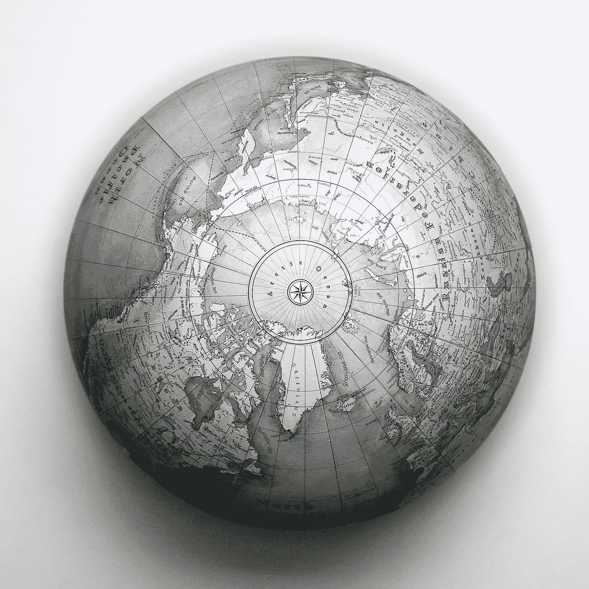
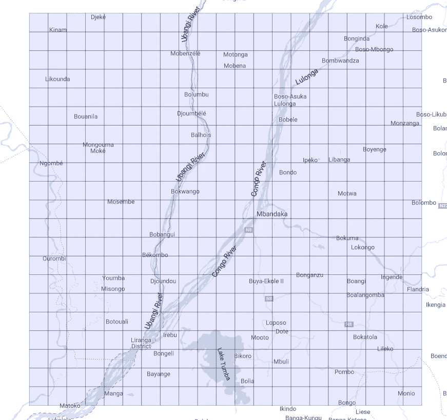
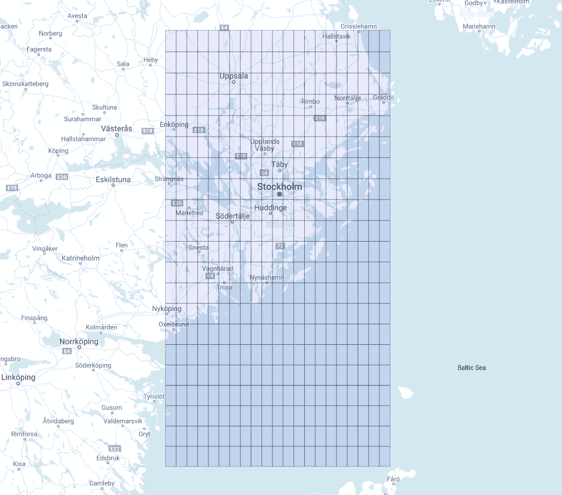
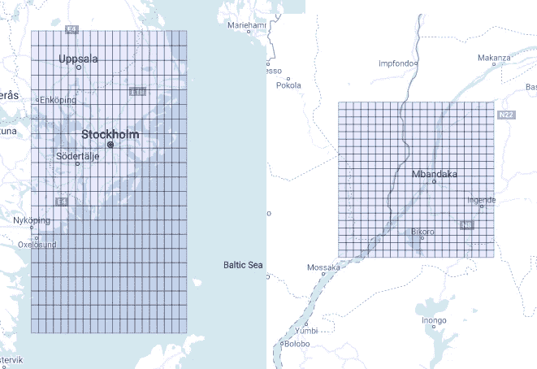
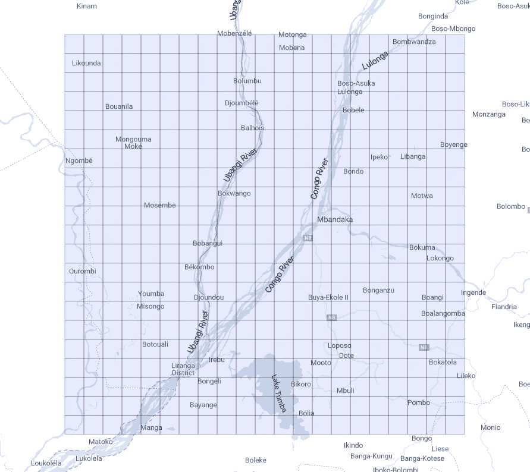
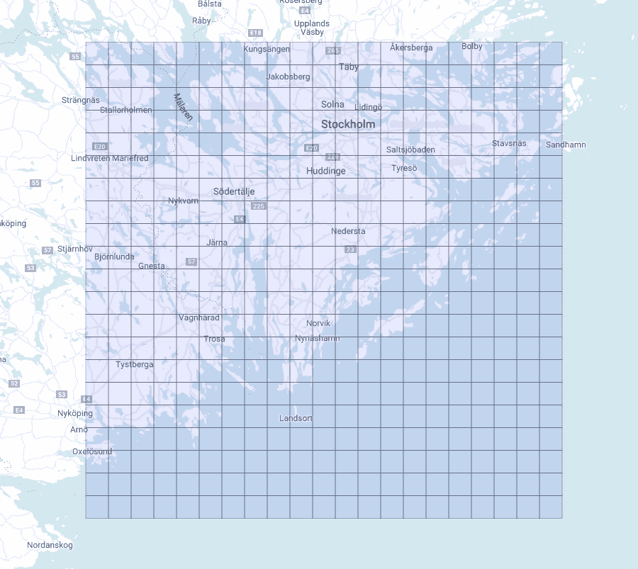

# 使用 Google BigQuery 的空间宁滨

> 原文：<https://towardsdatascience.com/spatial-binning-with-google-bigquery-d118afba6273?source=collection_archive---------23----------------------->

## 用 Google BigQuery 将宁滨地理坐标转换成方块

数据宁滨在数据科学和数据分析中是一种有用的常见实践，从几个方面来看:机器学习中连续变量的离散化或简单地制作直方图以便于可视化是两个常见的例子。通常，值被分组到相同大小的箱中，例如，分别用于一维和二维变量的恒定长度的间隔或恒定面积的矩形，但是只要每个值落入一个且仅一个箱中，我们就可以完全自由地定义它们。宁滨的一个小例子可以通过截断一个十进制数来实现，只保留它的整数部分或任意数量的十进制数字，这取决于所需间隔的大小。



盖尔·加博雷尔在 [Unsplash](https://unsplash.com?utm_source=medium&utm_medium=referral) 上的照片

我们希望在这里关注连续变量的特殊情况，即与地理参考数据相关的经度和纬度。在一般情况下，我们几乎有无限种方法来定义覆盖地球表面的二维非重叠面元:一个直接的选择可以是使用任何现有的行政区划，例如州、省、市和区。这里唯一的限制是访问这样的地理数据，幸运的是，这些数据通常是公开的:BigQuery 允许我们访问几个地理公共数据集，如 [geo us boundaries](http://console.cloud.google.com/marketplace/product/united-states-census-bureau/us-geographic-boundaries?_ga=2.81588823.-1738729434.1597332920) 数据集，其中包含代表美国边界的多边形表。

## 几何定义的箱

这种解决方案并不总是令人满意的，因为我们也希望像我们通常对其他连续变量所做的那样，根据数学函数在几何上定义面元。将一个给定的地理区域分割成几个在某种意义上规则的更小的多边形将会很棒。棘手的部分来了:地球表面是(据称😃)不是平面的，所以它的平面表示必然会造成一些形状或长度上的扭曲。人们很容易忘记我们通常用来定位一个点的坐标的角度性质，即经度和纬度，并将它们视为笛卡尔坐标。这将使我们能够很容易地定义地理箱，就像以前为二维变量的一般情况所建议的那样:我们可以截断经度和纬度，只保留给定数量的十进制数字。让我们展示一下我们会得到什么，使用 Google BigQuery 来制作多边形，使用 Google [Geo Viz](https://bigquerygeoviz.appspot.com/) 来可视化它们(图 1):

```
with **starting_point** as(
select
  0 **sp_lat**,
  18 **sp_long**,
  1 **digits**
)
select
  st_makepolygon(st_makeline(array[
  st_geogpoint(**pol_long**,**pol_lat**), 
  st_geogpoint(**pol_long**,**pol_lat** + pow(10,-**digits**)),
  st_geogpoint(**pol_long** + pow(10,-**digits**),**pol_lat** + pow(10,-**digits**)),
  st_geogpoint(**pol_long** + pow(10,-**digits**),**pol_lat**) 
  ])) **polygon**
from(
  select
    **digits**,
    trunc(**sp_long**,**digits**) + **x***pow(10,-**digits**) **pol_long**,
    trunc(**sp_lat**,**digits**) + **y***pow(10,-**digits**) **pol_lat**,
  from
    **starting_point**,
    unnest(generate_array(-10,10,1)) **x**,
    unnest(generate_array(-10,10,1)) **y**)
```

让我们简短地讨论一下这里提出的代码:在 *starting_point* 中，我们定义了围绕其构建网格的起点的坐标，以及截断后我们希望保留的十进制位数(这将清楚地确定每个多边形的大小)。然后，我们生成两个跨越区间[-10，10]的整数数组，以便在截断两个坐标后迭代地改变最后一个十进制数字。这将为我们提供多边形左下角的坐标，从这里可以直接得到其他三个。地理函数 [*st_makeline()*](https://cloud.google.com/bigquery/docs/reference/standard-sql/geography_functions#st_makeline) 和[*ST _ make polygon()*](https://cloud.google.com/bigquery/docs/reference/standard-sql/geography_functions#st_makepolygon)*让我们最终创建包含多边形的地理。我们最终得到一个 21x21 的网格，如下所示(图 1):*

**

*图 1 —通过地理坐标的数值截断在赤道附近生成的网格。*

*看起来不错！
让我们换个起点:*

```
*with **starting_point** as(
select
  59 **sp_lat**,
  18 **sp_long**,
  1 **digits**
)*
```

*因此我们得到(图 2):*

**

*图 2 —通过地理坐标的数值截断在赤道上方生成的网格。*

*这个网格看起来和上一个有点不同。为什么？请记住，经度和纬度是角坐标，当在极点附近沿经线(恒定经度)移动 1°时，会导致在赤道附近测得的完全相同的位移，但这不适用于沿纬线(恒定纬度)的移动:当我们接近极点时，经度上 1°的变化逐渐变小，在极点处正好为 0°。当我们改变起点时，我们可以很容易地使自己相信这样一个测量多边形任意两个顶点之间距离的特征:*

```
*st_length(st_makeline(st_geogpoint(**pol_long**,**pol_lat**),st_geogpoint(**pol_long**,**pol_lat** + pow(10,-**digits**)))) **length_constant_longitude**,st_length(st_makeline(st_geogpoint(**pol_long**,**pol_lat**) ,st_geogpoint(**pol_long** + pow(10,-**digits**),**pol_lat**))) **length_constant_latitude***
```

*你应该注意到这两个长度之间的比率大约等于 *1/cos(pol_lat)，*，这就是为什么在赤道附近多边形看起来像正方形！此外，考虑到这种影响，我们应该期待两个网格具有相同的高度，但不同的宽度，即在最后一个网格显示较短的基础。令人惊讶的是，如果我们直接比较地图上的两个形状，它们看起来完全相反！(图 3)*

**

*图 3 —前两个网格的直接比较。*

*它们宽度相同，但高度不同。这完全是由[投影不可避免的扭曲造成的，该投影用于](https://en.wikipedia.org/wiki/Web_Mercator_projection)在平面上绘制地球的曲面。这就是为什么格陵兰看起来几乎和非洲一样大！*

## *创建方形垃圾箱*

*刚刚提出的宁滨技术非常好，因为任何地理点都落在这个网格(一旦扩展到整个表面)的一个且仅一个多边形(从现在起我们将称之为 *tile* )中，但是它缺乏由完美排列的正方形组成的网格的令人满意的视觉规律性(至少远离赤道！).机器学习算法可能不会在意，在这种情况下，可能有更好的解决方案，其中长度或面积在整个网格中保持不变，但如果我们对整洁的视觉输出更感兴趣，那么这种解决方案更适合。按照上一个示例的结构，我们有:*

```
 *with **starting_point** as( -- step 1
select
  0 **sp_lat**,
  18 **sp_long**,
  12 **zoom**
)
select
 **zoom**,
 **tile_x**,
 **tile_y**,
 st_makepolygon(st_makeline([
  st_geogpoint(**ne_long**,**ne_lat**),
  st_geogpoint(**se_long**,**se_lat**),
  st_geogpoint(**sw_long**,**sw_lat**),
  st_geogpoint(**nw_long**,**nw_lat**)])) **polygon**,
from( --step 3
 select
  **zoom**,
  **tile_x**,
  **tile_y**,
  180/acos(-1)*(2*acos(-1)***tile_x**/pow(2,**zoom**)-acos(-1)) **nw_long**,
  360/acos(-1)*(atan(exp(acos(-1)-2*acos(-1)/pow(2,**zoom**)***tile_y**))-acos(-1)/4) **nw_lat**,
  180/acos(-1)*(2*acos(-1)*(**tile_x**+1)/pow(2,**zoom**)-acos(-1)) **ne_long**,
  360/acos(-1)*(atan(exp(acos(-1)-2*acos(-1)/pow(2,**zoom**)***tile_y**))-acos(-1)/4) **ne_lat**,
  180/acos(-1)*(2*acos(-1)*(**tile_x**+1)/pow(2,**zoom**)-acos(-1)) **se_long**,
  360/acos(-1)*(atan(exp(acos(-1)-2*acos(-1)/pow(2,**zoom**)*(**tile_y**+1)))-acos(-1)/4) **se_lat**,
  180/acos(-1)*(2*acos(-1)*(**tile_x**)/pow(2,**zoom**)-acos(-1)) **sw_long**,
  360/acos(-1)*(atan(exp(acos(-1)-2*acos(-1)/pow(2,**zoom**)*(**tile_y**+1)))-acos(-1)/4) **sw_lat**        
 from( --step 2
  select
   **zoom**,
   trunc((**sp_long***acos(-1)/180+acos(-1))/(2*acos(-1))*pow(2,**zoom**)) + **x** **tile_x**,
   trunc(pow(2,**zoom**)/(2*acos(-1))*(acos(-1)-safe.ln(tan(acos(-1)/4 + (**sp_lat**/180*acos(-1))/2)))) + **y** **tile_y**,
  from
   starting_point,
   unnest(generate_array(-10,10,1)) **x**,
   unnest(generate_array(-10,10,1)) **y**
     )
    )*
```

*这看起来有点复杂和冗长，让我们讨论每一步:*

1.  *和前面的例子一样，我们首先定义了生成网格中每个图块的起始点，然后通过 *zoom* 参数选择它们所需的大小。重要的是，缩放的最低级别是 0(即，只有一个图块覆盖整个地图)，每次我们提升一个级别，图块的数量就会翻两番。这里我们任意选择 12 级。*
2.  *我们从这两个整数数组中确定网格中每个方块的“ [*平铺坐标*](https://developers.google.com/maps/documentation/javascript/coordinates#tile-coordinates) ”。这些坐标和缩放级别将一起形成每个区块的明确标识符。注意，我们使用 *acos(-1)* 来获得π的值。*
3.  *接下来，我们应用反函数来获得每个正方形的四个顶点的坐标。*
4.  *最后，我们使用常用的地理函数将切片生成为地理数据类型。请注意，只有当我们希望在地图上可视化网格时，这最后两个步骤才是必需的。*

*因此我们得到了这个漂亮的网格(图 4):*

**

*图 4 —由赤道附近生成的方形瓦片组成的网格。*

*如果我们改变起点呢？让我们看一看(图 5):*

**

*图 5 —由赤道上方很远的地方生成的方形瓦片组成的网格。*

*很明显，我们现在有两个相同的网格，由相同外观尺寸的规则正方形组成，无论它们在地图上的什么位置。我们想再次强调，它们只是看起来平等，而实际上并不平等。对他们面积的评估揭示了这个特征:赤道附近的瓦片平均面积约为 95.5 km，而更靠近北极的瓦片平均面积约为 25.3 km！*

*我们终于准备好使用这种技术在 Geo Viz 和 Data Studio 上创建许多很酷的可视化效果了！*

*尽情享受吧！😃*