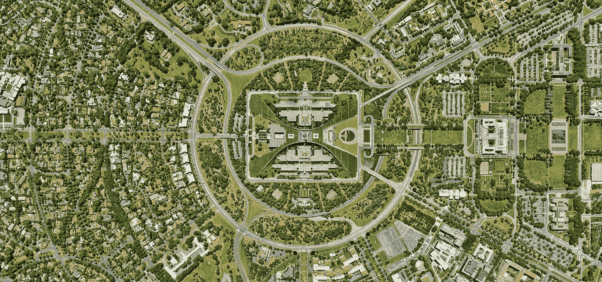
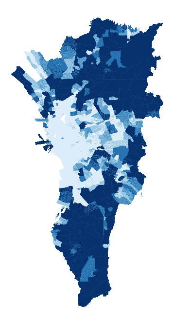
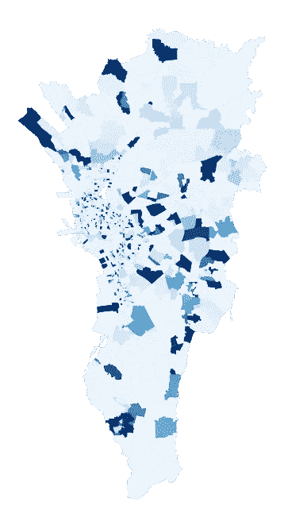
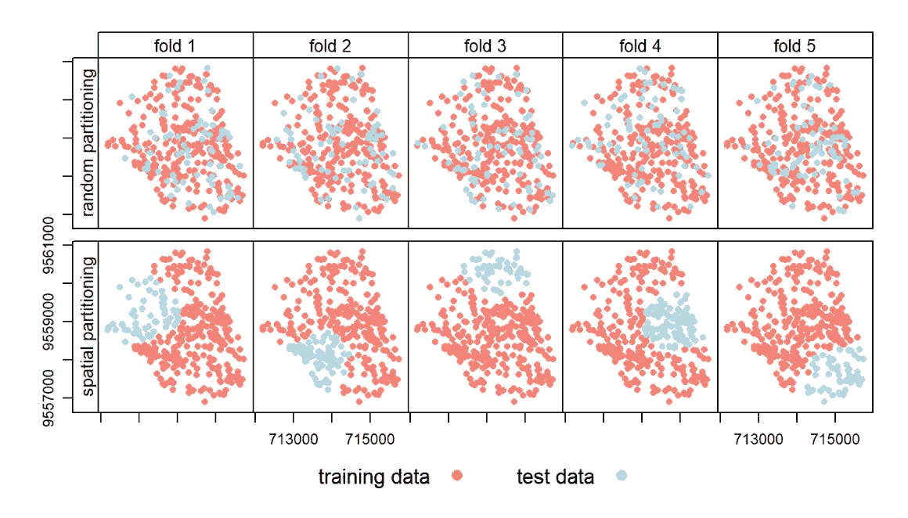

# 使用 scikit-learn 进行空间交叉验证

> 原文：<https://towardsdatascience.com/spatial-cross-validation-using-scikit-learn-74cb8ffe0ab9?source=collection_archive---------6----------------------->



图片由 Mohit (@98mohitkumar)在 [Unsplash](https://unsplash.com/photos/6M9xiVgkoN0) 上提供

## 使用 scikit-learn 对具有空间自相关的数据集实施交叉验证

*如果您想直接跳到代码，请跳到 scikit-learn 上的* ***空间交叉验证实现部分。***

统计推断的一个典型而有用的假设是数据是独立同分布的(IID)。我们可以随机抽取患者子集，用正常的训练-测试分割预测他们患糖尿病的可能性，没问题。然而，在实践中，有一些类型的数据集这种假设不成立，一个典型的训练测试分割可能会引入[数据泄漏](https://en.wikipedia.org/wiki/Leakage_(machine_learning))。当感兴趣的变量的分布是*而不是*随机时，数据被认为是自相关的——这对机器学习模型有影响。

我们可以在许多带有地理空间成分的数据集上找到*空间*自相关。考虑下面的地图:



具有**真实人口**的大马尼拉地图(左)与人口**随机分布的地图**(右)。数据在[人道主义数据交换](https://data.humdata.org/dataset/philippines-2015-census-population-administrative-level-1-to-4)公开。图片作者。

如果数据是 IID，它看起来就像右边的地图。但在现实生活中，我们有像左边这样的地图，可以很容易地观察到模式。地理第一定律指出，距离较近的事物比距离较远的事物更加相关。属性通常不会随机分布在某个位置，更有可能的情况是某个区域与其相邻区域非常相似。在上面的例子中，一个地区的人口水平很可能与邻近地区相似，而与远处的地区相反。

# 我们什么时候需要空间交叉验证？

当数据自相关时，我们可能要格外小心过度拟合。在这种情况下，如果我们使用随机样本进行训练测试分割或交叉验证，我们违反了 IID 假设，因为样本在统计上不是独立的。区域 A 可能在训练集中，但是验证集中的区域 Z 恰好离区域 A 只有一公里远，同时也共享非常相似的特征。该模型对于区域 Z 将具有更准确的预测，因为它在训练集中看到了非常相似的示例。要解决这个问题，按区域对数据进行分组可以防止模型偷窥它不应该看到的数据。以下是空间交叉验证的情况:



默认交叉验证与空间交叉验证的图示。图片来自 Lovelace 等人[1]

这里要问的一个好问题是:我们是否总是想要防止过度拟合？直觉上，是的。但与大多数机器学习技术一样，这取决于具体情况。如果它符合您的用例，过度拟合甚至可能是有益的！

假设我们有一个随机抽样的全国财富调查。我们有分布在全国各地的一组家庭的财富值，我们希望推断未调查地区的财富水平，以获得整个国家的完整财富数据。这里，目标仅仅是填充*空间间隙*。使用最近区域的数据进行训练肯定有助于更准确地填补空白！

如果我们试图建立一个可推广的模型，也就是说，一个我们可以完全应用到另一个国家的模型，那就是另一回事了。[【2】](https://www.pnas.org/content/pnas/111/45/15888.full.pdf)在这种情况下，在训练期间利用空间自相关属性将很可能提高潜在的差模型的准确性。如果我们把这个看似不错的模型用在一个没有地面事实可以验证的领域，这尤其令人担忧。

# ***在 scikit-learn 上实现空间交叉验证***

为了解决这个问题，我们必须在培训和测试之间划分区域。如果这是一个正常的训练测试分割，我们可以很容易地为我们的测试数据过滤出一些区域。然而，在其他情况下，我们希望通过使用交叉验证来利用所有可用的数据。不幸的是，scikit-learn 的内置 CV 函数随机或按目标变量分割数据，而不是按选择的列。考虑到我们的数据集包含地理编码的元素，可以实施一种变通方法。

下面的代码假设我们有一个带有行政边界的列(例如，城市、州、省)。如果你只有坐标，你可以先对数据进行技术上的聚类(比如用 [KMeans](https://scikit-learn.org/stable/modules/generated/sklearn.cluster.KMeans.html) ，但是你最好先用一个像 [GeoPandas](https://geopandas.org/) 这样的库把它们映射到一个带有行政边界的数据集上。(给它们分配一个像“城市”这样有意义的值，使结果更容易解释。)

```
from sklearn.model_selection import GroupKFold, cross_val_predictcities = df['city'].valuesgroup_kfold = GroupKFold(n_splits=5) # Generator for the train/test indices
city_kfold = group_kfold.split(X, y, cities) # Create a nested list of train and test indices for each fold
train_indices, test_indices = [list(traintest) for traintest in zip(*city_kfold)]
city_cv = [*zip(train_indices,test_indices)]predictions = cross_val_predict(model, X, y, cv=city_cv)
```

现在我们有了一个 CV 或 KFold 对象，我们可以将它插入到 Scikit-learn 的许多交叉验证拟合函数中，如上面所示的`cross_val_predict`，甚至可以使用参数网格搜索进行嵌套交叉验证，如`RandomizedSearchCV`。虽然只有几行代码，但希望它能帮助第一次谷歌空间自相关的人。快乐造型！

我非常感谢对实施、写作或直觉的反馈。有什么建议可以让这变得更好吗？请随时联系 chiaraledesma@gmail.com 或我的[*LinkedIn*](https://www.linkedin.com/in/chiara-ledesma-772a0b139/)*。*

## 参考

[1] R .洛夫莱斯、j .诺沃萨德和 j .明肖。[统计学习:空间 CV](https://geocompr.robinlovelace.net/spatial-cv.html) (2021)，用 r 进行地理计算。

[2] P. Deville 等[利用手机数据进行动态人口制图](https://www.pnas.org/content/pnas/111/45/15888.full.pdf) (2014)，美国国家科学院院刊。