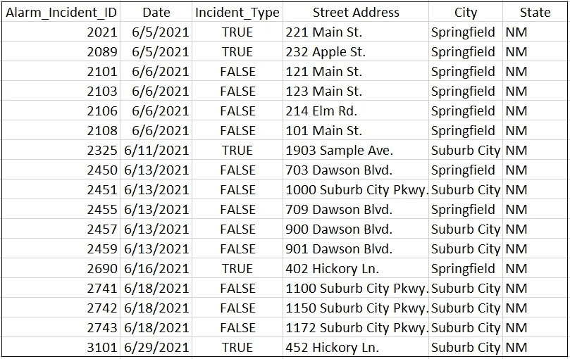
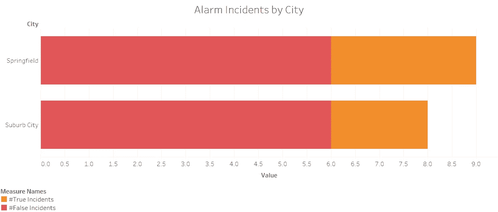
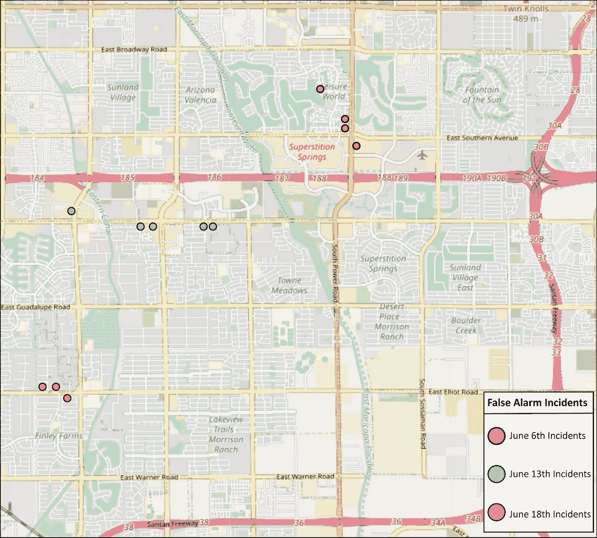
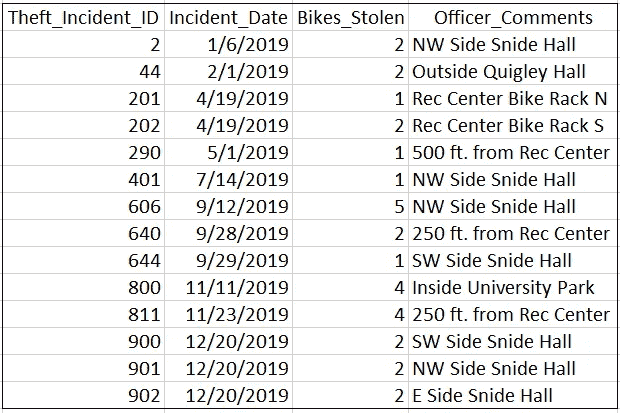

# 空间数据科学基础-绝对位置与相对位置

> 原文：<https://towardsdatascience.com/spatial-data-science-basics-absolute-vs-relative-location-b7f24470f0b2?source=collection_archive---------25----------------------->

## “定位科学”的简单入门，附实例

托拜厄斯在 [Unsplash](https://unsplash.com/photos/CyX3ZAti5DA) 上的照片。

每一天的每一分钟，您的连接设备都在挖掘您的位置数据。

你在哪里吃饭，你在哪里睡觉，甚至你下班后在哪里聚会都被外部实体一天 24 小时，一周 7 天记录下来。公司使用你的位置数据来创造令人惊讶的产品和应用的多样性。

你有没有想过谷歌地图怎么会有世界大片地区的交通报告？或者，你是否觉得奇怪，即使没有你的直接输入，你最喜欢的送货应用程序似乎总是向你推荐附近的餐馆？在谷歌的案例中，他们正在汇总数十万条记录，以估计全球道路上的车速。在 DoorDash 或 UberEats 等应用程序中，您的个人位置数据被用来鼓励您从他们的服务中进行购买。

虽然所有这些听起来有些令人不安和害怕，但对于一个有抱负的数据科学家来说，还是有一线希望的——公司需要能够处理位置数据的分析师。在你的简历中加入地理位置方面的资质可以帮助你在职业生涯中成长，在专业上成功。在本文中，我将介绍位置的概念，并详述它在数据科学中的应用。这个核心概念可能看起来很简单，但它比你想象的更微妙。

## 空间数据科学导论

空间数据科学是一个新兴领域，它将“传统”空间数据分析的关键方面(如查询、ETL、数据挖掘和可视化)与定位科学结合起来。“区位科学”的同义词是地理学。

地理学有许多重要的原则和概念，但如果你想更全面地了解这门学科，有三个关键概念你应该知道:*空间*、*地点*和*位置*。

位置是本文的主要主题，但我想简单介绍一下空间和地点，因为这三者是相互关联的。

*空间*是一个抽象的概念，用来描述人、景观物体和地点之间的关系距离。空间在数学上可以是绝对的。我和邻居之间的物理距离可以用精确的单位来衡量，假设我们每个人都停留在一个位置。测量员也可以在预期合同报价的情况下精确测量一块房地产的边界。在这两种情况下，空间(线性、矩形或其他)可以使用可测量的单位绝对量化。然而，在许多情况下，空间是相对的，不容易测量。我们所有人都有个人空间或泡泡，根据我们的情况而变化。在新冠肺炎期间，当我们试图在社交上与陌生人保持距离时，我们的大部分个人空间都扩大了，但如果你和亲人一起躲在家里，这种个人空间反而会减少。这些类型的可变空间无法量化测量。许多空间也存在于我们的头脑和想象中。你遇见你的生活伴侣的空间可能对你有很深的意义；同样，你曾经和童年伙伴一起玩耍的地方对你来说也可能是很伤感的。当一个空间具有情感价值时，这就是所谓的*场所*。

现在，你可能正在阅读这篇文章，想知道这些概念与数据有什么关系。毕竟，在一个要求苛刻的商业世界里，公司想要可实现的洞察力，像空间和地点这样的抽象概念有什么好处呢？

跟着我。我向你保证，知道这些概念会派上用场！

## 位置:空间数据的关键组成部分

使空间/地理数据不同于空间数据的关键要素是*位置*。打开关系数据库或 Microsoft Excel 电子表格，快速浏览一些数据表。您的表中有没有将街道地址作为属性或列的？GPS 坐标呢？甚至一个州/省的名字也可以。如果您的表中有任何包含位置成分的列，那么恭喜您，您正在处理空间数据！

位置只是地球表面上的一个地方，用某种形式的坐标系来表示。这些坐标可以是绝对的，也可以是相对的。

绝对位置通常是大多数数据科学家习惯使用的。顾名思义，绝对位置是精确和可测量的。GPS 坐标虽然容易出现小的误差，但通常是相当精确的。街道地址也是如此:如果你把街道地址输入你最喜欢的地图应用程序，它几乎总能把你带到离你想去的地方只有几英尺远的地方。

*相对位置*，另一方面，容易不准确。这种类型的位置是近似的，但不是精确的。当你向陌生人问路时，这通常是你会得到的位置类型。如果有人告诉你，“银行就在几条街外，过了火车站就到了，”这不是一套精确的方向，但它会带你接近你要去的地方。银行的位置与火车站等其他位置相关。使用注释/评论字段来表示位置的数据集并不少见。如果现场技术人员没有 GPS 单元，那么他们可以求助于使用手写注释来表示他们服务过的位置。这些位置可能相对于其他地标和位置。

了解相对位置和绝对位置之间的差异将有助于您改进数据分析和可视化工作流，并有助于提高您的整体工作效率。

## 场景 1:使用具有绝对位置的空间数据

作为一名空间数据科学家，您的大部分工作将会看到您处理带有绝对位置的数据。你的位置数据的*精度*将会深刻影响你可以对其进行的分析类型。在这种情况下，精度是指您的位置数据的准确性。如果您有某个位置的精确地理坐标，那么您可以使用这些数据做更多的事情，而不是使用城市或州名。

考虑下面的场景。你是一名数据科学家，在一家私人安全公司工作。您的公司为企业主提供商业警报服务，通常非常可靠，但由于某种原因，在过去的一个月中，新墨西哥的虚拟城市斯普林菲尔德发生了异常多的假警报事件。您的团队领导希望您调查此问题，尝试找出任何可能有助于解释您的警报产品发生问题的模式。

当您使用上面的表格视图时，您能发现位置数据吗？

地理空间数据分析师的与众不同之处在于，他们知道如何利用位置科学为雇主提供有价值的见解。

在这种情况下，不习惯使用地理空间数据的分析师可能会倾向于关注“日期”或“事件类型”属性。虽然这些属性很重要，但是如果没有位置信息，它们的重要性就会降低。在我们的表视图中有三个位置属性。这三个位置都可以归类为“绝对位置”，但它们的精度各不相同。

“州”列是我们的位置数据中最不精确的。

“城市”列更精确。使用该属性，可以在城市之间进行描述性比较。我们也可以做一些简单的可视化来帮助这些比较。当然，在这种情况下最好的图表之一是条形图(如下图所示)。

使用城市属性，可以清楚地看到，在 6 月份，斯普林菲尔德及其郊区“郊区城市”的虚警事件数量相等。这是一个独特的位置洞察力。我们现在可以排除该地区存在公用设施故障问题的可能性，因为每个城市都使用自己的电网。引入时间因素，我们也许能收集到更多的洞见。

虽然我们从使用城市属性中获得的见解很有帮助，但这几乎不是我们最精确的位置数据。“街道地址”一栏甚至更精确。有了这个属性，我们现在可以精确到建筑物级别的警报事件。我们还可以通过称为*地理编码的过程将每个事件映射为地图上的一个点。*

地理编码是指使用地址、名称或坐标将数据点的位置编码到地球表面的某个位置。地理编码只能使用绝对位置和专业软件进行，如 ESRI 的 ArcGIS 或 Tableau Desktop。地理编码也可以使用 Python 来完成，正如 [Abdishakur](https://shakasom.medium.com/?source=post_page-----161ec1e62b89--------------------------------) 在[迈向数据科学](/geocode-with-python-161ec1e62b89)中所展示的。

如果我们对我们的街道地址进行地理编码，我们就可以创建一个地图，让我们能够根据警报事件发生的地点来可视化这些事件。这将使我们能够确定是否有任何空间或时空模式可以帮助解释已经发生的事件。下面的地图(图 2)详细描述了在我们假设的区域中每个事件的位置和时间。

新墨西哥州虚拟城市斯普林菲尔德的假警报事件地图(实际地图描绘了亚利桑那州凤凰城)OpenStreetMap 贡献者

使用我们最精确的位置数据，我们现在可以看到按日期划分的假警报事件的清晰空间集群。这告诉我们，在导致这些假警报事件发生的*空间*中，可能正在发生一些事情。如果没有准确的街道地址，就不可能确定这一点。

有了这些信息，我们可以搜索这些地点附近的事件，试图找出发生了什么。在这种情况下，我们发现由于夜间道路重铺，这些地点出现了巡回停电。因为你的警报器需要一个持续的电源，当道路施工暂时切断警报器时，一个错误的警报器触发了。

这种情况的教训是绝对位置在数据分析工作中非常有价值。这些位置越精确越好！

## 使用具有相对位置的空间数据

作为数据分析师，处理附有相对位置的数据要难得多。90%的情况下，数据库中的位置信息是绝对的，可以根据地形进行地理编码。然而，情况并非总是如此。

让我们用另一个场景来打破这个概念。

这一次，你工作的保安公司想要一张在我们虚构的新墨西哥州斯普林菲尔德市的大学校园内自行车失窃的地图。你得到的是模糊的位置信息，这些信息是由校园里的安全官员输入的。

查看表视图，可以清楚地看到，这里没有可以使用的绝对位置。缺少绝对位置数据意味着您无法再对地图上的点进行地理编码。

使用“Officer_Comments”属性，您意识到您拥有这些盗窃事件发生的相对位置。这些位置是相对的，因为它们只是相对于大学校园中的其他位置来描述的。既然知道了这些相关建筑的位置，就可以对盗窃事件发生的地点做出一些推断。

没错，**使用相对位置的关键是使用上下文线索进行推理**。如果评论说“250 英尺。从娱乐中心“并且你知道在那个大概的位置有一个自行车架，你可以推断盗窃发生在自行车架上。同样，如果某个位置被指定为位于建筑物的“西北侧”,您可以根据自己的最佳判断在该位置放置一个点。地理信息系统(GIS)特别有助于通过地理编码和推理放置向地图添加数据点(点要素)。

使用相对位置时，您会遇到两个主要问题。首先，当您使用上下文线索“推断”数据点的位置时，必然会有一些数据准确性问题。让你的雇主提前了解这些问题。如果 250 英尺内有两个自行车架。对于一栋建筑，你可能会推断在一个机架上发生了盗窃，而实际上在另一个机架上发生了盗窃。这就产生了一个精度问题，如果您计划对数据应用地统计分析技术，这可能会成为一个问题。第二个问题是推断大型数据集的位置可能很麻烦，如果不是完全不可能的话。

## 结论

对于数据分析师和科学家来说，能够处理位置数据正成为一项越来越重要的技能。了解*位置*的基本情况有助于提高你的分析能力，改善你的工作表现。