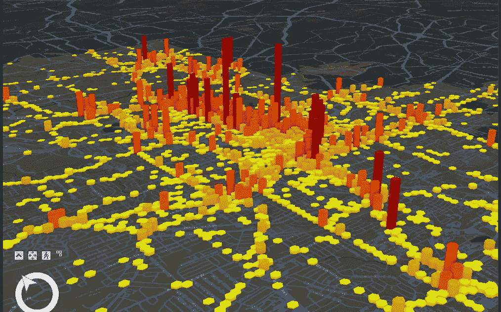
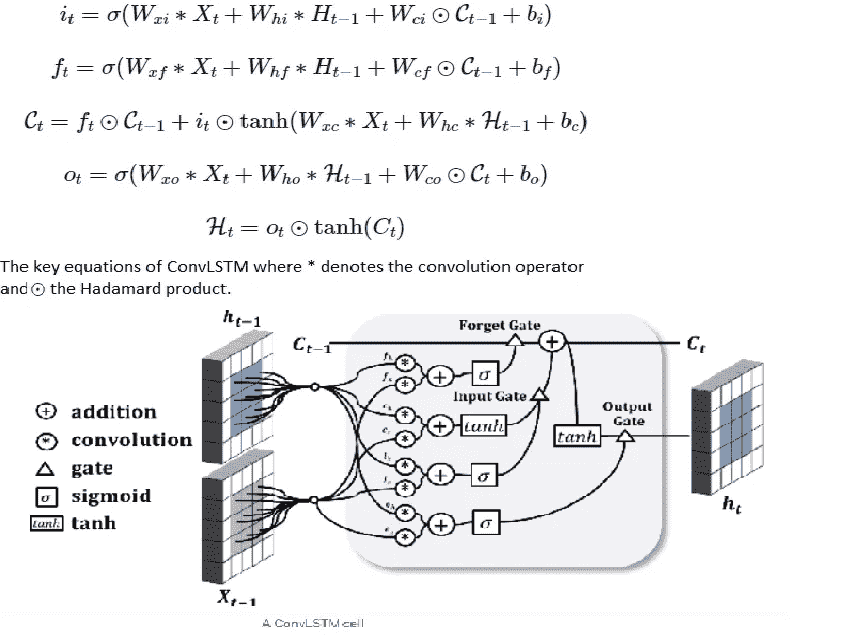
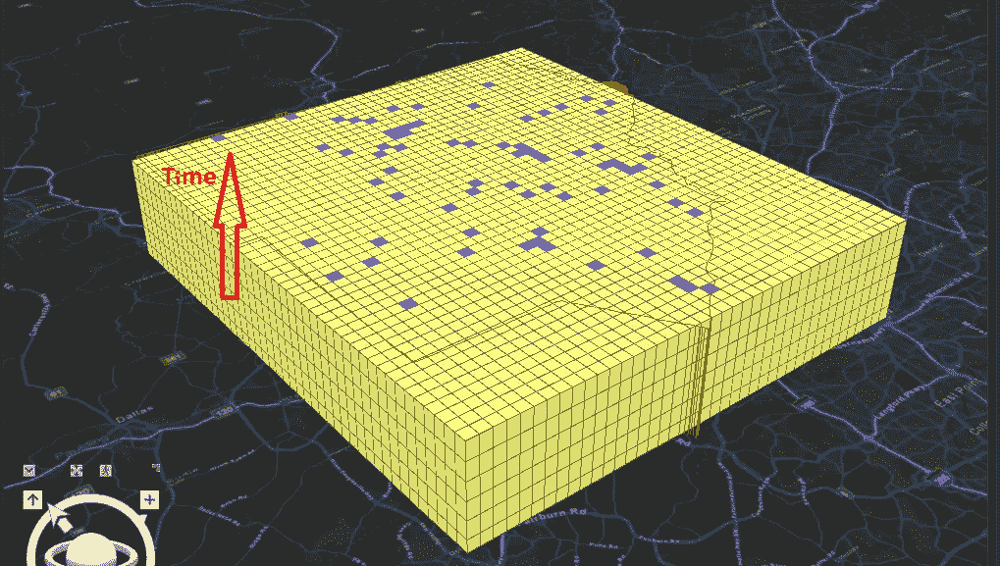
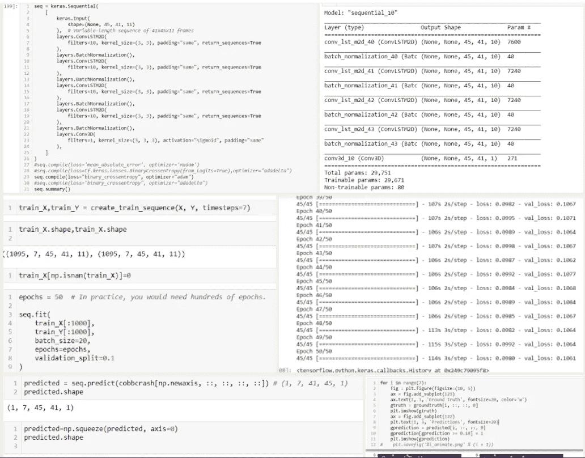
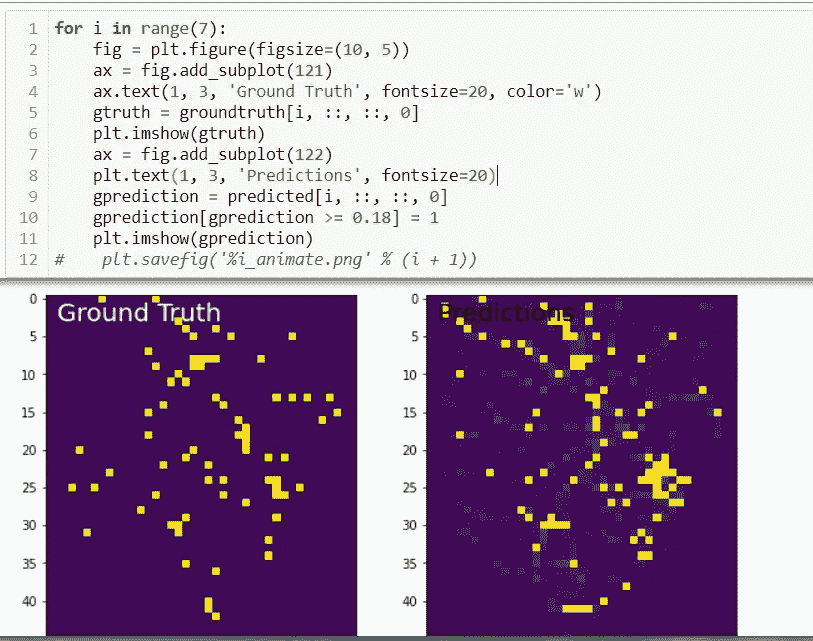
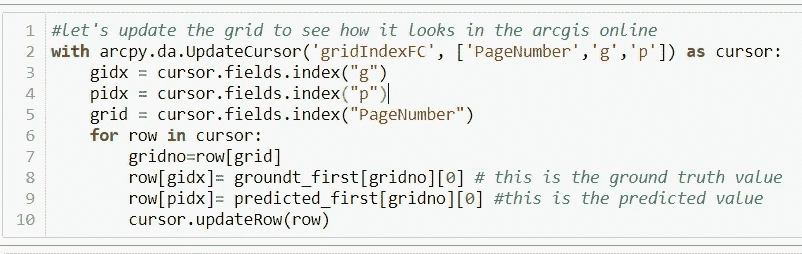
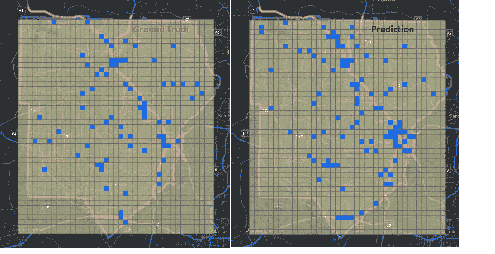

# 用于碰撞预测的时空变换

> 原文：<https://towardsdatascience.com/spatial-temporal-convlstm-for-crash-prediction-411909ed2cfa?source=collection_archive---------12----------------------->

2015-2019 年亚特兰大市的 3D 场景交通事故。数据源 GADOT。作者图片

## ***一种独特的深度学习方法用于事故预测***

这篇文章讲述了一项独特的实证研究，该研究使用 [**ConvLSTM**](https://arxiv.org/abs/1506.04214) 深度学习模型和 **ArcPy** 利用碰撞特征数据的时间序列来预测第二天的碰撞风险位置。交通事故被公式化为时空序列预测问题，其中输入和预测数据都是时空序列。卷积 LSTM ( **ConvLSTM** )方法是为崩溃预测建立一个端到端的可训练模型。结果表明 **ConvLSTM** 网络能够捕捉交通事故发生的时间和地点的时空相关性。

**问题:**交通事故导致严重的人员伤亡和巨大的经济损失。预测时空环境中交通事故风险的能力不仅对于公众而且对于政府官员来说对于预防事故的发生都是重要的。然而，预测交通事故是一项非常具有挑战性的任务，不仅要预测多种因素(如人、时间、几何和环境)的原因，还要预测稀有因素和稀疏数据集。传统的事故预测一般采用统计回归，如**泊松**、**负二项**、**、【NB】、**多元回归**。但是，当处理复杂和高度非线性的数据时，如事故的时空相关性，如事故发生的时间、地点和原因时，它们往往会失败。有经典的机器学习方法，例如 **XGBoost** 、 **SVM** 和 **RandomForest** 分类器，它们将特征设计到模型 [*中，以寻求特征对于概率*](https://github.com/gitWayneZhang/my_Spark/blob/master/right_angle%20crash%20prediction.ipynb) 的重要性。我们正在讨论机器学习中的特征，即多维空间中的数字阵列。要了解更多机器学习中的特征工程，请阅读来自 [*丹尼尔·克拉尔*](https://storymaps.arcgis.com/stories/19d90071cee34cf09acce4d00d758357) 的一个最好的故事。**

此外，时间和季节性在决定何时何地发生事故的概率方面起着重要作用。使用 ArcGIS Pro 中的 ArcPy，我们可以聚合特定时间窗口内的崩溃位置。 [*点击查看 3D 场景中*](https://cobbcountyga.maps.arcgis.com/home/webscene/viewer.html?webscene=15780a20c76b4f11b09e5c350052c4be) 坠机地点示例。

**解决方案:**那么，我们是否可以应用经典的机器学习模型来搜索重要的因果特征，然后提出一个实用的深度学习网络来预测事故发生的时间和地点？答案是肯定的。 **ConvLSTM** 模型是最有趣的深度学习模型之一，用于预测下一帧视频或图像。最初的研究是针对 [*降水临近预报*](https://arxiv.org/abs/1506.04214) 进行的。为了更好地理解 **ConvLSTM** 模型，我们先来看看普通的 **LSTM** 网络模型。[****(LSTM****)**](https://en.wikipedia.org/wiki/Long_short-term_memory)*网络是一种具有反馈连接的人工递归神经网络(***)*。它不仅可以处理单个数据点(如图像)，还可以处理整个数据序列(如语音或视频)。以下是迈克尔·菲尔为《LSTM 解说指南》制作的最佳解说视频之一。也可以看 [*他的博客*](/illustrated-guide-to-lstms-and-gru-s-a-step-by-step-explanation-44e9eb85bf21) *。****

***有用吗？现在，让我们看看什么是 **ConvLSTM** 。简单的说， **ConvLSTM** 就是 **CNN** 卷积神经网络结合 **LSTM** 网络。不是只有数据序列的输入，它的输入是最适合图像和视频的 **CNN** 卷积神经网络的数据序列。这种组合确保 **ConvLSTM** 捕捉潜在的局部时空相关性。 **ConvLSTM** 的关键方程和内部结构图见下图 1。***

******

***图一。图片来自[http://home page . div ms . uio wa . edu/~宁拙/papers/p984-yuan.pdf](http://homepage.divms.uiowa.edu/~zhuoning/papers/p984-yuan.pdf)***

*****工作原理:**这项实证研究的目标是利用 **ConvLSTM** 网络，设计先前的事故数据序列，以预测科布县固定时间段内的车祸地点。每个事故都有记录的时间和位置坐标。想象每个时间段，即每两个小时，是时空空间中的一个画面。当堆叠这些碰撞图像帧并馈入 **ConvLSTM** 网络时，我们可以预测固定长度，即接下来几个小时的交通事故图像帧。为了将数据拟合到模型中，数据将被公式化为 3D 张量，例如图像，并作为具有上述特征的 4D 张量序列进行叠加，作为第四维。(序列、图像、图像、特征)。使用 **ArcPy** 将整个科布县地区划分为 45hx41w(总共 1845 个，每个 0.25 英里)的方形箱。在这个初始项目中，我使用七天的碰撞序列数据作为模型的输入，并预测第二天的碰撞图像地图，因为县一级的碰撞数据非常稀少，并且具有很强的每周模式。将有另一个项目来预测未来两个小时的崩溃使用相同的模型和算法。当应用*[****XGBoost 和 RandomForest*** *模型**](https://github.com/gitWayneZhang/my_Spark/blob/master/right_angle%20crash%20prediction.ipynb)**时，总结出了导致科布交通事故的 11 个重要特征。这些特征属性包括不随时间变化的变量，如道路长度、道路曲率、平均坡度、人口密度等。以及时变变量，例如天气、一天中的时间、事故和位置等。这些特征被格式化为 4D 张量的第四维(7，45，41，11)。三年的科布县事故数据被处理并批量输入 **ConvLSTM** 模型，其中 90%为训练序列，10%为测试序列。每个序列一天移位一次，总共 1096 个序列用于训练和测试。输出预测是第二天在 1845 个箱中发生的碰撞(参见图 2 显示堆叠的县碰撞箱地图的解释性图片。蓝色的箱子是在那个时间段发生事故的箱子)******

**********

*****图二。作者图片*****

*******建立模型，训练数据，进行风险预测*******

*******幕后**:典型的深度学习模型是工程化数据集，建立模型，训练数据，进行预测，部署模型。用 ***二元交叉熵*** 和 ***亚当*** 优化器对模型进行 50 个历元的训练(实际上可以训练几百个历元)。结果证明很有希望。上面的图库显示了除数据工程部分之外的一些步骤。随机选择 2020 年 12 月 12 日的地面实况和预测样本，这在训练中没有使用。通过使用一定的概率阈值直观地比较实际情况和预测，该模型可以预测当天最匹配的碰撞位置和模式。参见图 3。*****

********

****图 3。作者图片****

********

****作者图片****

******结果:**通过几行 **ArcPy** 代码，我们可以将模型输出记录添加到 **ArcGIS** Pro 中的格网要素类和地图中。使用符号化的道路和其他要素，在 **ArcGIS Pro** 中更易于可视化。****

********

****作者图片****

********

****作者图片****

******为什么重要:**这个实证研究项目展示了我们如何使用 **ArcPy** 和深度学习技术，如 **ConvLSTM** 来找到一个有希望的崩溃预测解决方案。整个工作流和数据流程可通过更多工程要素和数据得到进一步增强，在 **ESRI ArcGIS** Pro desktop 中实现自动化、部署和制图，或成为 **ArcGIS** 企业服务。因此，同样的方法可以应用于交通流量、降雨量、犯罪预测等你能想到的造福人类的时空解决方案。****

****当今世界向我们提出了许多挑战。然而，借助人工智能和深度学习的力量，我们可以共同努力寻求解决方案，让世界变得更加美好。感谢您阅读这个故事地图。****

******参考文献******

****[1]邢建石，，陈，，杨迪燕，黄伟建，王春宇， [*卷积 LSTM 网络:一种用于降水临近预报的机器学习方法。*](https://arxiv.org/abs/1506.04214) 计算机视觉与模式识别(cs。CV)引用为:[arXiv:1506.04214](https://arxiv.org/abs/1506.04214)【cs。简历]****

****[2]袁，，杨天宝， [*Hetero-ConvLSTM:一种基于异构时空数据的交通事故预测深度学习方法*](http://homepage.divms.uiowa.edu/~zhuoning/papers/p984-yuan.pdf) *。*2018 年 KDD 奥运会，2018 年 8 月 19 日至 23 日，英国伦敦。****

****[3] Sobhan Moosavi，Mohammad Hossein Samavatian，Srinivasan Parthasarathy，Radu Teodorescu，Rajiv Ramnath， [*基于异质稀疏数据的事故风险预测:新数据集和见解*](https://arxiv.org/abs/1909.09638) *。*机器学习(cs。LG)；数据库(cs。DB)；as:[arXiv:1909.09638](https://arxiv.org/abs/1909.09638)【cs。LG】。****

****[4] Jeremiah Roland *，Peter D. Way，Connor Firat，Thanh-Nam Doan，Mina Sartipi，[田纳西州查塔努加市车辆事故发生的建模与预测，](https://www.sciencedirect.com/science/article/pii/S0001457520316808?via%3Dihub)事故分析与预防 149 (2021) 105860****

****[5][ESRI·阿皮](https://pro.arcgis.com/en/pro-app/latest/arcpy/get-started/what-is-arcpy-.htm)****

****[6]丹尼尔·克拉尔， [*汽车碰撞预测特征工程*](https://storymaps.arcgis.com/stories/19d90071cee34cf09acce4d00d758357) *。*故事地图 2020 年 5 月 19 日****