# 空间变压器网络

> 原文：<https://towardsdatascience.com/spatial-transformer-networks-b743c0d112be?source=collection_archive---------7----------------------->

## [思想和理论](https://towardsdatascience.com/tagged/thoughts-and-theory)

## 独立的介绍

*由 Max Jaderberg 等人引入的空间转换器*模块是一种流行的方法，用于增加模型对空间转换的空间不变性，如平移、缩放、旋转、裁剪以及非刚性变形。它们可以被插入到现有的卷积架构中:要么紧跟在输入之后，要么在更深的层中。它们通过自适应地将其输入变换为规范的、预期的姿态来实现空间不变性，从而导致更好的分类性能。单词 adaptive 表示根据输入本身的条件，为每个样本产生适当的变换。可以使用标准的反向传播来端到端地训练空间转换器网络。

空间转换器模块将输入转换成一个规范的姿态，
，从而简化后续层的识别(图片由作者提供)

在这个由四部分组成的教程中，我们涵盖了深入理解空间转换器所需的所有先决条件。在前两篇文章中，我们已经介绍了正向映射和反向映射的概念，并深入研究了双线性插值的细节。在本帖中，我们将介绍构成空间转换器模块的所有构件。最后，[在下一篇也是最后一篇文章](/spatial-transformer-networks-backpropagation-15023fe41c88)中，我们将从头开始推导所有必要的反向传播方程。

# 职责分离

为了理解空间转换器模块的一些构建块背后的动机，我们必须快速重复第一篇文章中介绍的[反向映射的原理。](/spatial-transformer-tutorial-part-1-forward-and-reverse-mapping-8d3f66375bf5)

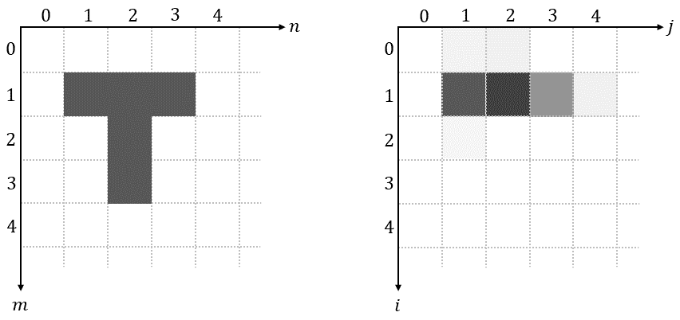

反向映射(图片由作者提供)

在反向映射中，我们遍历输出图像，一次一个像素，对于每个位置，我们执行两个操作:

1.  使用逆变换𝑇-1{…}来计算输入图像中的相应位置
2.  使用双线性插值对像素值进行采样

我们在上面的动画中一个接一个地直接执行这两个操作的原因主要是为了说明反向映射的概念。然而，当实现反向映射时，首先计算所有输出像素的相应位置(并且可能存储它们)，然后才应用双线性插值是有益的。很明显，这对最终结果没有影响。

这种方法的主要好处是，我们现在得到了两个具有独立职责的组件:**网格生成器**和**采样器**。**网格生成器**具有执行逆变换的专有任务，并且**采样器**具有执行双线性插值的专有任务。此外，正如我们将在下一篇文章中看到的，分离极大地促进了反向传播。

# 电网发电机

**网格生成器**在输出/目标图像的规则网格上迭代，并使用逆变换𝑇-1{…}来计算输入/源图像中的相应(通常是非整数)样本位置:

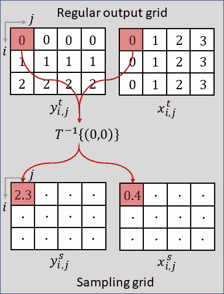

网格生成器(图片由作者提供)

上标𝑡和𝑠取自原纸，分别表示“*目标图像*”和“*源图像*”。**采样网格**的行和列索引分别表示为𝑖和𝑗。还请注意，在原始论文中，常规输出网格上的逆变换𝑇-1{…}表示为𝒯𝜃(𝐺).

尽管为了清楚起见，上图中的坐标是按顺序计算的，但出于计算效率的原因，**网格生成器**的实际应用将尝试并行转换尽可能多的点。

网格生成器的输出是所谓的**采样网格**，它是一组将对输入地图进行采样以产生空间变换输出的点:

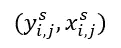

在哪里

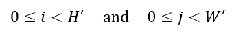

请注意，**采样网格**的大小，决定了目标图像的大小。

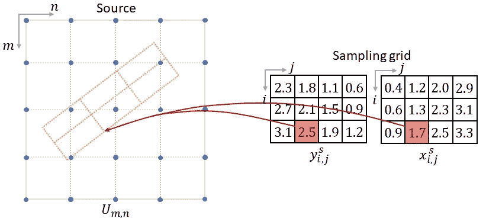

采样网格包含将对输入/源地图进行采样的点(图片由作者提供)

关于**采样网格**最后要提到的重要一点是，它的高度和宽度不一定需要与输入图像的高度和宽度相同。

# 取样器

**采样器**迭代**采样网格**的条目，并使用双线性插值从输入图中提取相应的像素值:

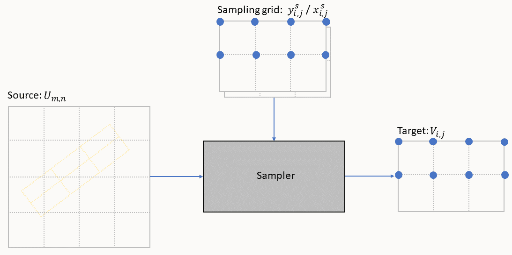

采样器(图片由作者提供)

像素值的提取包括三个操作:

1.  找到四个相邻点(左上、右上、左下和右下)
2.  对于每个相邻点，计算其相应的权重
3.  取加权平均值以产生输出

所有操作都总结在下面的等式中，该等式已在上一篇文章中导出[:](/spatial-transformer-networks-tutorial-part-2-bilinear-interpolation-371e1d5f164f)

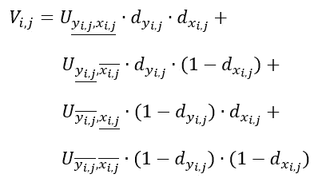

记住，𝑑𝑥表示从样本点到单元格右边界的水平距离，𝑑𝑦表示到单元格上边界的垂直距离。

在**网格生成器**中，每个输出像素的计算完全独立于任何其他输出像素。因此，现实世界中的**采样器**将通过并行提取尽可能多的点来加速这个过程。

# 本地化网络

**定位网络**的任务是找到逆变换𝑇-1{…}的参数𝜃，该逆变换将输入特征图置于标准姿态，从而简化后续层中的识别。**定位网络**可以采取任何形式，例如全连接网络或卷积网络，但是应该包括最终回归层以产生变换参数𝜃:

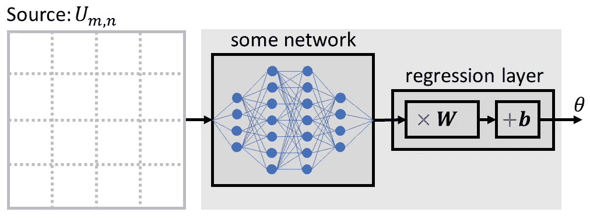

本地化网络(图片由作者提供)

𝜃的大小可以根据被参数化的变换而变化，例如对于仿射变换，𝜃是 6 维的:

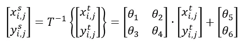

仿射变换非常强大，包含平移、缩放、旋转和剪切作为特例。然而，对于许多任务，更简单的转换可能就足够了，例如，仅使用 2 个参数来实现纯转换:

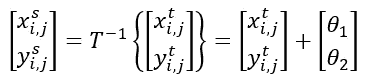

**网格生成器**和**采样器**都是无参数操作，即它们没有任何可训练的参数。在这方面，它们相当于最大池层。因此，空间转换器模块的智能来自**定位网络**，它必须学会检测输入特征地图的姿态(如其方向、比例等)。)以便产生适当的变换。

# 完整模块

最后，让我们看看空间转换器模块的单个构建块是如何相互作用的。输入特征图𝑈首先被传递到**定位网络**，其回归适当的变换参数𝜃.**网格生成器**然后使用变换参数𝜃产生**采样网格**，这是一组输入特征地图将被采样的点。最后，**采样器**获取输入特征图和**采样网格**，并使用例如双线性插值输出变换后的特征图。

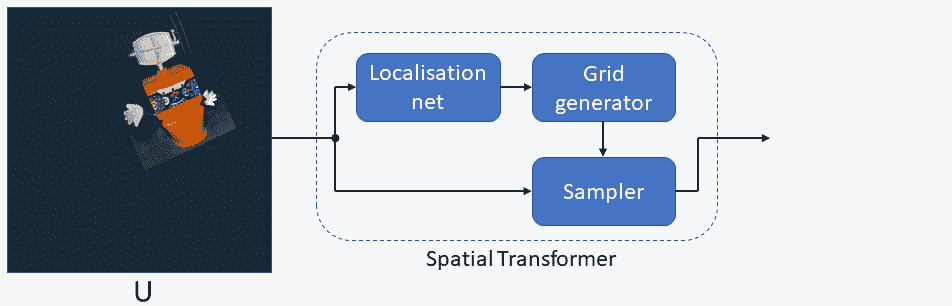

空间转换器模块(图片由作者提供)

在这一点上，我们想再次提请注意这样一个事实，即**定位网络**为每个输入单独预测变换参数。以这种方式，空间转换器模块成为自适应组件，其行为取决于输入。

# 多通道

到目前为止，我们已经在具有单通道𝐶=1 的输入上展示了空间变换器模块的原理，如在例如灰度图像中遇到的。然而，空间转换器模块通常用于更深的层，并在特征地图上操作，这些特征地图通常具有多个通道
𝐶 > 1。即使在输入之后立即使用，空间变换器模块也可能面对具有不止一个通道的输入，例如具有 3 个通道的 RGB 图像。

扩展很简单:对于多通道输入，对输入的每个通道进行相同的映射，因此每个通道都以相同的方式进行转换。这样，我们可以保持通道之间的空间一致性。请注意，空间转换器模块不会改变通道𝐶的数量，该数量在输入和输出特征图中保持不变。

我们到了第三个帖子的末尾。到目前为止，您已经熟悉了空间转换器模块的两个基石:反向映射和双线性插值。您知道空间转换器模块的所有构造块以及它们如何相互作用。大量的动画应该有助于你形成一个强有力的心理概念。现在，您可以在自动微分框架(如 TensorFlow 或 PyTorch)中使用空间转换器模块了。

[下一个也是最后一个帖子](/spatial-transformer-networks-backpropagation-15023fe41c88)主要是为那些想知道双线性插值怎么可能是微分运算的高级读者准备的。我们将详细了解梯度如何通过**采样器**不仅流回输入特征地图，还流回采样网格坐标。

# 参考

[原文](https://arxiv.org/pdf/1506.02025.pdf)
[关注点分离](https://www.castsoftware.com/blog/how-to-implement-design-pattern-separation-of-concerns)
[py torch 中的空间变形金刚](https://pytorch.org/tutorials/intermediate/spatial_transformer_tutorial.html)
[点评:STN —空间变形金刚网络](/review-stn-spatial-transformer-network-image-classification-d3cbd98a70aa?gi=c52d1304c8f8)