# 空间变压器网络—反向传播

> 原文：<https://towardsdatascience.com/spatial-transformer-networks-backpropagation-15023fe41c88?source=collection_archive---------11----------------------->

## 独立的介绍

由 Max Jaderberg 等人引入的空间变换器模块是一种流行的方法，用于增加模型对空间变换(如平移、缩放、旋转、裁剪以及非刚性变形)的空间不变性。它们通过自适应地将其输入变换为规范的、预期的姿态来实现空间不变性，从而导致更好的分类性能。

在这个由四部分组成的教程中，我们涵盖了深入理解空间转换器所需的所有先决条件。在前两篇文章中，我们已经介绍了正向和反向映射的[概念](/spatial-transformer-tutorial-part-1-forward-and-reverse-mapping-8d3f66375bf5)，并深入研究了双线性插值的[细节](/spatial-transformer-networks-tutorial-part-2-bilinear-interpolation-371e1d5f164f)。在上一篇文章中，我们已经介绍了构成空间转换器模块的所有构件。最后，在这篇文章中，我们将从头开始推导所有必要的反向传播方程。

# 梯度流动

在我们开始推导公式之前，让我们快速了解一下梯度是如何通过空间转换器模块流回的:

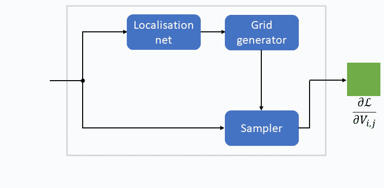

梯度流，𝓛表示损失函数(图片由作者提供)

上面的动画清楚地说明了为什么空间转换器网络可以使用标准反向传播进行端到端训练。我们从模块输出端的梯度开始，该梯度已经在较高层计算过了。我们要做的第一件事，是导出显式公式，通过**采样器**将该梯度传播(或流动)回输入特征图和**采样网格**。然后，我们必须通过**网格生成器**推导出控制反向传播的公式。记住**采样器**和**网格生成器**都是无参数操作，即没有任何可训练参数。最后，我们必须通过**定位网络**反向传播梯度，这是一个标准的神经网络，因此这里不需要推导新的公式。参数更新发生在**本地化网络**中。

如果你从未遇到过反向传播，对梯度流概念的理解有问题，[请看看我的介绍帖](/deriving-the-backpropagation-equations-from-scratch-part-1-343b300c585a)。

# 梯度 w.r.t 采样网格坐标

在所有以前的帖子中，我们将假设**采样器**使用双线性插值来转换输入特征图。让我们快速回忆一下在第二篇文章中[推导出的相应公式。对于**采样网格**的每个条目:](/spatial-transformer-networks-tutorial-part-2-bilinear-interpolation-371e1d5f164f)

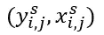

**采样器**首先通过取下限和上限运算找到四个相邻值:

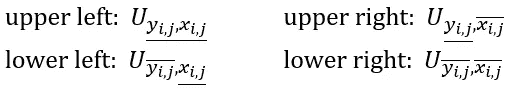

为了清楚起见，我们去掉了上标“𝑠”。接下来，**采样器**计算从采样点到其单元格右边界的*水平距离*和到单元格上边界的*垂直距离*:

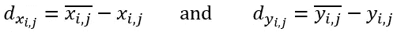

最后，需要一个加权平均值来产生输出:

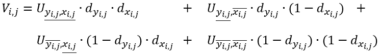

为了得到想要的导数的直觉，让我们摆动单个(！)进入**采样网格**:

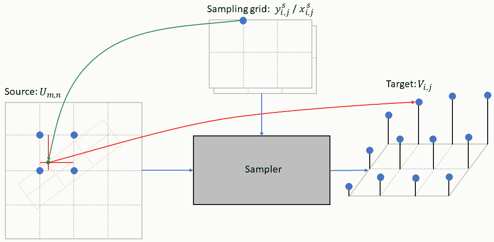

单个条目对输出地图的影响(图片由作者提供)

我们看到，摆动仅影响输出特征地图中的单个像素。这是意料之中的，因为**采样器**在**采样网格**的每个入口上独立运行(这是采样器非常适合并行化的原因)。为了将损失误差从输出特征图反向传播到**采样网格**，我们所要做的就是应用链式法则:

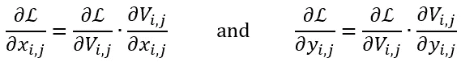

其中𝓛是损失函数。接下来，我们必须把𝑉·w·r·t 的导数带到𝑥:

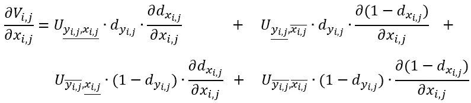

这需要我们对水平距离求导:

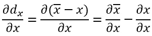

为了更进一步，我们必须看看天花板运算的导数:

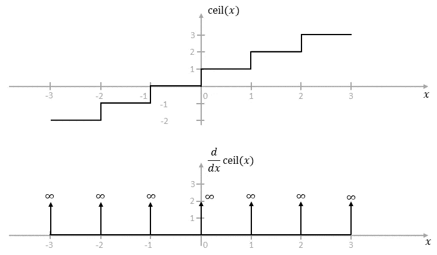

天花板操作及其衍生工具(图片由作者提供)

我们可以看到，上限运算是分段常数，常数的导数为零。上限运算在𝑥的整数值处是不连续的，并且在那里是不可微的。

从技术上讲，我们不能对一个不可微的函数应用梯度下降。我们的补救办法是所谓的次导数，它是导数的延伸，见*参考文献*。实际上，这可以归结为在𝑥:的整数值处将导数设置为零

类似地:

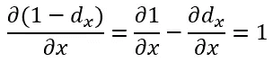

形式上，我们现在计算子梯度而不是梯度。我们最后的公式是:

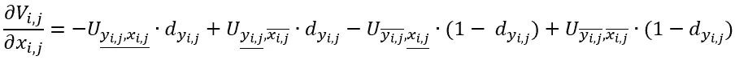

重新排列后:

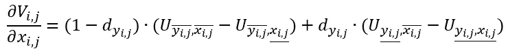

对于𝑦分量，我们相应地得到:

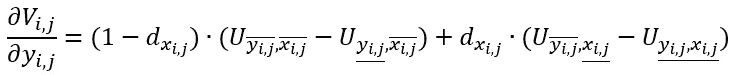

# 梯度 w.r.t 输入要素地图

在我们深入研究数学公式之前，让我们再次首先发展一种直觉。这一次，我们必须摆动输入要素地图中的像素值，比如坐标(2，1):

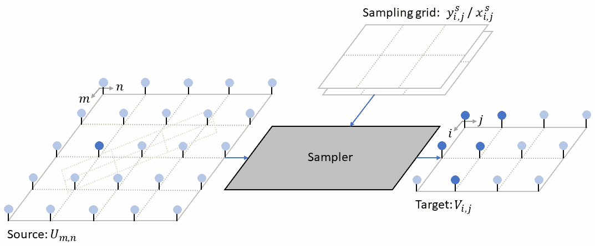

单个输入像素对输出地图的影响(图片由作者提供)

我们看到，摆动输入特征图中的单个像素会导致输出特征图中的多个像素发生变化。为了理解原因，让我们仔细看看受影响的输出像素的采样点:

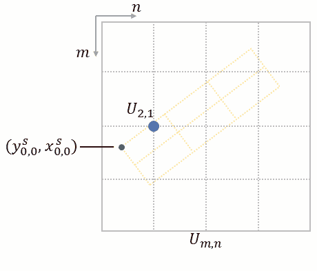

受影响的样本点共享一个公共输入像素(图片由作者提供)

我们注意到，所有提到的样本点都有一些共同点:坐标(2，1)处的输入像素总是属于双线性插值中使用的四个相邻点之一。还请注意输入像素(2，1)有时是右上邻居，有时是左下邻居，依此类推。

用于反向传播误差的链式法则现在变成:

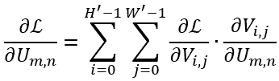

其中两个和考虑了输入特征图中的每个像素可能(潜在地)影响输出特征图中的多个像素的事实。在下一步中，我们必须评估表达式∂𝑉/ ∂𝑈，它强烈依赖于𝑈相对于𝑉's 样本点的相对位置(左上邻居、右上邻居等)。).为此，我们以如下方式重写双线性插值公式:

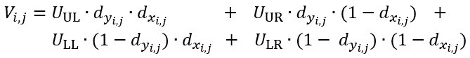

相应的衍生工具有:

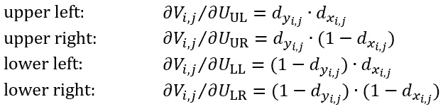

我们现在有了计算梯度的所有必要公式。为了对整个过程有一个更好的直觉，让我们把它应用到上面动画的例子中。这里，输入像素(2，1)影响以下五个输出像素(0，0)、(0，1)、(1，0)、(1，1)和(2，1):

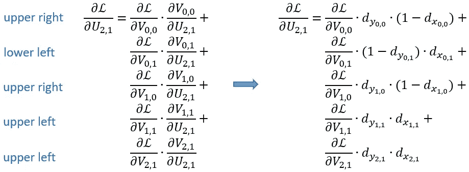

该过程的主要挑战似乎在于找到所有受影响的输出像素。幸运的是，在实际实现中，我们可以通过利用线性来完全省略显式搜索:

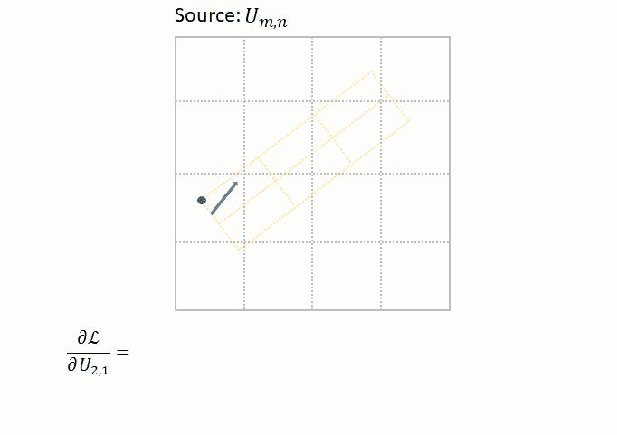

高效实施(图片由作者提供)

为此，我们首先为梯度∂𝓛 / ∂𝑈初始化一个空数组，然后迭代**采样网格**的条目。对于每个条目，我们使用倒数第二个公式来计算∂𝑉/ ∂𝑈的所有四个导数，随后乘以梯度
∂𝓛 / ∂𝑉.的相应条目剩下的最后一步是将四个计算值添加到梯度数组中。请注意，每个值都添加在不同的位置，由四个相邻点的位置定义。在整个过程结束时，梯度阵列的每个条目将包含所有受影响的输出像素的完整总和。

# 通过网格生成器反向传播

我们已经看到损失函数如何依赖于**采样网格**的所有坐标:

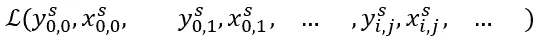

此外，每个样本坐标是由**定位网络**提供的参数的函数:

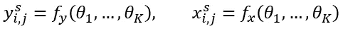

因此，将链式法则应用于多元函数，我们得到:

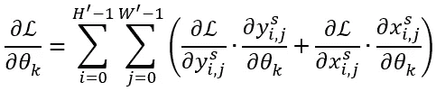

在下文中，我们将假设**网格生成器**正在使用仿射变换:

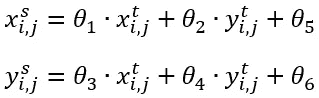

由于目标坐标位于规则的采样网格上，因此我们有:

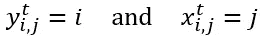

使得上述等式简化为:

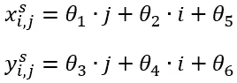

相应的衍生工具有:

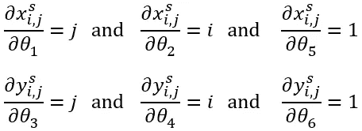

其余情况为零。为了获得最终的公式，我们将这些导数代入上述链式法则:

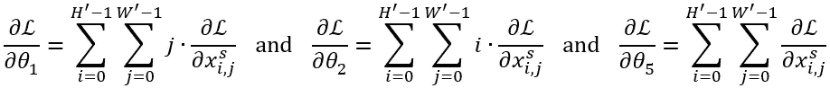

类似地:

如第一节所述，**网格生成器**通常被实现为标准的神经网络，例如全连接网络或卷积网络。为此，我们不需要推导任何新的反向传播公式。

我们已经到了第四个也是最后一个帖子的末尾。在这篇文章中，我们讨论了空间转换模块中很少被提及的反向传播的话题。虽然很复杂，但它将极大地帮助您调试在使用空间转换器模块时可能会遇到的问题。如果你想进一步磨练你的理解，请看看通过采样器反向传播的实际 [Tensorflow C++实现](https://github.com/tensorflow/addons/blob/v0.13.0/tensorflow_addons/custom_ops/image/cc/kernels/resampler_ops.cc)。

# 参考

[原文](https://arxiv.org/pdf/1506.02025.pdf)
[超越导数—次导数](/beyond-the-derivative-subderivatives-1c4e5bf20679)
[ReLU:不是可微函数](https://medium.com/@kanchansarkar/relu-not-a-differentiable-function-why-used-in-gradient-based-optimization-7fef3a4cecec)
[次导数](https://en.m.wikipedia.org/wiki/Subderivative?wprov=sfla1)