# 空间变压器网络教程，第 2 部分—双线性插值

> 原文：<https://towardsdatascience.com/spatial-transformer-networks-tutorial-part-2-bilinear-interpolation-371e1d5f164f?source=collection_archive---------12----------------------->

## 独立的介绍

*空间转换器*模块是一种流行的方式，用于增加模型的空间不变性，以抵抗空间转换，如平移、缩放、旋转、裁剪以及非刚性变形。它们可以被插入到现有的卷积架构中:要么紧跟在输入之后，要么在更深的层中。它们通过自适应地将其输入变换为规范的、预期的姿态来实现空间不变性，从而导致更好的分类性能。单词 adaptive 表示根据输入本身的条件，为每个样本产生适当的变换。可以使用标准的反向传播来端到端地训练空间转换器网络。

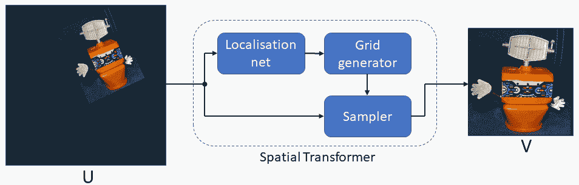

空间转换器模块将输入转换为标准姿态，从而简化后续图层中的识别(图片由作者提供)

在本教程中，我们将涵盖深入理解空间转换器所需的所有先决条件。在[的上一篇文章](/spatial-transformer-tutorial-part-1-forward-and-reverse-mapping-8d3f66375bf5)中，我们已经介绍了正向映射和反向映射的概念。在这篇文章中，我们将深入探讨双线性插值的细节。[在下一篇文章](/spatial-transformer-networks-b743c0d112be)中，我们将介绍构成空间转换器模块的所有构件。最后，[在第四篇也是最后一篇](/spatial-transformer-networks-backpropagation-15023fe41c88)中，我们将从头推导所有的反向传播方程。

# 线性内插法

作为热身，我们将从简单的一维情况开始。这里我们处理的是位于等距网格上的一系列数据点:

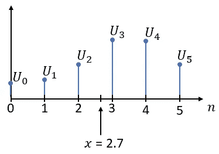

数据点序列(图片由作者提供)

由于在本教程中，我们将主要处理图像数据，我们可以安全地假设两个连续数据点之间的空间是一个而不失一般性。

请注意，上图中的离散序列仅针对整数位置定义，其他位置未定义。然而，我们经常需要非整数位置的值，比如上面例子中的 2.7。这是通过插值技术实现的，插值技术从已知数据值中估计未知数据值。在下文中，我们将未定义的点称为样本点，我们希望使用插值技术来估计这些点，并用字母𝑥.来表示它们

在线性插值中，我们只是简单地将一条直线拟合到。)𝑥的两个相邻点，然后查找所需的值:

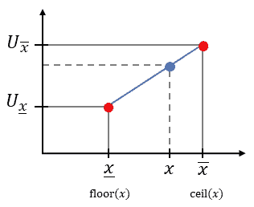

线性插值(图片由作者提供)

我们通过地板和天花板操作找到𝑥的邻近点。请记住:floor()将𝑥舍入到低于其值的最接近的整数，而 ceil()将它舍入到高于其值的最接近的整数。

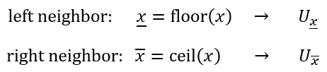

由于两个相邻的点都位于网格上，我们知道它们的𝑈值(如上图箭头右侧所示)。此外，对于网格上的两个连续点，我们有:

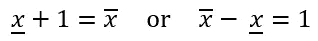

接下来，我们必须将以下直线拟合到两个相邻的点上:

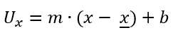

其中𝑚是斜坡，𝑏是交叉点。我们通过将左邻点插入方程来获得𝑏:

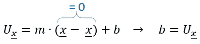

斜率𝑚是通过将右边的邻近点插入方程中获得的:

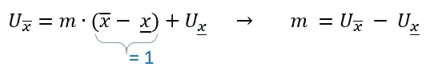

因此，我们的初步公式是:

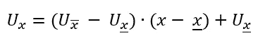

为了获得更多的直觉，让我们扩展上述乘积并重新排列:

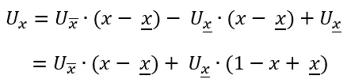

让我们将从采样点𝑥到其右侧相邻点的距离表示为:

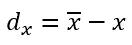

我们也可以改写为:

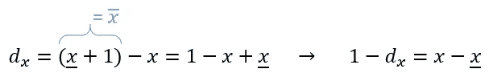

因此，我们得出了最终的公式:

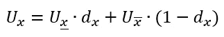

了解如何根据按相反距离加权的相邻点的值来解释线性插值:

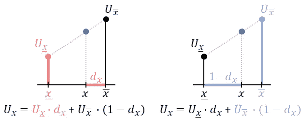

线性插值直觉(作者图像)

# 双线性插值

接下来，我们将把我们的尝试扩展到二维情况。这里我们处理的是一组位于等间距二维网格上的数据点:

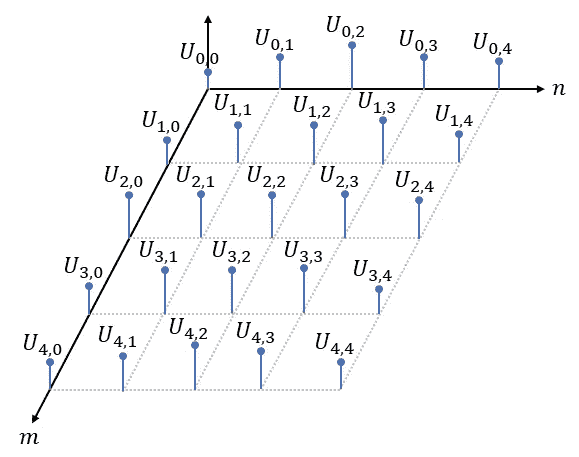

等距二维网格上的数据点(作者图像)

与一维情况一样，非整数位置的值未定义，必须使用插值技术进行估计。

在双线性插值中，我们将平面拟合到最接近的四个(！)采样点周围的相邻点(𝑦、𝑥)，然后查找所需值:

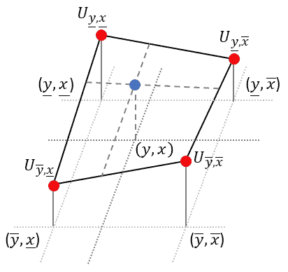

双线性插值(作者图像)

幸运的是，要得到平面方程，我们不需要像上一节那样求解复杂的线性方程组。取而代之的是，我们将对每个点重复应用线性插值(1-D)。我们从上面两点开始，在水平方向应用线性插值。接下来，我们对下面两点做同样的操作。最后，为了获得所需的值，我们对刚刚获得的中间点应用垂直方向的线性插值，参见下面的动画:

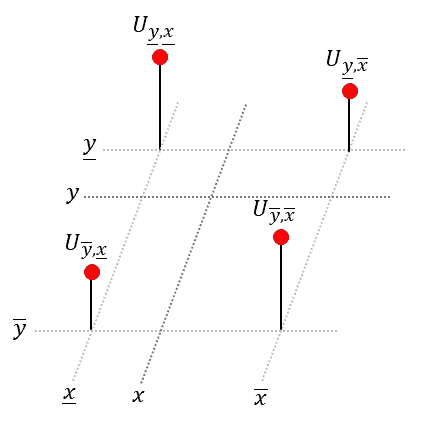

将线性插值扩展为双线性插值(作者图像)

𝑥-dimension:线性插值

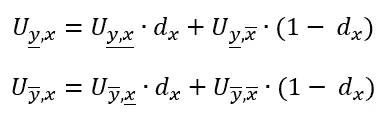

𝑦-dimension:线性插值

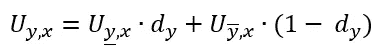

综合起来，我们得到:

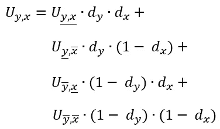

由于对称性，上述两个步骤的顺序是不相关的，即首先在垂直方向上执行线性插值，然后在水平方向上执行，得到完全相同的公式。

双线性插值还有一个很好的几何可视化:要获得所需点的值(蓝色)，我们必须对每个角上的值和对角相对的部分区域的乘积求和:

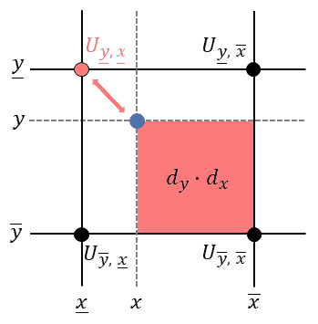

双线性插值直觉(作者图像)

还有另外两种重要的插值技术:最近邻插值和双三次插值。最近邻插值法只是将距离采样点最近的像素复制到输出位置。双三次插值考虑样本点的 16 个邻居，并拟合高阶多项式来获得估计值。

[在教程的下一部分](/spatial-transformer-networks-b743c0d112be)中，我们将解释使用双线性插值的空间变换网络的所有概念。这些概念可以很容易地扩展到更先进的插值技术。

# 参考

[原创论文](https://arxiv.org/pdf/1506.02025.pdf)
[线性插值](https://en.wikipedia.org/wiki/Linear_interpolation)
[双线性插值](https://en.wikipedia.org/wiki/Bilinear_interpolation)