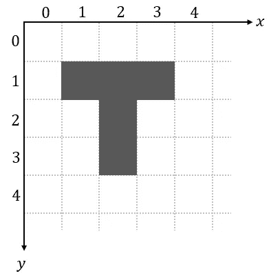
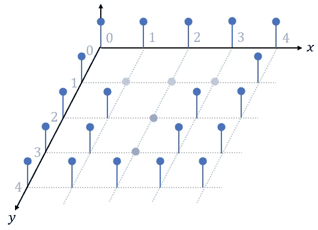
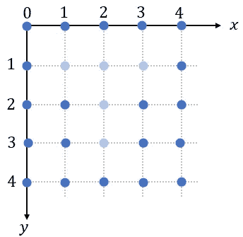
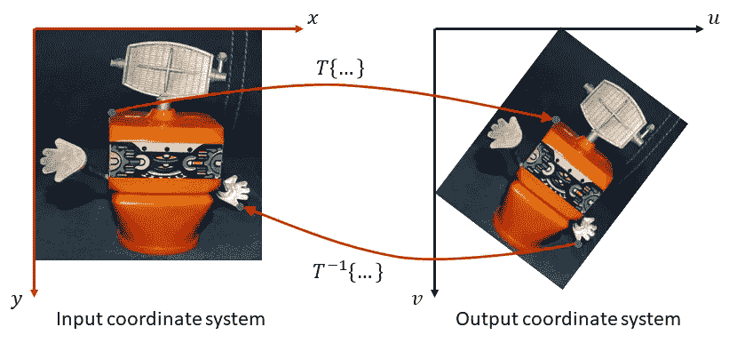
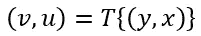
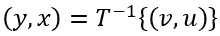
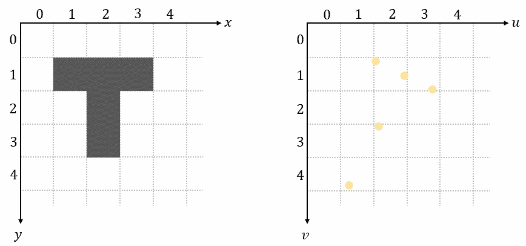
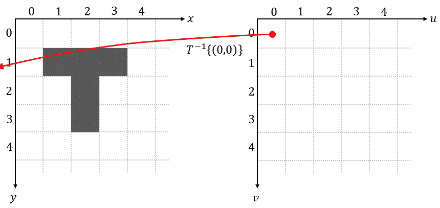

# 空间变压器网络教程，第 1 部分—正向和反向映射

> 原文：<https://towardsdatascience.com/spatial-transformer-tutorial-part-1-forward-and-reverse-mapping-8d3f66375bf5?source=collection_archive---------17----------------------->

## [思想和理论](https://towardsdatascience.com/tagged/thoughts-and-theory)

## 独立的介绍

卷积神经网络具有内在的平移不变性。这使他们能够在测试时正确地对图像进行分类，即使当其组成部分位于训练期间看不到的位置时。然而，细胞神经网络缺乏内在的尺度和旋转不变性:自然图像中最常见的两种变换。由于这种属性不是内建的，所以必须通过一种费力的方式来学习:在训练过程中，所有相关的对象必须以不同的比例和旋转来呈现。以这种方式，网络学习每个尺度和每个方向的冗余特征集，从而实现期望的不变性。因此，CNN 通常非常深，需要大量的训练数据来获得高精度。

空间转换器模块将输入转换为标准姿态，从而简化后续图层中的识别(图片由作者提供)

*空间转换器*模块是一种增加模型空间不变性的流行方法，可以抵抗空间转换，如平移、缩放、旋转、裁剪以及非刚性变形。它们可以被插入到现有的卷积架构中:要么紧跟在输入之后，要么在更深的层中。它们通过自适应地将其输入变换为规范的、预期的姿态来实现空间不变性，从而导致更好的分类性能。单词 adaptive 表示根据输入本身的条件，为每个样本产生适当的变换。可以使用标准的反向传播来端到端地训练空间转换器网络。

在本教程中，我们将涵盖深入理解空间转换器所需的所有先决条件。在这第一篇文章中，我们将介绍正向和反向映射的概念。在[的下一篇文章](/spatial-transformer-networks-tutorial-part-2-bilinear-interpolation-371e1d5f164f)中，我们将深入探讨双线性插值的细节。在第三篇文章中，我们将介绍构成空间转换器模块的所有构件。最后，[在第四篇也是最后一篇](/spatial-transformer-networks-backpropagation-15023fe41c88)中，我们将从头推导所有的反向传播方程。

# 输入数据

空间转换器最常用于图像数据。数字图像由有限数量的称为像素(像素是图片元素的缩写)的小方块组成，这些小方块被组织成行和列。每个像素值代表信息，如强度或颜色。

字母“T”的二进制图像(作者提供的图像)

我们使用𝑦-axis 朝下的坐标系，这是计算机视觉中的常见惯例。

图像数据的主要特征是像素之间的空间关系。像素的空间排列携带了图像内容的关键信息。如果没有其余的像素，单个像素就没有什么意义。

为了清晰起见，在本教程中，我们将经常使用下面的“线图”来可视化图像数据。在该图中，显示了𝑥-axis 和𝑦-axis 的空间位置，以及𝑧-axis.沿线的强度值

相同图像的线图(作者提供的图像)

线图清楚地说明了数字图像的离散性质，像素值仅在等距网格上定义，外部未定义。

每当只有空间信息是重要的时，例如当我们导出空间转换器的梯度时，我们将使用以下自上而下的视图:

线形图的俯视图(图片由作者提供)

有一点要记住:像素值可以是离散的，也可以是连续的。例如，在 8 位灰度图像中，每个像素具有范围在 0 和 255 之间的离散值，其中 0 代表黑色，255 代表白色。另一方面，由卷积层生成的特征图具有连续的像素值。

# 空间变换

空间变换将输入图像中的每个点(𝑥𝑦)移动到输出图像中的新位置(𝑢𝑣)，同时在一定程度上保留邻域中像素的空间关系:

转换概念(图片由作者提供)

基本的空间变换是缩放、旋转、平移和剪切。其他重要的转换类型是投影和映射。

正向变换𝑇{…}将输入空间中的位置映射到输出空间中的位置:

逆变换𝑇-1{…}将输出空间中的位置映射回输入空间中的位置:

# 正向映射

实现空间变换最直接的方法是迭代输入图像的每个像素，使用𝑇{…}计算其在输出图像中的新位置，并将像素值复制到新位置:

正向映射(图片由作者提供)

大多数情况下，新位置(𝑣、𝑢)不会落在输出图像的网格点上(不是整数值)。我们通过给𝑣和𝑢分配最近的整数并使用它们作为输出坐标来解决这个问题。

正向映射有两个主要缺点:重叠和空洞。正如我们在上面的动画中看到的，一些输出像素接收多个输入图像像素，而其他输出像素根本不接收任何输入图像像素。

由于正向映射方法的缺点，实际上使用了一种称为反向映射的不同技术。

# 反向映射

反向映射对输出图像网格上的每个像素进行迭代，使用反向变换𝑇-1{…}来确定其在输入图像中的对应位置，对该位置的像素值进行采样，并将该值用作输出像素:

反向映射(图片由作者提供)

这种方法完全避免了重叠和孔洞的问题。反向映射也是空间转换器中使用的方法。

正如我们在上面的动画中看到的，大多数时候，输入图像中确定的位置(𝑦，𝑥)并不在输入图像的网格上。为了在这些未定义的非整数位置获得输入图像的近似值，我们必须对像素值进行插值。一种称为双线性插值的插值技术将在下一篇文章中介绍[。](/spatial-transformer-networks-tutorial-part-2-bilinear-interpolation-371e1d5f164f)

# 多通道

到目前为止，我们已经展示了使用单通道𝐶=1 对输入进行正向映射和反向映射的原理，例如在灰度图像中遇到的情况。然而，大多数时间输入将具有不止一个通道𝐶 > 1，例如具有三个通道的 RGB 图像或深度学习架构中的特征图，其可以具有任意数量的通道。

扩展很简单:对于多通道输入，对输入的每个通道进行相同的映射，因此每个通道都以相同的方式进行转换。这样，我们可以保持通道之间的空间一致性。请注意，空间变换不会改变通道𝐶的数量，这在输入和输出地图中是相同的。

# 参考

[原创论文](https://arxiv.org/pdf/1506.02025.pdf)
[CNN 的平移不变性](https://www.pyimagesearch.com/2021/05/14/are-cnns-invariant-to-translation-rotation-and-scaling/)
[数据可视化](https://machinelearningmastery.com/time-series-data-visualization-with-python/)
[空间变换](https://blogs.mathworks.com/steve/2006/04/28/spatial-transforms-forward-mapping/)