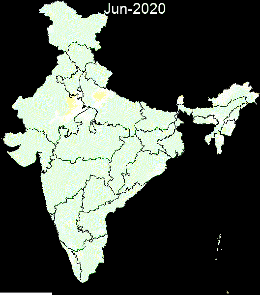

# 季节性干旱的时空制图

> 原文：<https://towardsdatascience.com/spatio-temporal-mapping-of-seasonal-droughts-e471f8cf9dad?source=collection_archive---------32----------------------->

## 如何创建动画 gif 来显示你感兴趣的地区在一段时间内的干旱情况



干旱的时空制图:作者提供的图像

# 介绍

干旱规模和频率的增加经常被认为是气候变化的不利影响之一。干旱是一种气候现象，其特点是由于降水不足而导致水分不足。干旱有三种类型:

1.  **气象**——降水不足导致。印度气象局(IMD)根据降雨量不足分别超过 25%和 50%，将气象干旱分为“中度”和“严重”。
2.  **水文**——长时间的干旱导致地表水和地下水枯竭，造成牲畜和人类用水短缺。
3.  **农业**——作物季节降雨量和土壤湿度不足的情况。

监测干旱很重要，因为它直接关系到粮食安全。有许多指数可以用来量化干旱情况。在这篇博客中，我将演示如何使用 Python 中的开源工具以动画 GIF 的形式呈现干旱的时空变化。

# 2.工作流程

工作流程由以下主要步骤组成:

*   导入库并验证谷歌地球引擎(GEE)。
*   定义感兴趣区域(aoi)。
*   根据观测期间的日降水量栅格创建月复合数据。
*   创建长期的月度复合基线——比如说 10 年。
*   计算每个月的降雨量不足。
*   通过创建镶嵌图，使用矢量边界覆盖的计算赤字图层的 RGB 可视化创建镶嵌图。
*   将每月的马赛克绘制成动画 GIF 的帧。
*   用相应月份标注每一帧并显示 GIF。

我们将从通常的 python 设置和 GEE 初始化开始。

```
import geemap
import eetry:
    ee.Initialize()
except:
    ee.Authenticate()
    ee.Initialize()
```

# 3.数据处理

我们将使用气候灾害小组的红外降水和台站(CHIRPS)降水数据，这些数据在 GEE([https://developers . Google . com/earth-engine/datasets/catalog/UCSB-CHG _ CHIRPS _ DAILY](https://developers.google.com/earth-engine/datasets/catalog/UCSB-CHG_CHIRPS_DAILY))中被同化。这是一个开放的数据集，所有版权都被放弃。它包含从 1981 年开始的 0.05 分辨率卫星图像的每日降雨量数据，这有助于为趋势分析和季节性干旱监测创建网格降雨量时间序列。

正如工作流中所讨论的，我们定义了用于分析和可视化的区域。我们将使用印度的矢量 shapefile，其中包含各邦边界的 GIS 信息。这个 shapefile 在互联网(IGISmap.com、gadm.org、arcgis.com 等)上很容易找到。)并可以通过代码编辑器作为资产上传到 GEE 上。一种更简单的替代方法是使用 FAO-GAUL 数据集，该数据集已经在 GEE 中获取，但需要做出一些努力，以将有争议的地理区域纳入印度领土，从而实现精确制图。

```
# We use the country boundaries from Global Administrative Unit Layers (2015) provided by FAO(UN)
india = ee.FeatureCollection("users/skantbksc/states");# Define the regional bounds for animation frames.
region = india.geometry().bounds();
```

## 3.1 为观察期创建每月合成图像

我们将分析 2020 年的干旱情况。由于干旱主要发生在印度大部分降水发生的季风季节，我们将选择 6 月至 10 月进行分析。

```
# set start date for analysis
startDate = '2020-06-01';# set end date for analysis
endDate = '2020-10-31';#filter the image collection using dates
pptCol = ee.ImageCollection("UCSB-CHG/CHIRPS/DAILY")\
        .filterDate(startDate, endDate)\
        .select('precipitation');# Setting year and month as a property of every image which will later be used to form monthly composites
def set_yymm(img):
    return img.set('yymm', img.id().slice(0,6))pptCol = pptCol.map(set_yymm)# Define a list of unique observation months from the image collection.
yymmList = ee.List(pptCol.aggregate_array('yymm')).distinct().sort();# Function to sum up the daily precipitation data of each month 
def groupByMonth(yymm):
    pptMonth = pptCol.filterMetadata('yymm', 'equals', yymm)\
                .sum()\
                .clip(india)\
                .set('yymm', yymm);
    return pptMonth# Map the function over the list of months to build a collection of monthly image composites.
pptMonthList = yymmList.map(groupByMonth);pptByYYMM = ee.ImageCollection.fromImages(pptMonthList);
```

使用`pptCol.size().getInfo()`和`pptByYYMM.size().getInfo()`可以检查到，原始每日采集和计算每月采集中的图像数量分别为 152 和 5。

## 3.2 基线月度综合数据的计算

```
# We use 10 year data to construct a baseline figure 
baseCol = ee.ImageCollection("UCSB-CHG/CHIRPS/DAILY")\
        .filterDate('2000-01-01','2010-01-01')\
        .select('precipitation');# Create a list of months
months = ee.List.sequence(1, 12);# Function to find the average monthly precipitation
def avgByMonth(m):
    img = baseCol.filter(ee.Filter.calendarRange(m,m, 'month')).sum().divide(10).clip(india);
    return img.set('mm',ee.Number(m).format('%02d'));# Map over the list of months to build a collection of long term average monthly precipitation composites
baseMonthCol = ee.ImageCollection.fromImages(months.map(avgByMonth))
```

## 3.3 降雨量不足的计算

```
# Compare the monthly composites against the corresponding baseline to arrive at the deficit figuresdef calc_deficit(img):

    mm = ee.String(img.get('yymm')).slice(4,6); 
    base = baseMonthCol.filterMetadata('mm','equals',mm).first();
    deficit = base.subtract(img).divide(base).set('yymm', img.get('yymm'));
    return deficit;deficitByMonth = pptByYYMM.map(calc_deficit);
```

## 3.4 移除干旱区域进行分析

由于许多干旱地区降水很少，由于分母效应低，它们的赤字百分比可能很高。我们将把这些像素的不足百分比设置为零。如果该地区的年降雨量少于 500 毫米，我们将把该地区划分为干旱地区。

```
# Remove deficit of arid areas from visualisation. We define an area as arid if its annual rainfall is less than 500mm.baseAnnualCol = baseMonthCol.sum();notArid = baseAnnualCol.gt(500);def arid_rem(img):
    return img.multiply(notArid);deficitByMonth = deficitByMonth.map(arid_rem);
```

# 4.测绘

下一步是可视化这 5 张图片，它们是`deficitByMonth`图片集的一部分。作为参数提供的调色板在最小和最大不足值之间线性插值颜色。我们设置可视化图像的参数，使黄色和红色像素分别代表中度和严重干旱条件。

```
# Define RGB visualization parameters.
visParams = {
    'min' : 0,
    'max' : 1,
    'palette': ['e6ffe6','ffffff', 'fff633', 'fc0703']
};
```

创建印度各州的轮廓很重要，这样干旱像素就可以通过州边界来描绘。我们将创建干旱层的 RGB 可视化，并在每个层上叠加州边界，从而创建一个马赛克。首先，我们创建地图轮廓。

```
# Create an empty image into which to paint the features.
transparent = ee.Image();
empty = ee.Image.cat([transparent, transparent,transparent]);# Select and (optionally) rename bands.
empty = empty.select(
    ['constant', 'constant_1', 'constant_2'], #old names
    ['vis-red', 'vis-green', 'vis-blue']  #new names
);# Paint all the polygon edges with the same number and width, display.
outline = empty.paint(
    featureCollection = india,
    color = 1,
    width = 1);
```

接下来，我们创建一个干旱的 RGB 图像表示的镶嵌图，然后是地图轮廓，按此顺序。这个顺序很重要，因为否则地图轮廓就看不见了。我们创建一个函数`rgb_fc_mosaic`来做这件事，并把它映射到`defictByMonth`中的图像集合上。

```
def rgb_fc_mosaic(img):
    #Create RGB visualization images for use as animation frames.
    imgRGB = img.visualize(**visParams).clip(india)
#   Mosaic the visualization layers and display (or export).
    mosaic = ee.ImageCollection([imgRGB, outline]).mosaic()
    return mosaicrgbVis = deficitByMonth.map(rgb_fc_mosaic);
```

生成动画的最后一步是设置动画帧的参数和它显示图像的速度。我们将为`getVideoThumbURL`函数提供必要的参数，并将其映射到`rgbVis`图像集合上。

```
# Define GIF visualization parameters.
gifParams = {
  'region': region,
  'dimensions': 600,
  'crs': 'EPSG:3857',
  'framesPerSecond': 1
};# Print the GIF URL to the console.
print(rgbVis.getVideoThumbURL(gifParams));
```

一旦动画 GIF(drugal _ in . GIF)准备就绪，我们将在 GIF 的每一帧上添加月份信息。这可以使用`geemap`包的`add_text_to_gif`功能轻松完成。

```
import pandas as pd
text = pd.date_range(startDate, endDate, 
              freq='MS').strftime("%b-%Y").tolist()# Add the months information on each frame of GIFin_gif = 'C:\\Users\\ADMIN\\Desktop\\satellite\\geemap\\images\\drought_in.gif'out_gif = 'C:\\Users\\ADMIN\\Desktop\\satellite\\geemap\\images\\drought_out.gif'geemap.add_text_to_gif(in_gif, out_gif, xy = ('40%', '0%'), text_sequence = text, font_size=30, font_color = '#ffffff',duration = 1000)
```

您可以使用`show_image`功能在 Jupyter Notebook 中可视化带注释的 GIF。

```
geemap.show_image(out_gif)
```

# 5.结论

动画 gif 是表现天气时空变化的非常有用的工具。这些视觉工具以一种吸引读者并易于理解的方式表达了价值千言万语的信息。在这篇博客中，我演示了如何使用 GEE 中的开放数据和 python 中的开源工具创建动画 gif 来捕捉干旱条件随时间的变化。

*免责声明:本博客表达的观点是个人观点。*

# 参考

*   吴(2020)。geemap:一个 Python 包，用于与 Google Earth 引擎进行交互式地图绘制。《开放源码软件杂志》，5(51)，2305 页。[https://doi.org/10.21105/joss.02305](https://doi.org/10.21105/joss.02305)
*   [https://developers . Google . com/earth-engine/guides/feature _ collections _ visualizing](https://developers.google.com/earth-engine/guides/feature_collections_visualizing)
*   [https://developers . Google . com/earth-engine/guides/image _ visualization](https://developers.google.com/earth-engine/guides/image_visualization)
*   [https://www . nrsc . gov . in/sites/default/files/pdf/ebooks/Chap _ 13 _ agriculturedraughtmonitoring . pdf](https://www.nrsc.gov.in/sites/default/files/pdf/ebooks/Chap_13_AgricultureDroughtMonitoring.pdf)