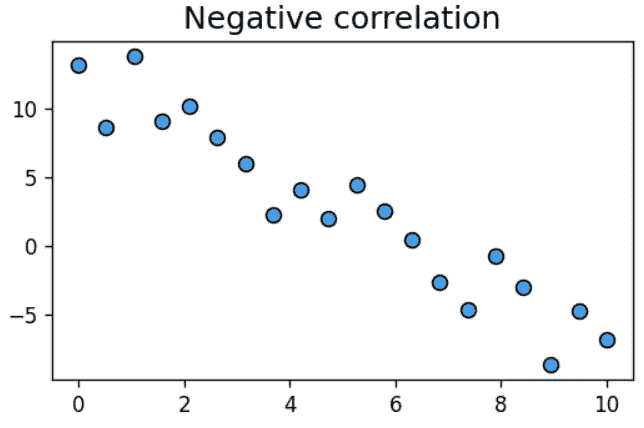
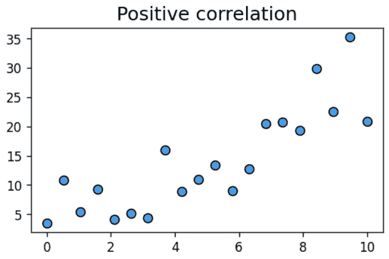
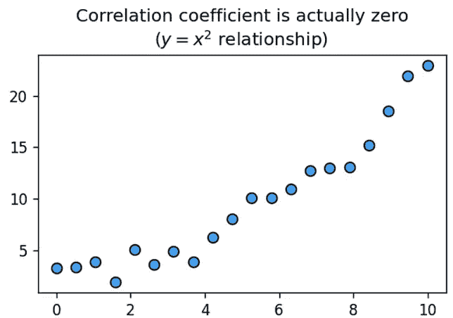
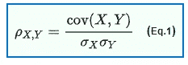
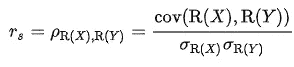
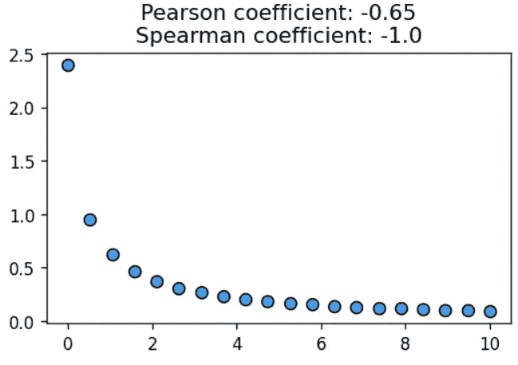

# Spearman 系数:广义相关分析的工具

> 原文：<https://towardsdatascience.com/spearman-coefficient-tool-for-a-generalized-correlation-analysis-d15b70d4ff1e?source=collection_archive---------32----------------------->

## 线性关系并不是相关性分析所能揭示的全部。我们讨论基于等级的相关性，这种相关性更加普遍和有效。

# 超越线性关系

是常见的数据科学面试问题。

> 比方说， *y* = *x* +噪声，你画出 *y* 对 *x* 并试着确定相关系数。会是什么呢？

如果你说的不是零分，大多数面试官不会给你分数。在大多数情况下，相关性这个词会引起变量之间的线性或线性关系的概念。

这里有一个直观的例子说明我的意思。



图片来源:作者创作

这种线性概念来自统计分析或数据科学中最广泛使用的特定相关系数的定义，即[皮尔逊系数](https://en.wikipedia.org/wiki/Pearson_correlation_coefficient)。

它以著名的英国统计学家卡尔·皮尔逊的名字命名，



其中 cov( *X* ， *Y* )是两个随机变量 *X* 和 *Y* 的协方差，分母由它们的标准差的乘积组成。


**卡尔·皮尔逊，图片来源:** [**维基媒体**](https://en.wikipedia.org/wiki/Karl_Pearson#/media/File:Karl_Pearson,_1912.jpg) **，免费媒体使用**

皮尔逊系数足以进行一阶分析，但会受到异常值的影响，无法处理定义的非线性。因此，有必要超越线性相关分析。

对于这样的广义相关性分析，还有一些工具。其中，斯皮尔曼系数是最容易理解和计算的。在本文中，我们将讨论这一点。

# 斯皮尔曼系数

Spearman 系数是一个[等级相关性](https://en.wikipedia.org/wiki/Rank_correlation)(两个随机变量的[等级](https://en.wikipedia.org/wiki/Ranking)之间的[统计相关性](https://en.wikipedia.org/wiki/Correlation_and_dependence)的度量)。它是以英国心理学家查尔斯·斯皮尔曼的名字命名的，他以因素分析和其他贡献而闻名。

那么，这和我们熟悉的正则相关系数有什么不同呢？斯皮尔曼系数是不同的，因为它不仅仅是关于原始数值，而是关于排名。

## 什么是等级？

那么，什么是等级呢？这里是[维基百科的定义](https://en.wikipedia.org/wiki/Ranking)，

*一个* ***排名*** *是一组条目之间的关系，使得对于任何两个条目，第一个要么“排名高于”、“排名低于”，要么“排名等于”第二个。*

取两组数字——1，2，3 和 10，24，102。这些集合之间的精确数字关系可能看起来很奇怪，但如果我们只考虑它们的排名，它们在“一对一”的意义上非常相似。*每组中的第二个数大于第一个数，小于第三个数。从这个角度来看，两组是相同的*。相对顺序很重要，而不是实际的数值。

这两个集合的皮尔逊(线性)相关系数可以完全不同于 1。但是斯皮尔曼系数将是一个完美的 1。

遵循类似皮尔逊系数的公式，它由下式给出:



唯一的区别是，所有原始数值都被它们的等级值(即，第 1、第 2、第 3、第 50 百分位等的顺序值)所取代。).

## Python 的一个例子

使用 Scipy 库，计算两组一维或二维数组的 Spearman 系数非常简单。

让我们用一个典型的例子来展示这两种类型的相关性之间的明显区别，

```
import numpy as np, matplotlib.pyplot as plt
import scipy.stats as statx = np.linspace(0,10,20)
y = np.log(1+1/(x+0.1))pearson = stat.pearsonr(x,y)
spearman = **stat.spearmanr(x,y)**
```

如果我们检查它们的值，它们将分别是-0.65 和-1.0。这是视觉表现，



图片来源:作者创作

为什么斯皮尔曼系数是完美的-1.0？因为两个数组的排列顺序完全相同。只要基础函数遵循单调(递增或递减)顺序，这将是正确的。显然，生成函数是高度非线性的(对数的倒数)，但这不会影响 Spearman 系数。

## Spearman 系数对异常值更稳健

如果我们将一些随机异常值引入到如上所述的相同阵列中，我们将会看到 Spearman 系数对于这些异常值更加稳健，因为等级顺序受到的干扰比实际数值小得多。这是一个带有异常值的样本结果。


图片来源:作者创作

皮尔逊系数受到异常值的干扰(从-0.65 到-0.79)，但是斯皮尔曼系数几乎没有变化(从-1.0 到-0.99)。

# 摘要

在本文中，我们讨论了 Spearman 系数，它相当于更广泛使用的 Pearson 系数，但用于相关数组的排序。这是更广义的相关性分析的一个特例，它着眼于与两个随机变量可以假定的数字数组或数值集相关联的多级属性。

在许多情况下，可以使用超出线性皮尔逊系数的方法，例如在存在异常值的情况下，或者当排序比原始数值更值得分析时。在这种情况下，像斯皮尔曼系数这样的概念对数据科学家来说将会派上用场。

喜欢这篇文章吗？成为 [***中等会员***](https://medium.com/@tirthajyoti/membership) *继续* ***无限制学习*** *。如果您使用下面的链接，* ***，我将收取您的一部分会员费，而不会对您产生额外费用*** *。*

[](https://medium.com/@tirthajyoti/membership) [## 通过我的推荐链接加入媒体

### 作为一个媒体会员，你的会员费的一部分会给你阅读的作家，你可以完全接触到每一个故事…

medium.com](https://medium.com/@tirthajyoti/membership)