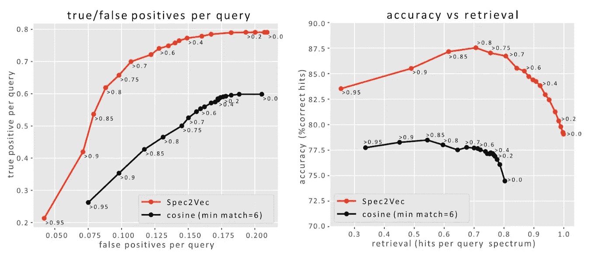

# Spec2Vec:质谱相似性度量的下一步

> 原文：<https://towardsdatascience.com/spec2vec-the-next-step-in-mass-spectral-similarity-metrics-b79c3db7511a?source=collection_archive---------37----------------------->

## Spec2Vec 使用无监督的机器学习模型从 MS/MS 质谱预测结构相似性

来源:作者

计算两个 MS/MS 质谱之间的相似性是大多数无目标代谢组学工作流程中的重要步骤。

然而，人们早就知道余弦相似性——最流行的相似性度量——有明显的弱点。

Justin van der Hooft 和他的团队开发了一种计算光谱相似性的新方法:Spec2Vec。这对于分析生物标志物发现或天然产物研究中的非靶向代谢组学结果非常有帮助。

让我们看看 Spec2Vec 是如何工作的，以及为什么它是余弦相似性的一个很好的替代品。

# 为什么质谱相似性度量很重要

最初，非目标代谢组学数据集中的数据点只是一个被测量的实体。我们还不知道它可能是什么分子。因此，我们不能解释它的意义:它是新的东西吗？它的代谢功能是什么？

但是如果你能把这个实体与一个数据库相匹配，比如人类代谢组数据库，那么你就可以给这个实体添加(注释)重要的信息。为了匹配你的测量和数据库中的条目，你需要**一个相似性度量**。

这就是质谱相似性度量的主要用途:

*   **光谱库匹配**:将化合物与光谱库(如 HMDB)进行匹配。
*   **模拟搜索**:在一个大的光谱库中寻找最佳匹配，寻找结构相关的分子。
*   **质谱网络**:在质谱网络中聚类相关化合物。

任何错误都可能代价高昂:如果你找不到匹配，那么你的化合物可能看起来是一个令人兴奋的新药候选物，而实际上，它是一个众所周知的分子；如果你只是在研究的后期才发现这一点，那么你就浪费了很多努力。

你的相似性度量越好，这样的错误就越少发生。

# 余弦相似性的缺点

余弦相似性测量一个质谱**与另一个质谱**重叠的程度。如果两个质谱有近乎完美的重叠，那么余弦相似性就很高——它们的分子结构很可能非常相似。

然而，有时你会有质谱不重叠的结构相似的分子——在这种情况下，余弦相似性可能会失败。这是如何发生的:

1.  **多处修饰的大分子:**大分子——常见于植物和微生物中——可以很容易地对其分子结构进行几次小的修饰。
2.  **几个片段被移位:**如果你将一个有几个修饰的分子片段化，那么不是一个，而是它的几个片段也保留一个修饰。结果，质谱上的几个碎片峰移动。
3.  **很少有峰完全重叠:**如果大量片段发生位移，整个光谱就不再与未修饰的分子整齐重叠。
4.  **低余弦相似度:**就余弦相似度(重叠)而言，两个分子因此看起来不相关，你会看到低余弦值。
5.  **错误结论:**结果，你可能认为一个库没有与你的化合物相似的分子，而事实上它有。这可能会引发你发现了一种新分子的结论，尽管你所发现的只是一种描述良好的分子的轻微修改。

这是一个众所周知的问题，但在 Spec2Vec 之前，还没有提出根本上替代的质谱相似性度量作为解决方案。

# Spec2Vec:光谱相似性的无监督学习

Spec2Vec 的基础是一个强大的新假设:如果两个碎片峰经常在数千个质谱中同时出现，那么这可能是因为它们来自同一个分子亚结构。

所以这两个峰值在某种程度上是相关的。现在，如果你在一个分子中只看到这些峰中的一个，而在另一个分子中看到另一个，你可以猜测，同样的亚结构，可能有小的改变，在两个分子中都存在。

学习峰之间的关系允许 Spec2Vec 识别两个光谱是相似的——即使它们的光谱在几个地方没有重叠。来源:作者

Spec2Vec 恰恰实现了这一思想。但是在大规模上，Spec2Vec 获取了成千上万质谱的数据集，并且**从该数据集学习**哪些峰是相关的。然后就可以用 Spec2Vec 学到的东西来计算任意两个质谱之间的光谱相似度。

如果这行得通，那么一个有一些小修饰的分子——就像前面的例子一样——应该不会骗过 Spec2Vec。现在，这有用吗？

# 比较 Spec2Vec 和余弦相似度

我们来看两个测试的结果。为了测试，我们使用了来自 GNPS 的大型分子库，其中包含分子结构和它们的光谱。

# 测试 1:spec 2 vec 分数与结构相似性的相关性如何？

首先，您需要一个基本事实来比较 Spec2Vec 和余弦相似性。贾斯汀和他的团队选取了 12797 种独特的化合物，利用它们已知的分子结构，直接计算出每对分子的结构相似性得分(Tanimoto score)。

对于每个相同的对(总共 81，875，206 对)，他们还计算了余弦、修正余弦和 Spec2Vec 得分，但这一次，只使用了库谱，而不是已知的结构。这是结果:

*   **Spec2Vec 与结构相似性的相关性更好**；
*   只有当光谱几乎完全重叠时，所有指标的表现才会相似。

Spec2Vec 在其得分最高的光谱对中发现了更多高度相似的结构(通过 Tanimoto 评分衡量)。来源:作者

Spec2Vec 与结构相似性(Tanimoto 得分)的高度相关性非常有希望，但这是否转化为更好的文库匹配？

# 测试 2:spec 2 vec 能在库搜索中找到正确的匹配吗？

在第二次测试中，贾斯汀的团队从光谱库中选择了 1000 个独特的分子，这些分子在库中也有至少四个平面结构等价物(这些在 2D 看起来相同)。这些近乎等价的分子留在了文库中。

接下来的任务是弄清楚具有相同 2D 结构的分子是否会得到最高的相似性分数。

结果与第一个测试一致:同样， **Spec2Vec 在所有分数范围内发现了比余弦相似度更可靠的匹配**。

在所有得分范围内，Spec2Vec 的命中率比余弦相似性的命中率高得多。来源:作者

但是 Spec2Vec 更有优势。

# Spec2Vec 要快得多

余弦相似性计算在质谱上非常昂贵，因为它们需要预处理。它们非常昂贵，以至于通常无法对整个大型数据库进行比较。

Spec2Vec 模型一旦经过训练，速度极快:大约比余弦相似性评分快 100 倍。即使将训练 Spec2Vec 模型的时间包括在内，总的来说仍然快 10 倍左右(不考虑余弦相似性方面的任何可能的优化)。

这意味着使用 Spec2Vec，您可以轻松地对大型库运行所有对所有的搜索，而没有任何限制。

Spec2Vec 并不难实现，尽管它是一种更高级的相似性评分方法。

# 如何将 Spec2Vec 集成到您的工作流程中

你可以用一个易于使用的 Python 开源包来实现 Spec2Vec，这个包可以在 Github:【https://github.com/iomega/spec2vec上免费获得。您可以用 Anaconda(推荐)或 pip 安装它。

您甚至可以从 Zenodo 下载用于上述测试的预训练 Spec2Vec 模型[。而且不用训练自己的模型也可以计算质谱相似度。](https://zenodo.org/record/4173596#.YDRdT2puft0)

**> >重要注意事项** : Spec2Vec 是一种无监督算法。这意味着你可以在任何一组 MS/MS 谱图上训练它，而不需要任何额外的信息。

# 这仅仅是开始

Spec2Vec 是一种很好的方法，可能很容易扩展:

*   **GC-MS** :到目前为止，Spec2Vec 只在 LC-MS 数据上进行了测试。这对于 GC-MS 研究可能更有价值，因为在 GC-MS 测量中，您不能通过根据前体离子的相似性进行预过滤来限制库搜索。
*   **有监督**:spec 2 vec 没有监督真是太好了。但是你也可以建立一个监督模型:例如，你可以训练一个模型，直接从光谱嵌入中预测 Tanimoto 分数。这可能会给你更精确的模型。
*   **改进的 Mass2Motifs** : Spec2Vec 矢量嵌入有可能被用来训练更强大的 Mass2Motifs。
*   **改进的网络注释传播(NAP)** :相似性得分在构建质谱网络中至关重要，因此如果 Spec2Vec 产生更多有用的网络，它也可以改进您的注释并加快结构解析。

总的来说，目前使用余弦结构相似性的任何工具都可能受益于集成 Spec2Vec 作为替代的相似性度量。

# 进一步阅读

如果您想了解更多关于 Spec2Vec 的信息:

*   **试试** [**Spec2Vec python 包**](https://github.com/iomega/spec2vec/tree/master/spec2vec)**；**
*   在 [GNPS](https://gnps.ucsd.edu/) 内试用 Spec2Vec
*   阅读 [Spec2Vec 论文](https://journals.plos.org/ploscompbiol/article?id=10.1371/journal.pcbi.1008724)；和
*   查看弗洛里安·胡伯的 [Spec2Vec 教程](https://blog.esciencecenter.nl/build-a-mass-spectrometry-analysis-pipeline-in-python-using-matchms-part-ii-spec2vec-8aa639571018)。

# 将机器学习应用于组学研究需要帮助吗？

我们可以帮助您的研究团队为可重复且易于部署的机器学习模型建立合适的基础设施。刚刚[取得联系](https://datarevenue.com/en-contact)。