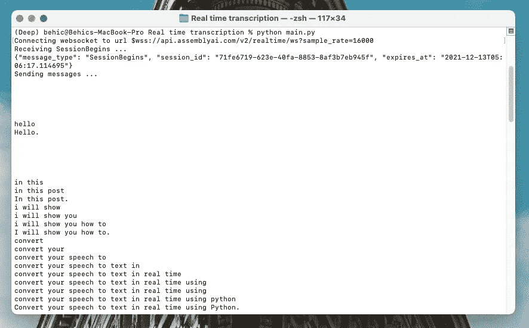
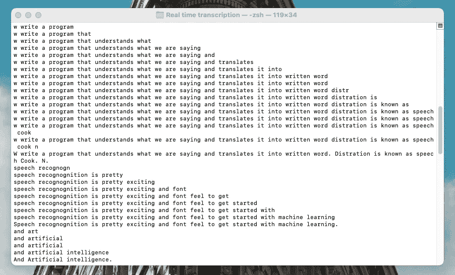

# 使用 Python 实现实时语音识别

> 原文：<https://towardsdatascience.com/speech-recognition-in-real-time-using-python-fbbd62e6ff9d?source=collection_archive---------4----------------------->

## 现场转录分步指南


[真诚媒体](https://unsplash.com/@sincerelymedia?utm_source=unsplash&utm_medium=referral&utm_content=creditCopyText)在 [Unsplash](https://unsplash.com/s/photos/microphone?utm_source=unsplash&utm_medium=referral&utm_content=creditCopyText) 上拍摄的照片

在这篇文章中，我将向你展示如何使用 Python 将你的演讲实时转换成文本。我们将编写一个程序，理解我们所说的话，并将其翻译成书面文字。这种翻译被称为语音识别。对于机器学习和人工智能来说，语音识别是一个非常令人兴奋和有趣的领域。

在我之前的帖子中，我已经讨论过类似的主题，比如[使用谷歌的语音识别 API](/building-a-speech-recognizer-in-python-2dad733949b4) 将语音转换为文本，以及[使用 Python](/building-a-speech-emotion-recognizer-using-python-4c1c7c89d713) 构建语音情感识别器。在这些项目中，识别和训练是通过静态音频文件完成的。今天，我们将在这个项目中做一些更先进、更非凡的事情。我们将学习如何实时地将我们的语音转换成文本。

如果你准备好了，让我们开始工作吧！

## 目录

*   ***入门***
*   ***第一步——库***
*   ***第二步——直播***
*   ***第三步—异步功能***
*   ***最后一步——测试实时识别器***

# 入门指南

在今天的教程中，我们将使用 AssemblyAI 的[实时转录 API](https://docs.assemblyai.com/overview/real-time-transcription) 。作为一名软件工程师和技术爱好者，很高兴看到语音识别领域正在飞速发展。我相信这些发展正使我们的生活变得更容易。

例如，实时转录可以有所帮助的一个领域是在线讲座。在听导师讲课的同时，我们也可以把导师的讲话当字幕来读。这一功能将使听力障碍者的学习过程更加容易。这只是一个基本的例子；我确信有许多领域可以实现实时转录。

顺便说一下， [AssemblyAI 的 API](https://www.assemblyai.com/) 是免费访问的。创建帐户后，您将获得一个唯一的 API 密钥。我们需要这个 API 密匙来使用服务和特性。

# 步骤 1 —库

我们将在这个项目中使用三个 Python 库。它们可以列举如下:PortAudio、PyAudio 和 Websockets。以下是它们的简短定义。

**PortAudio** 是一个免费、跨平台、开源的音频输入/输出库。这也是让后续库 *PyAudio* 工作的先决条件库。

[公文](http://www.portaudio.com/)。

PyAudio 是一个免费的开源库，可以在各种平台上播放和录制音频文件。这个库是 PortAudio 的扩展。

[官方文件](https://people.csail.mit.edu/hubert/pyaudio/docs/)。

**Websockets** 是建立在 asyncio 之上的依赖项，asyncio 是 Python 的标准异步 I/O 框架。它提供了一个优雅的基于协程的 API。

[官方文件](https://websockets.readthedocs.io/en/stable/)。

让我们开始安装它们。

我们将在终端窗口中运行以下代码行。要安装 PortAudio，我们必须使用名为 brew 的 python 库管理器。

```
brew install portaudio
```

之后，是时候安装另外两个库了。这次我们使用另一个 python 库管理器 pip。您知道我们可以在一行代码中安装一个或多个库吗？

```
pip install pyaudio websockets
```

# 步骤 2 —实时流

我们的图书馆已经安装好了。是时候准备好流媒体系统了！

是时候打开我们的编码平台，开始编码了。我们的代码是静态的，所以我将使用 Atom 文本编辑器。整个代码将在一个 python 文件中。易于运行。

```
import pyaudio

FRAMES_PER_BUFFER = 3200
FORMAT = pyaudio.paInt16
CHANNELS = 1
RATE = 16000
p = pyaudio.PyAudio()

stream = p.open(
   format=FORMAT,
   channels=CHANNELS,
   rate=RATE,
   input=True,
   frames_per_buffer=FRAMES_PER_BUFFER
)
```

在上面的代码中，我们定义了流系统的参数。说到细节，音频世界真的很复杂。我建议在网上搜索每一个变量，以便更好地理解它们。

# 步骤 3 —异步功能

在这一步，我们将编写一个*异步*函数，用 API 发送和接收音频数据。异步函数在主题[协程和任务](https://docs.python.org/3/library/asyncio-task.html)下。

用异步语法声明的协同程序是编写 asyncio 应用程序的首选方式。因为我们希望实时地传输语音，所以这是一个很好的方法，可以在终端窗口中显示识别出的单词，但需要等待一段时间。

## 发送和接收音频数据

首先，让我们导入 python 库。

```
import websockets
import asyncio
import base64
import json
from configure import auth_key
```

现在，我们将编写一个函数，我将其命名为: *send_receive_data(* )。在这个函数中发生了许多事情:

*   将程序连接到 AssemblyAI 的端点 url。
*   音频数据被传输到 API 进行识别。
*   API 返回一个 json 数据和识别的语音。

这基本上是一条双向高速公路，我们通过笔记本电脑的麦克风发送语音数据。然后，从 API 接收识别的语音。一切都发生得太快了。

是不是很酷？你猜怎么着，没有高峰时间:)

```
# the AssemblyAI endpoint we're going to hit
URL = "wss://api.assemblyai.com/v2/realtime/ws?sample_rate=16000"

async def send_receive_data():
   print(f'Connecting websocket to url ${URL}')
   async with websockets.connect(
       URL,
       extra_headers=(("Authorization", "our API key"),),
       ping_interval=5,
       ping_timeout=20
   ) as _ws:
       await asyncio.sleep(0.1)
       print("Receiving SessionBegins ...")
       session_begins = await _ws.recv()
       print(session_begins)
       print("Sending messages ...")
       async def send():
           while True:
               try:
                   data = stream.read(FRAMES_PER_BUFFER)
                   data = base64.b64encode(data).decode("utf-8")
                   json_data = json.dumps({"audio_data":str(data)})
                   await _ws.send(json_data)
               except websockets.exceptions.ConnectionClosedError as e:
                   print(e)
                   assert e.code == 4008
                   break
               except Exception as e:
                   assert False, "Not a websocket 4008 error"
               await asyncio.sleep(0.01)

           return True

       async def receive():
           while True:
               try:
                   result_str = await _ws.recv()
                   print(json.loads(result_str)['text'])
               except websockets.exceptions.ConnectionClosedError as e:
                   print(e)
                   assert e.code == 4008
                   break
               except Exception as e:
                   assert False, "Not a websocket 4008 error"

       send_result, receive_result = await asyncio.gather(send(), receive())
```

## 环

*send_receive_data()* 函数全部设置完毕！

现在，让我们把它放在一个循环中，这样我们的程序就能连续不断地听到我们的声音。由于我们不想让它永远运行，所以有一个超时，也就是 1 分钟。阿辛西奥会为我们做这件事。

```
asyncio.run(send_receive_data())
```

# 最后一步—测试实时识别器

在终端中运行 main.py 后，程序开始监听。并在那一刻显示识别的语音。我看了这篇文章的引言部分，下面是结果。



作者截图。



作者截图。

恭喜你。在本实践教程中，我们学习了如何使用 Python 构建一个程序来检测我们的语音并将其实时转换为文本。我喜欢创建和从事这些项目，因为它们是机器学习和人工智能在我们日常生活中的自然应用。希望你喜欢阅读本指南，并在今天学到一些新东西。

> 我是[贝希克·居文](https://medium.com/u/a073b4360020?source=post_page-----fbbd62e6ff9d--------------------------------)，我喜欢分享关于编程、教育和生活的故事。[订阅](https://lifexplorer.medium.com/membership)我的内容，保持灵感。泰，

如果你想知道我写的是什么样的文章，这里有一些:

*   [使用 Python 构建人脸识别器](/building-a-face-recognizer-in-python-7fd6630c6340)
*   [分步指南—用 Python 构建预测模型](/step-by-step-guide-building-a-prediction-model-in-python-ac441e8b9e8b)
*   [使用 Python 构建语音情感识别器](/building-a-speech-emotion-recognizer-using-python-4c1c7c89d713)