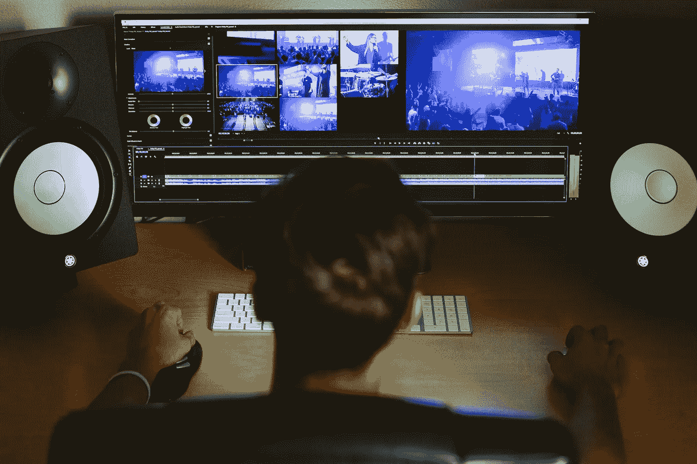
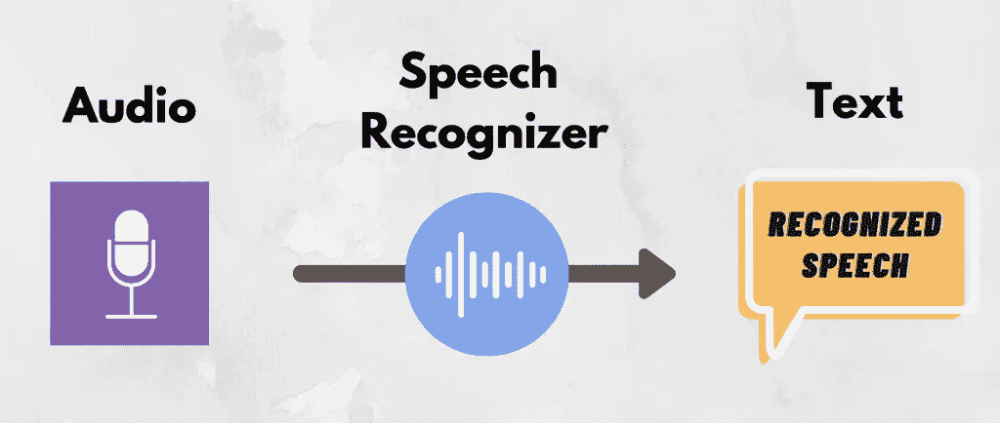
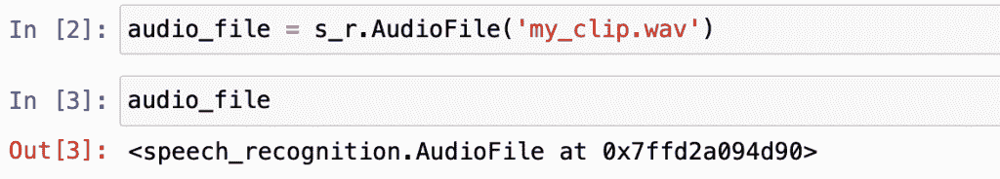
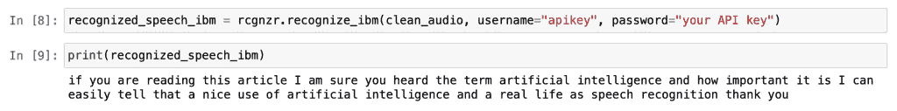

# 使用 IBM 的语音到文本 API 的语音识别

> 原文：<https://towardsdatascience.com/speech-recognition-using-ibms-speech-to-text-api-9956254c46d4?source=collection_archive---------39----------------------->

## 使用 Python 从音频记录中轻松提取对话



Avel Chuklanov 在 [Unsplash](https://unsplash.com/s/photos/video-editing?utm_source=unsplash&utm_medium=referral&utm_content=creditCopyText) 上拍摄的照片

在本文中，我们将学习如何使用 IBM 的语音转文本 API 从音频记录文件中识别语音。我们将使用 API 的免费版本，它可能有一些限制，例如音频长度限制。我将在本文后面分享更多关于 API 的细节。让我先给你一些关于语音识别在我们日常生活中使用的背景信息。

## 背景

如果你正在阅读这篇文章，我肯定你听说过“*人工智能*”这个术语及其重要性。我可以很容易地看出，人工智能在现实生活中的良好应用是语音识别。

从音频中识别语音基本上允许我们通过说话而不是打字来节省时间。这使得使用我们的科技产品变得更加有趣和容易。这项技术还帮助我们无需编写一行代码就能与这些设备进行交互。想象一下，人们必须知道编程才能向 Alexa 或 Siri 发出命令。那太疯狂了。😊



作者设计

我迫不及待地想向您展示实际运行的语音识别器。我们开始工作吧。下面是我们在这个语音识别项目中将遵循的步骤。

## 目录:

*   语音识别云服务
*   步骤 1 —图书馆
*   步骤 2-导入音频剪辑
*   步骤 3 —定义识别器
*   步骤 4 —语音识别器的作用
*   最后一步—导出结果

# 语音识别云服务

许多大型科技公司都有自己的认可模式。我将在这里分享其中的一些给你看大图。这些 API 通过云工作，只要有互联网连接，就可以从全球任何地方访问。此外，它们大多数是付费服务，但可以免费测试。例如，微软通过 Azure 云账户提供为期一年的免费访问。

以下是一些最受欢迎的语音转文本云服务:

*   [谷歌云](https://cloud.google.com/speech-to-text)
*   [IBM 沃森](https://www.ibm.com/cloud/watson-speech-to-text)
*   [微软 Azure](https://azure.microsoft.com/en-us/services/cognitive-services/speech-services/)
*   [亚马逊转录](https://aws.amazon.com/transcribe/)

# 步骤 1 —图书馆

对于这个项目，我们将只需要一个库。这就是演讲认知。SpeechRecognition 是免费和开源的。它支持多种语音识别引擎和 API。如；微软 Azure 语音、谷歌云语音、IBM Watson 语音转文本 API 等等。对于这个项目，我们将测试 IBM Watson 语音转文本 API。您可以从[这里](https://github.com/Uberi/speech_recognition)随意查看 SpeechRecognition 软件包的源代码和文档。

让我们从安装包开始。我们将使用 pip，它是一个 Python 库管理器。

```
pip install SpeechRecognition
```

安装过程完成后，我们可以打开代码编辑器。也可以用 Jupyter 笔记本。

```
import speech_recognition as s_r
```

# 步骤 2-导入音频剪辑

我用电脑录了一份语音备忘录。它是 *m4a* 格式的，但是识别器不能识别 *m4a* 格式的。这就是为什么我必须把它转换成 *wav* 格式。

```
audio_file = s_r.AudioFile('my_clip.wav')
```



作者图片

# 步骤 3 —定义识别器

在这一步，我们要做的就是定义语音识别器。前面，我们已经导入了库。现在，我们将创建一个新变量，并将识别属性赋给它。

```
rcgnzr = s_r.Recognizer()
```

# 步骤 4 —语音识别器的作用

表演时间到了！我们将在音频文件中运行 IBM 的语音转文本。在运行识别器之前，我将继续运行名为“ *adjust_for_ambient_noise* ”和“ *record* ”的其他函数，这将清除一些噪声并优化音频。这样，我们的识别器将能够返回更准确的结果。

```
with audio_file as source: 
   rcgnzr.adjust_for_ambient_noise(source) 
   clean_audio = rcgnzr.record(source)
```

太好了，现在我们有更清晰的录音了。现在，让我们继续运行 IBM 的语音识别器。(我花了几个小时才弄明白 IBM 语音转文本 API 是如何与 SpeechRecogniton python 库集成的)。下面是从 API 调用识别器的最佳方式:

```
recognized_speech_ibm = rcgnzr.recognize_ibm(clean_audio, username="apkikey", password= "your API Key")
```

**注意:**没有 API 键，IBM 的 API 就无法工作。这就是为什么我们需要从 IBM Watson 页面获取一个。我已经创建了一个帐户来测试这个语音到文本的模型。我喜欢 IBM 模型的一点是，我仍然可以使用 lite 帐户每月录制 500 分钟，这对学习来说绰绰有余。

# 最后一步—导出结果

我们差不多完成了。是时候检查结果了。我们的识别器在上一步中检测到了音频文件中的语音。我们将继续检查它是如何工作的。如果我们对结果满意，我们将把结果导出到一个文本文档中。

为了检查识别的语音，让我们打印出识别的变量:

```
print(recognized_speech_ibm)
```



作者图片

看起来不错。它对我的录音做了很大的认可。我在读这篇文章中的一段。如果您对结果不满意，有许多方法可以预处理音频文件以获得更好的结果。[这是一篇很好的文章，向](/speech-recognition-in-python-the-complete-beginners-guide-de1dd7f00726)展示了关于语音识别以及如何提高识别器预测能力的更详细的信息。

现在，我将把识别的语音导出到一个文本文档中。我们将看到消息“*准备好了！*“出口完成后，在我们的码头。

```
with open('recognized_speech.txt',mode ='w') as file:    
   file.write("Recognized Speech:") 
   file.write("\n") 
   file.write(recognized) 
   print("ready!")
```

恭喜你。！如果您正在阅读这一段，那么您已经完成了语音识别器的构建。希望你喜欢这个实践教程，并在今天学到一些新东西。练习编程技能的最好方法是做有趣的项目。我已经分享了很多像这样的实践项目。如果您在实施该计划时有任何问题，请随时[联系我](https://sonsuzdesign.blog)。

> 我们来连线。查看我的[博客](https://medium.com/@lifexplorer)和 [youtube](https://www.youtube.com/behicguven) 以获得灵感。谢谢你，

## 为您提供更多动手项目:

</building-a-chatbot-in-python-the-beginners-guide-2743ad2b4851>  </adding-text-on-image-using-python-2f5bf61bf448> 