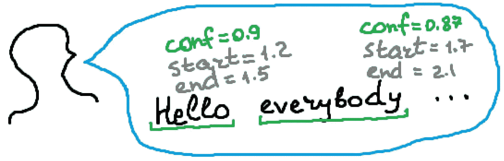
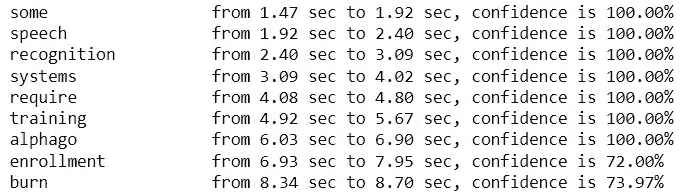

# 带有时间戳的语音识别

> 原文：<https://towardsdatascience.com/speech-recognition-with-timestamps-934ede4234b2?source=collection_archive---------8----------------------->

## 使用 Python 和 vosk API 进行离线和免费语音识别

带时间戳的语音识别。作者图片

在这篇文章中，我将告诉你如何使用 Python 实现带有时间戳的**离线语音识别。以下示例中的代码将允许您识别音频文件并获得置信度、每个单词的开始和结束时间**、超过 15 种语言、**离线**和免费。****

**我将使用 [vosk API](https://alphacephei.com/vosk/) 。参见下面的文章，了解如何设置 vosk 库。在本文中，您还可以找到无需时间戳即可进行离线语音识别的代码。**

** [## 离线外语语音识别

### 如何为免费和离线的外国(非英语)语音识别设置 Python 库

medium.com](https://medium.com/@andimid/offline-foreign-speech-recognition-32d8d63de2dc) 

首先，安装库并下载模型。

**重要提示** —音频必须为 **wav 单声道**格式。如果你的音频文件以不同的格式编码，用一些免费的在线工具如 [this](https://audio.online-convert.com/convert-to-wav) 将它转换成 wav 单声道。

# Vosk 的输出数据格式

Vosk 模型以 JSON 格式输出结果。语音识别的最终结果是`results`变量，它是 JSON 字典的列表。该列表的每个元素具有以下结构:

第一个元素`result` —也是一个 JSON 字典列表。这个变量实际上代表一个句子，并包含一个句子中每个单词的四个变量*:置信度、开始和结束时间以及识别的单词。*

第二个元素，`text`组合了程序确定为句子的所有已识别单词。它可以用于简单的语音识别，如上文所述。

为了方便起见，我创建了一个简单的`Word`类，它以那种格式表示一个单词。除了用于实例化类的`__init__`方法之外，它只有一个打印对象的方法。我们以后会用到它。

# 程序的本质

一旦我们得到了`results`变量，我们只需要遍历它包含的列表来获得我们需要的信息。

该程序输出以下内容:

程序的结果。作者图片

我使用了与上一篇文章相同的音频文件。在这里，我从维基百科上的一篇[语音识别文章中读到了一段文字。具体来说，这里识别的短语是:“某些语音识别系统需要训练(也称为“注册”)，其中…”。](https://en.wikipedia.org/wiki/Speech_recognition)

在上面的代码示例中，我保持了大纲的简单。对于可靠的、防御性的编程，我建议增加对文件存在和 vosk 模型、文件格式等的检查。在[git lab repo](https://gitlab.com/Winston-90/foreign_speech_recognition/-/tree/main/timestamps)中有更详细评论的完整程序。

 [## 时间戳主 Dmytro Nikolai ev/foreign _ speech _ recognition

### 使用 Python、vosk、SpeechRecognition / Pocketsphinx 进行免费的离线外语(非英语)语音识别

gitlab.com](https://gitlab.com/Winston-90/foreign_speech_recognition/-/tree/main/timestamps) 

# 感谢您的阅读！

*   我希望这些材料对你有用。[在 Medium](https://medium.com/@andimid) 上关注我，获取更多类似的文章。
*   如果您有任何问题或意见，我将很高兴得到任何反馈。在评论里问我，或者通过 [LinkedIn](https://www.linkedin.com/in/andimid/) 或者 [Twitter](https://twitter.com/dimid_ml) 联系。
*   为了支持我作为一个作家，并获得数以千计的其他媒体文章，使用[我的推荐链接](https://medium.com/@andimid/membership)获得媒体会员资格(不收取额外费用)。**