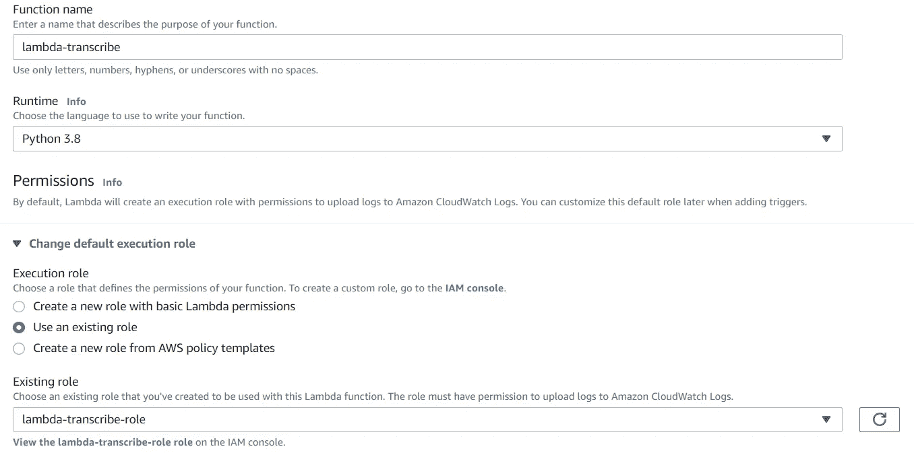

# 使用 AWS 转录、S3 和 Lambda 将语音转换为文本

> 原文：<https://towardsdatascience.com/speech-to-text-using-aws-transcribe-s3-and-lambda-a6e88fb3a48e?source=collection_archive---------5----------------------->

## 使用 AWS 转录、S3、Lambda 进行语音到文本转换，并使用 SNS 和 CloudWatch 事件输出通知。


Miguel Henriques 在 [Unsplash](https://unsplash.com/s/photos/speech?utm_source=unsplash&utm_medium=referral&utm_content=creditCopyText) 上拍摄的照片

peech to text 是将音频转换成文本的过程。对于计算机软件和程序，音频文件几乎不可能用于可视化/分析或以有意义的方式从中获取数据。因此，需要将这些音频文件转换为文本，然后才能用于分析和收集数据。虽然在当前的技术世界中，语音转文本似乎非常简单，但它涉及许多语言模型和算法，以提供接近 100%的准确性。

目前，有许多由软件提供商创建的工具，他们创建了自己的模型和算法来提供这种语音到文本的服务。在本文中，我将介绍 AWS 提供的一种名为 **AWS 转录**的语音转文本服务。

## 自动气象站转录

AWS Transcribe 是由 Amazon Web Services 提供的语音到文本解决方案，它以非常快速和高准确性而闻名。AWS Transcribe under the hood 使用了一个名为 ASR(自动语音识别)的深度学习过程，来快速、更准确地将音频转换为文本。它内部也有一个名为 Amazon Transcribe Medical 的独立服务，也用于医疗文档应用程序。

AWS 转录有一个创建良好的 API，程序可以自动将音频文件转换为文本文件的转录工作。但是，一旦您开始一个转录工作，因为它可能需要时间取决于文件，AWS 转录不会发送输出在同一个请求作为响应。因为我们需要连续轮询来检查转录作业是否完成，或者我们需要某种事件触发器来识别作业的状态。在这篇文章中，我们将探讨两种这样的事件触发器，它们将使得从头到尾自动转录成为可能。下面是我们将在本文中完成的内容的简要概述。

*   创建两个 S3 存储桶，作为 AWS 转录的输入存储桶和输出存储桶。
*   使用 python 创建一个 Lambda 函数，以在新文件上传到输入 S3 存储桶时触发 AWS 转录。
*   使用 S3 事件完成转录后，发送一封包含转录作业详细信息的电子邮件。
*   使用 CloudWatch 事件完成转录后，发送一封包含转录作业详细信息的电子邮件。


整体架构

*   场景一—使用 S3 事件发送电子邮件
*   场景二—使用云监控事件发送电子邮件

以上是我们在本文中试图实现的总体架构。我们可以选择场景一或场景二来接收电子邮件通知。现在没有更多的解释，让我们深入实现。将按以下顺序在 AWS 中创建以下服务。

*   Lambda 触发转录的 IAM 角色
*   λ函数
*   输入和输出 S3 存储桶
*   社交网络话题

## 为 Lambda 函数创建具有转录权限的 IAM 角色

因为我们的 Lambda 函数将代表我们自己触发 AWS 转录，所以我们需要允许 Lambda 函数调用转录服务。为此，让我们创建一个新的 IAM 角色，它将被我们的 Lambda 函数使用。

转到 IAM 仪表板，选择创建一个角色，并作为 AWS 服务，选择 Lambda。


接下来，从策略中为我们的 IAM 角色选择以下两个策略。

*   **CloudWatchLogsFullAccess**
*   **amazontranscribefullacess**

接下来，提供一个角色名称并创建新角色。


## 为触发转录作业创建 Lambda 函数

接下来，让我们创建 Lambda 函数，当我们上传一个新文件到我们的输入 S3 桶(我们将在下一步创建)时，它将触发 AWS 转录。

转到 Lambda 仪表板并创建函数。选择 Python 作为运行时，并在执行角色上选择我们在上面创建的角色。



将下面给出的代码复制到 lambda 函数。代码解释如下。

当 Lambda 功能被触发时，将遵循以下步骤。

*   该功能将由 S3 事件触发。因此，首先我们将提取 S3 存储桶和触发事件的文件的详细信息。
*   接下来，我们将创建一个转录 API 所需的作业名称。为了保持唯一性，我们将 UUID 附加到文件名的末尾。
*   接下来，我们用所需的参数调用 **start_transcription_job** 。这里对于 **OutputBucketName，**我们需要指定我们接下来要创建的输出 S3 存储桶。因此，现在您可以完全删除该字段。

## 创建输入 S3 桶和 S3 事件以触发 Lambda 函数

接下来，让我们开始创建我们的 S3 桶。我们将创建两个存储桶，首先，让我们创建我们的输入存储桶，我们的音频文件将被上传到这里。


创建 S3 存储桶后，转到属性和事件通知。这里是我们配置 S3 事件的地方，每当一个新的对象被添加到这个桶中时，它就触发我们创建的 Lambda 函数。

单击创建事件通知，然后提供一个名称。在事件类型上，选择所有对象创建事件。这将确保在上传新对象、对现有对象进行重命名或者将新对象直接复制到存储桶时创建一个事件。


对于目的地，选择我们创建的 Lambda 函数。现在，这将确保无论何时在这个桶中创建新文件，我们的 Lambda 函数都将被触发，从而触发 AWS 转录。


## 创建输出 S3 存储桶并授予写权限

现在让我们开始创建我们的输出 S3 桶，从我们的自动气象站转录的结果将是可用的。这里我们需要提供对 lambda 函数的写访问，这样它就可以在这个桶上写输出结果。首先，创建一个新的 S3 存储桶。


然后，我们首先需要创建一个新策略，指定对此 S3 存储桶的写访问权限。转到 IAM 控制面板并导航到策略。然后点击 Create Policy，选择 JSON 并添加下面的策略。


```
{
    "Version": "2012-10-17",
    "Statement": [
        {
            "Action": [
                "s3:PutObject"
            ],
            "Resource": [
                "arn:aws:s3:::transcribe-output-tutorial/*"
            ],
            "Effect": "Allow"
        },
        {
            "Action": [
                "s3:ListBucket"
            ],
            "Resource": [
                "arn:aws:s3:::transcribe-output-tutorial"
            ],
            "Effect": "Allow"
        }
    ]
}
```

接下来，为了授予我们为 Lambda 创建的写入 S3 存储桶的角色。为此，再次返回到我们之前创建的 Lambda 角色，并将这个新创建的策略附加到它。


**最后一步，确保编辑我们创建的 Lambda 函数，将 OutputBucketName 作为我们现在创建的新 S3 存储桶名称。该名称应该只是没有任何前缀的存储桶名称。(例如:-转录-输出)**

现在，我们配置了所有需要的组件，而没有输出通知电子邮件。让我们首先试着测试配置，以检查我们的系统目前是否工作正常。转到输入 S3 桶，上传一个 mp4 文件到我们的输入桶。如果一切顺利，如果你去转录仪表板和转录作业下，你应该看到一个由我们的 Lambda 函数触发的新作业。


几分钟后，状态将变为 completed，我们将看到输出。也检入输出文本对象的输出 S3 存储桶。如果一切正常，让我们进入下一步。

让我们继续，一旦转录作业完成，就触发电子邮件通知。我们将介绍两种实现这一点的方法，使用 S3 事件和 CloudWatch 事件。但是对于这两者，我们需要先创建一个 SNS 主题。

## 创建社交网络话题

转到 SNS 仪表板并创建一个主题。作为类型选择标准。


接下来，如果我们要使用 S3 事件，我们需要授予 S3 存储桶访问该主题的权限。为了做到这一点，在 AccessPolicy 下，在策略的末尾添加以下行。

```
{
      "Sid": "s3",
      "Effect": "Allow",
      "Principal": {
        "Service": "s3.amazonaws.com"
      },
      "Action": "SNS:Publish",
      "Resource": "{YOUR_SNS_TOPIC_ARN}"
    }
```


现在我们可以完成主题的创建了。接下来，我们需要为这个主题创建一个订阅，它将使用电子邮件协议。

点击创建订阅并选择协议为电子邮件。


请确保在输入您的电子邮件后通过您的电子邮件确认订阅。

既然我们的 SNS 主题已经创建，让我们继续尝试实现场景一，即使用 S3 事件触发发送电子邮件。

## AWS S3 事件触发器

主要思想是每当 AWS 转录服务上传一个新文件到我们的输出 S3 桶时，触发我们的 SNS 主题。要做到这一点，首先去我们的输出 S3 桶。转到 properties 并创建 even notifications，就像我们对输入桶所做的那样。


事件类型将与输入桶相同，而这次的目的地将是 SNS 主题。


现在，当 AWS 转录输出输出结果到我们的桶，我们将自动收到一封电子邮件。您可以通过重命名当前在我们的输入桶中的对象来尝试这一点。现在转录完成后，它被上传到我们的输出 S3 桶你会收到一封电子邮件。

## 使用 CloudWatch 事件

场景二是使用 CloudWatch 事件触发电子邮件。当转录作业启动时，AWS transcriptor 开始向 CloudWatch 发送事件。因此，这里的概念是每当转录完成时，使用这些 CloudWatch 事件创建一个触发器。首先让我们来看看 AWS CloudWatch、事件和规则。

点击创建规则。这里我们需要定义一个规则，当我们的转录作业进入完成状态或失败状态时，我们需要一个触发器。

```
{
  "source": [
    "aws.transcribe"
  ],
  "detail-type": [
    "Transcribe Job State Change"
  ],
  "detail": {
    "TranscriptionJobStatus": [
      "COMPLETED",
      "FAILED"
    ]
  }
}
```


作为目标添加我们的 SNS 话题。接下来，通过命名来创建规则。

现在尝试重命名或添加一个新对象到我们的输入 S3 桶，最后，我们会收到一封电子邮件通知转录作业的状态。(如果您已经在同一主题中添加了 S3 事件，请确保将其删除，否则会触发两封电子邮件。)

这就是本文的全部内容。在 AWS 转录完成一项工作后，我们可以通过许多其他方式来触发事件。但我会让你自己找到解决方法。如果你想了解更多关于 AWS 转录以下是文件。感谢您阅读这篇文章和快乐编码😁😁😁

[https://docs.aws.amazon.com/transcribe/index.html](https://docs.aws.amazon.com/transcribe/index.html)