# 机器学习的速度立方

> 原文：<https://towardsdatascience.com/speed-cubing-for-machine-learning-4bf90170e2ee?source=collection_archive---------44----------------------->

## 第 3 集:使用多 GPU、Dask 和 CuPy


布莱斯·巴克在 [Unsplash](https://unsplash.com?utm_source=medium&utm_medium=referral) 拍摄的照片

# 介绍

《机器学习的速度立方》前情提要……

在第 1 集**【1】中，我们描述了如何使用 CPU、多线程和云资源，尽可能快地生成 3D 数据，以最终养活一些生成性对抗网络。我们达到了每秒 20 亿个数据点的速度。**

**在第 2 集[2]中，我们使用了一个本地 GPU，一个名为 *RAPIDS* 的框架，以及 *CuPy* 和 *VisPy* 等库。我们的速度甚至更快，几乎达到了每秒 50 亿个数据点！**

**在这最后一集，我们仍将关注速度，但这一次，我们将在**几个 GPU**的帮助下执行*实际计算*。**

# **技术设置**

**所有实验都将通过 JupyterLab 笔记本电脑在云中实例化的虚拟机(VM)上进行。该虚拟机具有 16 个英特尔至强 vCPUs @ 2.30GHz、60 GB 内存和 8 个 NVIDIA Tesla K80 GPUs(图 1)。虚拟机预先配置了所有必要的 NVIDIA 驱动程序和 CUDA 11.0 工具包。操作系统是 Linux (Debian 4.19 64 位)，安装了 Python 3.7。**

**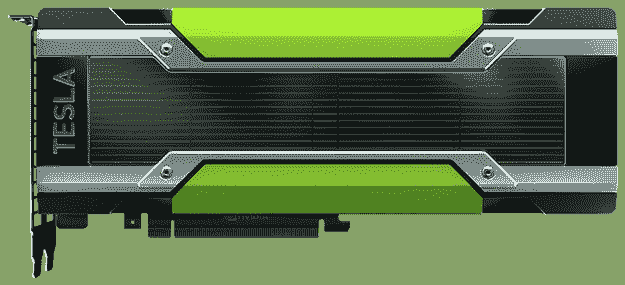**

****图一** : NVIDIA Tesla K80，24GB GDDR5，4992 个 CUDA 核心(来源:nvidia.com)。**

**我们还需要以下额外的图书馆/包:**

*   ****Dask**:Python 中并行计算的开源库[3]。使用命令`python -m pip install "dask[complete]"` *进行安装。***
*   ****CuPy** :用 NVIDIA CUDA 加速的开源阵列库[4]。它相当于 GPU 的 NumPy。使用命令`pip install cupy-cuda110`进行安装(以匹配我们的 CUDA 版本)。**
*   ****Dask CUDA** :由*rapidsai*【5】托管的实验性开源库，帮助多 GPU 系统中 Dask workers 的部署和管理。使用命令`pip install dask-cuda`进行安装。**

**安装完成后，我们可以像这样导入库:**

```
**import** dask.array **as** da
**import** cupy
**from** dask_cuda **import** LocalCUDACluster
**from** dask.distributed **import** Client
```

# **我们开始吧！**

**我必须承认，成功运行多 GPU 数值模拟是一段不平凡的旅程。事实上，大多数在线材料都专注于专门用于加速深度学习模型训练的内置方法。然而，当计算在这个框架之外执行时，我缺乏完整的文档。此外，多 GPU 计算比多 CPU 计算更棘手:内存分配和数据管理可能难以处理。这就是达斯克的用武之地。**

# **存储数据:Dask 数组**

**Dask 数组协调许多数组(在 API 中足够“像 NumPy ”,比如 CuPy 数组),在一个网格中排列成块(图 2)。将大数组分割成许多小数组，可以让我们使用所有内核在比可用内存更大的数组上执行计算。Dask 数组受益于多维*阻塞* *算法*和*任务* *调度*。**

**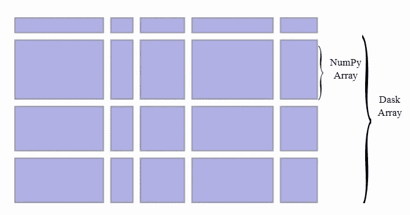**

****图 2**:Dask 阵列的结构。**

# **第一个实验:单 CPU**

**我们首先生成一个二维 Dask 数组，其中的数据是从高斯分布中抽取的随机样本。我们将平均值设为 10，标准差设为 1。分布大小是 sz=100000，块大小是 ch=10000。这导致一个 80 GB 的 Dask 数组包含 100 个块，每个块是一个 800 MB 的 numpy 数组。当您在笔记本中打印 Dask 数组时，Dask 会自动显示数据的图形表示以及有关其体积、形状和类型的信息(图 3)。这个过程完全是“懒惰”的，这意味着还没有数据被加载到内存中。请注意，dask 需要执行 100 个任务来创建 Dask 数组。**

**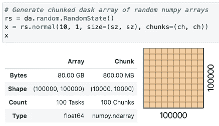**

****图 3** :分块随机 **numpy** 数组的 Dask 数组。**

> **对于我们的基准测试，我们希望执行下面的简单计算:**获取数据的一个子集，将所有值递增 1，然后计算平均值**。**

**图 4 显示了我们将要计算平均值的子集的信息。我们可以看到，Dask 现在需要执行 300 个任务来获得该子集，这是一个 20GB 的 Dask 数组，有 100 个块，每个块是一个 200 MB 的 numpy 数组。**

**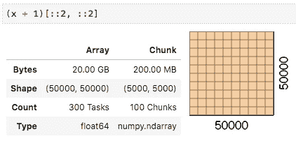**

****图 4** :原始数据子集(类型为 **numpy.ndarray** )。**

**现在，实际的计算可以使用`.compute()`方法来完成。我们还将调度器参数指定为`'single-threaded'`，因此 Dask 将在一个**单 CPU** 上执行任务。整个过程用时 **11 分 41 秒。**最终值与预期值接近(1.0e-5)移动平均值(图 5)。**

**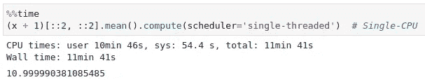**

****图 5** :单个 CPU 上的计算:耗时 701 秒。**

# **第二个实验:多 CPU**

**在 Dask 中，从单个 CPU 到多个 CPU 非常简单:您所要做的就是将调度器的参数改为`'threads'`。这样，Dask 将使用所有可用的内核来执行并行计算(图 6)。这一次，使用我们 VM 的 **16 核**，只需要 **55 秒**就可以完成任务。计算出的平均值仍然接近(1.7e-5)预期值 11(图 7)。**

**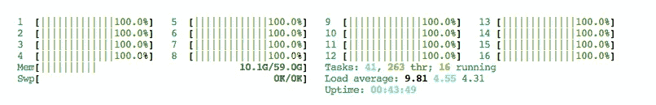**

****图 6** :运行中的 16 个内核(*使用‘htop’*命令)。**

**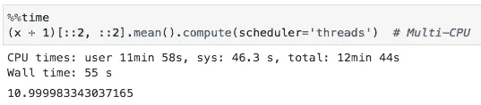**

****图 7**:16 核计算:耗时 55 秒。**

# **第三个实验:单个 GPU**

**从 CPU 切换到 GPU 非常容易。只需要知道一个小技巧，这就是 CuPy 库的用武之地。在第 2 集[2]中，我们将我们的 numpy 数组移动到我们的 GPU 设备中(我们将这个操作称为*数据* *传输*)。这里我们用参数`cupy.random.RandomState`直接在随机状态下指定数组的类型。因此，我们告诉 Dask，我们使用 cupy 数组而不是 numpy 数组，以确保计算将在 GPU 上完成(图 8)。同样，这是一个“懒惰”的操作，还没有数据被加载到视频存储器中。**

**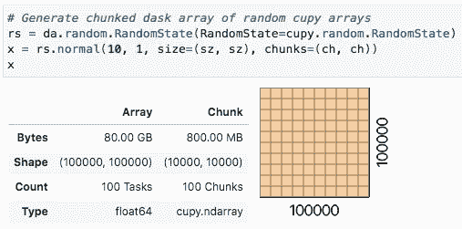**

****图 8** :分块随机 **cupy** 数组的 Dask 数组。**

**子集完全相同，只是块的数据类型发生了变化，现在是 *cupy.ndarray* 而不是之前的 *numpy.ndarray* (图 9)。**

**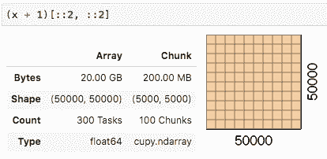**

****图 9** :数据子集(类型为 **cupy.ndarray** )。**

**对于实际计算，使用第一个实验中的相同调度程序参数(单个 CPU)。在一个**单 GPU** 上，它需要将近 **12 秒**，因此几乎比 16 个内核快 4.6 倍。计算出的平均值仍然很好(1.8e-5)(图 10)。**

**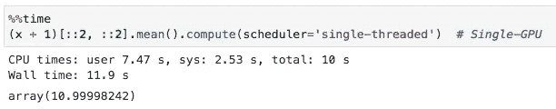**

****图 10** :单个 GPU (1x Tesla K80)上的计算:几乎需要 12 秒。**

# **第四个实验:多 GPU**

**对于最后这个实验，我们首先必须定义一个支持 GPU 的集群，这就是 Dask CUDA 库的用武之地。我们从 Dask CUDA 库中导入`LocalCUDACluster`,并设置参数`CUDA_VISIBLE_DEVICES`,这样我们就可以选择特定的 GPU。然后，我们为该集群构建一个**分布式客户端**(图 11)。总而言之，Dask 创建了两个对象:**

*   ****集群**:由 8 个 workers 和 8 个 cores 组成(都是我们的 GPU)。**
*   ****客户端**:通过本地 url 访问(此处[*http://127 . 0 . 0 . 1:8787/status*)](http://127.0.0.1:8787/status))。您可以使用一个非常丰富的仪表板来监控整个过程。**

**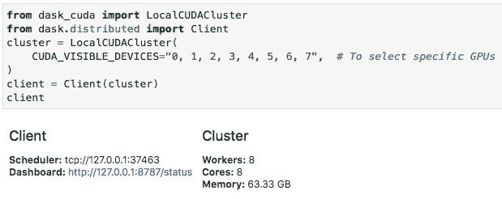**

****图 11** :本地 CUDA 集群及其 DASK 分布式客户端。**

**从那里，我们可以像以前一样执行相同的表达式(不需要在这里指定 scheduler 参数)。最后， **8 个 GPU**上的计算非常快，花费**不到 2 秒**，因此与单个 GPU 相比**加速了 6.26 倍**。计算的平均值也非常接近(2.2e-6)预期值(图 12)。**

**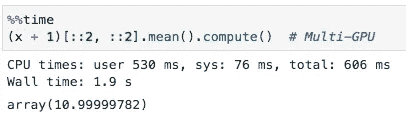**

****图 12** :使用全套 GPU(**8x**Tesla K80)的计算:仅需 2 秒。**

**图 13 描述了我们全套 GPU 的 GPU 活动。实际上，谷歌云实际上将特斯拉 K80 的显存分成了两半。这就是为什么我们只有 12 GB 的可用内存，而不是 24 GB。这也意味着我们“只”拥有每个 GPU 2496 个 CUDA 核心。**

**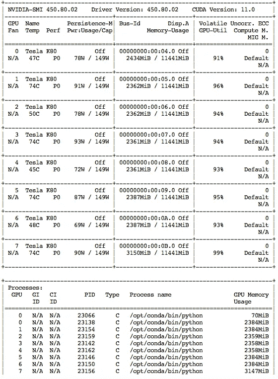**

****图十三**:特斯拉 k80 正在摇滚。**

# **结论**

**通过 Dask 阵列上的简单数值模拟，我们从使用单个 CPU 的几乎 **12 分钟**的计算时间，到在 8 特斯拉 K80 GPUs 上的几乎 **2 秒**的闪电般速度，因此有了**360 倍的加速比**！计算时间的巨大增长并不是以准确性为代价的。这些实验在很大程度上受到了来自 Matthew Rocklin 的帖子的启发，他是 Dask 的最初作者，现任 Coiled computing 的首席执行官。我们希望能够在使用多 GPU 系统执行更复杂的任务之前，重现简单方法的速度结果，例如我们正在处理的生成模型的快速训练。多 GPU 计算乍一看似乎令人生畏，但使用正确的工具时，它会变得非常容易。**

**我们的三部曲到此结束，希望你喜欢，我会很快回来的。**

# **感谢**

**我要感谢[克里斯托夫](https://medium.com/u/8dd41142f97f?source=post_page-----4bf90170e2ee--------------------------------)、[马特奥](https://medium.com/u/e77161de2cb4?source=post_page-----4bf90170e2ee--------------------------------)、[菲利普](https://medium.com/u/4b708f6ba2df?source=post_page-----4bf90170e2ee--------------------------------)和[佩瑟瓦尔](https://medium.com/u/7227db78307a?source=post_page-----4bf90170e2ee--------------------------------)在本研究实现过程中给予的支持，以及他们对本文草稿的反馈。**

# **参考**

**[1] [N. Morizet，“机器学习的速度立方—第 1 集”，走向数据科学，2020 年 9 月 15 日。](/speed-cubing-for-machine-learning-a5c6775fff0b)
【2】[n . Morizet，《机器学习的速度立方——第二集》，迈向数据科学，2020 年 11 月 20 日。](/speed-cubing-for-machine-learning-8d32a40aa474)
【3】[Dask:Python 中并行计算的开源库](https://dask.org/)。
【4】[CuPy:用 NVIDIA CUDA 加速的开源阵列库。](https://cupy.dev/)
[【5】Dask CUDA:一个实验性的开源库，帮助多 GPU 系统中 Dask workers 的部署和管理。](https://github.com/rapidsai/dask-cuda)
【6】[m . Rocklin，“GPU Dask 数组，第一步把 Dask 和 CuPy 扔在一起”，matthewrocklin.com，2019。](https://blog.dask.org/2019/01/03/dask-array-gpus-first-steps)**

# **关于我们**

**[**Advestis**](https://www.advestis.com/) 是一家欧洲合同研究组织(CRO)，对统计学和可解释的机器学习技术有着深刻的理解和实践。Advestis 的专长包括复杂系统的建模和时间现象的预测分析。
*领英*:[https://www.linkedin.com/company/advestis/](https://www.linkedin.com/company/advestis/)**