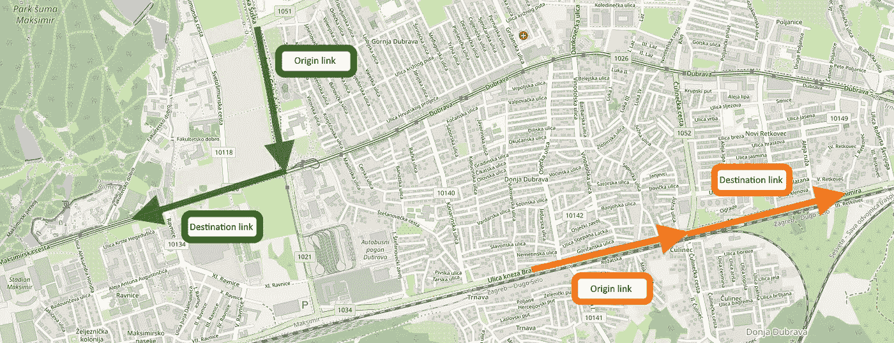
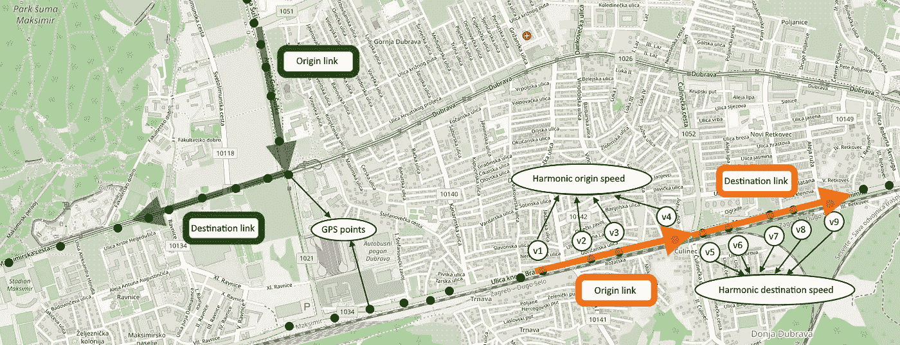
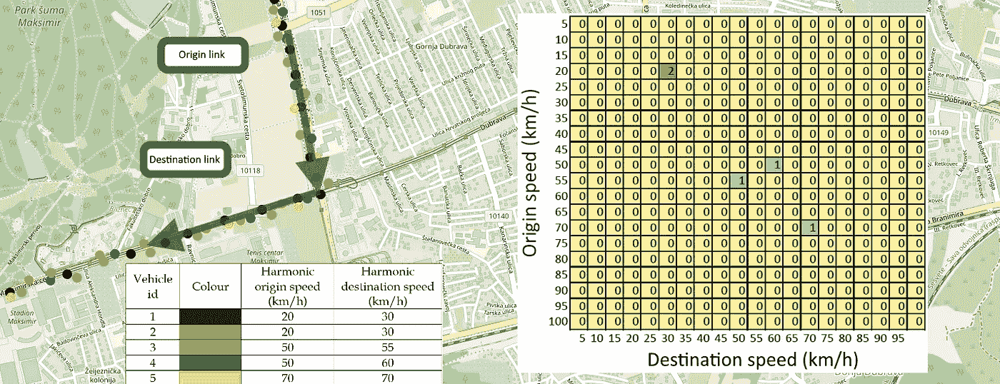
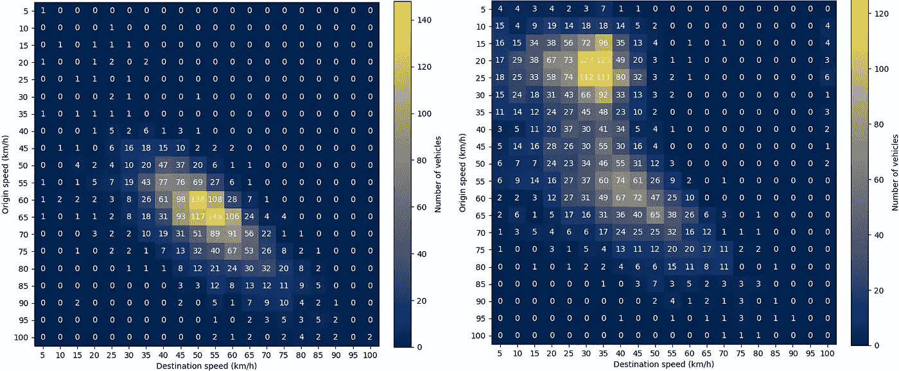
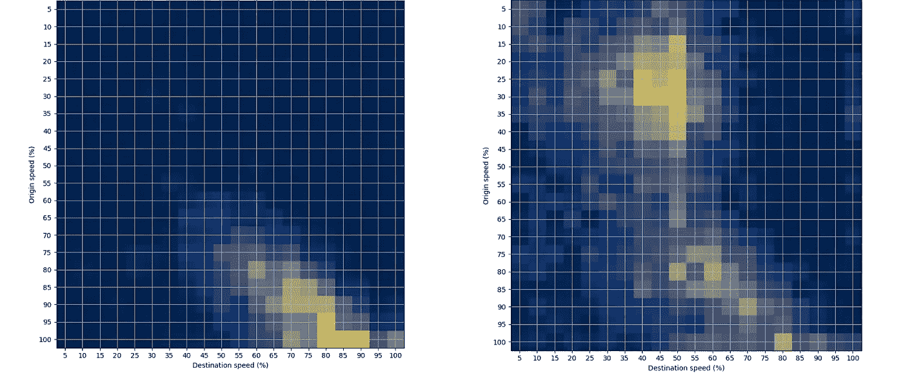

# 速度转移矩阵:一种新的道路交通数据建模技术

> 原文：<https://towardsdatascience.com/speed-transition-matrix-novel-road-traffic-data-modeling-technique-d37bd82398d1?source=collection_archive---------30----------------------->

探索道路交通数据可视化和分析的新途径

[亚历山大·波波夫](https://unsplash.com/@5tep5?utm_source=medium&utm_medium=referral)在 [Unsplash](https://unsplash.com?utm_source=medium&utm_medium=referral) 上拍照

对道路交通数据建模的方法有很多种。研究人员大多使用某种时间序列来表示一些交通参数在时间上的变化，如速度、延误或流量。大多数情况下，需要聚合大量数据来创建这种时间序列。在这一步，出现了不同的问题，大多与大偏差有关。速度转移矩阵(STM)就是为了解决这个问题而提出的，它提供了一种从交通数据中提取更多信息的方法。通过这个故事，我将解释 STM 的一些基本概念和用例。更多细节，你可以跳转到[发表在《可持续发展杂志》上的论文](https://www.researchgate.net/publication/344138884_Traffic_State_Estimation_and_Classification_on_Citywide_Scale_Using_Speed_Transition_Matrices)“使用速度转换矩阵进行城市范围内的交通状态估计和分类”。

# 基本概念

让我们首先解释一下 STM 的基本部分:

## **1。过渡**

在 STM 概念中，过渡被定义为单个车辆在两个连续路段(链路)之间的运动。在一个转换中，我们有两个链接，起点和终点。值得一提的是，链接长度取决于您使用的地图。例如 [OpenStreetMap](https://www.openstreetmap.org) 使用非常短的链接(几米)，而其他地图提供商将一个链接定义为两个路口之间的所有路段。

道路网络上的两个过渡示例(图片来源:作者)

## 2.速度

第二步是速度计算。为了构建一个 STM，我们计算每一辆穿越这个过渡的车辆的速度。计算起点和终点链路的速度非常重要。我们使用谐波速度，因为它倾向于较低的值，以提取更好的拥堵表示，但人们可以试验其他速度计算方法，如平均速度或中值速度。以下是 GNSS 数据的示例，但也可以使用其他数据源。

过渡时的速度计算(图片来源:作者)

## 3.[数]矩阵

矩阵的第一次迭代用于表示一次转换中的速度计数。下图举例说明了五条经过绿色过渡区的车辆路线。可以看出，在计算 STM 时，观察时间是一个非常重要的参数。如果经过的时间越长，计数会越大，因为会有更多的汽车通过观察到的转换。

STM 计算(第一部分——计算速度变化)

以下是在两个时间间隔内观察到的一个转变的 STM 的两个最常见的例子:1)从 08:30 h 到 15:30 h，和 2)从 15:30 h 到 17:30 h:

STMs 的例子:1)非高峰时间，2)晚上高峰时间(图片来源:作者)

现在我们可以用这个工作了！在第一幅图像中，起点和目的地速度位于中间，起点和目的地速度较高，这表示交通正常，没有拥堵。在第二张图中，我们可以观察到大多数计数位于左上角，起点和终点速度较低，这可能表示拥堵。由此，我们提取了一些有用的流量模式。

您还可以观察到，起点和目的地速度用以 km/h 表示的绝对值表示。为了使 STM 在城市范围内更具可比性，以 0–100%范围内的相对形式表示速度非常重要。我们选择相对于限速来表示速度，但是你可以相对于最高速度或者平均夜间速度来表示。此外，我们通过将矩阵中的每个值除以矩阵值的总和，将计数转换为概率。有了这个，结果更好理解，也更容易解释。

STM 的最终形式:相对值，概率(图片来源:作者)

# 利弊

这里有一些使用 STMs 时要考虑的最重要的优点和缺点。
**优点:**
-易于解释
-信息量更大
-不存在聚集问题
**缺点:**
-比时间序列数据更复杂
-计算时间更长
-不能用于非常稀疏的数据

# STM 用例

 [## 基于速度转移矩阵的交通状态分类

### 城市范围内交通状态分类的新方法

towardsdatascience.com](/traffic-state-classification-using-the-speed-transition-matrices-36f7a03ca776)  [## 基于速度转移矩阵的道路交通异常度量新方法

### 利用 GPS 交通数据测量道路网络异常水平的新方法

towardsdatascience.com](/novel-road-traffic-anomaly-metric-based-on-speed-transition-matrices-f2faf7d3b38b)  [## 基于模糊逻辑的道路交通拥挤指数估计

### 如何利用大量 GPS 数据为基于模糊的道路交通拥堵量化系统提供信息

towardsdatascience.com](/using-fuzzy-logic-for-road-traffic-congestion-index-estimation-b649f8ddede1) 

# 结论

STM 是一种新颖的交通数据建模技术，在交通数据表示和分析方面显示出巨大的潜力。在最近发表的论文中，我们展示了将 STM 应用于交通状态估计的可能性，但它也可以用于异常检测、可视化等。

除了它的优点之外，它也有一些缺点，在实施之前必须加以考虑。目前，这种方法处于“进展中”状态，将是我博士论文的主要部分。

如果您对类似的、与交通相关的话题感兴趣，请关注我的[媒体简介](https://tisljaricleo.medium.com/)，或者在研究门户:)查看[发表的研究](https://www.researchgate.net/profile/Leo-Tisljaric)

如有任何问题或建议，欢迎评论或联系我！[https://www.linkedin.com/in/leo-tisljaric-28a56b123/](https://www.linkedin.com/in/leo-tisljaric-28a56b123/)

# 发表的论文

这里有一个发表论文的列表，显示了扫描隧道显微镜的用法。

1.  [l . tiljari、T. Cari、B. Abramovi 和 T. Fratrovi，“使用速度转换矩阵进行全市范围的交通状态估计和分类”，*可持续性*，第 12 卷，第 18 期，第 7278 页，2020 年。](https://www.researchgate.net/publication/344138884_Traffic_State_Estimation_and_Classification_on_Citywide_Scale_Using_Speed_Transition_Matrices)
2.  [l . tiljari、S. Fernandes、T. Cari 和 J. Gama，“使用张量分解方法对城市道路网进行时空交通异常检测”，载于 *Discovery Science。计算机科学讲义*，第 12323 卷，A. Appice、G. Tsoumakas、Y. Manolopoulos 和 S. Matwin 编辑。Cham: Springer，2020 年，第 674-688 页。](https://www.researchgate.net/publication/344667216_Spatiotemporal_Traffic_Anomaly_Detection_on_Urban_Road_Network_Using_Tensor_Decomposition_Method)
3.  [l . tiljari，Majstorovi、T. Erdeli 和 T. Cari，“使用速度转换矩阵进行城市道路交通异常检测的方法”，载于《国际信息和通信技术、电子和微电子会议会议记录》*，2020 年，第 268-275 页。*](https://www.researchgate.net/publication/344471121_Measure_for_Traffic_Anomaly_Detection_on_the_Urban_Roads_Using_Speed_Transition_Matrices)