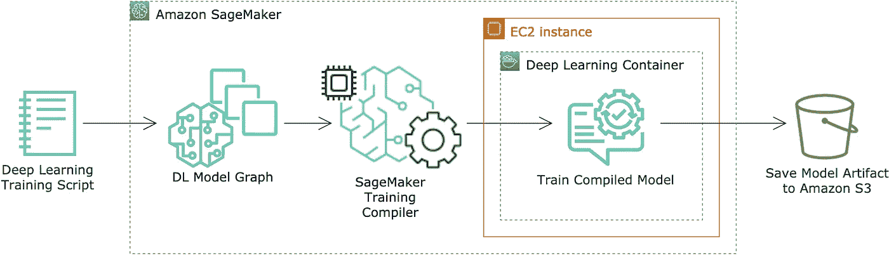
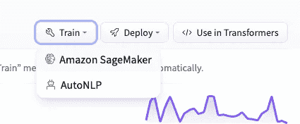
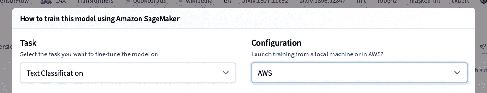

# 使用 SageMaker Training 编译器，将 AWS 上的拥抱面部训练工作的速度提高 50%

> 原文：<https://towardsdatascience.com/speed-up-hugging-face-training-jobs-on-aws-by-up-to-50-with-sagemaker-training-compiler-9ad2ac5b0eb?source=collection_archive---------21----------------------->

## SageMaker 培训编译器概述和入门指南

**简介**

深度神经网络每年都在稳步变大，因为硬件和算法的进步已经允许神经网络由数千亿个参数组成。尤其是通常用于自然语言处理(NLP)任务的 Transformer 模型，近年来使用的参数数量激增。例如，2018 年提出的变压器双向编码器表示(BERT) large 有超过 3.4 亿个参数，2021 年提出的开关变压器有 1.6 万亿个参数。

尽管最近的技术进步，训练这些模型的成本和时间变得令人望而却步。在 AWS，我们有代表客户进行发明的记录，以减少为最常见的深度学习框架(TensorFlow 和 PyTorch)运行培训工作的成本和时间。其中两项创新包括用于数据并行和模型并行的 SageMaker 库，它通过分布式培训技术的进步减少了特定任务的培训时间。如果你想更深入地了解我们的分布式培训技术，我强烈推荐阅读[我们关于 SageMaker 数据并行的出版物](https://www.amazon.science/publications/herring-rethinking-the-parameter-server-at-scale-for-the-cloud)。

2021 年，我们推出了深度学习模型训练的最新创新产品: [SageMaker 训练编译器](https://aws.amazon.com/blogs/aws/new-introducing-sagemaker-training-compiler/)。SageMaker Training 编译器作为 SageMaker SDK 的一部分提供，只需对利用 TensorFlow 或 PyTorch 的现有代码进行最少的更改，就可以优化您的训练代码，以提高运行效率，消耗更少的计算和内存，将 GPU 驱动的训练作业速度提高 50%。这一进步将使最先进的深度学习模型向更广泛的受众大众化，并为我们在 AWS 上使用这些框架的客户提供性能改进。

在这篇文章中，我将带您了解 SageMaker 训练编译器的高级设计，并向您展示如何将 SageMaker 训练编译器与拥抱脸变形金刚库集成在一起。拥抱脸是一家提供易于使用的工具和库的公司，用于开发和部署最先进的开源 NLP 模型。

**SageMaker 培训编译器**

编译器负责将您在高级编程语言(如 Python 或 Java)中指定的代码转换成在硬件上执行的机器代码。在将高级编程语言翻译成机器代码的过程中，编译器设计者必须做出与这种翻译相关的决定，这种决定对所执行的编译代码的性能有影响。在 AWS，我们的编译器设计人员致力于创建一个专门针对大规模深度学习训练优化的编译器，结果是 SageMaker Training 编译器。

用 TensorFlow 和 PyTorch 构建的神经网络，以图形的形式直观、逻辑地表示出来。SageMaker Training 编译器使用图形级优化，如运算符融合、内存规划和代数简化，来优化图形，以便在底层硬件上执行。此外，SageMaker Training 编译器提供后端优化(内存延迟隐藏、面向循环的优化)和数据流优化(布局转换、公共子表达式消除)来有效地协调训练执行。

实时运算符融合是 SageMaker Training 编译器提供的节省时间的主要技术之一，因此值得深入研究。训练深度学习模型的主要瓶颈之一是往返内存以检索和执行操作符的延迟成本。通过将多个运算符融合在一起，SageMaker 训练编译器要求训练作业更少地访问内存，并且可以直接在后端设备的硬件寄存器中执行更多的运算符。与传统的操作员执行方法相比，这可以提高性能。

**高层建筑**



高级架构图显示了 SageMaker Training 编译器如何利用您提供的深度学习训练脚本中的深度学习模型图来编译和训练您的模型(图片由作者提供)

SageMaker 培训编译器可在 [select AWS 深度学习容器(DLCs)](https://docs.aws.amazon.com/sagemaker/latest/dg/training-compiler-support.html) 中直接获得。指定适当的框架和估计器参数将启用 SageMaker 训练编译器，如果您是[带来您自己的模型](https://docs.aws.amazon.com/sagemaker/latest/dg/training-compiler-modify-scripts.html)，可能需要对您的训练脚本进行额外的修改。SageMaker 培训编译器将分析您的培训脚本，并在编译期间自动进行优化，从而使您的模型培训作业执行得更快。由训练作业产生的模型工件然后被输出到亚马逊简单存储服务(S3)。

**使用拥抱脸变形器开始使用 SageMaker 训练编译器**

SageMaker 训练编译器目前[支持 PyTorch 和 TensorFlow](https://docs.aws.amazon.com/sagemaker/latest/dg/training-compiler-support.html#training-compiler-supported-frameworks) 。为了快速上手 SageMaker Training 编译器，我将向您展示一种将 SageMaker Training 编译器与 Hugging Face Trainer API 和 PyTorch 集成的简单方法，如果您需要重构现有工作，这种方法只需要最少的代码更改。

**先决条件**

*   如果这是你第一次使用亚马逊 SageMaker，你需要[设置 SageMaker](https://docs.aws.amazon.com/sagemaker/latest/dg/gs-set-up.html)
*   [配置 SageMaker Studio](https://docs.aws.amazon.com/sagemaker/latest/dg/onboard-quick-start.html) 或随意修改用于 [SageMaker 笔记本实例](https://docs.aws.amazon.com/sagemaker/latest/dg/nbi.html)或其他开发环境的指令
*   确保查看 SageMaker Training 编译器[测试的实例类型](https://docs.aws.amazon.com/sagemaker/latest/dg/training-compiler-support.html#training-compiler-supported-frameworks)，如果必要，如果您的帐户级服务限制没有您想要的实例类型和可用的所需实例数量，请[请求增加配额](https://docs.aws.amazon.com/sagemaker/latest/dg/regions-quotas.html#service-limit-increase-request-procedure)

**演练**

关于使用`BERT-base-cased`为情感分类任务执行模型调整的技术的完整示例，您可以访问我们的 [AWS GitHub 示例页面](https://github.com/aws/amazon-sagemaker-examples/blob/master/sagemaker-training-compiler/huggingface/pytorch_single_gpu_single_node/bert-base-cased/bert-base-cased-single-node-single-gpu.ipynb)。此示例假设使用单个 p3.2xlarge 实例。此外，该示例假设 PyTorch v1.9.0 和 Transformers v.4.11.0。

**重要提示:**sage maker 培训编译器已经在[精选型号](https://docs.aws.amazon.com/sagemaker/latest/dg/training-compiler-support.html)上进行了测试。虽然您可以在 AWS 文档页面上列出的型号之外的型号上试验 SageMaker Training 编译器，但是 SageMaker Training 编译器在其他型号上的性能尚未经过测试。在支持的模型表中也有推荐的批量大小设置。如果您偏离了测试的模型和推荐的批量设置，您需要在解锁任何训练加速之前重新调整参数。

在下面的演练中，我将向您展示如何使用拥抱脸代码生成功能来快速生成用于 Amazon SageMaker 的训练代码。然后，我将向您介绍构建由 Hugging Face 生成的代码以与 SageMaker Training 编译器集成所需的步骤。在本演练中，我选择“文本分类”任务作为模型任务，我希望对我的预训练模型进行微调。

1.  选择[我们测试过的型号](https://docs.aws.amazon.com/sagemaker/latest/dg/training-compiler-support.html) 中的一个，它也可以作为[抱脸预训练型号](https://huggingface.co/models)。
2.  现在，让我们生成我们的启动代码。导航至所选模特的拥抱脸模特页面(例如，[这是 roberta-large 的页面](https://huggingface.co/roberta-large))。
3.  在页面顶部附近，点击“火车”>“亚马逊 SageMaker”。



使用拥抱脸模型页面，你可以在 Amazon SageMaker 上轻松生成代码来训练你的模型

4.选择要微调模型的任务，并为配置选择 AWS。



在本例中，我们选择“文本分类”测试，并计划在 AWS 上启动或作业

5.将显示的代码复制到剪贴板，创建一个在 Amazon SageMaker 开发环境中运行的 Jupyter 笔记本，并将代码粘贴到笔记本中。

6.准备您的训练数据，根据需要分成训练、验证和测试数据集，并将数据上传到 S3。将 S3 路径存储在 Jupyter 笔记本中定义的变量中。在准备数据时，你可能会发现[拥抱面部数据集库](https://huggingface.co/docs/datasets/quickstart.html)很有帮助。

```
training_input_path=‘s3://example_bucket/s3_prefix_example/train’
test_input_path=‘s3://example_bucket/s3_prefix_example/test’
```

7.编写训练脚本，并将训练脚本存储在拥抱面部估计器的 source_dir 参数中指定的位置。例如，训练脚本见[拥抱脸 GitHub 库](https://github.com/huggingface/notebooks/tree/master/sagemaker/01_getting_started_pytorch)或参考上面的 BERT 基本案例。对于这个例子，你的训练脚本必须使用变形金刚库的训练器类。

```
from transformers import Trainer, TrainingArgumentstraining_args=TrainingArguments(**kwargs) 
trainer=Trainer(args=training_args, **kwargs)
```

8.为了确保您充分利用 SageMaker Training 编译器在内存中适应更大批量的能力，请参考[本机的批量大小和](https://docs.aws.amazon.com/sagemaker/latest/dg/training-compiler-support.html)训练编译器编号的批量大小。使用获得的批量数量，更新批量数量，并根据 Jupyter 笔记本顶部的新批量调整您的学习速度。

```
# the original max batch size that can fit into GPU memory without compilerbatch_size_native=12
learning_rate_native=float(‘5e-5’)# an updated max batch size that can fit into GPU memory with compilerbatch_size=64# update learning ratelearning_rate=learning_rate_native/batch_size_native*batch_size
```

9.更新您的 HuggingFace estimator 以指定启用 SageMaker Training 编译器的正确参数，目前建议禁用调试器以确保对性能没有影响，但请参考 [SageMaker Training 编译器文档](https://docs.aws.amazon.com/sagemaker/latest/dg/training-compiler.html)以获取关于调试器和 SageMaker Training 编译器的最新指南。

在这一步中，注意我们正在实例化一个`TrainingCompilerConfig`类的实例，并将其传递给`compiler_config`参数。这个类使您能够为您的培训工作配置 SageMaker 培训编译器。TrainingCompilerConfig 类接受两个布尔参数作为`enabled`和`debug`参数。有关这些参数的更多信息，请参见[文档](https://docs.aws.amazon.com/sagemaker/latest/dg/training-compiler-enable.html)。通过在估算器中不指定`compiler_config`参数，您明确地禁用了 SageMaker 训练编译器。

```
pytorch_huggingface_estimator=HuggingFace(
 source_dir=’./scripts’,
 entry_point=’train.py’,
 instance_count=1,
 instance_type=’ml.p3.2xlarge’,
 transformers_version=’4.11.0',
 pytorch_version=’1.9.0',
 hyperparameters=hyperparameters,
 compiler_config=TrainingCompilerConfig(),
 disable_profiler=True,
 debugger_hook_config=False
)
```

10.要启动您的训练作业，调用 Estimator 对象上的 fit 方法，传入您在步骤 6 中指定的数据位置。

```
huggingface_estimator.fit({‘train’: training_input_path, ‘test’: test_input_path}, wait=False)
```

恭喜你！现在，您已经使用新的 SageMaker 培训编译器启动了您的第一个培训工作。您可以从 SageMaker 服务控制台的“培训>培训作业”下跟踪您的培训作业的进度，当培训完成时，您的模型将输出到 S3，[准备部署](https://docs.aws.amazon.com/sagemaker/latest/dg/how-it-works-deployment.html)。要查看使用上述技术微调`BERT-base-cased`的完整示例，您可以访问我们的 [AWS GitHub 示例页面](https://github.com/aws/amazon-sagemaker-examples/blob/master/sagemaker-training-compiler/huggingface/pytorch_single_gpu_single_node/bert-base-cased/bert-base-cased-single-node-single-gpu.ipynb)。

**结论**

在这篇博客文章中，你了解了新的 SageMaker 训练编译器，以及它如何帮助你减少训练深度学习模型所需的时间。然后我们介绍了如何使用 PyTorch 和 Hugging Face 开始使用新的 SageMaker 培训编译器。

我鼓励你把你在这里学到的东西应用到你自己的用例中。很可能你已经在通过使用多 GPU 甚至多节点的训练方法来优化性能增益了。您会很高兴地知道 SageMaker 培训编译器也可以适应这些用例(参见文档中的[分布式培训指南](https://docs.aws.amazon.com/sagemaker/latest/dg/training-compiler-enable.html)，并在我们的 AWS GitHub 示例库中找到[多节点多 GPU 示例](https://github.com/aws/amazon-sagemaker-examples/blob/master/sagemaker-training-compiler/huggingface/pytorch_multiple_gpu_multiple_node/language-modeling-multi-gpu-multi-node.ipynb))。您还可能有需要使用不同于拥抱脸训练器 API 的方法的用例，对于这些用例，请检查您如何能够[轻松地调整您的训练脚本](https://docs.aws.amazon.com/sagemaker/latest/dg/training-compiler-modify-scripts.html)以继续利用 SageMaker 训练编译器的性能优势。