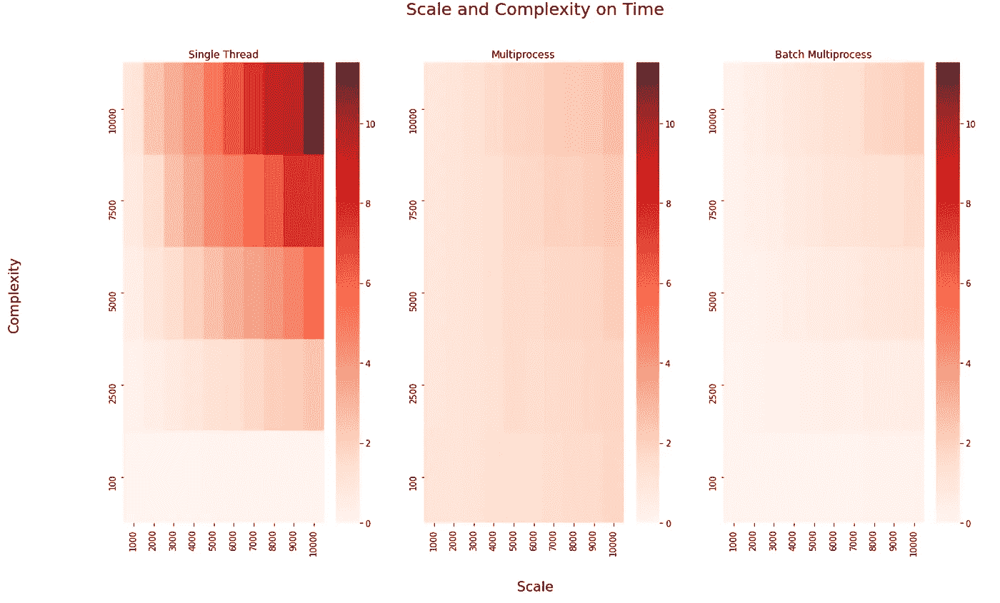

# 通过批处理加速多重处理

> 原文：<https://towardsdatascience.com/speed-up-multiprocessing-with-batching-72f6ac6594e0?source=collection_archive---------12----------------------->

## 批还是不批？

作者:[爱德华·克鲁格](https://www.linkedin.com/in/edkrueger/)和[道格拉斯·富兰克林](https://www.linkedin.com/in/dougaf/)。

Jonathan Farber 在 Unsplash 上拍摄的照片

## 介绍

*我们将评估三种并发模式在具有不同输入长度和复杂性的函数上的性能。*

我们的函数 f(x)返回一个整数的因子。

f(x)

这不是 f(x)的最优实现；相反，我们设计了两个“杠杆”来改变问题，从而改变执行时间。

1.  我们将修改**范围**来产生一个更大的尺寸问题。想想平行部分。
2.  我们将修改一个 **randint range** 来产生一个更复杂的问题。思考顺序部分。

*你可以在* [*这个库*](https://github.com/edkrueger/concurrency_with_joblib) *里找到下面的代码和图形。*

<https://github.com/edkrueger/concurrency_with_joblib>  

# 什么是批处理？

批处理是在并行化之前将我们的输入分组。批处理可以通过将计算资源集中在一个批处理上，直到处理完所有输入，从而提高效率。

如果您有许多简单的任务，批处理往往会提高执行时间。我们可以想象，如果我们需要折叠 100 条毛巾并将它们放在架子上，将它们分配到许多毛巾文件夹中会大大减少完成任务所需的时间。这里，许多文件夹代表了多进程解决方案中的许多进程。

让我们将这个比喻扩展到利用批处理。如果我们在 10 个文件夹完成任务时一条一条地分发 100 条毛巾，我们会花很多时间来分发毛巾。相反，想象我们在任务**开始时给每个文件夹一批**10 条毛巾。

pablo ramos 在 Unsplash 上拍摄的照片

如果你有复杂的任务，批处理就没什么帮助了。想象一下，我们有 4 个画家，需要 100 幅杰作。如果我们一开始给每个画家 1 或 25 张画布，这并不重要。这是因为画这幅杰作所花的时间相对来说比分发一幅画布所花的时间要多得多。然而，如果一个画家碰巧在其他人之前完成了他的 25 幅画，那么当其他人完成工作时，他将被迫闲置。也就是说批次不占某人提前完成的便宜。

下面我们的第三个并发模式展示了如何在 joblib 中修改多处理模式以使用批处理。当执行这种模式时，每个流程将接收一批预先确定的输入来执行，而不需要从队列中提取或查看其他流程的结果。

重要的是要认识到，与在单线程上执行计算相比，无论有无批处理，多处理都会通过委托输入带来一定的计算开销。然而，由于批处理只需要传递一次输入，所以它比其他形式的多处理要快。

多处理可以通过利用更多的硬件或为手头的问题创建更好的并发模式来加快执行时间。

# 如何让我们的机器使用更多的进程？

# Joblib

Joblib 是一组工具，用于在 Python 中提供并行处理解决方案。Joblib 经过优化，速度更快，鲁棒性更强，尤其是在大型计算任务上。

joblib。并行文档

Joblib 提供了一个简单的助手类来使用多重处理编写并行化的进程。核心思想是把要执行的代码写成生成器表达式，转换成并行计算。

例如，可以使用`n_jobs=2`将 f(x)分布在两个 CPU 上:

我们的函数 f(x)返回一个整数的因子。`delayed`函数是`joblib.Parallel`的一部分，它延迟函数的执行，直到它被适当地并行化。

请记住，joblib 可以做得更多！查看 Pratik Gandhi 的这篇文章，看看如何在管道中使用它。

</using-joblib-to-speed-up-your-python-pipelines-dd97440c653d>  

# 我们的并发模式

## 单线程的

这是解决这个问题的最简单的模式。在单个线程或进程上运行计算。

## 朴素多进程

这里我们使用`joblib.Parallel`和`n_jobs=-1`来最大化这个问题的并行化。在我的例子中，这意味着 i7 处理器需要 12 个进程。

对于简单的多处理，每个输入都给第一个可用的进程。

## 分批多重处理

在第 16 行，我们再次使用 joblib。与`n_jobs=-1`并行，最大化这个问题的并行化。然而，我们对我们的输入委托更加慎重。每个流程都有自己的**批**输入要执行。每个批次大小相等，每个流程接收一个批次。

# 测试我们的并发模式

我们来比较一下三种模式；**单线程**、**朴素多进程**和**批量多进程、**同时改变输入长度和复杂度。

# 结果

我们的第一个图表显示了输入数量从 0 增加到 10，000 时的执行时间，其中最大的随机整数值为 1000。还有。请注意，多重处理是最慢的模式。对于这个问题，跨多个进程委托输入的开销太大，无法保证多重处理。但是，当我们使用批处理时，我们可以将性能提高到比单线程执行更快！

图表 1 —按时间缩放至 10，000 图表 2 —按时间缩放至 100，000

在第二张图中，我们将最大的随机整数值设置为 1000，并绘制输入数量从 0 增加到 100，000 时的执行时间。

我们看到，当输入数量超过 50，000 时，多处理开始胜过单线程。我们再次看到，批处理多进程优于其他模式，这一次规模更大。

## 现在让我们随着问题复杂性的增加来看性能。

图表 1 —时间复杂度高达 1000 图表 2 —时间复杂度高达 10，000

我们的第一张图显示，随着复杂度从 1 增加到 1000，多处理是最慢的，而单线程和批处理之间实际上没有什么区别。

在第二张图中，我们将复杂度提高了两个数量级。现在我们看到，随着复杂性增加到 10，000，多处理优于单线程。批处理多处理优于其他处理，直到大约复杂度 70，000，在这里多处理和批处理多处理汇合。最终，在最复杂的情况下，我们看到多重处理变得比批处理更快。

# 结论

什么时候用**批处理**？如果你对一个简单的问题有**许多输入**。假设你没有很多输入，使用单线程。在一个非常简单的问题上使用多重处理是不值得的。最后，如果你的问题有很多输入并且很复杂，使用简单的多重处理。

当许多人可以从批处理中获益时，他们天真地进行多重处理。请注意，在下面的热图中，多进程在低复杂度时会产生开销，这使得它比单线程和批处理多进程要慢。

跨多种规模和复杂性的 3 种并发模式的运行时热图

随着规模和复杂性的增加，我们发现使用更多的流程会带来显著的好处。所以对于你的复杂问题，用 joblib 来并行执行吧！