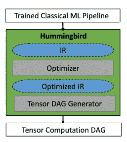
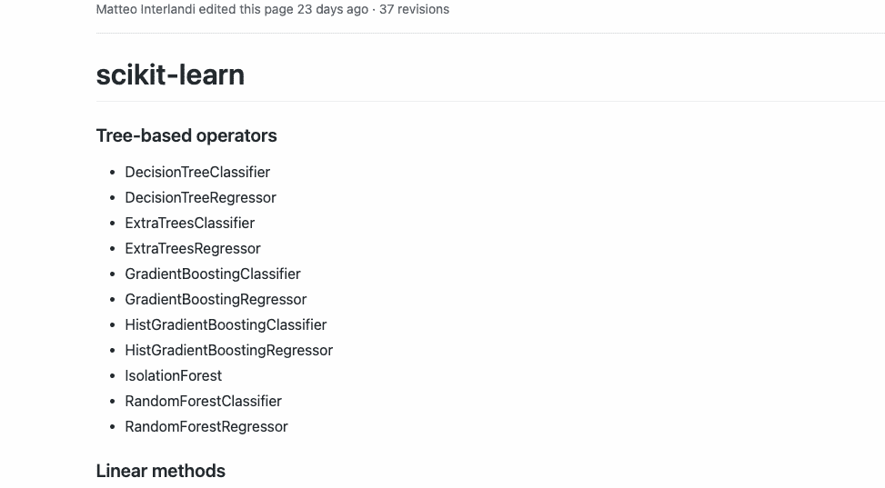
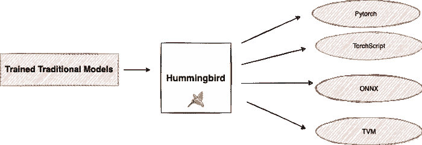
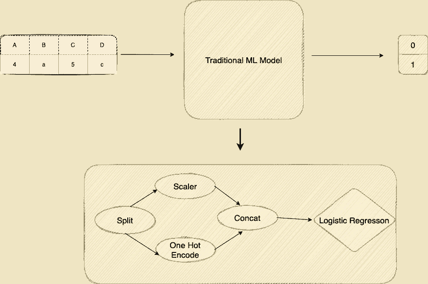
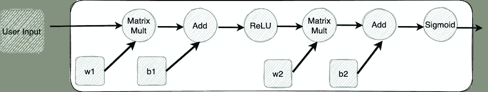
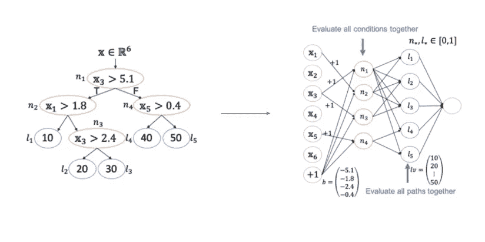
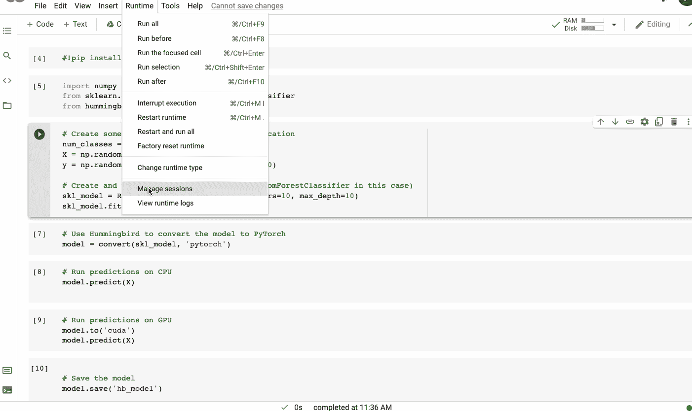
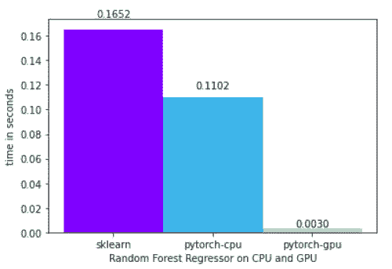

# 张量是你所需要的

> 原文：<https://towardsdatascience.com/speed-up-the-inference-in-traditional-machine-learning-models-by-converting-them-into-tensor-based-efe6bbe5c92d?source=collection_archive---------24----------------------->

## 加快您的 scikit-learn 模型的推理速度

弗拉多·帕诺维奇在 [Unsplash](https://unsplash.com?utm_source=medium&utm_medium=referral) 上拍摄的照片

深度学习框架由张量组成，作为它们的基本计算单元。结果，它们可以利用硬件加速器(例如，GPU)，从而加速模型训练和推断。然而，像 [scikit-learn](https://scikit-learn.org/stable/) 这样的传统机器学习库是为了在 CPU 上运行而开发的，没有张量的概念。因此，他们无法利用 GPU，因此错过了深度学习库享有的潜在加速。

在本文中，我们将了解一个名为 **Hummingbird** 的库，它就是为了弥合这一差距而创建的。Hummingbird 通过将传统机器学习模型转换为基于张量的模型，加快了它们的推理速度。这使我们能够在 GPU 上使用 scikit-learn 的决策树和随机森林等模型，并利用硬件功能。

# 蜂鸟是什么？

如上所述，[蜂鸟](https://github.com/microsoft/hummingbird)是传统机器学习模型中用于加速推理的库。Hummingbird 通过将这些传统的机器学习管道编译成张量计算来实现这一点。这意味着你可以利用 GPU 和 TPU 等硬件加速，甚至是传统的机器学习模型，而无需重新设计模型。

这在几个方面是有益的。在蜂鸟的帮助下，用户可以受益于:

*   在神经网络框架中实现的优化；
*   原生硬件加速；
*   拥有支持传统和神经网络模型的单一平台；

蜂鸟库高层架构|来源:[官方论文](http://learningsys.org/neurips19/assets/papers/27_CameraReadySubmission_Hummingbird%20(5).pdf)

除了上述优点，蜂鸟还提供了许多方便的功能，其中一些列举如下。

## 1️⃣ .方便的统一“推理”API

Hummingbird 提供了一个方便的统一“推理”API，它非常类似于 sklearn API。这允许用 Hummingbird 生成的模型交换 sklearn 模型，而不必更改推理代码。

## 2️⃣.支持主要模型和特征。

当前版本的 Hummingbird 目前支持以下操作符:

运营商支持 b 蜂鸟。来源:[官方 Github 库](https://github.com/microsoft/hummingbird/wiki/Supported-Operators)

## 3️⃣.转换能力

目前，您可以使用蜂鸟将您训练的传统 ML 模型转换为 [PyTorch](https://pytorch.org/) 、 [TorchScript](https://pytorch.org/docs/stable/jit.html) 、 [ONNX](https://onnx.ai/) 和 [TVM](https://docs.tvm.ai/)

蜂鸟可以按作者转换你训练过的传统 ML |图像

# 工作

蜂鸟库的主要重点是加快传统机器学习模型的推理速度。已经开发了很多专门的系统，比如 ONNX Runtime、TensorRT 和 TVM。然而，许多这些系统都专注于深度学习。传统模型的问题在于，它们是用**命令式代码**以特定的方式表达的。让我们通过一些视觉表现来理解它。

传统机器学习模型如何工作|作者图片|转载自[蜂鸟会议。](https://www.slideshare.net/databricks/tensors-are-all-you-need-faster-inference-with-hummingbird)

> 传统模型的一个缺点是，它们是使用**命令式代码**以特定的方式表达的

让我们考虑一个包含四列的数据框架，其中两列是分类的，其余两列是数字的。这些被输入一个机器学习模型，比如逻辑回归，以识别它们是属于`class 0`还是`class 1`。这是二元分类问题的经典案例。如果我们深入观察，我们有一个 DAG 或有向无环操作图，称为管道。管道由特征器组成，这些特征器对数据进行预处理，然后将其提供给预测器，预测器将输出预测。这只是传统模型的一个简单表示。在所有传统的 ML 框架中，有成百上千的这些特征和预测器。因此，很难用一种对所有不同框架都有意义的方式来表示它们。

> 深度学习模型被表示为张量运算的 DAG

另一方面，我们在深度学习中主要依赖张量的抽象，它只是一个多维矩阵。深度学习模型也表示为 DAG，但明确专注于张量算子。在下图中，我们有非常通用的矩阵运算，可以很容易地在各种系统中表示出来。

深度学习模型如何工作|作者图片|转载自[蜂鸟会议。](https://www.slideshare.net/databricks/tensors-are-all-you-need-faster-inference-with-hummingbird)

深度学习预测服务系统可以利用这些张量运算，并利用这种抽象在许多不同的目标环境中工作。

Hummingbird 通过重新配置算法运算符，将传统的流水线转换为张量运算。下面这个来自他们[官方博客](https://www.microsoft.com/en-us/research/group/gray-systems-lab/articles/announcing-hummingbird-a-library-for-accelerating-inference-with-traditional-machine-learning-models/)的例子解释了蜂鸟将决策树翻译成张量的策略之一，其中涉及到 GEMM(通用矩阵乘法)。

*将简单的决策树转化为神经网络|转载自蜂鸟的* [*官方博客*](https://www.microsoft.com/en-us/research/group/gray-systems-lab/articles/announcing-hummingbird-a-library-for-accelerating-inference-with-traditional-machine-learning-models/)

# 演示

蜂鸟的语法非常直观和简洁。要在 DNN 框架上运行您的传统 ML 模型，您只需要`import hummingbird.ml`并将`convert(model, 'dnn_framework')`添加到您的代码中。下面是一个使用 [scikit-learn 随机森林](https://scikit-learn.org/stable/modules/ensemble.html#forest)模型和 [PyTorch](https://pytorch.org/) 作为目标框架的例子。

***🔗*** [***链接访问整个代码和数据集***](https://www.kaggle.com/parulpandey/random-forest-on-gpus-with-pytorch-backend)

使用一个 [scikit-learn 随机森林](https://scikit-learn.org/stable/modules/ensemble.html#forest)模型和 [PyTorch](https://pytorch.org/) 作为目标框架使用 Hummingbird |图片由作者提供

CPU 上的随机森林回归器与 GPU 上的随机森林回归器的时间比较|由作者绘制的图像| [链接到代码](https://www.kaggle.com/parulpandey/random-forest-on-gpus-with-pytorch-backend)

# 结论

Hummingbird 是一个很有前途的库，正在研究机器学习领域的一个核心问题。让用户能够从 CPU 无缝过渡到 GPU，并利用硬件加速器来加速推理，这将有助于直接关注问题而不是代码。如果您想更进一步，请确保查看下面的参考资料。本文以这些参考资料为基础，如果您决定更深入地研究该库的底层解释，您也会发现它们很有帮助。

## 参考

*   [https://github.com/microsoft/hummingbird](https://github.com/microsoft/hummingbird)
*   [张量是你所需要的:用蜂鸟更快的推理](https://www.slideshare.net/databricks/tensors-are-all-you-need-faster-inference-with-hummingbird)
*   [为统一机器学习预测服务的张量编译器](https://arxiv.org/abs/2010.04804)。
*   [将经典的 ML 管道编译成张量计算，以实现“一刀切”的预测服务](http://learningsys.org/neurips19/assets/papers/27_CameraReadySubmission_Hummingbird%20(5).pdf)。