# 用这三个工具加速你的命令行导航

> 原文：<https://towardsdatascience.com/speed-up-your-command-line-navigation-with-these-3-tools-f90105c9aa2b?source=collection_archive---------25----------------------->

## 用一个词修复您的打字错误，保存您的命令行片段，等等！

# 动机

命令行是数据科学家的常用工具。因此，知道如何有效地使用命令行将会提高您的生产率。

比如在命令行打错字的时候，如果能像下面这样只打一个字就能修复错误不是很好吗？

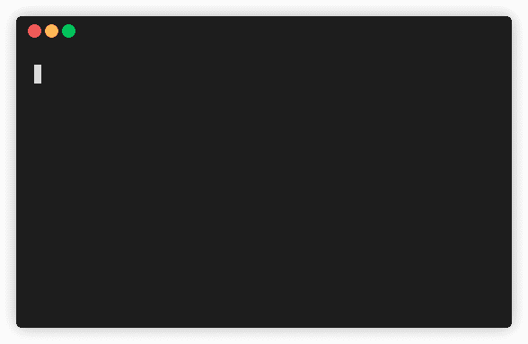

作者 GIF

在本文中，您将学习 3 个工具，使您在命令行上工作时更有效率。它们是:

*   用一个词纠正你之前的命令
*   pet —保存并执行您的命令行片段
*   猛拉—将终端输出猛拉到剪贴板

# 用一个词纠正你之前的命令

使用命令行时，输入错误是很常见的。例如，您可以键入`git comit`而不是`git commit`。除了重新键入整个句子之外，有没有一种方法可以只用一个单词来修复之前的命令？

这时候[吸盘](https://github.com/nvbn/thefuck)就派上用场了。这个按钮允许你用一个单词来纠正前面的命令，如下所示。

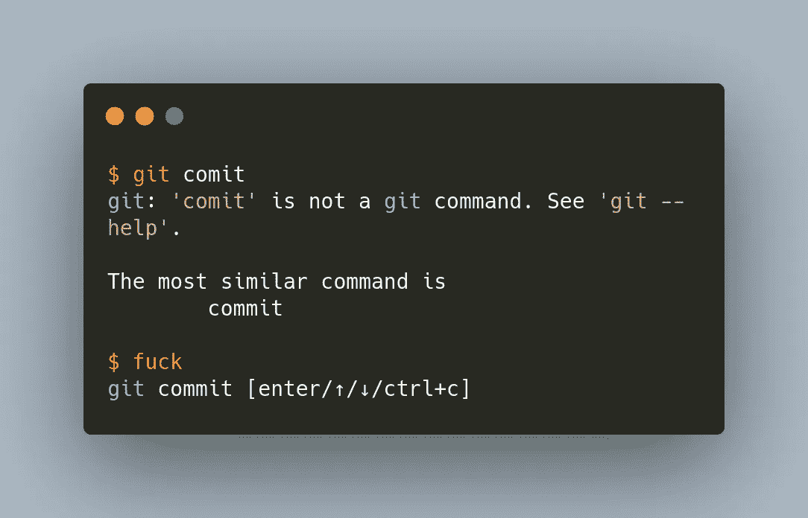

作者图片

如果你忘记添加`sudo`，使用这个工具将修复它。

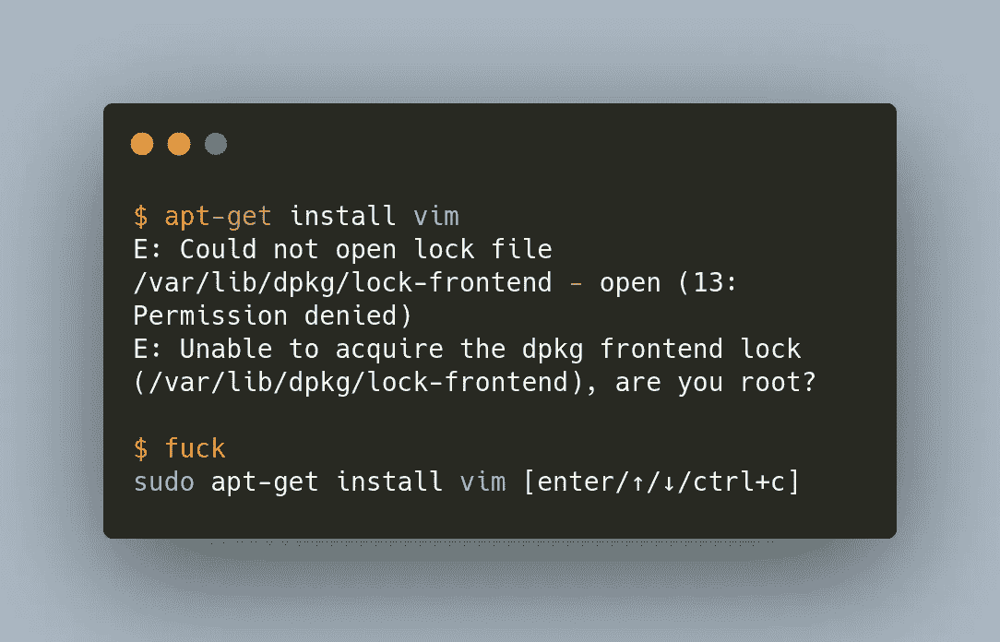

作者图片

有时，您可能会不小心将一个命令键入两次。该工具将识别并删除重复项。

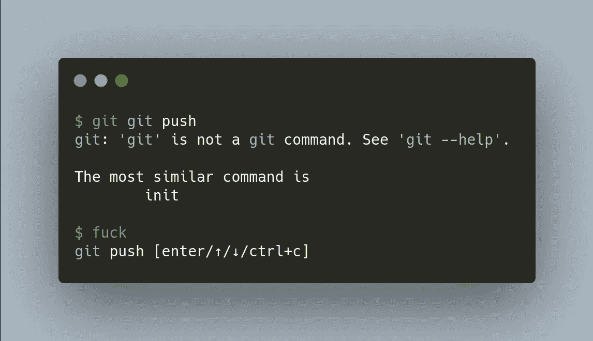

作者图片

如果您在跟随教程时不小心复制了`$`，这个工具也可以检测到。

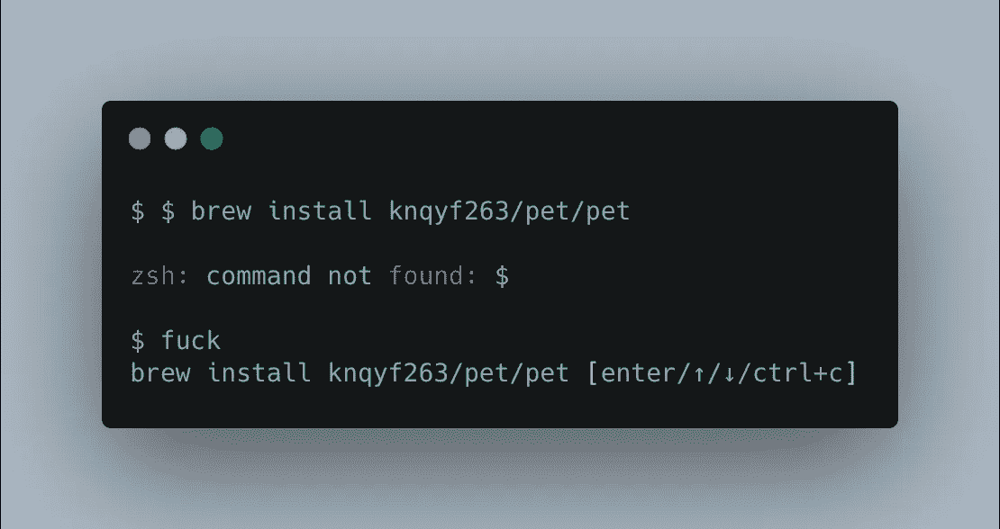

作者图片

您可以使用向上或向下箭头从该工具中获得其他建议:

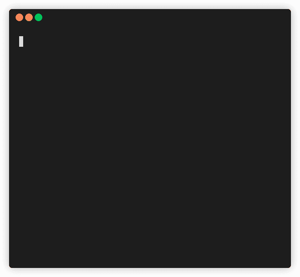

作者图片

点击了解如何安装推杆[。](https://github.com/knqyf263/pet#installation)

# Pet —保存并执行您的命令行片段

有没有一些有用的命令，在需要的时候你总是忘记？与其在 Google 上搜索或在 Word 文档中保存这些命令，不如直接在命令行中保存这些命令，这样不是很好吗？

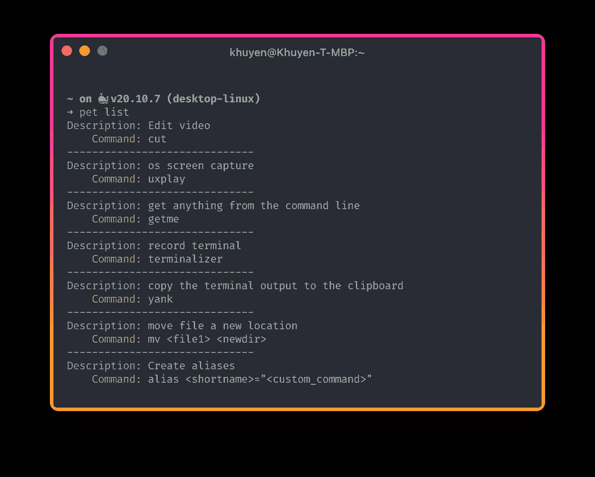

作者图片

这时候[宠物](https://github.com/knqyf263/pet)就派上用场了。与其他命令行片段管理器相比，我喜欢 pet 的一点是它易于使用。

要保存新命令，请键入`pet new`。您只需要插入两条信息，如下图所示的`Command`和`Description`，就可以创建一个新的命令片段。

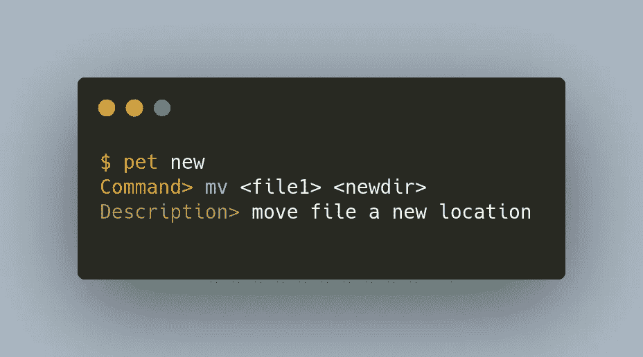

作者图片

要执行该命令，运行`pet exec`:


作者图片

注意，由于我们把`file1`放在了`<>`中，所以 pet 知道它是一个变量。Pet 允许我们使用 tab 键轻松地输入变量的名称！

要查看你所有的代码片段，输入`pet list`:


作者图片

要编辑命令，请键入`pet edit`:

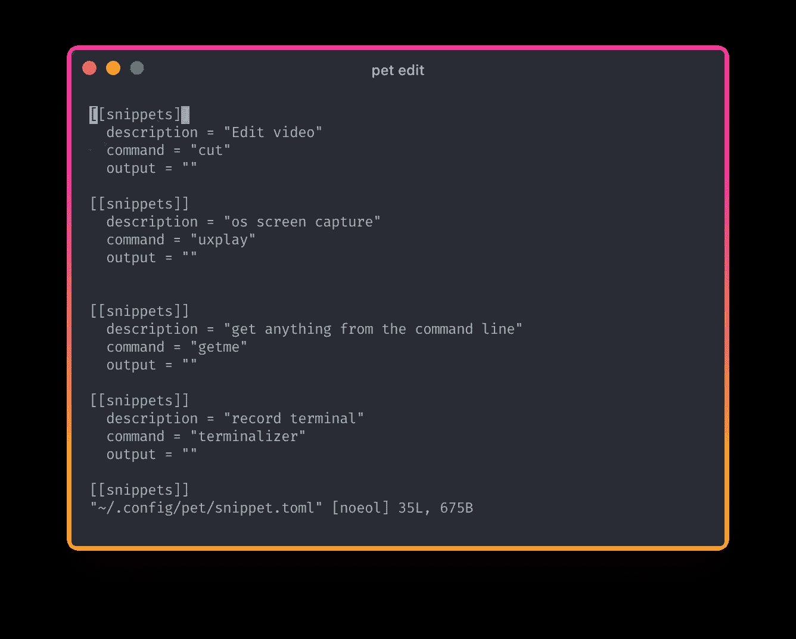

作者图片

默认编辑器是 Vim。如果你想改变编辑器，键入`pet configure`或转到文件`~/.config/pet/snippet.toml`。接下来，将`editor`的值更改为您最喜欢的编辑器:

我把编辑器换成了 VSCode。

要查看所有可用的命令，请键入`pet`:

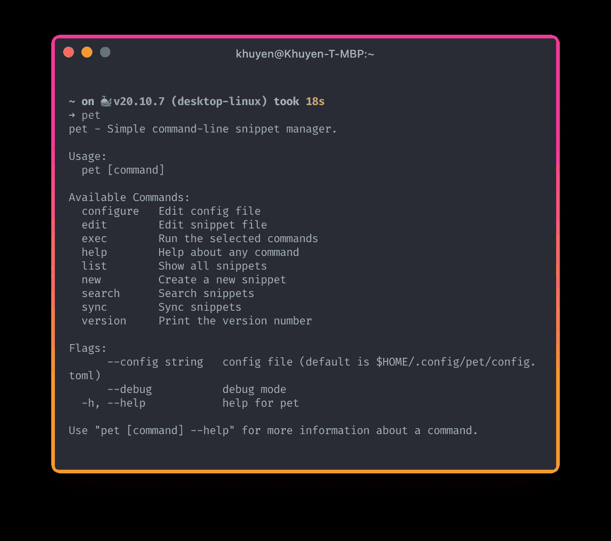

作者图片

在这里找到如何安装宠物。

# 猛拉—将终端输出猛拉到剪贴板

你有没有想过不用鼠标就能复制终端输出？

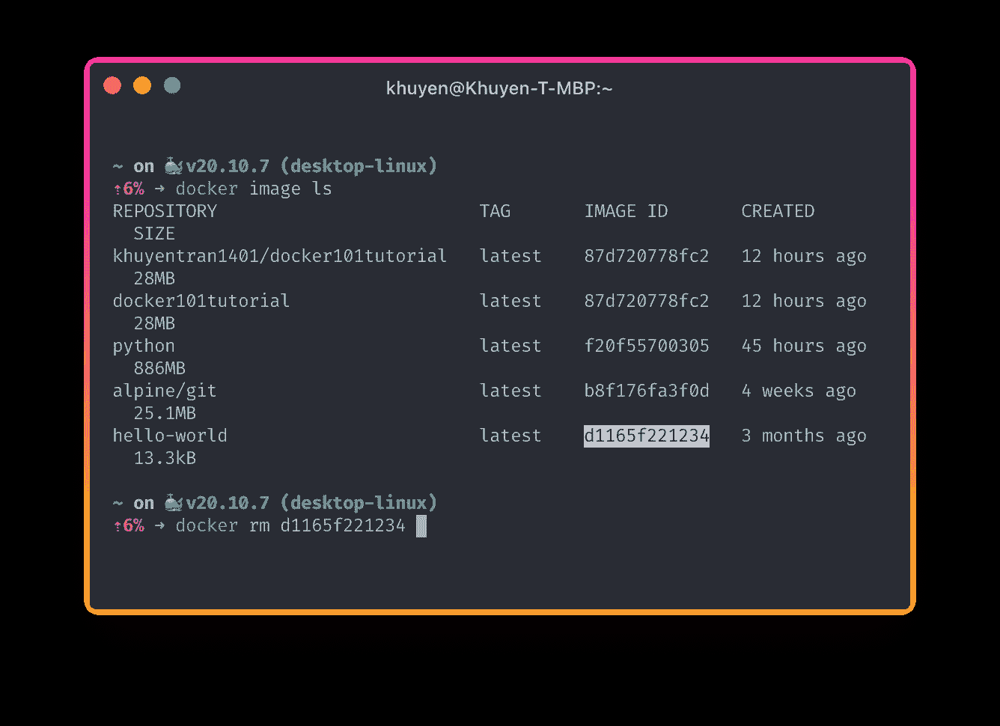

作者图片

这时[猛拉](https://github.com/mptre/yank)就派上用场了。Yank 允许您仅使用键盘选择和复制终端输出。

要使用 yank，请在要复制输出的命令末尾添加`| yank`。例如，键入`docker image ls | yank`来拉动`docker image ls`的输出。

使用箭头在不同的字段之间移动，并键入 Enter 来复制字段。

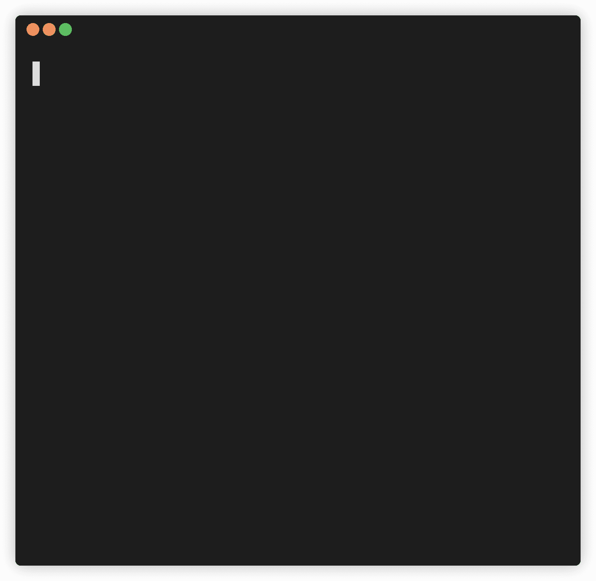

作者 GIF

如果要复制整行，使用`yank -l`。

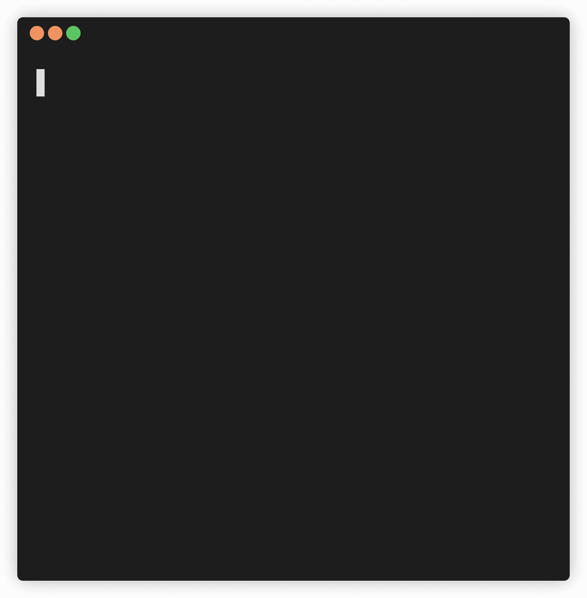

作者 GIF

多方便啊？

如果你用的是 Linux，用`command | yank -- xsel -b`代替`command | yank`。由于`yank -- xsel -b`输入起来很长，您可能想要创建一个[别名](https://www.tecmint.com/create-alias-in-linux/),比如`grab`来缩短命令:

```
$ alias grab="yank -- xsel -b"$ docker image ls | grab
```

点击了解如何安装拉环[。](https://github.com/mptre/yank#installation)

# 结论

恭喜你！您刚刚学习了 3 个工具来提高您在命令行上的工作效率。从长远来看，在这里或那里节省一点时间将会为你节省大量的时间。

我喜欢写一些基本的数据科学概念，并尝试不同的算法和数据科学工具。你可以在 LinkedIn 和 T2 Twitter 上与我联系。

星[这个回购](https://github.com/khuyentran1401/Data-science)如果你想检查我写的所有文章的代码。在 Medium 上关注我，了解我的最新数据科学文章，例如:

</typer-build-powerful-clis-in-one-line-of-code-using-python-321d9aef3be8>  </2-tools-to-automatically-reload-when-python-files-change-90bb28139087>  </ptpython-a-better-python-repl-6e21df1eb648> [## Ptpython:更好的 Python REPL

towardsdatascience.com](/ptpython-a-better-python-repl-6e21df1eb648)