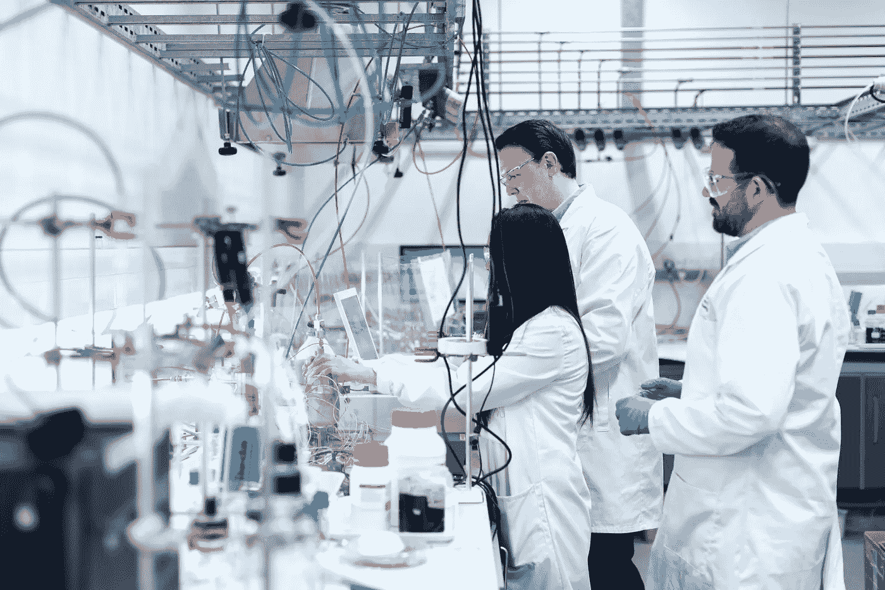
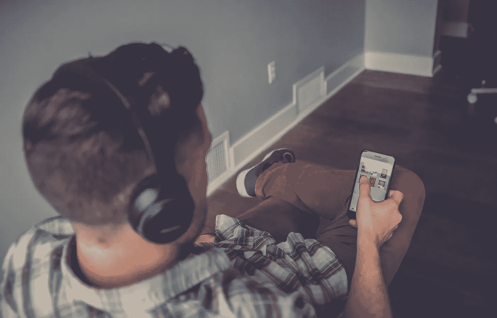
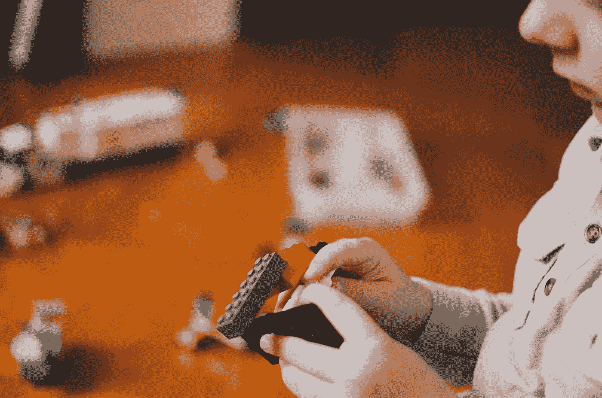

# 帮助您更好地学习数据科学的技术

> 原文：<https://towardsdatascience.com/speed-up-your-data-science-learning-process-a49ae080a46d?source=collection_archive---------16----------------------->

## 发现你的学习方式，更聪明地学习

乔纳森·博尔巴在 [Unsplash](https://unsplash.com/s/photos/learn-child?utm_source=unsplash&utm_medium=referral&utm_content=creditCopyText) 上的照片

自从我开始自学数据科学以来，我投入了大量的时间来找出最好的学习方法。

我想以更快的速度学习，尽可能快地更好地理解概念。有一段时间我是边工作边学习，时间真的很宝贵。

对我来说，尽可能多、尽可能快地学习是很重要的。

当我在寻找让自学变得更容易的技巧时，我不可避免地遇到了不同的**学习风格**。

# 什么是学习风格？

我们都有不同的学习方式。

不仅速度不同，而且方式也不同。这可能是人们倾向于不同事物的原因——我们中的一些人更有创造力，而另一些人更有逻辑性。

我们中的一些人喜欢公开演讲和辩论，而另一些人喜欢绘画和素描。

这种对不同道路的倾向源于我们的思维方式，并影响我们的学习方式。

我们都非常不同，有独特的思想、观念和学习模式。我们以不同的方式体验周围的世界。

这些不同的模式可以分为四种学习风格。

这意味着有四类学习者，我们都属于每一类。

有些人不止属于这一类。

当我读到更多关于学习风格的内容时，我有所领悟。我明白让我的学习材料与我的学习风格相一致的重要性。

我也意识到了为什么我在一些问题上苦苦挣扎，而在其他问题上却表现出色。

我在科学考试中总是得 A，而且计算起来轻而易举。然而，我可以对实验课说相反的话。

照片由[this engineering RAEng](https://unsplash.com/@thisisengineering?utm_source=unsplash&utm_medium=referral&utm_content=creditCopyText)在 [Unsplash](https://unsplash.com/s/photos/lab?utm_source=unsplash&utm_medium=referral&utm_content=creditCopyText) 上拍摄

把我放在一个化学实验室里，你会看到我是如何努力去遵循讲师给出的看似简单的指令的。

为了克服这个困难，我会请我的朋友告诉我完成实验任务的所有步骤。然后我会**写下这个**，对自己重复一遍，然后清楚地知道该做什么。

这是因为我的学习方式。我不是一个视觉学习者，这让我很难观察和模仿其他人做的事情。我也不是动觉型学习者，这让我更难跟上老师的指示。

了解你的学习风格很重要，因为它可以帮助你找到学习一门学科的最佳方法。如果你正在纠结于一个看似简单的概念，而你周围的人似乎都能理解，也许你只是学错了。

我现在将分解不同的学习风格。

根据您的学习风格，我还将解释您可以采取的学习数据科学的不同方法。

# 视觉学习者

由[乌列尔·索伯兰斯](https://unsplash.com/@soberanes?utm_source=unsplash&utm_medium=referral&utm_content=creditCopyText)在 [Unsplash](https://unsplash.com/s/photos/gamer?utm_source=unsplash&utm_medium=referral&utm_content=creditCopyText) 上拍摄的照片

视觉学习者是通过视觉手段学习得最好的人。这是一个人**通过观察**最能理解一个概念。

当一个概念以**图片**、**思维导图**或**流程图**的形式出现时，这个学习者理解得最好。如果你是一个视觉学习者，你会通过观察某人执行任务而不是听他们解释过程来学得更好。

作为一名可视化学习者，观看在线课程将极大地有利于您的数据科学学习过程。有很多 MOOCs 迎合视觉学习者，因为导师会告诉你如何执行任务。

当导师在你面前运行一段代码并演示程序如何工作时，你会学得最好。

记笔记时，你应该用不同颜色的笔，做思维导图，或创建流程图。这将有助于加快你的学习进程。

作为视觉学习者，你能够通过观察在脑海中描绘出一个概念。我建议在数据科学学习中利用这一点。

制作一张你想要实现的短期学习目标和长期学习目标的思维导图，并朝着它们努力。你还应该创建一个**愿景板**，**展示你希望在未来几年看到自己的**。

每天早上醒来，看着你的愿景板，准确地看到你未来想要达到的目标会激励你，并且每天推动你更接近你的目标。

# 听觉学习者

在 [Unsplash](https://unsplash.com/s/photos/earphones?utm_source=unsplash&utm_medium=referral&utm_content=creditCopyText) 上 [NeONBRAND](https://unsplash.com/@neonbrand?utm_source=unsplash&utm_medium=referral&utm_content=creditCopyText) 拍摄的照片

听觉学习者更喜欢通过听觉而不是视觉来获取信息。

如果你是一个听觉学习者，当你大声听到一个概念时，你理解得最好。你倾向于自己重复笔记，更喜欢听讲座。

作为一名听觉学习者，我喜欢向他人解释概念，因为大声说出来有助于强化我的记忆。

当我的朋友在考试前大声修改笔记时，我总是专注地听，因为听觉概念帮助我将它们内化。

作为一个听觉学习者，我经常听 MITx 或者哈佛的数据科学和深度学习讲座。虽然大多数人觉得传统的听课方式很无聊，但这是我学得最好的方式。

讲课结束后，我喜欢用自己的话再次解释概念，将学到的东西内化。这种先听一个概念，然后大声重复的方法对我理解新话题有很大帮助。

如果你是一个听觉学习者，我建议这样做是为了更好地理解新概念。(从经验上讲，我建议在这样做的时候避开图书馆或者安静的学习空间)。

# 动觉学习者

由[凯利·西克玛](https://unsplash.com/@kellysikkema?utm_source=unsplash&utm_medium=referral&utm_content=creditCopyText)在 [Unsplash](https://unsplash.com/s/photos/build?utm_source=unsplash&utm_medium=referral&utm_content=creditCopyText) 上拍摄的照片

动觉学习者通过实践学习效果最好。当他们真正参与其中，并进行一些实践时，他们最能理解一个概念。

这些学习者在学校环境中最挣扎，因为他们发现很难安静地坐着并接受大量的信息。

然而，这些学习者在校外有很大的潜力。他们对与周围环境互动的兴趣使他们很容易在工作场所和任何需要动手实践的环境中茁壮成长。

## 如果你是动觉学习者，我建议采取自上而下的方式学习数据科学。

这意味着您可以先学习 Kaggle 教程，然后通过编写代码来解决端到端的问题。

一旦你开始构建并熟悉所使用的工具，你就可以开始研究底层算法了。

# 阅读/写作学习者

照片由 [Aaron Burden](https://unsplash.com/@aaronburden?utm_source=unsplash&utm_medium=referral&utm_content=creditCopyText) 在 [Unsplash](https://unsplash.com/s/photos/book?utm_source=unsplash&utm_medium=referral&utm_content=creditCopyText)

顾名思义，阅读和写作学习者从阅读和写作中学习效果最好。他们通过阅读课本和记笔记来掌握概念。

传统的学校系统迎合阅读和写作学习者，因为所做的大部分工作涉及写文章和从教科书中学习。

如果你是一个阅读/写作学习者，我建议采取自下而上的方式学习数据科学。

可以买一本机器学习的书，熟悉一下概念。在对每个算法的用例有了直觉之后，你可以继续深入研究实现，并实际开始编码。

除了是一个听觉学习者，我也是一个阅读/写作学习者。由于这个原因，我喜欢大声读出概念，写下来，然后再读出来。

# 我的学习方法

如上所述，我的学习方式是听觉和阅读/写作。然而，我想强调的是，学习风格只是信息最自然地出现在你面前的方式。

有可能适应并学习我上面列出的所有方法，这取决于你所从事的领域。

以我的经验来看，以一种符合我学习风格的方式来学习一个概念会更容易。

例如，大约六个月前，我正在尝试吴恩达的深度学习课程。这是一门被强烈推荐的课程，有着令人难以置信的评价。

然而，我发现自己在听课时很容易感到无聊和走神，并且没有取得太大的进步。

这是因为我不是一个视觉学习者，试图通过视频讲座来保留大量信息对我来说并不理想。

我开始寻找学习相同概念的新方法，并偶然发现了一本由 Francois Chollet 写的名为《用 Python 进行深度学习》的书。

这本书有很多与吴恩达的课程相同的材料，这本书的免费 PDF 版本可以在网上找到。

与在线课程相比，我发现自己从书中学到的东西要快得多。我可以写下我正在阅读的概念，并通过对自己重复来内化它。我可以很容易地回头多次阅读这些单词，以帮助在我的脑海中描绘出这个概念。

这让我意识到，我可以通过简单地找到与我的思维过程一致的资源来加快我的数据科学学习过程。

我们都以不同的方式思考。因此，我们消费信息的方式各不相同。

如果你想以更快的速度学习，并真正享受学习的过程，那么你需要以一种与你的学习过程相一致的方式来创建你的学习计划。

我希望这篇文章能对如何更有效地学习提供一些见解。

祝您的数据科学之旅好运，并继续学习。感谢阅读！

> 尽可能以最不受约束、最不敬和最原始的方式，努力学习你最感兴趣的东西——理查德·费曼