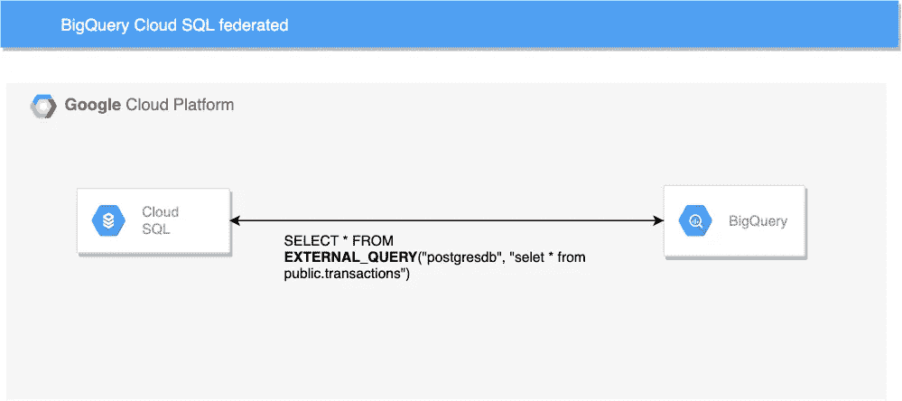
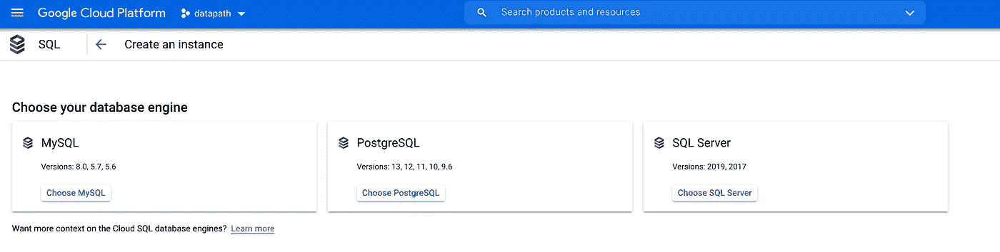
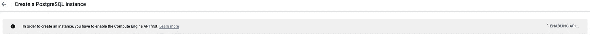
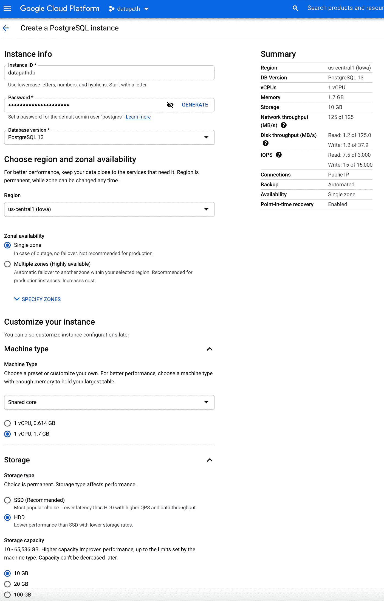
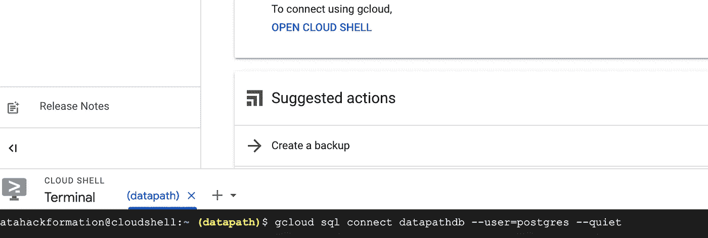
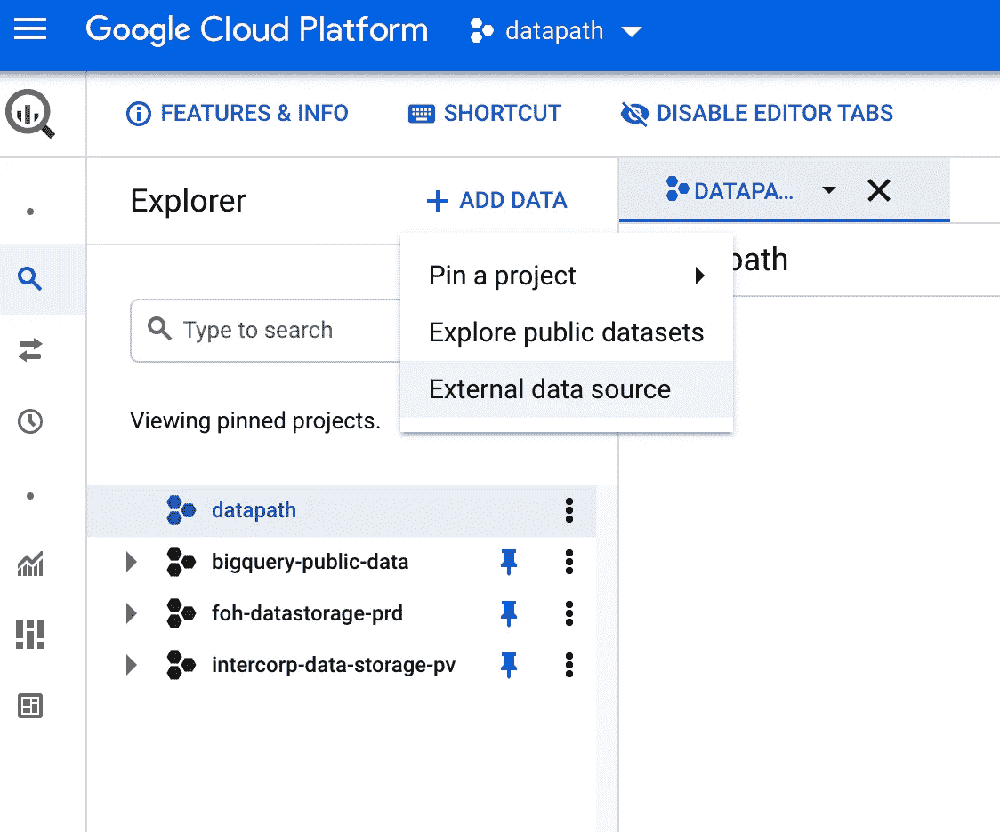
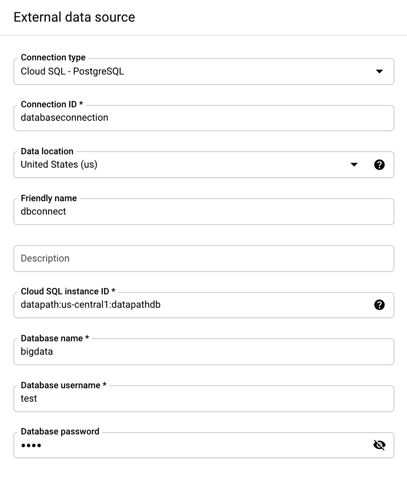
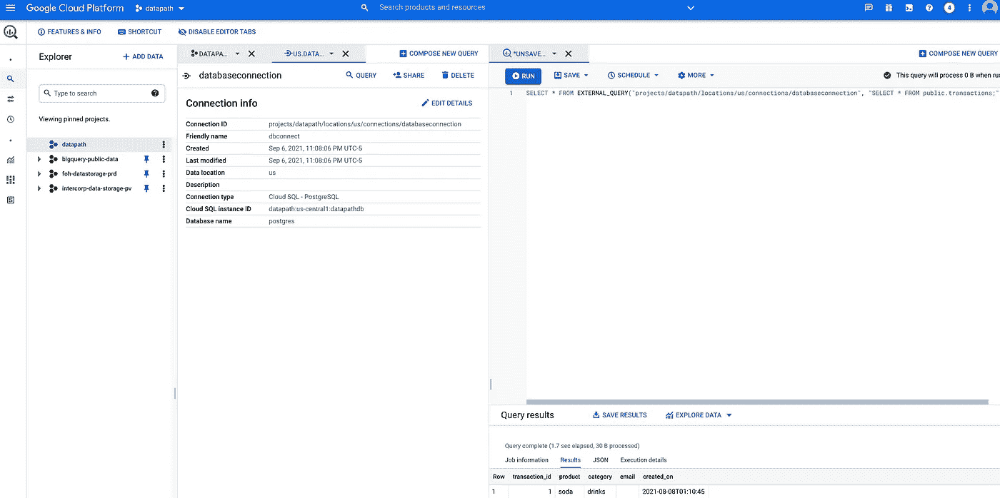

# 使用 BigQuery Cloud SQL Federation 加速您的 ELT

> 原文：<https://towardsdatascience.com/speed-up-your-elt-using-bigquery-cloud-sql-federation-90b3ede99472?source=collection_archive---------26----------------------->



作者图片

实时查询云 SQL 实例中的数据，减少 ELT 开发时间，避免复制和移动数据，这要归功于 BigQuery 云 SQL 联盟。

众所周知, [Cloud SQL](https://cloud.google.com/sql) 是一个完全托管的关系数据库服务，适用于 MySQL、PostgreSQL 和 SQL Server。这些类型的数据库面向宿主应用程序或事务性数据。[另一方面，BigQuery](https://cloud.google.com/bigquery) 支持分析工作负载。

在传统世界中，您必须开发一个数据管道来从应用程序的数据库中提取数据。让我们看看如何在 PostgreSQL 数据库中利用表联合。

# 循序渐进的案例

在这个场景中，我们作为数据工程师负责在分析区域(BigQuery)中启用来自事务数据库(云 SQL)的数据。这些数据可以被其他流程或其他角色使用，如数据科学家或机器学习工程师。

像往常一样，公司希望我们的团队可以立即使用最新生成的交易数据。

由于 BigQuery Cloud SQL Federation，我们能够实时查询 Cloud SQL 中的数据。这一特性为传统的[批量摄取](https://cloud.google.com/bigquery/docs/batch-loading-data)提供了新的替代方案。现在，我们可以使用创建当天或同一小时的数据。例如，Data Studio 上的报告可以显示过去一个小时的销售信息，最棒的是，如果您有使用 BigQuery 的经验，开始使用它并不困难。

**在你继续之前**

为了执行接下来的步骤，您需要一个谷歌云帐户。要开户，只需在 GCP 网站注册，自动获得 300 美元的信用。

# 在云 SQL 中

为了首先重现这个案例，我们创建了事务性数据库。在这个数据库中，我们将生成一个表来存放一个虚构商店的销售额。

让我们创建云 SQL 实例，在本例中是 PostgreSQL



作者图片

如果是第一次创建云 SQL，您需要启用计算引擎 API，这允许 GCP 代表您创建和管理计算引擎。只要看看窗口，点击蓝色按钮。



作者图片

在这种情况下，为新实例设置最小值。有了这些价值，我们保证了最便宜的价格。如果你想详细了解价格明细，请点击这里。

*   区域可用性:单一区域
*   机器类型:共享核心
*   存储:硬盘



作者图片

创建该实例大约需要 10 分钟。

然后让我们使用云外壳连接到实例。这是最容易连接的形式。记住你之前设置的密码就行了。存在其他选择，比如从本地机器使用[数据库客户机的连接。](https://cloud.google.com/sql/docs/mysql/connect-connectors)



作者图片

连接后，创建事务表。带有主键和其他常规字段的简单表。

此外，我们向表中插入一些数据。


作者图片

因此，我们有了 PostgreSQL 数据库和事务表，保留插入脚本，并在下一步模拟新事务后随意插入数据。

我们准备转移到我们的分析区域。

# 在 BigQuery 中

BigQuery 是我们的数据工程和数据科学团队花费大量时间来转换公司数据并从中获得洞察力的地方。

为了继续这个案例，BigQuery 需要与我们的云 SQL 实例建立连接。这个连接将允许我们查询刚刚插入的数据。

在浏览器中，打开另一个选项卡，进入 BigQuery 界面。

我们转到“添加数据”，然后单击“外部数据源”



作者图片

如果是第一次启用大查询连接 API。

在窗口的右边，会出现一个询问外部数据源的表单。添加您的连接 id(您需要从云 SQL 页面复制的字符串)、数据库名称和用户密码。

 **重要——联邦表只在同一个项目中起作用。这意味着您的云 SQL 实例和大查询联邦表需要在同一个项目中。
-仅适用于具有公共 IP 连接的云 SQL 实例。**

****

**作者图片**

**就这么简单。最好的情况是，CloudSQL tabla 中的每个更改都将反映在联邦表上，因此不需要运行提取管道。**

**最后，只需运行一个简单的查询！就像您观察到的查询表一样，您可以使用相同的 BigQuery UI，除了一个[特殊语法](https://cloud.google.com/bigquery/docs/federated-queries-intro#federated_query_syntax),因此所有的特性，如调度查询或保存都是允许的。**

****

**作者图片**

**另一个特性是，您不仅限于使用来自云 SQL 的数据，您可以将一个联邦查询结果与一个 BigQuery 表连接起来。这意味着您可以构建一个丰富的流程，从 PostgreSQL 中获取交易数据，并添加其他变量，如客户信息，以根据他们的购买情况发送特殊促销信息。**

```
SELECT a.customer_id, a.name, b.first_order_date
FROM bqdataset.customers AS a
LEFT OUTER JOIN EXTERNAL_QUERY(
  'projects/datapth/databaseconnection',
  '''SELECT * FROM public.transactions''') AS b
ON b.customer_id = a.customer_id
GROUP BY c.customer_id, c.name, rq.first_order_date;
```

# ****注意事项****

*   **[**定价**](https://cloud.google.com/bigquery/pricing#on_demand_pricing) **:** 根据外部查询返回的字节数向您收费(每 TB 5 美元)。**
*   **[**性能**](https://cloud.google.com/bigquery/docs/cloud-sql-federated-queries#limitations) : BigQuery 需要等待源数据库执行外部查询，并将数据从外部数据源临时移动到 BigQuery。**
*   **[**限制**](https://cloud.google.com/bigquery/docs/cloud-sql-federated-queries#data_type_mappings) : PostgreSQL 支持很多 BigQuery 不支持的非标准数据类型，比如`money`、`path`、`uuid or boxer.`**

# **结论**

**BigQuery Cloud SQL federation 是加速 ELT 开发的一个极好的特性。如果你想更进一步，我推荐你查看这篇关于增量数据接收管道的文章，然后回来重新思考这个小管道，为每日报告仪表板提供数据。**

**PS 如果你有任何问题，或者想要澄清什么，请给我发[电报](http://t.me/adataarchitectguy)、[脸书](https://www.facebook.com/dataarchitectguy)或 [LinkedIn](https://www.linkedin.com/in/antoniocachuan/) 或者我喜欢讨论数据😊**

# **参考**

*   **[https://cloud . Google . com/big query/docs/cloud-SQL-federated-queries](https://cloud.google.com/bigquery/docs/cloud-sql-federated-queries)**
*   **【https://cloud.google.com/bigquery/docs/batch-loading-data】**
*   **[https://cloud . Google . com/blog/products/data-analytics/optimizing-your-big query-incremental-data-ingestion-pipelines](https://cloud.google.com/blog/products/data-analytics/optimizing-your-bigquery-incremental-data-ingestion-pipelines)**
*   **[https://cloud . Google . com/big query/docs/federated-queries-intro # federated _ query _ syntax](https://cloud.google.com/bigquery/docs/federated-queries-intro#federated_query_syntax)**
*   **[https://cloud.google.com/sql/docs/postgres/quotas](https://cloud.google.com/sql/docs/postgres/quotas)**