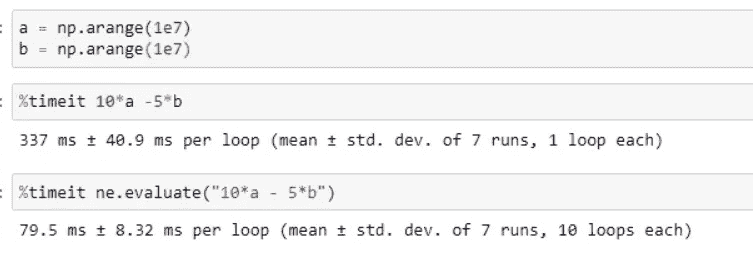
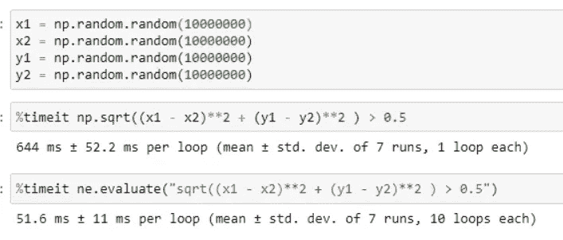
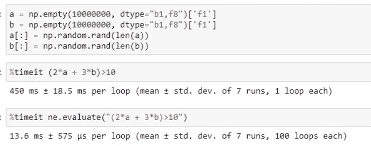

# 用 NumExpr 包加速你的 Numpy 操作

> 原文：<https://towardsdatascience.com/speed-up-your-numpy-operations-with-numexpr-package-1bead7f5b520?source=collection_archive---------23----------------------->

## 利用多线程功能加速您的数字运算

图片来自 [Pixabay](https://pixabay.com/?utm_source=link-attribution&amp;utm_medium=referral&amp;utm_campaign=image&amp;utm_content=4787149) 的 [Ashim Shres](https://pixabay.com/users/asimalways-15006432/?utm_source=link-attribution&amp;utm_medium=referral&amp;utm_campaign=image&amp;utm_content=4787149)

Numpy 是数据科学社区中一个流行的 Python 包，它提供了大量高级数学函数来操作这些多维数组。在数据科学案例研究中，经常会遇到对大型向量执行数学运算的情况。

Numpy 提供了快速和优化的矢量化函数来加速数学运算，但不涉及并行性。在本文中，我们将介绍 NumExpr 包，它是 NumPy 的一个快速数值表达式计算器。

# NumExpr 入门:

Numexpr 是一个完全基于 NumPy 1.6 中引入的新数组迭代器的开源 Python 包。Numexpr 计算作为参数传递给`**evaluate**`函数的字符串表达式。使用 Python 编译函数计算字符串函数，以找到变量和表达式。

例如，a 和 b 是两个 NumPy 数组。要添加这两个数组，需要传递`**numexpr.evaluate(“a+b”)**` ，其中`**a+b**`是字符串表达式。然后通过构建表达式的解析树来计算字符串表达式。这个解析树结构然后被编译成字节码程序，它描述了如何执行基于元素的操作。

## NumExpr 如何加速计算？

NumExpr 通过将符号赋值器数值 Python 表达式转换为高性能的矢量化代码，并在元素块中进行矢量化，而不是一次性编译所有内容，从而实现了并行性。

NumExpr 比 NumPy 实现了更好的性能，因为它避免了为中间结果分配内存，从而提高了缓存利用率并减少了一般的内存访问。还有，NumExpr 虚拟机完全是用 C 语言写的，这使得它比 Python 快。因此，NumExpr 最适合大型数组。

## 预期绩效:

根据 [NumExpr 文档](https://numexpr.readthedocs.io/projects/NumExpr3/en/latest/intro.html)，NumPy 运算的计算速度有望提高 2 到 4 倍。这完全取决于表达式的复杂性和操作符的内部优化。使用大型阵列或非对齐阵列时，性能可能会提高 20 倍。

# 实施:

NumExpr 包可以使用`**pip install numexpr**` 从 PyPI 安装。

## 简单的数学运算:

让我们从两个 NumPy 数组(a 和 b)的简单数学运算开始，每个数组都有 10⁷元素。与 Python 操作相比，我们使用 NumExpr 获得了几乎 4.2 倍的加速——从 337 毫秒到 79 毫秒。

(图片由作者提供)，与 NumExpr 的简单操作对比

## 逻辑运算:

在执行一些逻辑表达式和布尔过滤时，我们通过 NumExpr 获得了 13 倍的加速——从 644 毫秒到 52 毫秒。

(图片由作者提供)，与 NumExpr 的复杂逻辑运算比较

## 未对齐的数组操作:

对于未对齐的数组，与 Python NumPy 操作相比，加速要高得多。使用 NumExpr，我们可以实现大约 32 倍的增长

(图片由作者提供)，非对齐数组操作与 NumExpr 的比较

**配置:**

使用 NumExpr，您还可以使用`**numexpr.set_num_threads()**`函数指定内核的数量。

# 结论:

在本文中，我们讨论了一个开源 Python 包 NumExpr，它通过向量化元素块而不是一次性编译所有元素来实现并行性，从而加快数学运算的速度。与 NumPy 操作相比，速度可以提高 2 到 20 倍，具体取决于各种条件。

NumExpr 是一个很好的工具，可以加速大型数组的数学运算。

# 参考资料:

[1] NumExpr 文档:[https://nume xpr . readthedocs . io/projects/nume xpr 3/en/latest/intro . html](https://numexpr.readthedocs.io/projects/NumExpr3/en/latest/intro.html)

*喜欢这篇文章吗？成为* [*中等会员*](https://satyam-kumar.medium.com/membership) *继续无限制学习。如果你使用下面的链接，我会收到你的一小部分会员费，不需要你额外付费。*

> 感谢您的阅读