# 加快你基于熊猫的分析

> 原文：<https://towardsdatascience.com/speed-up-your-pandas-based-analysis-4836049d186e?source=collection_archive---------34----------------------->

## 通过亲身体验了解核心原则


作为一名 python-data scientist，您无疑对使用`pandas`进行数据分析很熟悉，这是一个用于处理类似表格的数据类型的 python 包，类似于`R`中的`Excel`、`SAS`、`SQL`或`data.table`、`dplyr`等规范工具。

要在`pandas`中进行分析，可走的路不止一条。即使对于有经验的数据科学家和 python 开发人员来说，基于传统方法选择的解决方案有时也可能不是最佳的，甚至在计算方面效率低下。

本文旨在向您介绍一个简单的用例，并定量地比较不同的编程方法。希望所讨论的比较可以为你在未来基于`pandas`的分析中挑选最优解提供一些定量的基础。

# 背景

给定一组随机点，我们的用例是将它们分类到不同的同心环中。

就算法而言，这个问题可以通过计算从每个点到区域中心的欧几里德距离，根据给定的容差对它们进行宁滨，并对它们进行标注来轻松解决。为了方便起见，我们将把标签作为颜色索引，以便在最后进行简单的可视化。基本上，初始结果(**左**)和最终结果(**右**)将是:


使用案例的目标—作者提供的图像

请记住，这种走查的主要目的不是用例本身，而是用于到达那里的方法，以及它们性能的**相对比较**。

# 分析

## 数据

我们将使用坐标`x`和`y`模拟一个包含 100k 个点的简单数据帧。

```
n = 100000
x = np.random.rand(n)
y = np.random.rand(n)
df = pd.DataFrame({'x': x, 'y': y})
df.head(4)
```

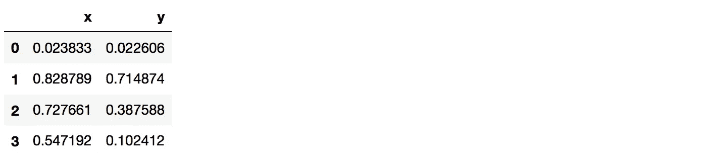

## 简单的应用方法

作为第一种方法，我们将使用`pandas`的内置`apply`函数将自定义函数`encode_color_v1`映射到每个数据帧的行。`encode_color_v1`的定义如下。

```
def **encode_color_v1**(ser: pd.Series, step: float = 0.1, ncolors: int = 7) -> int:
    r = np.sqrt((ser['x']-0.5)** 2 + (ser['y']-0.5)**2)
    return int(round(r/step)%ncolors)
```

基本上，我们计算到中心点的距离(0.5，0.5)，将距离绑定到每个`step`中，并根据颜色数量`ncolors`进行调制，稍后我们将使用这些颜色来可视化结果。

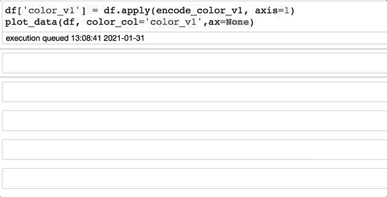

在每行上使用内置的“应用”和自定义函数

如图所示，我们用`apply`完成了工作。正如支持者指出的，代码语法相当清晰，实现映射的自定义函数并不需要花费太多时间。易用性是`apply`经常用于`pandas`分析管道的原因之一。

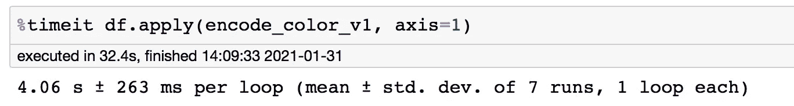

100k 行的“应用”方法的运行时

现在仔细一看，运行时间好像不是很快。对于 100k 行，在 MacOS、英特尔酷睿 i7、16GB DDR3 上用了 **4** s。当规模增大或计算需要重复多次时，这将成为一个实际问题。对于 1M 的行，它花费了 35.5 秒的 737 毫秒，而对于 10M 的行，它变得长得可笑，超过了 6.5 分钟。

让我们用`ipython`魔法命令`%prun`检查一下主要耗时步骤。

```
%prun -l 5 df.apply(encode_color_v1, axis=1)
```

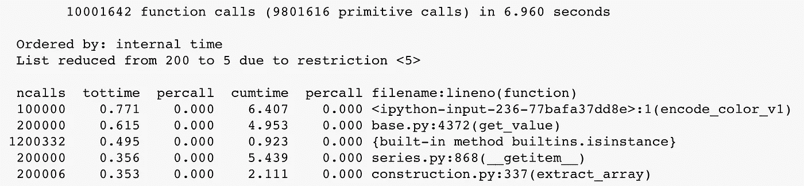

应用方法的时间配置文件

正如我们所看到的，主要花费时间在我们的自定义函数`encode_color_v1` (100k *ncalls* ，6.4s *cumtime* )上，所以任何重大的加速都必须处理这个问题。

有两个显著的观察结果:

*   内置的 python 函数`get_value`花费了大量的时间
*   使用`__getitem__`、`get_value`对与数据帧长度(如 10k)成比例的不同函数进行多次重复调用(`ncalls`)

这是因为在 sence 后面，`apply`函数会将沿着所提供的轴的每一行转换成一个`pandas.Series`，并在 dataframe 中的所有行上循环。

因此，我们可以在两个主轴上对此进行优化:

*   避免转换到`Series`的开销
*   避免循环

让我们从第一次优化开始。

## 内部循环

这里的想法是避免将每一行数据转换到`pandas.Series`，其时间足迹可以在上面看到，例如`__getitem__`、`get_value`。为此，我们将重写自定义函数，将输入作为 numpy 向量，并在每个索引上循环。

```
def **encode_color_v2**(x: np.ndarray, y: np.ndarray,
                    step: float = 0.1, ncolors: int = 7) -> int:
    n = len(x)
    res = np.empty(n, dtype=int)
    for i in range(n):
        r = np.sqrt((x[i]-0.5)** 2 + (y[i]-0.5)**2)
        res[i] = int(round(r/step)%ncolors)
    return res
```

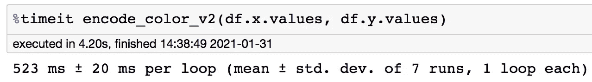

跳过转换为熊猫时运行时间更短。系列

如图所示，我们轻松获得了 8 倍的加速。这清楚地表明了熊猫的转换和使用所带来的开销。使用`apply`功能时的系列。在这种情况下，这似乎是显而易见的，但在实践中，尤其是当处理包含`str`记录的数据帧时，许多从业者没有意识到或注意到这种开销。

现在，让我们再次检查时间配置文件。

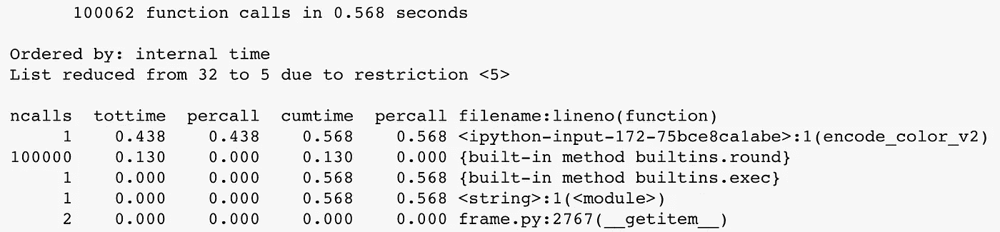

时间曲线显示了循环的影响，例如 100k 次调用。

如你所见，我们找不到`__getitem__`、`get_value`的开销。然而，我们仍然可以看到循环的影响，例如，在上面的第二行，100k 倍的`ncalls`。

让我们向量化我们的自定义函数。

## 矢量化

基本上，我们将利用输入的向量性质，并使用向量计算来代替循环。

```
def **encode_color_v3**(x: np.ndarray, y: np.ndarray,
                    step: float = 0.1, ncolors: int = 7) -> int:
    r = np.sqrt((x-0.5)** 2 + (y-0.5)**2)
    return ((r/step)%ncolors).astype(np.int32)
```

如前所述，我们可以通过 numpy 矢量化显著减少运行时间。

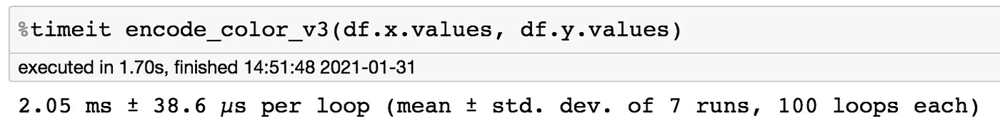

通过矢量化进一步加速计算

就时间剖面而言，我们在我们执行计划中看不到任何明显的缺陷。现在唯一真正需要时间是自定义函数的执行。

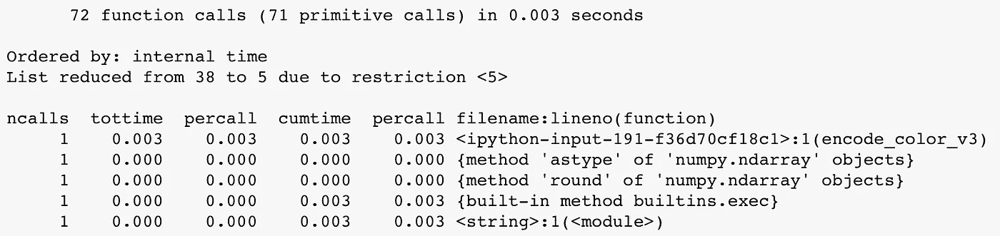

时间配置文件显示主要时间消耗在自定义功能的执行中

## 用 Numba 加速

让我们继续用编译函数来挤压性能。有人可能会想到通过`Cython`使用 C 预编译功能，然而，更简单的方法是通过`Numba`使用基于低级虚拟机(LLVM)的`JIT-compilation`。更详细的解释可以在我的另一个帖子[这里](/why-numba-sometime-way-slower-than-numpy-15d077390287)找到。

```
from numba import njit[@njit](http://twitter.com/njit)(cache=True)
def **encode_color_v4**(x: np.ndarray, y: np.ndarray,
                    step: float = 0.1, ncolors: int = 7) -> int:
    r = np.sqrt((x-0.5)** 2 + (y-0.5)**2)
    return ((r/step)%ncolors).astype(np.int32)
```

与使用`numpy`矢量化的解决方案的主要不同之处在于，我们只是从导入的`numba`中添加了一个装饰器`'@jit'`。

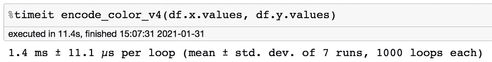

使用简单的 njit 装饰器，速度提高 25%

我们可以很容易地看到，自定义功能的执行时间在`numba`版本中减少了(与`numpy`版本的时间配置文件中的 3ms 相比，为 2ms)。

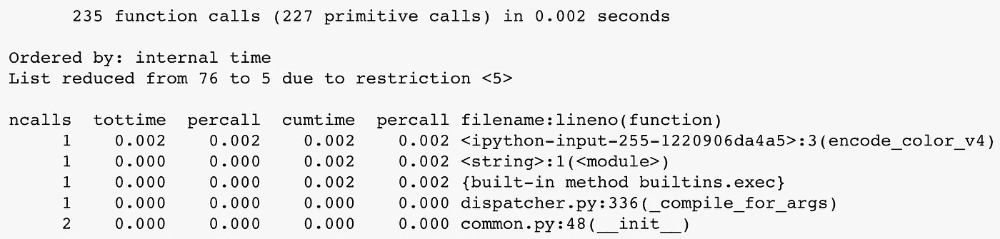

我们可以从这里开始，为我们的用例找到一个相当好的计时解决方案。然而，为了增加额外的好奇，让我们走得更远一点！

## 优化数字

这里优化的想法是相当反直觉的。我们从减少循环的逻辑开始我们的旅程，并试图从矢量化中获益。然而，并不是每个人都知道内存分配的成本。

在 numpy 矢量化计算中，经常会将中间结果保存到新的时态变量中，从而需要分配新的内存块。最终的问题是函数调用时间和内存分配时间之间的权衡。这并不总是显而易见。

在`numba`的情况下，`jit-compiled`函数的加载时间很快(例如，与 python `bytecode`函数的加载时间相比)，并且它们的时间成本不如分配大数据矢量化计算所需的大内存块重要。

让我们把它具体化。我们将重新编码我们的自定义函数，但是通过每个元素使用一个循环，而不是整个向量。

```
from numba import njit[@njit](http://twitter.com/njit)(cache=True)
def **encode_color_v5**(x: np.ndarray, y: np.ndarray,
                    step: float = 0.1, ncolors: int = 7) -> int:
    n = len(x)
    res = np.empty(n, dtype=np.int32)
    for i in range(n):
        r = np.sqrt((x[i]-0.5)** 2 + (y[i]-0.5)**2)
        res[i] = int(round(r/step)%ncolors)
    return res
```

令人惊讶的是，我们的执行时间更短了。

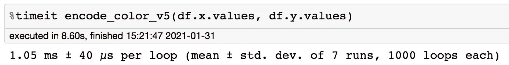

自定义函数的优化 numba 版本可实现 2 倍加速


优化 numba 版本的时间配置文件

关于这一时间收益的深入讨论值得另发一篇专稿。现在，请保持函数调用和内存分配之间的平衡。

# 最终注释

作为那些经常使用`pandas`进行日常分析的人之一，我承认直到最近我才意识到这里讨论的几个方面。我希望这篇文章对其他人有所帮助，或者至少为进一步优化打下一些基础。

实际上，我们并不总是需要从代码中挤出每一秒钟。一个清晰的语法，易于书写、阅读和被他人理解，比优化后的代码更重要。然而，对于具有大数据集的工业化版本，对一些定制函数的多次调用，那么高效的代码可能是一个重要因素。

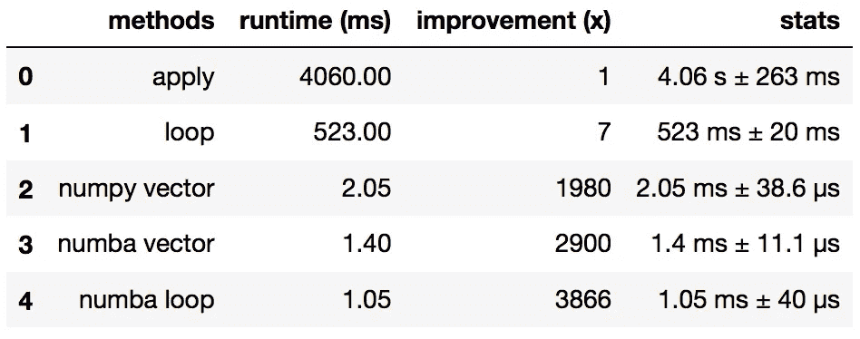

不同方法的运行时间和增益总结

在整个使用案例中，我们要传达的信息是:

*   循环和转换为熊猫。使用内置`apply`功能时，系列是速度缓慢的主要原因。
*   尽可能避免使用`apply`。
*   尽可能向量化你的函数。
*   当`numba`支持自定义功能时使用`numba`(基本上大部分 numpy 功能)。
*   对于大型数据集，内存分配成本很高，因此最好使用带有编译函数的循环。

非常感谢你的阅读。像往常一样，如果你有任何意见和建议，请告诉我。

## 参考

【1】[深度潜入](/why-numba-sometime-way-slower-than-numpy-15d077390287)`[numba](/why-numba-sometime-way-slower-than-numpy-15d077390287)`[vs](/why-numba-sometime-way-slower-than-numpy-15d077390287)`[numpy](/why-numba-sometime-way-slower-than-numpy-15d077390287)` 【2】[熊猫官方纪录片](https://pandas.pydata.org/pandas-docs/stable/reference/api/pandas.DataFrame.apply.html)