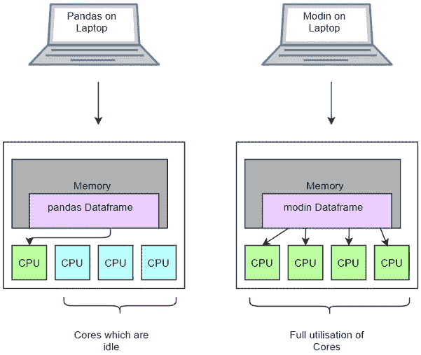
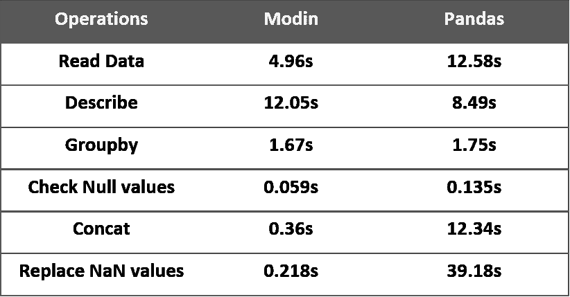

# 通过改变一行代码来加速你的熊猫工作流程

> 原文：<https://towardsdatascience.com/speed-up-your-pandas-workflow-by-changing-a-single-line-of-code-11dfd85efcfb?source=collection_archive---------5----------------------->

## 使用 Modin 扩展您的数据探索和可视化


蒂姆·高在 [Unsplash](https://unsplash.com?utm_source=medium&utm_medium=referral) 上拍摄的照片

Pandas 是用于数据探索和可视化的最流行的 Python 库之一。Pandas 提供了大量的内置功能，使得执行数据探索变得更加容易。但是当处理大型数据集时，它失败了，因为它使用单核 CPU 执行所有操作。熊猫没有利用所有可用的 CPU 核心来扩大计算规模。

所有可用的 CPU 内核都可以用来提升大型复杂计算的性能和时间复杂度。有各种开源库，如 Vaex、Dask、Modin 等，可以使用 CPU 的所有内核来提升性能。CPU 内核的充分利用节省了数据科学家的大量时间，因为它减少了计算时间。

阅读文章下面的[，了解如何使用 Vaex 处理有 2 亿条记录的数据集。](/process-dataset-with-200-million-rows-using-vaex-ad4839710d3b)

[](/process-dataset-with-200-million-rows-using-vaex-ad4839710d3b) [## 使用 Vaex 处理具有 2 亿行的数据集

### 使用 vaex 数据框对大型数据集执行操作

towardsdatascience.com](/process-dataset-with-200-million-rows-using-vaex-ad4839710d3b) 

在本文中，您可以了解如何使用 Modin 提升 Pandas 库计算的性能，只需更改一行代码。

# 摩丁是什么？

Modin 是一个开源的 Python 库，它通过将操作分布在 CPU 的多个核心上来加速 Pandas 的工作流程。与其他分布式库不同，Modin 可以很容易地与 Pandas 库集成和兼容，并具有类似的 API。

开发人员不需要担心指定 CPU 内核的可用性，也不需要提供如何分发数据。摩丁通过将计算分配到 CPU 的多个内核来处理所有这些。

## 安装和使用:

可以使用 PyPl 安装 Modin:

```
**pip install modin**
```

安装库后，导入库以进一步使用它:

```
**import** **modin.pandas** **as** **md**
```

这只是为了提升熊猫的性能而对代码进行的一行修改。摩丁的 API 和熊猫的很像，开发者不用担心学习或者搜索。

# 摩丁是如何在引擎盖下工作的？

使用 Pandas 对数据帧的操作很慢，因为它使用单核 CPU 来执行计算，而没有利用多核 CPU。现代笔记本电脑有许多内核，可以并行使用来提升性能。摩丁做了同样的事情，它利用了 CPU 的所有核心，并将其计算分配到 CPU 的多个核心中，这有助于加快性能。



([来源](https://www.youtube.com/watch?v=-HjLd_3ahCw))，熊猫和摩丁的 CPU 核心利用率

对于拥有大量 CPU 内核的大型数据科学工作站或集群，Modin 性能呈指数级增长，如下所示充分利用 CPU 内核。

# API 覆盖范围:

摩丁使用 Ray 或 Dask 引擎来加速计算。在 API 覆盖上，大部分常用的 API 都被摩丁覆盖了，巨大的开发量要覆盖剩下的功能。

```
**About,
91% of API’s are covered for Pandas Dataframe.
88% of API’s are covered for Pandas Series.**
```


([来源](https://github.com/modin-project/modin))，摩丁 API 覆盖率

# 基准时间限制:



(图片由作者提供)，摩丁和熊猫之间的基准时间数

# 结论:

在观察了基准时间数字后，我们可以得出结论，与熊猫相比，摩丁的操作更快。摩丁分配计算并最大限度地利用 CPU 内核。还有各种其他的分布式库也有类似于 Pandas 的 API，包括 Dask、Vaex、Pandarallel 等等。

# 参考资料:

[1]摩丁文献:【https://modin.readthedocs.io/en/latest/】T4

[2]熊猫文献:[https://pandas.pydata.org/docs/](https://pandas.pydata.org/docs/)

> 感谢您的阅读