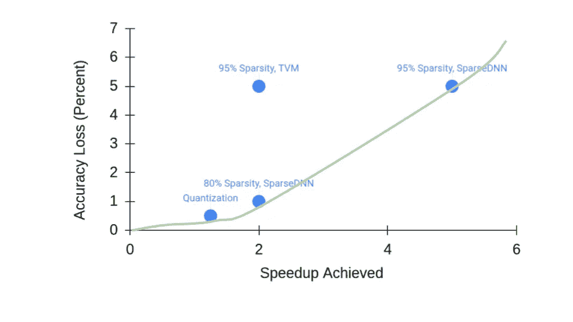

# 加速伯特推理:量化与稀疏

> 原文：<https://towardsdatascience.com/speeding-up-bert-inference-different-approaches-40863b2954c4?source=collection_archive---------16----------------------->

来自 Unsplash 的 Joshua Hoehne

**简介**

最近，变压器和类似变压器的架构已经成为 NLP 的事实上的最新技术。伯特就是一个很好的例子。BERT 和它的各种表亲如 RoBERTa 和 AlBERT 从文本序列中产生嵌入。然后，嵌入可以用于各种下游任务，如分类、语义相似性或问答，在其中一些任务中实现接近人类水平的性能。

BERT(以及最先进的 NLP)的一个大问题是，这种伟大的人类水平不是免费的。这通常表现为客户的长时间延迟和每月的巨额 AWS 账单。

许多努力试图解决这一挑战。批处理查询，允许灵活的序列长度和智能的客户机/服务器工作划分可以走很长的路。但是有没有方法可以加速实际的伯特推理本身呢？在这篇文章中，我假设我们正在处理一个 CPU 后端，这是最常见的情况。

**使用正确的库**

第一步可能是从 Tensorflow 或 Pytorch 切换到 Onnx 或 OpenVINO 的更好的**免费**库。根据您的 Tensorflow/Pytorch 版本和特定的硬件，这一步可能是我在这里讨论的所有内容中最大的节省。流行的 Huggingface 库正在不断地与 Onnx 集成，所以请查看那里的最佳实践。

**这意味着你应该注意商业工具**他们声称可以提高 Tensorflow/Pytorch 的推理速度，但没有提到 Onnx 或 OpenVINO 基准！理想情况下，您还需要查看 Onnx/OpenVINO 版本，因为只有较新的版本包含针对 Transformer 的优化。

**量化**

假设你现在运行 Onnx 或者 OpenVINO，你如何进一步推动性能？首先要尝试的可能是量子化。这仅仅意味着用 int8 权重替换模型中的浮点权重。这通常可以节省大量的内存空间，但是**这可能不会节省太多的执行时间！**

这一不幸的事实是因为在 AVX512-VNNI 推出之前，英特尔(和 AMD) CPU 的矢量单元不能对 int8 数据进行本机操作，至少不能以对深度学习推理有用的方式进行操作。AWS 上的绝大多数云 CPU 目前不支持 AVX512-VNNI。仅有的起价为 c5.12xlarge 的产品，在成本规划方面可能无法为您提供很大的灵活性。

例如，在具有 c5.2xlarge 的单核上执行 BERT-base，使用 Onnx，量化仅导致 25%的加速。相比之下，c5.12xlarge 上的 AVX512-VNNI 内核的加速约为 250%。

量化的一个好处是你通常只损失不到 1%的精度。它也很好地集成到大多数深度学习框架中，所以很容易尝试:[https://colab . research . Google . com/github/py torch/tutorials/blob/GH-pages/_ downloads/dynamic _ quantization _ Bert _ tutorial . ipynb](https://colab.research.google.com/github/pytorch/tutorials/blob/gh-pages/_downloads/dynamic_quantization_bert_tutorial.ipynb)。

**修剪**

量化的替代方法是修剪。修剪在权重矩阵中引入了零(也称为稀疏度)，保证了内存和计算的节省。例如，Huggingface 最近的一项工作 pruneBERT 能够在 BERT 上实现 95%的稀疏性，同时为下游任务进行微调。麻省理工学院彩票假说团队的另一项有前途的工作表明，人们可以获得 70%稀疏预训练的 BERTs，在下游任务的微调方面实现类似于密集 BERTs 的性能。Tensorflow 和 Pytorch 都支持进行修剪。

然而，通过修剪获得加速比量化更具挑战性，因为 CPU 不太喜欢稀疏计算。事实上，据我所知，Pytorch 的稀疏矩阵密集矩阵乘法只有在稀疏矩阵包含超过 98%的零的情况下才比密集-密集版本更快！通常，在不损失太多准确性的情况下，人们最多可以承受 90%或 95%的稀疏度。

最近的解决方案，如 OctoML 的 TVM，已经开始解决稀疏推理问题:[https://medium . com/OctoML/using-sparsity-in-Apache-TVM-to-halve-your-cloud-bill-for-NLP-4964 EB 1c E4 f 2](https://medium.com/octoml/using-sparsity-in-apache-tvm-to-halve-your-cloud-bill-for-nlp-4964eb1ce4f2)。虽然只给出了与 Tensorflow 的比较，但 pruneBERT 上近 2 倍的加速似乎相当有希望。遗憾的是，它似乎只适用于 AMD CPUs，可能是因为它没有针对特定于英特尔 CPU 的 AVX512 进行优化。

Neuralmagic 是一家麻省理工学院的初创公司，专门加速稀疏神经网络。虽然他们报告的性能很好，但不幸的是，他们目前只支持计算机视觉模型。

我将在这里为我的库 SparseDNN 添加一个广告，它(我相信)为类似 BERT 的模型提供了目前市场上最好的稀疏推理性能:[https://arxiv.org/abs/2101.07948](https://arxiv.org/abs/2101.07948)。SparseDNN 为 pruneBERT 提供了**5 倍**的加速，适用于英特尔和 AMD 的 CPU。SparseDNN 还为 ResNet 和 MobileNet 等流行的计算机视觉网络提供加速。

值得注意的是，目前没有库可以同时利用量化和修剪。(知道的请评论。)SparseDNN 提供了实验支持，但是它的稀疏 INT8 内核只比浮点内核快一点点。

**底线**

在本文中，我以 BERT 为例，按照难度增加的顺序介绍了几种提高神经网络性能的方法。在实践中应该如何决定采用哪种方法？这完全取决于特定应用的精度-加速比权衡。直觉上，如果你愿意牺牲更多的准确性，你可以加快你的神经网络。

本文中提到的几种应用于 BERT 的方法的精度-加速权衡如上图所示。该设置假设我们使用一个不带 AVX512-VNNI 的 CPU 内核。理想情况下，你想坐在右下角，低精度损失和高加速。绿线是优化选项的帕累托最优边界。

这篇文章绝不是神经网络优化的详尽指南。比如量化不限于 int8，我甚至没有涉及结构化剪枝。新的硬件选项，如 AWS Graviton 和推理，也提供了有趣的依赖于架构的权衡。但是希望它能给你一些初步的想法和一个心理框架来比较不同的优化方法。

**Github 针对稀疏 NN 的回购**:【https://github.com/marsupialtail/sparsednn】T4