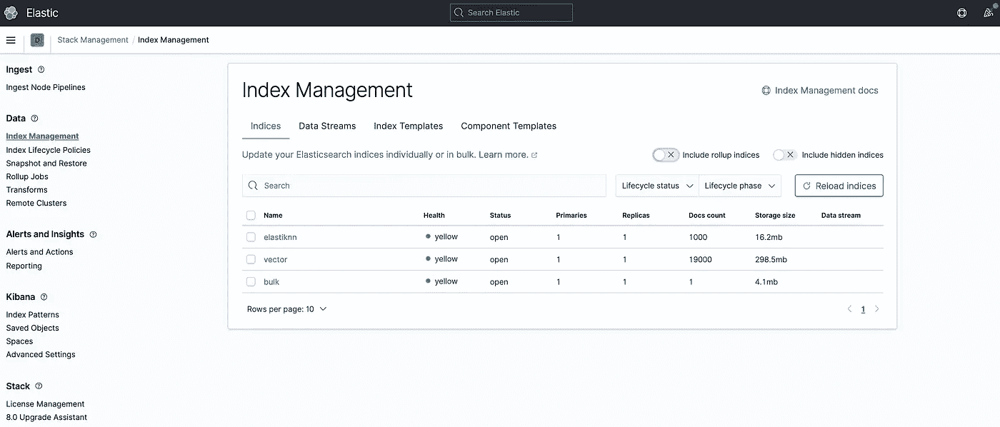
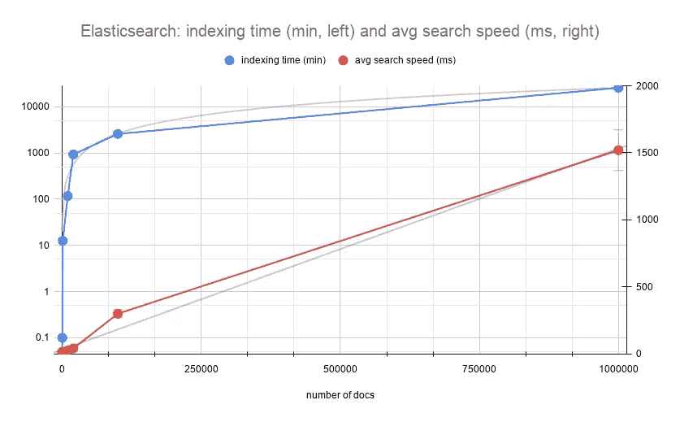
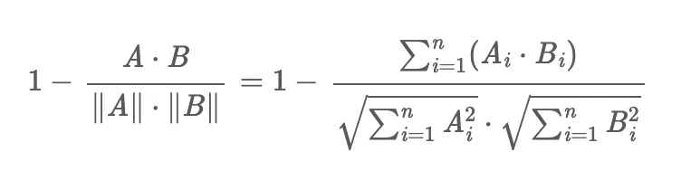
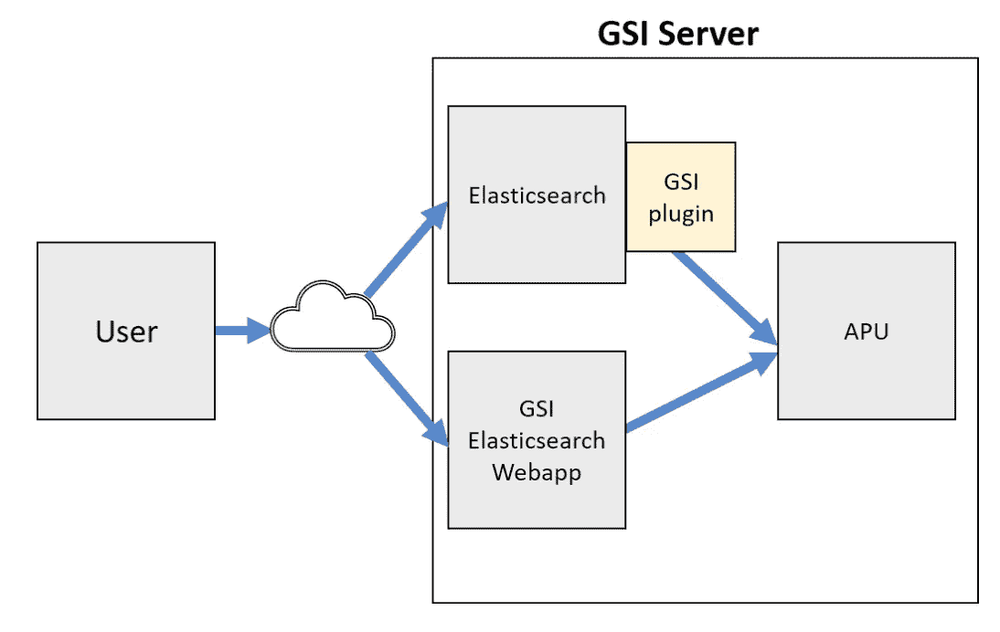
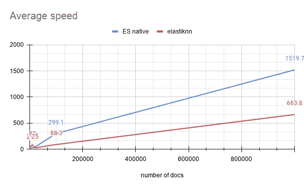
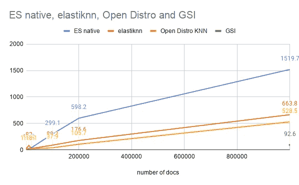

# 加速弹性研究中的 BERT 搜索

> 原文：<https://towardsdatascience.com/speeding-up-bert-search-in-elasticsearch-750f1f34f455?source=collection_archive---------6----------------------->

## [理解大数据](https://towardsdatascience.com/tagged/making-sense-of-big-data)

## 弹性搜索中的神经搜索:从香草到 KNN 到硬件加速


伯特(图片来自 [Flickr](https://www.flickr.com/photos/chrisinphilly5448/2056434980/) ，经 CC BY-SA 2.0 许可/背景被作者弄模糊)

在我之前的两篇关于 BERT 之旅的博客文章中:[用 BERT 和 Solr 进行神经搜索](https://dmitry-kan.medium.com/neural-search-with-bert-and-solr-ea5ead060b28)和[用 Apache Lucene 和 BERT 进行娱乐](https://medium.com/swlh/fun-with-apache-lucene-and-bert-embeddings-c2c496baa559)我已经向您介绍了如何在 Solr 中实现由 BERT 支持的语义搜索(事实上，您可以插入除 BERT 之外的任何其他密集嵌入方法，只要它输出浮点向量；二进制向量也可以工作)。虽然用像 BERT 这样的技术来增强你的搜索体验感觉很酷也很现代，但是让它具有高性能对于产品化来说仍然很重要。你希望你的搜索引擎运营团队在真实的行业环境中快乐。你希望你的用户喜欢你的搜索解决方案。

Devops 非常关心磁盘大小、RAM 和 CPU 消耗。在一些公司，他们也关心用电量。数百万或数十亿用户和数十亿文档的规模并不便宜。

在使用 BERT 和 Solr 的[神经搜索](https://dmitry-kan.medium.com/neural-search-with-bert-and-solr-ea5ead060b28)中，我确实在处理 BERT 时测量了*时间*和内存消耗，其中*时间*用于索引和搜索。随着时间的推移，出现了一些令人不快的意外。

*搜索*时间实际上是文档数量的函数，因为从算法复杂性的角度来看，它需要 O( *n* )，其中 *n* 是索引中文档的总数。如果您正在索引数百万个文档，这很快就会变得难以处理，而且更重要的是:您并不真的想要向您的用户交付 *n* 个文档:没有人会有时间去查看数百万个文档来响应他们的搜索。那么，为什么要费心去给所有的 *n* 打分呢？我们之所以需要访问所有的 *n* 个文档，是因为我们事先不知道这些文档中的哪些文档将根据文档和查询密集向量之间的点积或余弦距离与查询相关。

在这篇博文中，我将把 BERT 密集嵌入技术应用于 elastic search——许多公司选择的流行搜索引擎。我们将着眼于实现普通的矢量搜索，然后在矢量搜索方面向 KNN 迈出一大步——测量我们前进的每一步。

由于有大量博客文章讨论了使用弹性搜索的矢量搜索的复杂性，我想:这篇博客文章能给你什么独特的视角，我不知疲倦的读者？这就是你今天将得到的:我将与你分享一个在 Elasticsearch 中处理向量搜索的鲜为人知的解决方案:使用由 GSI 实现的[关联处理单元(APU)。我得到了这个独特的系统，它不仅关心大规模查询向量的速度，还关心消耗的瓦特数(我们确实希望对我们的星球生态友好！).听起来很刺激？让我们投入进去吧！](https://medium.com/gsi-technology/scalable-semantic-vector-search-with-elasticsearch-e79f9145ba8e)

# Elasticsearch 自己实现的向量搜索

Elasticsearch 在内部使用 Apache Lucene 作为搜索引擎，因此许多底层概念、数据结构和算法(如果不是全部)同样适用于 Solr 和 Elasticsearch。记录在[https://www . elastic . co/blog/text-similarity-search-with-vectors-in-elastic search](https://www.elastic.co/blog/text-similarity-search-with-vectors-in-elasticsearch)中的向量搜索方法与我们在 Solr 中观察到的限制完全相同:它将检索所有匹配搜索标准的文档(关键字查询以及文档属性过滤器)，并根据选择的向量相似性(余弦距离、点积或 L1/L2 范数)对所有文档进行评分。也就是说，向量相似性将不会在检索过程中使用(第一步，也是最昂贵的一步):而是在文档评分过程中使用(第二步)。因此，由于您无法预先知道要获取多少个语义最相关的文档，因此向量搜索的数学思想并没有真正应用。

等等，它与基于 TF-IDF 或 BM25 的搜索有何不同——为什么我们不能对矢量搜索使用相同的技巧？对于 BM25/TF-IDF 算法，您可以在索引阶段预先计算一组信息以帮助检索:术语频率、文档频率、文档长度，甚至术语在给定文档中的位置。使用这些值，可以在检索步骤中非常有效地应用*评分过程。但是您不能在索引阶段应用余弦或点积相似性:您不知道您的用户将向您发送什么查询，因此无法预计算查询嵌入(除了电子商务中的一些情况，在这些情况下您*可以*知道这一点，因此预计算一切)。*

但是回到实践。

要运行 vanilla Elasticsearch index 的索引器，触发以下[命令](https://github.com/DmitryKey/bert-solr-search/blob/master/src/index_dbpedia_abstracts_elastic.py):

```
time python src/index_dbpedia_abstracts_elastic.py
```

如果您想重现实验，请记住更改 MAX_DOCS 变量，并将其设置为需要索引的文档数。

就像每一项新技术一样，我设法运行了我的弹性搜索[索引器](https://github.com/DmitryKey/bert-solr-search/blob/bert-es-search/src/index_dbpedia_abstracts_elastic.py)代码，遇到了一个问题:索引在索引过程中变成了只读，并且无法前进！原因很好解释[这里](https://stackoverflow.com/questions/50609417/elasticsearch-error-cluster-block-exception-forbidden-12-index-read-only-all)，一言以蔽之:你需要确保至少 5%的空闲磁盘空间(如果你有一个 1 TB 的磁盘，51.5！)以避免这个讨厌的问题，或者需要关闭这个保护功能(不推荐用于生产部署)。

错误如下所示:

```
{‘index’: {‘_index’: ‘vector’, ‘_type’: ‘_doc’, ‘_id’: ‘100’, ‘status’: 429, ‘error’: {‘type’: ‘cluster_block_exception’, ‘reason’: ‘index [vector] blocked by: [TOO_MANY_REQUESTS/12/disk usage exceeded flood-stage watermark, index has read-only-allow-delete block];’}
```

在这种情况下，您可以求助于 ki Bana——UI 工具，它从单纯的数据可视化发展到安全性和索引管理、警报和可观察性功能。在这篇博文中，我一直在收集索引大小信息，并通过索引管理仪表板检查索引设置和映射:



用于检查弹性搜索索引的索引管理仪表板:健康状况、文档数量、存储大小以及索引是否开放更新(图片由作者提供)

如果你仍然想摆脱这个限制，你可以在 Kibana 开发工具中尝试这样的东西(为你的用例选择合适的值——但是要小心“cluster . routing . allocation . disk . watermark . flood _ stage”值，因为如果它太低，你的操作系统可能会遇到稳定性问题——咨询[官方文档](https://www.elastic.co/guide/en/elasticsearch/reference/master/modules-cluster.html#disk-based-shard-allocation)):

```
PUT _cluster/settings
{
  "transient": {
    "cluster.routing.allocation.disk.watermark.low": "100gb",
    "cluster.routing.allocation.disk.watermark.high": "50gb",
    "cluster.routing.allocation.disk.watermark.flood_stage": "10gb",
    "cluster.info.update.interval": "1m"
  }
}
```

索引后，我运行了 10 个查询来测量平均速度。我还记录了索引所用的时间(包括从文本计算向量的时间)以及每个 N=100、200、1000、10000 和 20000 的索引的大小。我没有记录瓦特消耗，这可能是下一个实验的一个有趣的想法。



索引时间与搜索时间作为文档数量的函数(普通弹性搜索，按作者分类的图片)

下面是上图背后的原始表格:

由于在 bert-as-service 中索引是由单个工作人员完成的，因此索引时间呈指数增长，而搜索速度与文档数量呈次线性增长。但是这有多实际呢？对于 20k 的短摘要，搜索 40ms 似乎太高了。索引大小线性增长，这也是一个令人担忧的因素(记住，您的 devops 团队可能会担心，您需要证明您的算法的有效性)。

因为索引这么慢变得不切实际，所以我必须找到另一种方法来计算向量(大部分时间都花在计算向量上，而不是索引它们:我很快就会用实验证明这一点)。所以我看了看拥抱人脸库，它允许使用暹罗伯特网络索引句子嵌入，这里描述了。在拥抱脸的情况下，我们也不需要使用 http 服务器，不像在 bert-as-service 中。下面是一个示例代码:

```
from sentence_transformers import SentenceTransformersbert_model = SentenceTransformer('bert-base-nli-mean-tokens')def compute_sbert_vectors(text):
    *"""
    Compute Sentence Embeddings using Siamese BERT-Networks: https://arxiv.org/abs/1908.10084* ***:param*** *text: single string with input text to compute embedding for* ***:return****: dense embeddings
    numpy.ndarray or list[list[float]]
    """* return sbert_model.encode([text])
```

SBERT 方法计算嵌入的速度比 bert-as-service 快 6 倍**。实际上，1M 向量使用 bert-as-service 需要 18 天，使用 SBERT 和拥抱脸需要 3 天。**

# **在向量搜索方面，我们可以比 O( *n* )做得更好**

**并且该方法是使用 KNN 算法在最近的向量子空间中有效地寻找文档候选。**

**我采用了开源软件中的两种方法:Alex Klibisz 的 elastiknn 和 AWS 支持的 Elasticsearch 开放发行版的 k-NN:**

1.  **[https://github.com/alexklibisz/elastiknn](https://github.com/alexklibisz/elastiknn)**
2.  **[https://github.com/opendistro-for-elasticsearch/k-NN](https://github.com/opendistro-for-elasticsearch/k-NN)**

**让我们在所有三个维度上将我们的标准矢量搜索与这些 KNN 方法进行比较:**

*   **索引速度**
*   **最终索引大小**
*   **搜索速度**

# **KNN:弹性蛋白方法**

**我们首先需要安装 elastiknn 插件，你可以从[项目页面](https://github.com/alexklibisz/elastiknn)下载:**

```
bin/elasticsearch-plugin install file:////Users/dmitrykan/Desktop/Medium/Speeding_up_with_Elasticsearch/elastiknn/elastiknn-7.10.1.0.zip
```

**要在索引上启用 elastiknn，您需要配置以下属性:**

```
PUT /my-index
{
  "settings": {
    "index": {
      "number_of_shards": 1,          # 1  
      "elastiknn": true               # 2

    }
  }
}
```

****# 1** 指的是索引中的分片数量，分片是加速查询的方法，因为它将在每个分片中并行执行。**

****# 2**elastic KNN 使用二进制 doc 值来存储向量。将此变量设置为 true 可以显著提高 Elasticsearch 版的速度，因为它更喜欢不压缩文档值的 [Lucene70DocValuesFormat](https://github.com/apache/lucene-solr/blob/master/lucene/backward-codecs/src/java/org/apache/lucene/backward_codecs/lucene70/Lucene70DocValuesFormat.java) ，而不是使用压缩的 [Lucene80DocValuesFormat](https://github.com/apache/lucene-solr/blob/061b3f29c99cf4070677eeaf4525ff6f9fff0a56/lucene/core/src/java/org/apache/lucene/codecs/lucene80/Lucene80DocValuesFormat.java#L143) ，这样可以节省磁盘空间，但会增加读取文档值的时间。这里值得一提的是，从 Lucene 8.8 开始，Lucene80DocValuesFormat 提供以压缩比换取更好的速度，反之亦然(相关 jira:[https://issues.apache.org/jira/browse/LUCENE-9378](https://issues.apache.org/jira/browse/LUCENE-9378)，这个版本的 Lucene 用于[elastic search 8 . 8 . 0-alpha 1](https://www.elastic.co/guide/en/elasticsearch/reference/master/release-notes-8.0.0-alpha1.html))。所以最终这些好东西会同时登陆 Solr 和 Elasticsearch。**

**有很多相似性不同的索引和搜索选项——我推荐学习写得很好的[文档](https://elastiknn.com/)。**

**要运行 elastiknn 索引的索引器，触发以下[命令](https://github.com/DmitryKey/bert-solr-search/blob/master/src/index_dbpedia_abstracts_elastiknn.py):**

```
time python src/index_dbpedia_abstracts_elastiknn.py
```

**下表总结了 elastiknn 的索引和搜索性能:**

**elastiknn 的性能，模型:LSH，相似度:角度(L=99，k=1)，前 10 名候选人**

# **KNN: Opendistro 方法**

**我在 Open Distro 上遇到了很多问题——我真的希望这篇博文能引起 OD 开发者的注意，尤其是如果你能找到我的配置中可以改进的地方。**

**毫不夸张地说，我花了几天时间搞清楚不同设置的迷宫，让 OD 索引 1M 向量。我的设置是:**

1.  **在 docker 下运行的 OD elastic search:Amazon/open distro-for-elastic search:1 . 13 . 1**
2.  **单节点设置:仅保留 odfe-node1，没有 kibana**
3.  **open distro _ security . disabled = true**
4.  **-" ES _ JAVA _ OPTS =-xms 4096m-xmx 4096m-XX:+use G1 GC-XX:G1 reserve percent = 25-XX:initiationheapoccupancypercent = 30 " #最小和最大 JAVA 堆大小，建议将两者都设置为系统 RAM 的 50%**
5.  **为 docker 分配足够的磁盘空间**

**我也进行了索引特定的设置，这是展示如何配置 [KNN 插件](https://opendistro.github.io/for-elasticsearch-docs/docs/knn/approximate-knn/)的合适时机:**

```
"settings"**:** {
  "index"**:** {
    "knn"**:** true**,** "knn.space_type"**:** "cosinesimil"**,** "refresh_interval"**:** "-1"**,** "merge.scheduler.max_thread_count"**: 1** }
}
```

**设置 *index.refresh_interval = 1* 可以避免频繁的索引刷新，从而最大化索引吞吐量。并且*merge . scheduler . max _ thread _ count = 1*将合并限制到单个线程，以在索引本身上花费更多资源。**

**通过这些设置，我成功地将 20 万个文档编入了 Open Distro Elasticsearch index。重要的一点是像这样定义向量场:**

```
"vector"**:** {
  "type"**:** "knn_vector"**,** "dimension"**: 768** }
```

**该插件在索引期间构建分层可导航小世界(HNSW)图，用于加速 KNN 矢量搜索。为每个 KNN 场/ Lucene 段对构建图，使得有可能为给定的查询向量有效地找到 K 个最近的邻居。**

**要运行开放发行版的索引器，触发以下[命令](https://github.com/DmitryKey/bert-solr-search/blob/master/src/index_dbpedia_abstracts_opendistro.py):**

```
time python src/index_dbpedia_abstracts_opendistro.py
```

**要进行搜索，您需要将查询向量包装到以下对象中:**

```
"size": docs_count**,** "query": {
    "knn": {
        "vector": {
            "vector": query_vector**,** "k": **10** }
    }
}
```

**插件支持的最大 *k* 为 10000。每个片段/碎片将返回最接近查询向量的 k 个向量。然后，候选文件将“累积”到*大小*数量的结果文件。请记住，如果您对候选项使用后期过滤，很可能每个片段/分片会得到< *k* 个候选项，因此它也会影响最终的*大小*。**

**在索引设置中选择的 KNN 空间类型定义了用于查找 K 个最近邻的度量。“cosinesimil”设置对应于以下距离公式:**

****

**“余弦米尔”空间类型的距离函数(截图来自[开放区](https://opendistro.github.io/for-elasticsearch-docs/docs/knn/approximate-knn/)**

**来自插件文档:“余弦相似性公式不包括`1 -` 前缀。然而，因为 [nmslib](https://github.com/nmslib/nmslib/) 将更小的分数等同于更接近的结果，所以它们返回`1 - cosineSimilarity`用于余弦相似性空间——这就是为什么`1 -` 被包括在距离函数中。”**

**在 KNN 空间中，*较小的*距离对应于更近的矢量。这与弹性搜索评分的工作方式相反:更高的*分数代表更相关的结果。为了解决这个问题，KNN 插件将把距离颠倒成一个`1 / (1 + distance)`值。***

**我对索引时间、大小和搜索速度进行了测量，平均 10 次查询(所有方法都使用了完全相同的查询)。结果:**

**KNN 性能开放区，空间类型:cosinesimil**

# **用 GSI APU 和拥抱脸让它更快**

**在 [Solr](https://dmitry-kan.medium.com/neural-search-with-bert-and-solr-ea5ead060b28) 和 [Lucene](https://medium.com/swlh/fun-with-apache-lucene-and-bert-embeddings-c2c496baa559) 上发表了两篇关于 BERT vector search 的文章后，GSI 科技联系了我，并邀请我测试他们的 Elasticsearch 插件，该插件实现了由 GSI 的关联处理单元(APU)硬件技术支持的分布式搜索。APU 加速向量运算(像计算向量距离)并直接在内存数组中就地搜索，而不是在内存和 CPU 之间来回移动数据。**

**架构看起来是这样的:**

****

**GSI APU 供电的 Elasticsearch 架构的架构(截图由 [GSI 科技](https://www.gsitechnology.com/)提供)**

```
# The query flow:
GSI query → Elasticsearch -> GSI plugin -> GSI server (APU) → top k of most relevant vectors → Elasticsearch → filter out → < ktopk=10 by default in single query and batch search
```

**为了使用这个解决方案，用户需要生成两个文件:**

*   **带有所需维数向量的 numpy 2D 数组(在我的例子中是 768)**
*   **pickle 文件，其文档 id 与 Elasticsearch 中所述向量的文档 id 相匹配。**

**这些数据文件上传到 GSI 服务器后，同样的数据会在 Elasticsearch 中被编入索引。APU 供电搜索在多达 3 块 Leda-G PCIe APU 板上进行。**

**由于我已经遇到了 bert-as-service 解决方案的索引性能问题，我决定采用上述 SBERT 方法来准备 numpy 和 pickle 数组文件。这让我可以随时自由地进入 Elasticsearch，而无需等待数天。您可以使用[这个脚本](https://github.com/DmitryKey/bert-solr-search/blob/master/src/create_gsi_files.py)在 DBPedia 数据上这样做，它允许在嵌入模型之间进行选择。拥抱 _ 脸 _ 句子(SBERT)和嵌入模型。BERT _ un cased _ 768(BERT-as-service)。**

**接下来，我预计算了 1M SBERT 矢量嵌入，并为矢量嵌入预计算快进了 3 天，我可以将它们索引到我的 Elasticsearch 实例中。我不得不更改索引脚本来解析带有 1M 向量的 numpy&pickle 文件，同时从 DBPedia 归档文件中读取数据，以合并成一个文档接一个文档的索引过程。然后，我将 100k 和 1M 向量索引到单独的索引中，以运行我的搜索(每个索引 10 个查询)。**

**对于 vanilla Elasticsearch 7.10.1，结果如下:**

**Elasticsearch 7.10.1 普通矢量搜索性能**

**如果我们成比例地将使用 bert 即服务方法计算 1M 矢量所需的时间增加到 25920 分钟，那么 SBERT 方法将快 17 倍！索引大小不会改变，因为它取决于 Lucene 编码，而不是选择 BERT 还是 SBERT。通过降低向量精度来压缩索引大小是另一个有趣的研究课题。**

**对于 elastiknn，我得到了以下数字:**

**结合 vanilla 和 elastiknn 的平均速度指标，我们得到:**

****

**elastic search vanilla vs elastic KNN 矢量搜索性能(图片由作者提供)**

**在我的硬件上，elastiknn 平均比 Elasticsearch 原生矢量搜索算法快 2.29 倍。**

**GSI APU 解决方案怎么样？首先，索引速度与上述方法不直接兼容，因为我必须单独制作 numpy+pickle 文件并上传到 GSI 服务器。对 Elasticsearch 进行索引与我上面所做的相当，结果是 1M SBERT 向量的索引为 15G。接下来，我运行同样的 10 个查询来测量平均速度。为了用 GSI Elasticsearch 插件运行查询，我需要将查询向量打包成以下查询格式:**

**GSI 的矢量查询格式**

**由于我只上传了 1M 的向量，并在 Elasticsearch 索引中试验了 1M 的条目，所以我得到了 10 次查询的平均速度:92.6 毫秒。这给出了我们的速度图上 X 轴上 1M 标记的上限:**

****

**Elasticsearch native、elastiknn、knn 开放发行版和 GSI APU 矢量搜索方法的平均速度比较(图片由作者提供)**

**图中所有时间均来自 Elasticsearch 报告的“are”值。所以这些数字都不包括将结果传输回客户端的网络速度。然而，GSI 的“take”包括 Elasticsearch 和 APU 服务器之间的通信。**

**有趣的是，GSI Elasticsearch 插件支持批量查询——这可以用于各种用例，例如当你想运行几个预先设计好的查询来获得数据更新时。一个具体的用例可能是针对用户感兴趣的查询创建用户警报——对于许多商业搜索引擎来说，这是一个非常常见的用例。**

**要运行批处理查询，您需要像这样更改查询:**

**作为响应，GSI 插件将并行执行查询，并返回每个查询的前 N 个(由 topK 参数控制)文档 id，余弦相似度为:**

**GSI 的搜索架构可以扩展到数十亿个文档。在这篇博文中，我用 100 万条 DBPedia 记录测试了它，看到了令人印象深刻的性能结果。**

# **摘要**

**在这篇博文中，我研究了 4 种方法，可以这样分类:**

*   **Elasticsearch: vanilla(原生)和 elastiknn(外部插件)**
*   **打开 KNN 发行版插件**
*   **APU 上的 GSI 弹性搜索插件**

**如果你喜欢留在原来的 Elasticsearch by Elastic，最好的选择是 elastiknn。**

**如果你愿意开放发行版作为 Elasticsearch by Elastic 的开源替代品，你将赢得 50-150 ms。然而，你可能需要额外的帮助来设置。**

**如果你喜欢尝试硬件加速的商业解决方案，那么 GSI 插件可能是你的选择，给你相对最快的矢量查询速度。**

**如果你想进一步探索这篇博文中讨论的主题，请阅读下一部分，如果你有什么要问或要补充的，请留下评论。**

# **关于该主题的进一步阅读**

1.  **在 Elasticsearch(矢量搜索的高等数学及更多)中编写您的分数:[https://www . elastic . co/guide/en/elastic search/reference/7.6/query-DSL-script-score-query . html # vector-functions](https://www.elastic.co/guide/en/elasticsearch/reference/7.6/query-dsl-script-score-query.html#vector-functions)**
2.  **第三章“寻找相似的物品”影响了这篇博文中使用的 elastiknn 中的随机投影算法:【http://www.mmds.org/**
3.  **使用 Vespa、Elasticsearch 和 Open Distro 对 Elasticsearch K-NN 进行最近邻搜索的性能评估:[https://github . com/jobergum/dense-vector-ranking-performance/](https://github.com/jobergum/dense-vector-ranking-performance/)**
4.  **GSI Elasticsearch 插件:[https://medium . com/GSI-technology/scalable-semantic-vector-search-with-elastic search-e79f 9145 ba8e](https://medium.com/gsi-technology/scalable-semantic-vector-search-with-elasticsearch-e79f9145ba8e)**
5.  **开放发行版何去何从:[https://www.youtube.com/watch?v=J_6U1luNScg](https://www.youtube.com/watch?v=J_6U1luNScg)**
6.  **非度量空间库(NMSLIB):一个高效的相似性搜索库和工具包，用于评估通用非度量空间的 k-NN 方法:[https://github.com/nmslib/nmslib/](https://github.com/nmslib/nmslib/)**