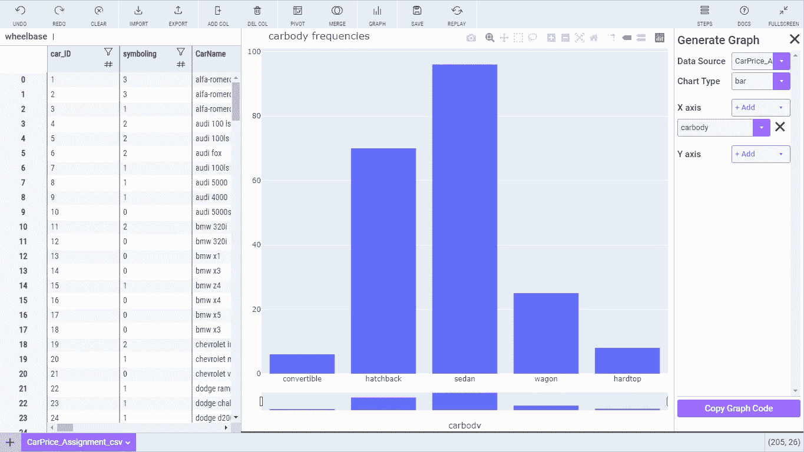
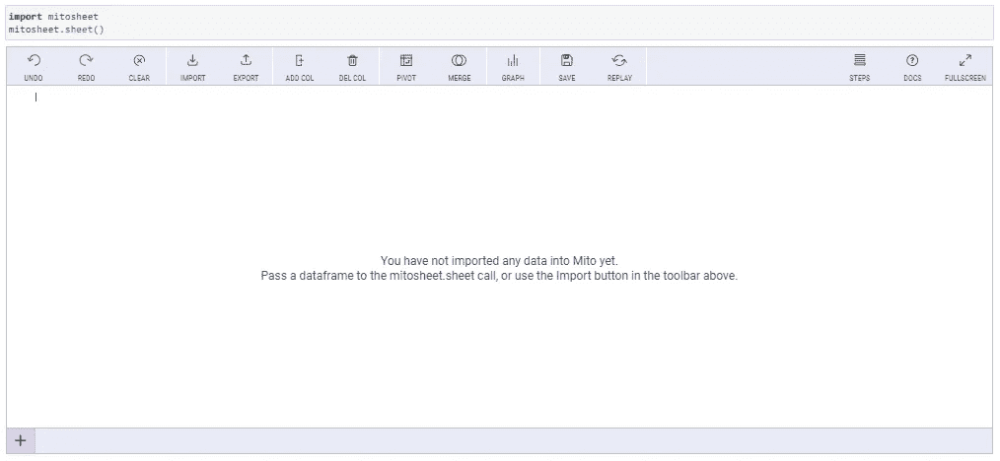
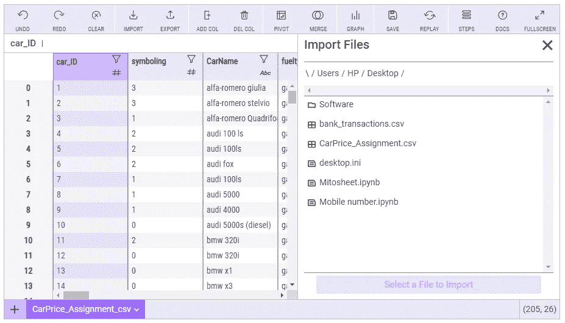
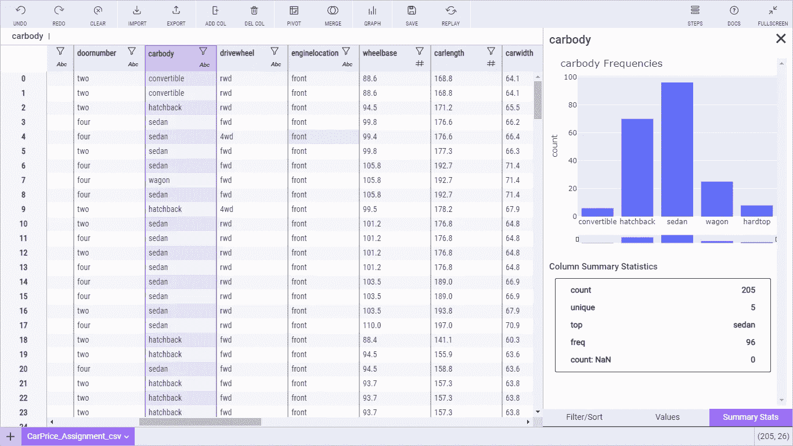
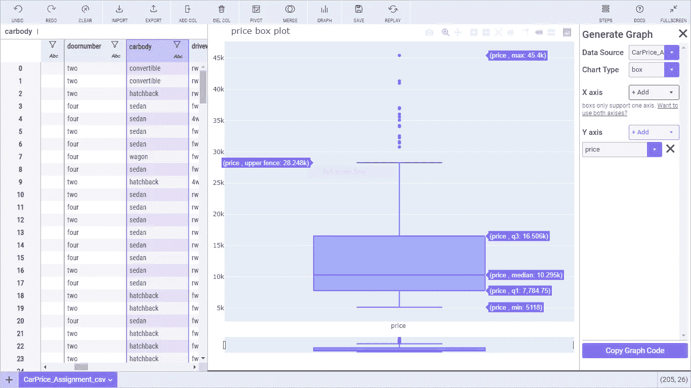
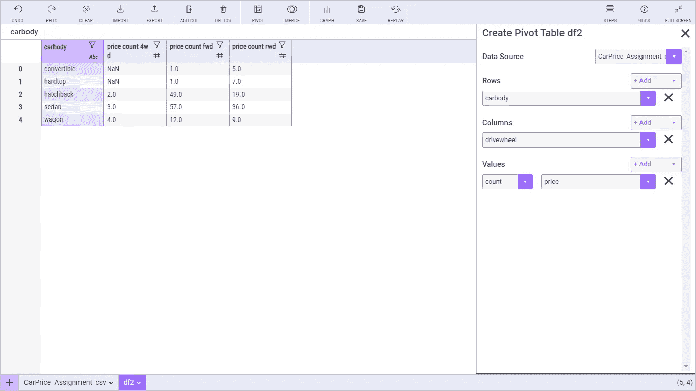

# 加速数据分析

> 原文：<https://towardsdatascience.com/speeding-up-data-analysis-d2aa65ff0347?source=collection_archive---------41----------------------->

## 使用最新版本的 Mitosheets 加速数据分析



来源:作者

数据分析是数据科学的一个组成部分；它有助于解开数据，找出所有隐藏的模式，以便我们可以使用它们来产生有意义的见解。数据分析也有助于找出不同数据点之间的关系。

数据分析是建立模型的第一步，因为我们应该能够知道数据是关于什么的，它包含什么。它还可以用于操作数据并为建模做准备。做所有这些需要花费大量的时间和精力，因为我们需要编写大量的代码并创建不同的可视化和表格来更好地理解数据。

使用最新版本的 [Mitosheets](https://docs.trymito.io/) 我们可以轻松地执行所有这些操作，甚至不需要编码。

[Mitosheet](https://docs.trymito.io/) 是一个开源的 python 库，用于在一行代码中执行数据分析。它作为一个界面，用户可以通过单击不同的选项来执行与数据分析相关的不同操作。

在本文中，我们将探索在数据集上执行数据分析的 [Mitosheet](https://docs.trymito.io/) 。

让我们开始吧…

# 安装所需的库

为了安装 [mitosheets](https://docs.trymito.io/) ，我们需要运行下面给出的 pip 安装命令。Mitosheets 在 Jupyter Lab 上运行，因此我们应该在系统中安装它。

```
!pip install mitoinstaller
!python -m mitoinstaller install
```

安装后，我们需要启动 Jupyter Lab，这样我们就可以使用 [Mitosheets](https://docs.trymito.io/) 。我们可以使用下面给出的命令从 Anaconda 接口或 Anaconda 提示符启动它。

```
start jupyter lab
```

# 导入所需的库

我们需要导入的唯一库是 [mitosheets](https://docs.trymito.io/) ，我们将使用下面给出的命令导入它。我们还将使用下面给出的命令启动 [mitosheet](https://docs.trymito.io/) ，这是我们执行分析所需的唯一代码。

```
import mitosheet
mitosheet.sheet()
```



主屏幕(来源:作者)

正如您在这里看到的，这是我们将执行数据分析的 [Mitosheets](https://docs.trymito.io/) 的主屏幕，它包含不同的选项，如导入和导出数据、添加或删除列、创建不同的可视化和数据透视表。

# 正在加载数据集

接下来，我们将加载我们将要处理的数据集，您可以选择任何数据集。对于本文，我们使用的是[汽车设计数据集](https://www.kaggle.com/goyalshalini93/car-price-prediction-linear-regression-rfe/data)。



导入数据集(来源:作者)

这里我们可以看到导入数据集是多么容易，现在我们将开始我们的分析。

我们将从查看不同列的统计属性开始。为此，我们需要单击列名前面的“漏斗”,然后单击右侧面板中的“汇总统计”。



统计摘要(来源:作者)

在右边的面板中，您还可以看到另外两个不同的选项卡，显示值(百分比)和排序数据。现在让我们创建一个可视化。



方框图(来源:作者)

在这里你可以看到我们如何使用 [Mitosheets](https://docs.trymito.io/) 中的图形选项创建了一个方框图。我们只需要选择轴和我们想要绘制的图表类型。它包含各种各样的图表，我们可以很容易地创建。

创建数据透视表是 [Mitosheets](https://docs.trymito.io/) 提供的功能之一。在下图中，您可以看到我们使用 pivot 选项并选择所需的行、列和值创建了一个数据透视表。



数据透视表(来源:作者)

类似地，我们可以探索多种功能，如添加或删除列、合并数据等。此外，我们可以在预处理后保存数据集。

继续尝试使用不同的数据集并执行数据分析。如果您发现任何困难，请在回复部分告诉我。

本文是与 [Piyush Ingale](https://medium.com/u/40808d551f5a?source=post_page-----d2aa65ff0347--------------------------------) 合作的。

# 在你走之前

***感谢*** *的阅读！如果你想与我取得联系，请随时通过 hmix13@gmail.com 联系我或我的* [***LinkedIn 个人资料***](http://www.linkedin.com/in/himanshusharmads) *。可以查看我的*[***Github***](https://github.com/hmix13)**简介针对不同的数据科学项目和包教程。还有，随意探索* [***我的简介***](https://medium.com/@hmix13) *，阅读我写过的与数据科学相关的不同文章。**