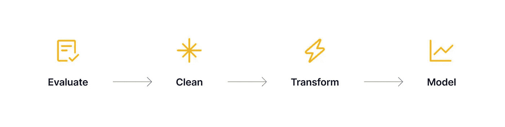
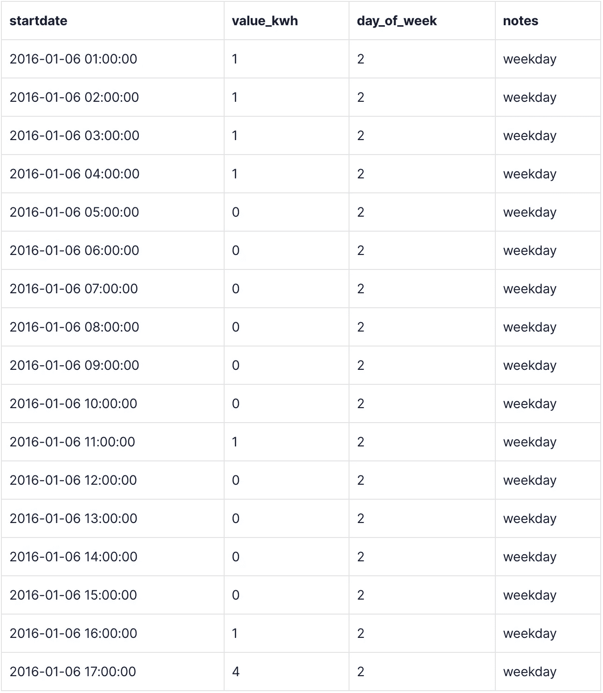
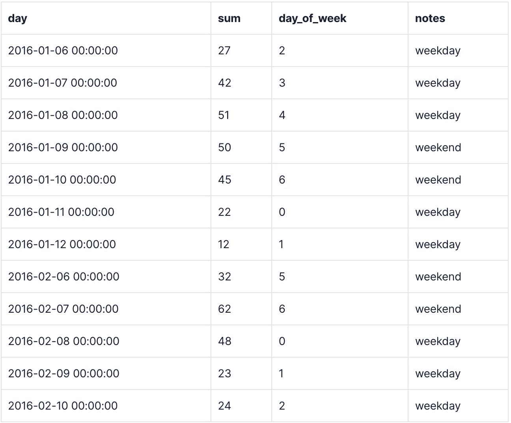

# 使用 PostgreSQL 和 TimescaleDB 加速数据分析

> 原文：<https://towardsdatascience.com/speeding-up-data-analysis-with-timescaledb-and-postgresql-e3bdfee41108?source=collection_archive---------38----------------------->

## [理解大数据](https://towardsdatascience.com/tagged/making-sense-of-big-data)

## 评估、清理和转换数据时的常见问题 PostgreSQL 和 TimescaleDB 如何帮助我解决这些问题。


由[马库斯·温克勒](https://unsplash.com/@markuswinkler)通过 [Unsplash](https://unsplash.com/photos/afW1hht0NSs) 创作

1.  常用数据分析工具和“问题”
2.  数据分析问题#1:存储和访问数据
3.  数据分析问题#2:最大化分析速度和计算效率(数据集越大，问题越大)
4.  数据分析问题#3:存储和维护数据分析脚本
5.  数据分析问题#4:轻松利用新技术或附加技术
6.  包扎

[时序](https://blog.timescale.com/blog/what-the-heck-is-time-series-data-and-why-do-i-need-a-time-series-database-dcf3b1b18563/?utm_source=tds&utm_medium=blog&utm_id=tsdb-for-data-analysis&utm_content=time-series-blog-post)数据无处不在，它驱动着每个行业的决策。时间序列数据共同代表了一个系统、过程或行为如何随时间变化。了解这些变化有助于我们解决众多行业的复杂问题，包括[可观察性](https://blog.timescale.com/blog/simplified-prometheus-monitoring-for-your-entire-organization-with-promscale/?utm_source=tds&utm_medium=blog&utm_id=tsdb-for-data-analysis&utm_content=promscale-blog-post)、[金融服务](https://blog.timescale.com/blog/how-messari-uses-data-to-open-the-cryptoeconomy-to-everyone/?utm_source=tds&utm_medium=blog&utm_id=tsdb-for-data-analysis&utm_content=messari-blog-post)、[物联网](https://blog.timescale.com/blog/how-meter-group-brings-a-data-driven-approach-to-the-cannabis-production-industry/?utm_source=tds&utm_medium=blog&utm_id=tsdb-for-data-analysis&utm_content=meter-groups-cannabis-blog-post)，甚至[职业足球](https://blog.timescale.com/blog/hacking-nfl-data-with-postgresql-timescaledb-and-sql/?utm_source=tds&utm_medium=blog&utm_id=tsdb-for-data-analysis&utm_content=nfl-blog-post)。

根据他们构建的应用程序的类型，开发人员最终会收集数百万行时间序列数据(有时每天甚至每小时会收集数百万行数据！).理解这种高容量、高保真度的数据需要一组特殊的数据分析技能，而这些技能在传统的开发人员技能中并不常见。为了执行超越基本问题的时间序列分析，开发人员和数据分析师需要专门的工具，随着[时间序列数据日益突出](https://db-engines.com/en/ranking_categories)，这些工具的**效率**变得更加重要。

通常，数据分析师的工作可以归结为**评估**、**清理**、**转换**，以及**建模**数据。根据我的经验，我发现这些行动对我从数据中获得理解是必要的，我将在这篇文章中称之为“数据分析生命周期”。



数据分析生命周期。图片作者。

Excel、R 和 Python 可以说是一些最常用的数据分析工具，虽然它们都是很棒的工具，但它们可能并不适合每项工作。从经验上讲，这些工具在生命周期的早期阶段对于“数据管理”尤其低效；具体来说，预建模工作中涉及的**评估数据**、**清理数据**、**转换数据**步骤。

随着我处理更大和更复杂的数据集，我开始相信为特定类型的数据(如时间序列数据)构建的数据库对于数据分析更有效。

在这个博客系列中，我将深入讨论分析生命周期中的三个数据管理步骤，并演示如何使用 TimescaleDB 和 PostgreSQL 作为强大的数据分析工具。

在这篇介绍性的文章中，我将探讨一些我在使用流行的数据分析工具时遇到的常见挫折，并从这里开始，深入探讨我是如何使用 TimescaleDB 和 PostgreSQL 来帮助缓解这些棘手问题的。

在以后的帖子中，我们将关注:

*   TimescaleDB 和 PostgreSQL 数据分析功能如何取代通常在 Python 和 pandas 中执行的数据管理工作
*   TimescaleDB 和 PostgreSQL 与 Python 和 pandas 在数据管理任务中的比较(标准数据分析工作流的基准测试)
*   如何使用 TimescaleDB、PostgreSQL 和 Python 进行端到端的深度数据分析，使用来自[纽约市出租车和豪华轿车委员会](https://www1.nyc.gov/site/tlc/about/tlc-trip-record-data.page) (NYC TLC)的真实黄色出租车数据。

# 常用数据分析工具和“问题”

正如我们已经讨论过的，用于数据分析的三个最流行的工具是 Excel、R 和 Python。虽然它们本身是很好的工具，但它们并没有优化到能有效地执行分析过程中的每一步。

尤其是大部分数据科学家(包括我自己！)随着数据量的增长，或者需要月复一月地重复相同的分析，为类似的问题而苦恼。

这些困难包括:

*   数据存储和访问:存储和维护用于分析的数据的最佳位置是哪里？
*   数据大小及其对分析的影响:如何提高数据管理任务的效率，尤其是在数据扩展时？
*   脚本存储和可访问性:我能做些什么来改进数据管理脚本存储和维护？
*   轻松利用新技术:我如何设置我的数据分析工具链，以便轻松过渡到新技术？

所以系好安全带，让你的胳膊和腿一直呆在车里，让我们开始研究这些问题吧！

# 数据分析问题#1:存储和访问数据

为了进行数据分析，你需要访问…数据。

管理数据的存储位置，以及访问数据的难易程度是分析过程中的第一步(通常也是最重要的一步)。每当我开始一个新的数据分析项目时，这通常是我第一次陷入困境的地方。不管原始数据源是什么，我总是问“当我开始处理数据管理过程时，存储和维护数据的最佳位置在哪里？”

尽管数据分析师使用数据库存储和查询数据变得越来越普遍，但它仍然不是普遍存在的。很多时候，原始数据是在生成 JSON 的 CSV 文件或 API 流中提供的。虽然这对于较小的项目来说可能是可管理的，但是它可能很快变得难以维护，并且难以在项目之间进行管理。

例如，让我们考虑如何使用 Python 作为我们选择的数据分析工具。

在使用 Python 进行数据分析时，我可以选择通过文件/API 或数据库连接来获取数据。

如果我在分析过程中使用文件或 API 来查询数据，我经常会遇到这样的问题:

*   文件在哪里？如果某个 API 的 URL 或参数发生变化，会发生什么情况？
*   如果制作了重复的文件会怎么样？如果只更新了一个文件，而没有更新另一个文件呢？
*   我如何最好地与同事共享这些文件？
*   如果多个文件相互依赖，会发生什么？
*   如何防止不正确的数据被添加到 CSV 的错误列中？(即。字符串应该在的地方是十进制数)
*   非常大的文件怎么办？10MB、100MB、1GB、1TB 大小的文件的接收率是多少？

在经历了一个又一个项目的初始问题后，我知道一定会有更好的解决方案。我知道我的数据需要一个真实的来源——很明显，一个专门的 SQL 数据库可能就是我的答案！

现在，让我们考虑一下，如果我连接到 TimescaleDB。

通过将我的时间序列数据导入 TimescaleDB，我可以为我的所有数据创建一个真实的来源。因此，与他人协作变得像共享数据库访问权限一样简单。对数据库中数据管理过程的任何修改都意味着所有用户可以同时访问相同的更改，而不是通过解析 CSV 文件来验证我的版本是否正确。

此外，数据库通常可以处理比用 Python 或 r 编写的脚本大得多的数据负载。TimescaleDB 旨在高效、经济地容纳、维护和查询数 TB 的数据(从计算角度和您的钱包角度而言)。有了像[连续聚合](https://docs.timescale.com/timescaledb/latest/how-to-guides/continuous-aggregates/?utm_source=tds&utm_medium=blog&utm_id=tsdb-for-data-analysis&utm_content=caggs-docs)和本机[列压缩](https://docs.timescale.com/timescaledb/latest/how-to-guides/compression/?utm_source=tds&utm_medium=blog&utm_id=tsdb-for-data-analysis&utm_content=compression-docs)这样的功能，存储和分析多年的时间序列数据变得高效，同时仍然易于访问。

简而言之，随着时间的推移管理数据，尤其是当数据来自不同来源时，高效地维护和访问数据可能是一场噩梦。但是，不一定要这样。

# 数据分析问题#2:最大化分析速度和计算效率(数据集越大，问题越大)

Excel、R 和 Python 都能够执行数据分析“生命周期”的前三个步骤:评估、清理和转换数据。然而，这些技术在处理过程中通常没有针对速度或计算效率进行优化。

在过去几年的许多项目中，我发现随着数据集大小的增加，导入、清理和转换数据集的过程变得更加困难、耗时，在某些情况下甚至是不可能的。对于 Python 和 R 来说，解析大量数据似乎要花很长时间，而 Excel 一旦遇到数百万行就会崩溃。

当我需要为聚合或数据转换之类的事情创建额外的表时，事情变得*尤其*困难:根据数据的大小、我使用的计算机或分析的复杂性，一些代码行可能需要几秒钟，或者在极端情况下，几分钟才能运行。

虽然几秒钟或几分钟可能看起来不算多，但当你在执行一个月需要运行数百或数千次的分析时，它们累积起来会导致数小时或数天的生产力损失！

为了说明这一点，我们再来看一个 Python 例子。

假设我正在处理来自 Kaggle 的[物联网数据集。该套件包含两个表格，一个指定德克萨斯州休斯顿一个家庭的能源消耗，另一个记录天气情况。](https://www.kaggle.com/srinuti/residential-power-usage-3years-data-timeseries)

要使用 Python 进行分析，我的分析的第一步是获取数据并观察它。

当使用 Python 来做这件事时，我会像这样运行代码👇

```
import psycopg2import pandas as pdimport configparser## use config file for database connection informationconfig = configparser.ConfigParser()config.read('env.ini')## establish connectionconn = psycopg2.connect(database=config.get('USERINFO', 'DB_NAME'),host=config.get('USERINFO', 'HOST'),user=config.get('USERINFO', 'USER'),password=config.get('USERINFO', 'PASS'),port=config.get('USERINFO', 'PORT'))## define the queries for selecting data out of our databasequery_weather = 'select * from weather'query_power = 'select * from power_usage'## create cursor to extract data and place it into a DataFramecursor = conn.cursor()cursor.execute(query_weather)weather_data = cursor.fetchall()cursor.execute(query_power)power_data = cursor.fetchall()## you will have to manually set the column names for the data frameweather_df = pd.DataFrame(weather_data, columns=['date','day','temp_max','temp_avg','temp_min','dew_max','dew_avg','dew_min','hum_max','hum_avg','hum_min','wind_max','wind_avg','wind_min','press_max','press_avg','press_min','precipit','day_of_week'])power_df = pd.DataFrame(power_data, columns=['startdate', 'value_kwh', 'day_of_week', 'notes'])cursor.close()print(weather_df.head(20))print(power_df.head(20))
```

总之，使用我的 [2019 款 32GB 内存的 MacBook Pro 笔记本电脑](https://www.apple.com/shop/buy-mac/macbook-pro/16-inch-space-gray-2.3ghz-8-core-processor-1tb)，这段代码运行了 2.718 秒。

但是，如果我用数据库中的 SQL 运行这个等价的脚本呢？

```
select * from weatherselect * from power_usage
```



作者图片

这个查询只花了 0.342 秒，比 Python 脚本快了近 8 倍。

当我们考虑到 Python 必须连接到数据库，然后运行 SQL 查询，然后解析检索到的数据，然后将其导入到 DataFrame 中时，这种时间差是很有意义的。虽然几乎三秒钟的时间很快，但是随着脚本变得更加复杂以及更多数据管理任务的增加，额外的处理时间也会增加。

拉进数据观察只是我分析的开始！当我需要执行转换任务时，比如聚合数据，会发生什么情况？

对于这个数据集，当我们查看`power_usage`表时——如上所示——每小时记录千瓦时读数。如果我想进行每日分析，我必须将每小时的数据汇总到“天时段”中。

如果我使用 Python 进行这种聚合，我可以使用类似👇

```
# sum power usage by day, bucket by day## create column for the dayday_col = pd.to_datetime(power_df['startdate']).dt.strftime('%Y-%m-%d')power_df.insert(0, 'date_day', day_col)agg_power = power_df.groupby('date_day').agg({'value_kwh' : 'sum', 'day_of_week' : 'unique', 'notes' : 'unique' })print(agg_power)
```

…运行时间为 0.49 秒(这不包括导入数据的时间)。

或者，使用 TimescaleDB `[time_bucket()](https://docs.timescale.com/api/latest/hyperfunctions/time_bucket/?utm_source=tds&utm_medium=blog&utm_id=tsdb-for-data-analysis&utm_content=time-bucket-docs)`函数，我可以使用下面的查询直接在数据库中进行聚合👇

```
selecttime_bucket(interval '1 day', startdate ) as day,sum(value_kwh),day_of_week,notesfrom power_usage pugroup by day, day_of_week, notesorder by day
```



作者图片

…这只需要 0.087 秒，比 Python 脚本快 5 倍以上。

你可以在这里看到一个模式。

创建 TimescaleDB 是为了高效地查询和存储时间序列数据。但是简单地查询数据只是触及了 TimescaleDB 和 PostgreSQL 功能所提供的可能性的表面。

TimescaleDB 和 PostgreSQL 提供了广泛的工具和功能，可以取代使用其他工具来评估、清理和转换数据的需求。一些 TimescaleDB 功能包括连续聚合、压缩和[超功能](https://docs.timescale.com/api/latest/hyperfunctions/?utm_source=tds&utm_medium=blog&utm_id=tsdb-for-data-analysis&utm_content=hyperfunctions-doc)；所有这些都允许您直接在数据库中完成几乎所有的数据管理任务。

当我直接在 TimescaleDB 中执行分析的评估、清理和转换步骤时，我不再需要使用额外的工具(如 Excel、R 或 Python)来执行数据管理任务。然后，我可以将经过清理和转换的数据直接导入 Excel、R 或 Python，为建模做好准备。

# 数据分析问题#3:存储和维护数据分析脚本

将 Excel、R 或 Python 专门用于整个数据分析工作流的另一个潜在缺点是，分析数据的所有逻辑都包含在一个脚本文件中。与拥有许多不同数据源的问题类似，维护脚本文件可能会很不方便和混乱。

我和许多数据分析师遇到的一些常见问题包括:

*   丢失文件
*   无意中创建重复文件
*   更改或更新一些文件，但不更改或更新其他文件
*   需要编写和运行脚本来访问转换后的数据(参见下面的示例)
*   每当添加新的原始数据时，花费时间重新运行脚本(参见下面的示例)

虽然您可以使用代码库来克服其中的一些问题，但它不能解决最后两个问题。

让我们再次考虑我们的 Python 场景。

假设我使用了一个专门用于我所有数据分析任务的 Python 脚本。如果我需要导出转换后的数据以用于德克萨斯州的能源消耗报告，会发生什么情况？

很可能，我必须在脚本中添加一些代码来导出数据，然后再次运行脚本来实际导出数据。根据脚本的内容和转换数据所需的时间，这可能会非常不方便和低效。

如果我也得到一堆新能源使用和天气数据呢？为了将新的原始数据合并到现有的可视化或报告中，我需要再次运行脚本，并确保我的所有数据管理任务都按预期运行。

数据库函数，如连续聚合和物化视图，可以创建转换后的数据，这些数据可以直接从数据库中存储和查询，而无需运行脚本。此外，我可以为连续聚合创建策略，以便在任何时候修改原始数据时，定期更新转换后的数据。由于这些策略，我不必担心运行脚本来重新转换数据以供使用，从而高效地访问更新的数据。

# 数据分析问题#4:轻松利用新技术或附加技术

最后，数据分析生命周期的最后一步:建模。如果我想使用新的工具或技术来创建可视化，很难轻松地将转换后的数据用于其他地方的建模或可视化。

Python、R 和 Excel 的可视化和建模能力都非常棒。然而，当你的公司或团队想要采用一种新工具时会发生什么呢？

根据我的经验，这通常意味着要么在分析过程中增加另一个步骤，要么重新发现如何在新技术中执行评估、清理和转换步骤。

例如，在我以前的一份工作中，我被要求将我的一部分分析转换成 Power BI，用于业务分析。我的利益相关者想要的一些可视化要求我从 Python 脚本中访问转换后的数据。当时，我可以选择从 Python 脚本中导出数据，或者想出如何在 Power BI 中直接转换数据。这两种选择都不理想，而且肯定要花费额外的时间。

当谈到采用新的可视化或建模工具时，使用数据库来评估、清理和转换数据可以再次对您有利。大多数可视化工具——如 [Grafana](https://grafana.com/) 、 [Metabase](https://www.metabase.com/) 或[Power BI](https://powerbi.microsoft.com/)——允许用户直接从数据库导入数据。

由于我可以在 TimescaleDB 中完成大部分数据管理任务，因此添加或切换工具——比如使用 Power BI 实现仪表板功能——变得非常简单，只需连接到我的数据库，提取管理的数据，并使用新工具进行可视化和建模。

# 包扎

总之，Excel、R 和 Python 都是很好的分析工具，但可能不是每项工作的最佳工具。例证:我在时间序列数据分析上的挣扎，尤其是在大数据集上。

借助 TimescaleDB 和 PostgreSQL 功能，您可以直接在数据库中存放数据并执行数据分析的评估、清理和转换，并在此过程中解决许多常见的数据分析难题(我希望如此！—在本文中演示)

在接下来的博客文章中，我将探索 TimescaleDB 和 PostgreSQL 功能与 Python 的比较，比较 TimescaleDB 和 PostgreSQL 性能与 Python 和 pandas 的数据管理任务，并深入研究 TimescaleDB(用于数据管理)和 Python(用于建模和可视化)的数据分析。

如果你对 TimescaleDB、时间序列数据或上述任何功能有疑问，欢迎[加入 Timescale 的**社区 Slack**](https://slack.timescale.com/?utm_source=dev-to&utm_medium=blog&utm_id=tsdb-for-data-analysis&utm_content=slack) ，在那里你会发现一个由时间序列爱好者和各种 Timescale 团队成员(包括我！).

如果你对使用 TimescaleDB 和 PostgreSQL 感兴趣，你可以注册[30 天免费试用](https://www.timescale.com/timescale-signup/?utm_source=tds&utm_medium=blog&utm_id=tsdb-for-data-analysis&utm_content=timescale-signup)或[安装 TimescaleDB](https://docs.timescale.com/timescaledb/latest/how-to-guides/install-timescaledb/self-hosted/?utm_source=tds&utm_medium=blog&utm_id=tsdb-for-data-analysis&utm_content=timescale-self-hosted-guide) 并在你当前的 PostgreSQL 实例上管理它。我们还有一堆很棒的[教程](https://docs.timescale.com/timescaledb/latest/tutorials/?utm_source=tds&utm_medium=blog&utm_id=tsdb-for-data-analysis&utm_content=timescale-tutorials)来帮助你入门。

下次见！

*本帖由米兰达·奥尔原创，发表于 2021 年 9 月 9 日*[*https://blog.timescale.com*](https://blog.timescale.com/blog/speeding-up-data-analysis/?utm_source=dev-to&utm_medium=blog&utm_id=tsdb-for-data-analysis&utm_content=original-blog-post)*上*