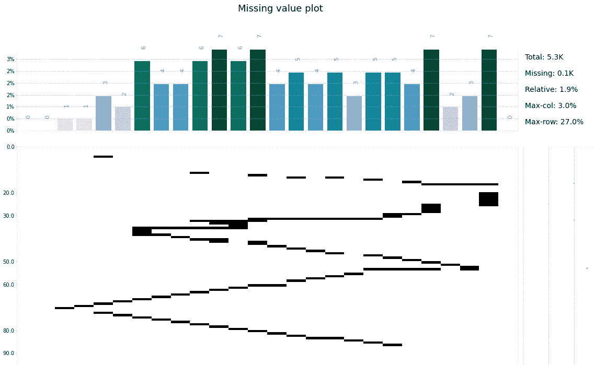
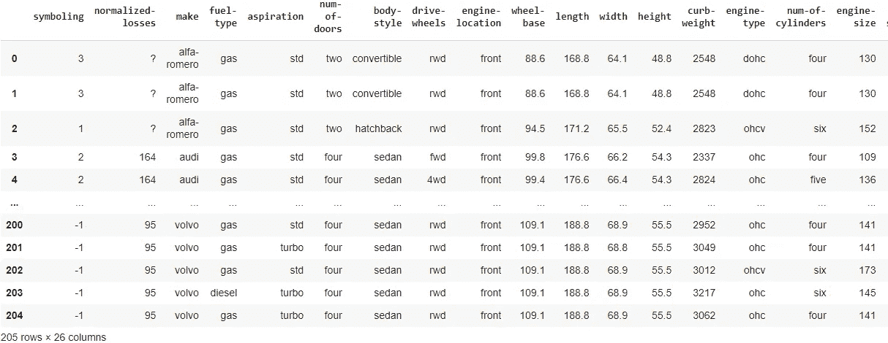
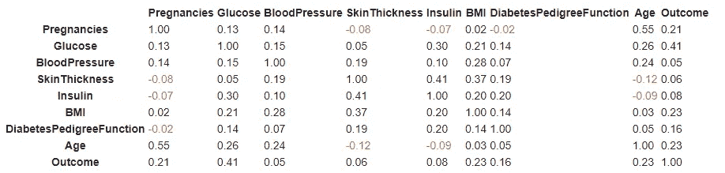
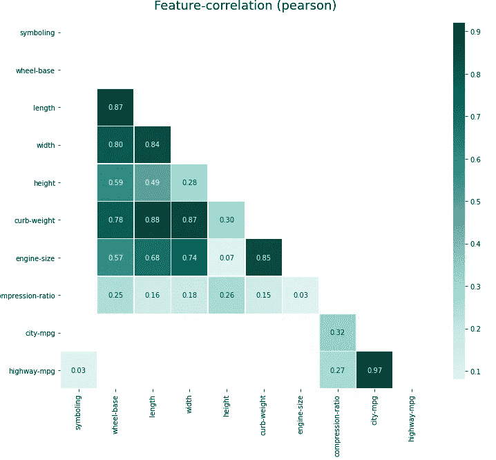
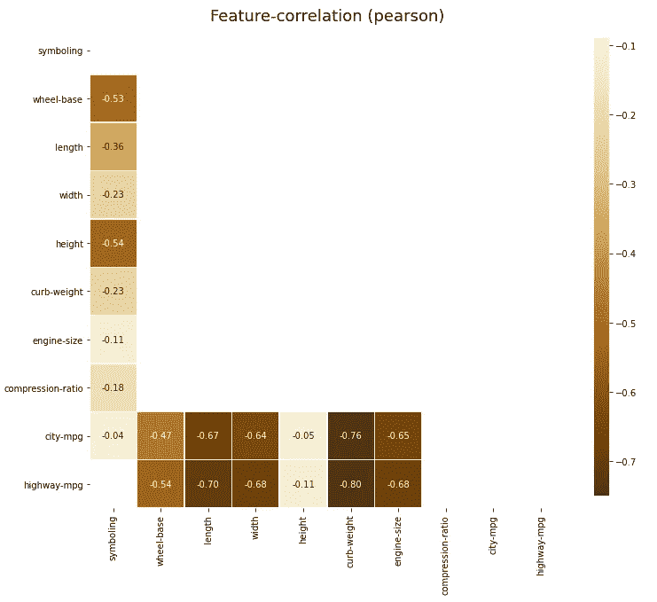
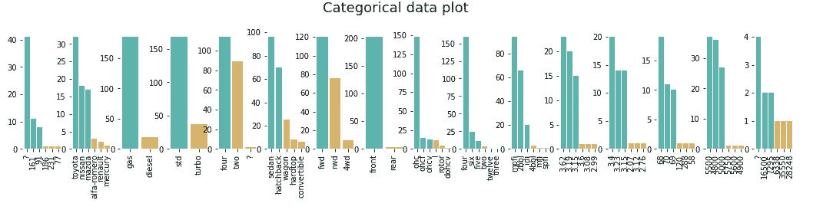
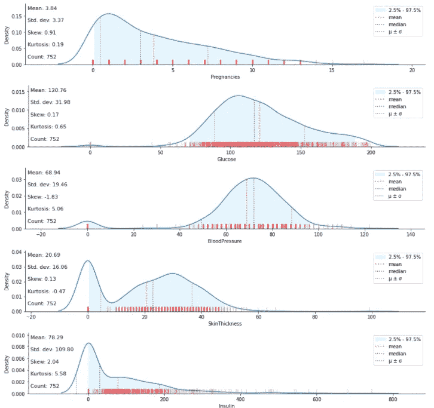
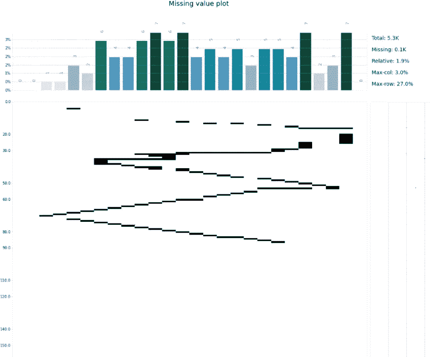

# 加速数据可视化

> 原文：<https://towardsdatascience.com/speeding-up-data-visualization-e370f4470b86?source=collection_archive---------23----------------------->

## 在一行代码中使用 Klib 进行数据可视化



来源:作者

数据可视化帮助我们理解数据，找出不同的模式、关联和视觉洞察。根据我们试图解决的问题，可以使用各种各样的可视化方法。Python 提供了 N 个可以帮助数据可视化的库，其中一些是 Seaborn、Matplotllib 等。

可视化包含不同数据类型的列的数据可能有点困难，因为我们需要识别这些列并相应地创建一个图。Klib 可以解决这个问题，只需一行代码就可以创建不同类型的可视化效果。

Klib 是一个开源的 python 库，可以轻松地对数据进行可视化、分析和预处理。在本文中，我们将探索 Klib 提供的不同类型的可视化。

让我们开始吧…

# 安装所需的库

我们将从使用 pip 安装 Klib 开始。下面给出的命令可以做到这一点。

```
!pip install klib
```

# 导入所需的库

在这一步中，我们将导入加载数据集和可视化数据集所需的库。

```
import klib
import pandas as pd
```

# 正在加载数据集

对于这篇文章，我使用的是可以从 [Kaggle](https://www.kaggle.com/toramky/automobile-dataset) 下载的汽车数据集。该数据集包含分类列和数字列。

```
df = pd.read_csv("/content/Automobile_data.csv")
df
```



数据集(来源:作者)

# 创建可视化

在这一步中，我们将为分类和数字数据类型创建不同类型的可视化。

1.  **相关矩阵**

```
klib.corr_mat(df)
```



相关性(来源:作者)

**2。相关图**

相关图可以根据正相关和负相关来划分。

```
klib.corr_plot(df, split="pos")
klib.corr_plot(df, split="neg")
```



积极的(来源:作者)



否定的(来源:作者)

**3。分类图**

```
klib.cat_plot(df)
```



分类(来源:作者)

**4。分布图**

```
klib.dist_plot(df)
```



分发(来源:作者)

**5。缺失值图**

```
klib.missingval_plot(df)
```



缺失数据(来源:作者)

继续尝试不同的数据集，并使用 Klib 创建不同的可视化效果。如果您发现任何困难，请在回复部分告诉我。

本文是与 [Piyush Ingale](https://medium.com/u/40808d551f5a?source=post_page-----e370f4470b86--------------------------------) 合作完成的。

# 在你走之前

***感谢*** *的阅读！如果你想与我取得联系，请随时通过 hmix13@gmail.com 联系我或我的* [***LinkedIn 个人资料***](http://www.linkedin.com/in/himanshusharmads) *。可以查看我的*[***Github***](https://github.com/hmix13)**简介针对不同的数据科学项目和包教程。还有，随意探索* [***我的简介***](https://medium.com/@hmix13) *，阅读我写过的与数据科学相关的不同文章。**