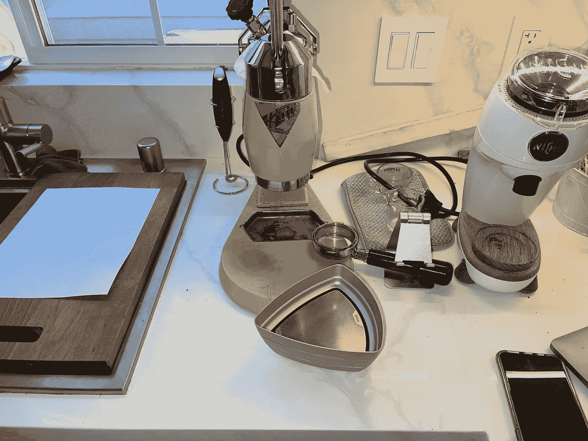
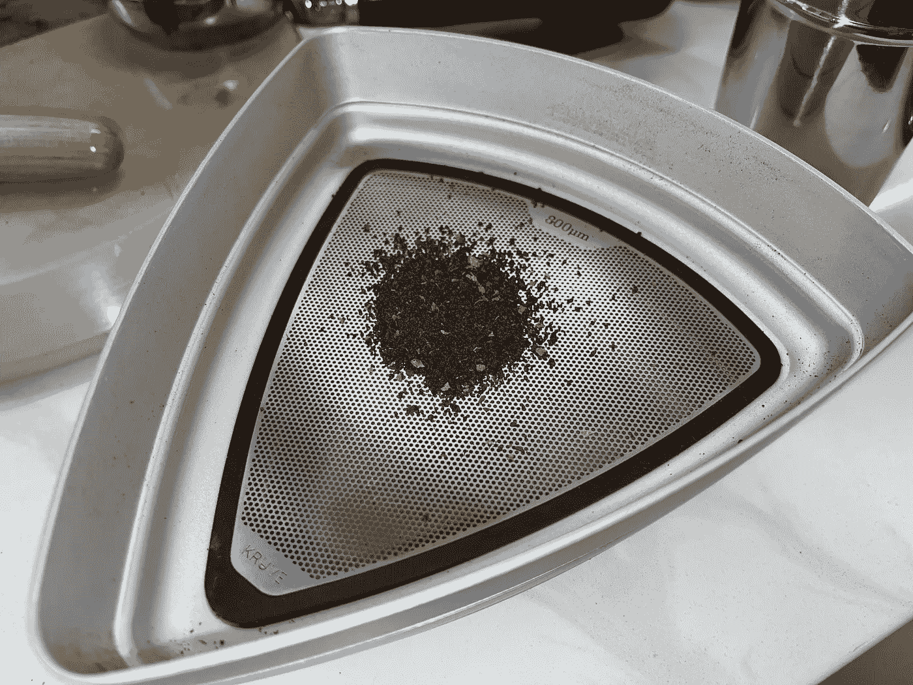
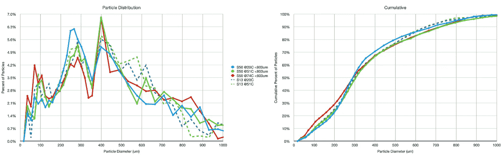
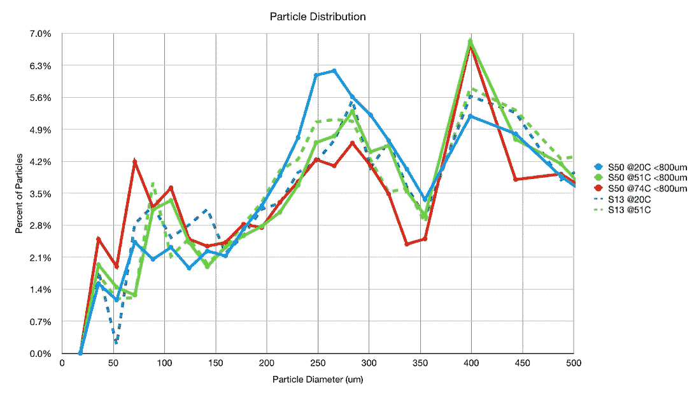
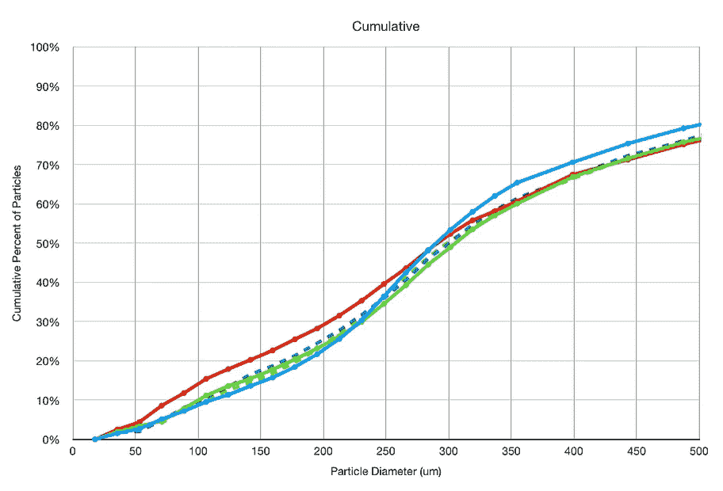
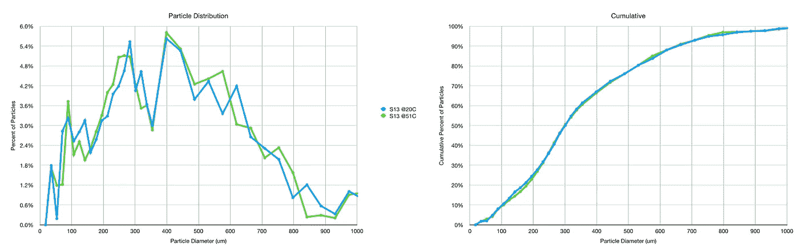
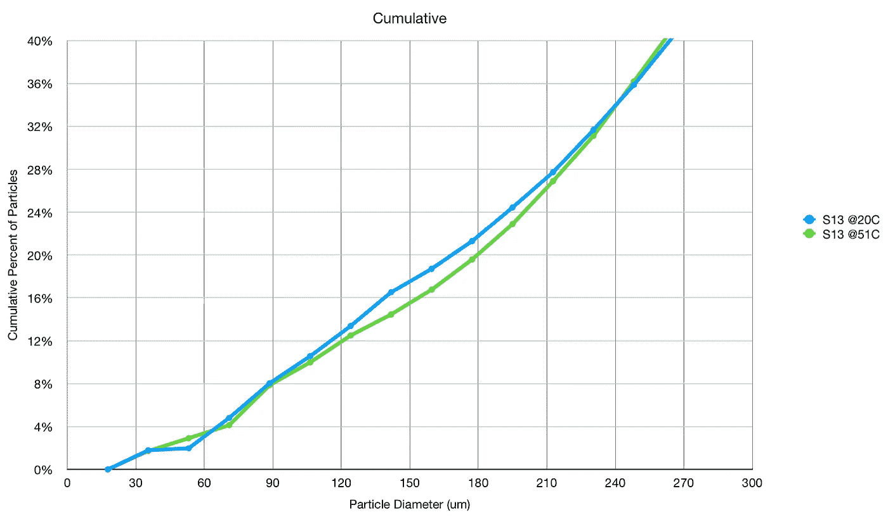
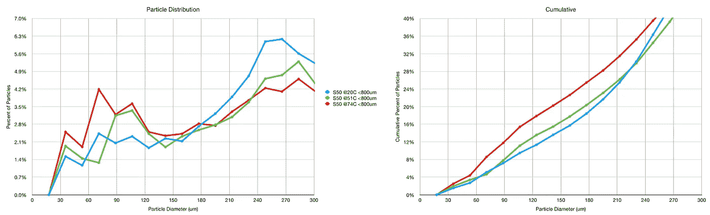

# 辣咖啡研磨配送

> 原文：<https://towardsdatascience.com/spicy-coffee-grind-distributions-e4d73c6e3e1f?source=collection_archive---------27----------------------->

## 咖啡数据科学

## 检查热咖啡渣

去年，我一头扎进了一个彻底的调查中，调查咖啡豆和研磨粉的温度是如何影响萃取和味道的。这是一个到处探索的领域，许多人发现当加热咖啡豆时，他们的喷射流变慢了。结果是，尽管热的豆子会影响研磨的方式，但是研磨出来的东西是热的。所以我想更好地了解热磨豆的研磨分布。

我从几个方面看了这些理由。我在设置 13(浓缩咖啡的典型设置)和设置 50 下研磨。对于设置 50，我使用 800 微米的筛子过滤掉较大的块。这里的目的是了解更高温度的咖啡豆如何影响咖啡豆的[更软的部分](/fines-in-coffee-grinds-searching-for-a-source-326c3eba2bb4?source=your_stories_page-------------------------------------)，当设置为 50 时，通常会产生更细的颗粒。

然后我拍摄了一些图像，并使用[的一些图像处理](https://medium.com/nerd-for-tech/measuring-coffee-grind-distribution-d37a39ffc215)来确定研磨分布。

# 研磨发行版！

他们看起来都很相似。很难看出有什么不同。

所以我把我的范围缩小到小于 500 微米，这是浓缩咖啡中大多数粒子的范围。

更清楚的是，74C 时的 S50 向更细的颗粒转变。S50 在 20℃和 51℃之间略有变化，但最大的变化是在 74℃。很有可能，将咖啡豆加热到那个温度，尤其是在微波炉中，会导致它们稍微变熟。

所以我们只看 S13:

在这种情况下，分布在 51C 而不是 20C 处具有更少的低于 200um 的颗粒，表明向右移动而不是像 S50 那样向左移动。

我们可以回到同样的范围，300 微米以下，差别非常明显。然而，在这种情况下，随着温度的升高，会向左移动。

虽然这只是在一些样品上，但它似乎表明热量对咖啡的不同部分有不同的影响。对于软的内部，颗粒尺寸变得更小，如 S50 数据所示。对于其余部分，颗粒尺寸稍微变大。

这让我想知道我有多了解研磨，以及研磨设置如何影响咖啡豆的不同部分。

如果你愿意，可以在 Twitter 和 YouTube 上关注我，我会在那里发布不同机器上的浓缩咖啡视频和浓缩咖啡相关的东西。你也可以在 [LinkedIn](https://www.linkedin.com/in/robert-mckeon-aloe-01581595?source=post_page---------------------------) 上找到我。也可以在[中](https://towardsdatascience.com/@rmckeon/follow)和 [Patreon](https://www.patreon.com/EspressoFun) 上关注我。

# [我的进一步阅读](https://rmckeon.medium.com/story-collection-splash-page-e15025710347):

[浓缩咖啡系列文章](https://rmckeon.medium.com/a-collection-of-espresso-articles-de8a3abf9917?postPublishedType=repub)

[工作和学校故事集](https://rmckeon.medium.com/a-collection-of-work-and-school-stories-6b7ca5a58318?source=your_stories_page-------------------------------------)

[个人故事和关注点](https://rmckeon.medium.com/personal-stories-and-concerns-51bd8b3e63e6?source=your_stories_page-------------------------------------)

[乐高故事启动页面](https://rmckeon.medium.com/lego-story-splash-page-b91ba4f56bc7?source=your_stories_page-------------------------------------)

[摄影飞溅页](https://rmckeon.medium.com/photography-splash-page-fe93297abc06?source=your_stories_page-------------------------------------)

[使用图像处理测量咖啡研磨颗粒分布](https://link.medium.com/9Az9gAfWXdb)

[改善浓缩咖啡](https://rmckeon.medium.com/improving-espresso-splash-page-576c70e64d0d?source=your_stories_page-------------------------------------)

[断奏生活方式概述](https://rmckeon.medium.com/a-summary-of-the-staccato-lifestyle-dd1dc6d4b861?source=your_stories_page-------------------------------------)

[测量咖啡磨粒分布](https://rmckeon.medium.com/measuring-coffee-grind-distribution-d37a39ffc215?source=your_stories_page-------------------------------------)

[咖啡萃取](https://rmckeon.medium.com/coffee-extraction-splash-page-3e568df003ac?source=your_stories_page-------------------------------------)

[咖啡烘焙](https://rmckeon.medium.com/coffee-roasting-splash-page-780b0c3242ea?source=your_stories_page-------------------------------------)

[咖啡豆](https://rmckeon.medium.com/coffee-beans-splash-page-e52e1993274f?source=your_stories_page-------------------------------------)

[浓缩咖啡用纸质过滤器](https://rmckeon.medium.com/paper-filters-for-espresso-splash-page-f55fc553e98?source=your_stories_page-------------------------------------)

[浓缩咖啡篮及相关主题](https://rmckeon.medium.com/espresso-baskets-and-related-topics-splash-page-ff10f690a738?source=your_stories_page-------------------------------------)

[意式咖啡观点](https://rmckeon.medium.com/espresso-opinions-splash-page-5a89856d74da?source=your_stories_page-------------------------------------)

[透明 Portafilter 实验](https://rmckeon.medium.com/transparent-portafilter-experiments-splash-page-8fd3ae3a286d?source=your_stories_page-------------------------------------)

[杠杆机维护](https://rmckeon.medium.com/lever-machine-maintenance-splash-page-72c1e3102ff?source=your_stories_page-------------------------------------)

[咖啡评论与思考](https://rmckeon.medium.com/coffee-reviews-and-thoughts-splash-page-ca6840eb04f7?source=your_stories_page-------------------------------------)

[咖啡实验](https://rmckeon.medium.com/coffee-experiments-splash-page-671a77ba4d42?source=your_stories_page-------------------------------------)