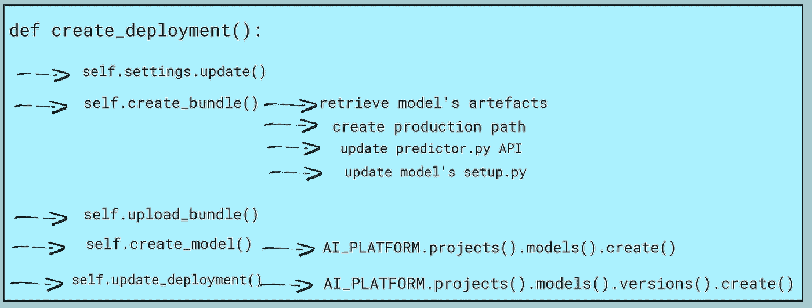

# 使用 MLflow 部署插件在 GCP 人工智能平台上旋转您的模型

> 原文：<https://towardsdatascience.com/spin-up-your-models-in-gcp-ai-platform-with-mlflow-deployment-plugin-c0198077dca1?source=collection_archive---------20----------------------->

MLflow 插件允许集成到任何定制平台。这是一个从实验跟踪到模型生产的绝佳机会。今天让我们看看如何在 MLflow 中实现一个部署插件


Vishnu Mohanan 在 [Unsplash](https://unsplash.com/photos/_hAZlayJFoA) 上的图片

[](https://medium.com/@stefanobosisio1/membership) [## 通过我的推荐链接加入 Medium-Stefano Bosisio

### 作为一个媒体会员，你的会员费的一部分会给你阅读的作家，你可以完全接触到每一个故事…

medium.com](https://medium.com/@stefanobosisio1/membership) 

之前关于 MLflow 的文章:

*   [**使用 MLflow**](/scale-up-your-models-development-with-mlflow-4b78a5f22cb7) 扩展您的模型开发
*   [**改进您的 MLflow 实验，跟踪历史指标**](/improve-your-mlflow-experiment-keeping-track-of-historical-metrics-6e70a6c7b201?source=your_stories_page----------------------------------------)

# 目录

— [什么是 MLflow 插件？](#ca15)
——[MLflow AI-platform 插件](#be30)
— — [我们需要什么来创建一个新的 ml flow 插件？](#fd82)
—[插件文件夹和模型模板文件的结构](#d8c9)
—[部署跟踪界面](#4673)
—[创建捆绑方法](#92d1)
—[上传捆绑方法](#c3b9)
—[创建模型方法](#79d2)
—[更新部署方法](#d3ba)
—[删除部署方法](#5531) 

# 什么是 MLflow 插件？

MLflow 是一个与框架无关的机器学习工具，可以覆盖整个 ML 过程，从数据探索到模型开发、调整和部署。MLflow Python API 非常通用，允许开发人员为不同 ML 框架和后端完全集成 MLflow。插件是 MLflow 提供的集成之一。插件允许用户拥有额外的 MLflow 兼容组件，例如，可以保存特定服务的人工制品(例如，在专用数据库上)。此外，可以开发插件来接受第三方认证，或者将任何模型部署到定制平台。

在这里你可以找到 MLflow 插件优秀文档:[https://www.mlflow.org/docs/latest/plugins.html](https://www.mlflow.org/docs/latest/plugins.html)而在这里:[https://www . mlflow . org/docs/latest/plugins . html # deployment-plugins](https://www.mlflow.org/docs/latest/plugins.html#deployment-plugins)你可以找到 ml flow 部署插件的列表。

在这篇文章中，我们将看到如何实现一个插件，这个插件可以将一个模型从开发带到 GCP 人工智能平台上。特别是，我们将理解创建一个新插件需要什么元素，以及我们需要什么功能来部署一个定制模型到 AI 平台。这将是一个可以进一步开发的框架，以在我们的 ML Ops 框架中获得一个更加自动化和自治的组件。

# MLflow 人工智能平台插件

## 我们需要什么来创建一个新的 MLflow 插件？

最终，MLflow 插件是一个定制的 Python 包，它必须满足主部署对象的以下约束:

*   必须是`mlflow.deployments.BaseDeploymentClient`的子类；
*   它必须具有`run_local`和`target_help`功能。前者允许本地测试——我们不会在本教程中实现这个功能——而后者可以返回有用的信息；
*   它必须具有以下方法(由`BaseDeploymentClient`继承):1) `create_deployment`，用于定义部署过程的主要方法，2) `update_deployment`，用于更新部署信息，3) `delete_deployment`，用于删除已部署的模型，4) `list_deployments`，用于列出所有已部署的模型，5) `get_deplyoment`，用于检索特定已部署模型的信息，6) `predict`，用于直接从 MLflow 返回预测的主要方法。

特别是，我们的目标是 GCP 人工智能平台。在 AI 平台上，将模型部署为端点有一条路径可循:[https://cloud . Google . com/AI-platform/prediction/docs/deploying-models](https://cloud.google.com/ai-platform/prediction/docs/deploying-models)。因此，我们可以构建这个路径，以便在我们的部署方法`create_deployment`中轻松实现，如图 1 所示:

*   首先，代码检索所有需要的配置设置(例如`production_bucket`、`run_id`、工件等等)
*   然后创建一个“部署包”。代码寻找模型工件的位置、生产 uri，它为我们的模型创建安装包以及模型的端点 API Python 代码— `create_bundle()`
*   此时，可以将捆绑包推到特定的生产桶— `upload_bundle()`
*   AI 平台 Python API 开始在平台上创建模型容器— `create_model()`
*   一个 json 请求被发送到 AI 平台以继续模型部署— `update_deployment()`



图 1:主部署类方法 create_deployment()遵循 AI 平台路径将新模型部署到端点

此外，我们必须创建`delete_deployment`、`get_deployment`和`list_deployments`方法，始终使用 AI 平台 API，以满足 MLflow 部署插件的需求。

## 插件文件夹和模型模板文件的结构

首先，插件包文件和文件夹的结构可以定义如下:

```
mlflow_ai_plugin/ 
                mlflow_ai_plugin/
                                __init__.py
                                DeploymentTrackingInterface.py
                                model_setup.py
                                predictor_template.py
                requirements.txt
                setup.py
```

主部署类包含在入口点`DeploymentTrackingInterface.py`中。`predictor_template.py`是模型端点 API 的模板版本:

图 2:给定模型的模板化 API。在这个例子中，我们正在处理 load_iris，注释指出可以使用一个预处理器

API 满足了 AI 平台的需求。首先，类构造函数`__init__`读取输入模型和预处理器——为了简单起见，我们在这里注释掉了预处理器的位。方法`predict`返回模型的预测。一个输入数据集被转换成一个 NumPy 数组作为`np.array(instances)`，并通过`self._model.predict(inputs).`计算概率。最后，方法`from_path`允许使用 MLflow 在 AI 平台中旋转模型。任何模型的 artefact 文件(如`pickle, joblib, h5`)都可以作为`mlflow.pyfun.load_model()`通过 MLflow 读取。这里的`MODEL_ARTIFACT_URI`是一个模板化的关键字，当部署脚本运行时，可以通过 main 方法`create_bundle()`用模型工件 uri 替换它，我们将在后面看到。

为了让模型的 API `predictor_template.py`工作，需要一个`setup.py`文件，这样 AI-platform 就知道需要哪些包来安装模型。`model_setup.py`是模型设置文件的模板版本。在本例中，设置文件相当简单，但是可以进行调整，例如，由数据科学家在部署时进行调整:

图 3:模型的 setup.py 文件的模板版本

同样，在方法`create_bundle`中，模板关键字`MODEL_VERSION`被当前模型版本所替代。该文件将创建一个名为`deploy_from_script`的包，它的脚本是`predictor.py`——它是从`predictor_template.py`创建的——它的依赖项是通过`install_requires`安装的。

## 部署跟踪界面

是我们插件的核心，所有人工智能平台的步骤都在这里被触发和控制。

**配置和构造器**

第一步是定义作业常量变量、配置和对象构造函数。

图 4:定义插件常量变量，如 AI_PLATFORM、GS_BUCKET、TODAY 和 MLFLOW_AIPLATFORM_PATH。

图 4 显示了导入语句和常量变量。在这些导入中，值得记住的是我们需要导入`from mlflow.deployments import BaseDeploymentClient`和`import mlflow_ai_plugin`，这是包本身，因此将有可能检索模板化文件`predictor_template.py`和`model_setup.py`的路径。最后，我们可以在这里定义 MLflow 插件需要的两个功能，分别是`run_local`和`target_help`——这里就不实现了。

图 Config 类定义了我们使用 AI 平台所需的所有配置设置

对于人工智能平台和流程配置，我们可以定义一个类`Config`,它读取包含以下所有变量的字典的输入:

*   这是我们正在进行的 GCP 项目
*   `production_bucket`生产用桶的名称
*   `production_route`我们希望在`production_bucket`中存储所有模型工件的路径
*   `run_id`ml flow 模型的运行 id，因此我们可以选择特定的模型
*   `tracking_uri`是 MLflow UI uri，例如`http://localhost:5000`
*   `prediction_script`定义了`predictor_template.py`的路径，该路径将被`create_bundle()`读取以容纳模型的端点信息
*   `tmp_dir`定义一个临时路径，插件可以在这里创建文件
*   `setup_file`是`model_setup.py`文件路径，将由`create_bundle()`读取
*   `model_name`生产中的型号名称
*   `version_name`型号的版本

**部署协议**

图 6 显示了部署协议，它定义了在 MLflow 中实现插件所需的所有方法，以及将模型部署到 AI 平台的所有方法。构造函数`__init__`定义了来自`Config`类的配置设置——如上所述。

图 6:部署协议定义。这个类是 AI 平台 MLflow 插件的核心，定义 MLflow 所需的方法和 AI 平台方法来部署模型

## 创建捆绑方法

图 7 显示了创建模型“包”，即模型文件的代码步骤。

图 7:该方法检索模型信息，创建 setup.py 和模型的 API 脚本，并将所有内容打包到一个 tar 文件中

首先调用`retrieve_model_info()`(图 8)。在这里，通过`MlflowClient`从其`run_id`中检索模型文件，并将其转换为字典`run_info['info']['artifact_uri']`。

随后，模型的端点 Python `predictor.py`被相应调整，这样`MODEL_ARTIFACT_URI`将是`self.model_uri_production`路径(例如`gs://bucket/model/model.joblib`)`template_predictor.py`文件将被保存为`self.predictor_path`(例如`predictor.py`)。这个替换是使用 Ubuntu 的`sed`命令完成的

图 8:检索模型信息并创建设置和端点文件

最后，创建模型的`setup.py`,再次通过`sed`替换`MODEL_VERSION`,并将文件保存在本地，这样 AI 平台可以读取它。一旦模型文件可用，`create_bundle`通过命令`python self.setup_path sdist --formats=gztar`将安装`sdist`打包到`gztar` 中，并将`gztar`文件路径返回给`create_deployment`

## 上传捆绑方法

此时，安装`gztar`文件，以及模型工件(如模型二进制文件`model.joblib`)被上传到生产路径。如图 9 所示

图 9:上传包方法负责将包文件和模型的工件上传到生产桶。在模型工件中，我们将有模型的二进制文件(例如 joblib 扩展)，它允许预测 API 读取模型

## 创建模型方法

接下来，一旦所有文件对 AI 平台可用，我们需要通过`create_model`创建一个 AI 平台模型。最初，一个 json 请求被发送到 AI 平台，指定模型名称`self.settings['model_name']`，我们是否想要一个终点预测`onlinePredictionLogging`和工作区域(例如`europe-west1`)。然后，列出 AI 平台中的所有模型`AI_PLATFORM.projects().models().list`，一个 for 循环检查给定的模型名称是否已经存在。如果模型不存在，`AI_PLATFORM`创建这个新模型作为`AI_PLATFORM.projects().models().create().execute()`

图 10:创建模型方法向 AI 平台发送请求，以检查模型是否存在，否则 AI 平台创建新模型

## 更新部署方法

`update_deployment`方法是部署的真正触发器，也是 MLflow 插件的要求。该方法调用`update_source`方法，如图 11 所示

向人工智能平台发送 json 请求。json 请求包含模型的名称，`deploymentUri`是模型工件的位置，`createTime`，`machineType`，`packageUris`是`gztar`模型安装文件的位置，`pythonVersion`，`runtimeVersion`是 AI 平台的位置，`predictorClass`是模型端点文件`predictor.py`的预测类

通过`AI_PLATFORM.projects().models().versions().create`创建新的端点

图 11:上传部署和更新源是 MLflow 部署插件的关键元素。update_source 向 AI 平台发送一个 json 请求，带有 model_uri_production，即模型的 artefacts 路径，以及 package uri，即模型的 gztar 路径和 endpoint 类，以便创建模型的端点

## 删除部署方法

现在，让我们看看附件插件方法。`delete_deployment`删除一个现有的模型，给出它的 GCP uri(图 12)。

模型的版本被重构，以与 AI 平台一致，并且模型的 AI 平台路径被创建`parent = self.settings['project_id'] + f"/models/{self.settings['model_name']}"`。然后通过`AI_PLATFORM.projects().models().versions().delete(name=body)`删除该模型

图 12:删除部署方法。json 请求被发送到 AI 平台，以便从 AI 平台中删除给定的模型

## 获取和列出部署方法

图 13:获取并列出部署方法。从 get 可以从模型的名称中检索到关于特定模型的信息，而 list deployments 返回所有已部署的模型

图 13 显示了`get_deployment`和`list_deployment`方法。前者通过`AI_PLATFORM.projects().models().version().get(name=body)`从一个模特的名字中返回模特的信息。后者，通过`AI_PLATFORM.projects().models().version().list(parent=parent)`登记所有部署的模型，其中`parent`是模型在 AI-platform 中的 uri。

# 安装 MLflow 部署插件

图 14:安装 MLflow 部署插件 g mlflow_ai_plugin 的 setup.py 文件

现在让我们将注意力转向 MLflow 部署插件`setup.py`文件。此安装程序将在您的 MLflow 安装中安装插件。值得注意的是，我们需要指定插件入口点:`entry_points={"mlflow.deployments":"aiplatform=mlflow_ai_plugin.DeploymentTrackingInterface"}`，它调用`DeploymentTrackingInterface`代码。`aiplatform`是从 MLflow 中读取的目标，因此我们可以通过类似`mlflow deployments create -t aiplatform ...`的命令调用我们的 MLflow AI-platform 插件

# 例子

最后，让我们看一些如何使用部署插件的例子。首先，我们将通过 Python 运行部署插件。首先，[正如我们在 MLflow 系列的第 2 部分中看到的，让我们运行一个 MLflow 实验](/improve-your-mlflow-experiment-keeping-track-of-historical-metrics-6e70a6c7b201#8668)，在这里我们训练一个简单的神经网络模型，如图 15 所示

图 15:要在 MLflow 上训练的玩具模型

一旦模型的训练被保存在 MLflow 中，我们就可以通过 Python 脚本部署该模型，如下所示:

```
from mlflow.deployments import get_deploy_clienttarget_uri = 'aiplatform'
aiplatform = get_deploy_client(target_uri)
aiplatform.create_deployment()
```

`target_uri='aiplatform'`将目标传达给 MLflow。从那里我们可以使用`mlflow.deployments`方法来获得我们的 AI 平台插件并调用部署核心`aiplatform.create_deploment()`

因此，我们可以通过 bash 脚本完成部署，指定输入 env 变量:

```
#!/bin/bash 
export project_id='YOUR GCP PROJECT'
export production_bucket='YOUR PRODUCTION BUCKET'
export production_route='YOUR PATH WITHIN PROD BUCKET'
export run_id='2c6d5f4bc3bc4bf3b6df3ca80212a28d'
export tracking_uri='http://localhost:5000'
export model_name='YOUR MODEL NAME'
export version_name='VERSION NUMBER'
python deploy.py
```

通过命令行界面可以获得相同的结果。在这种情况下，我们不会调用 python 脚本，而是:

```
# export statements as above 
export model_uri="YOUR MODEL PRODUCTION URI"mlflow deployments create -t aiplatform --name tester -m $model-uri
```

最后，我们可以发送请求来获得对数据的预测，如图 16 所示。这里我们将使用`googleapiclient.discovery` API，用输入数据创建一个 json 请求来返回模型的预测。

图 16:通过 googleapiclient.discovery 发送预测数据

MLflow 这边到此为止！我希望你喜欢这些关于 MLflow 及其 SDK 开发和插件的文章。

如果你有任何问题或好奇，请给我发电子邮件到 stefanobosisio1@gmail.com