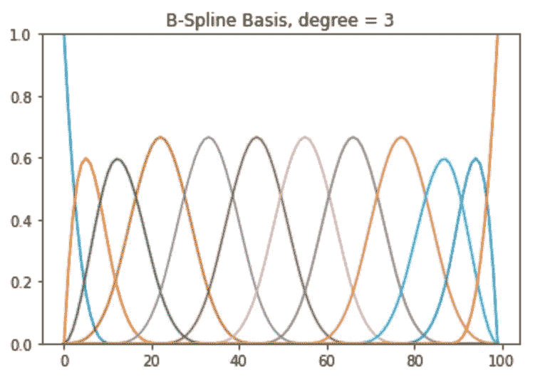
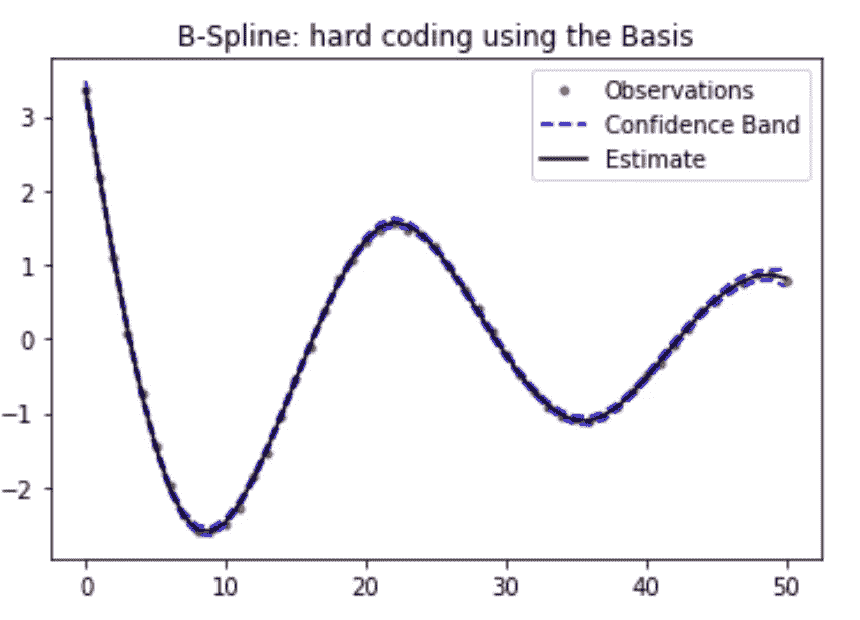
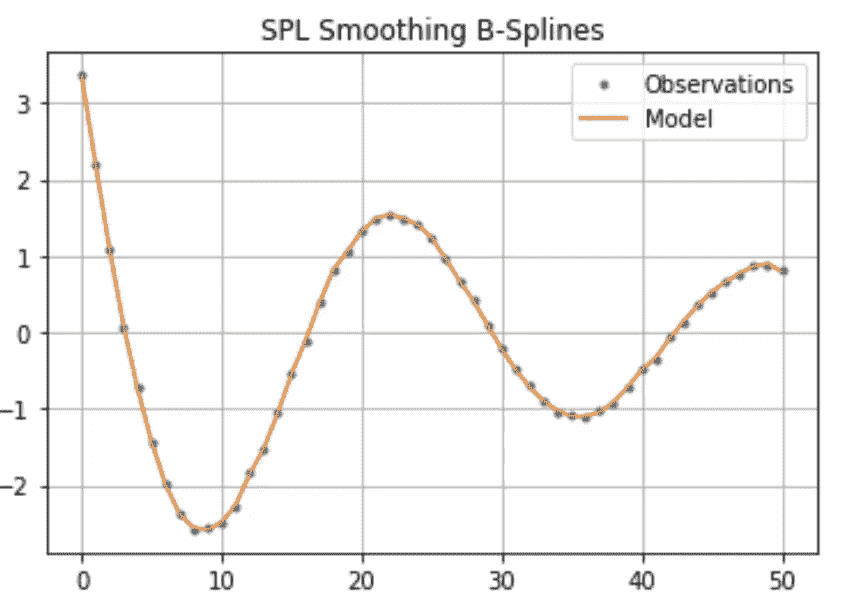
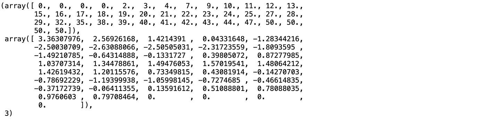

# Python 中用于要素选择和数据平滑的样条

> 原文：<https://towardsdatascience.com/splines-for-feature-selection-and-data-smoothing-python-ed5ad31436d5?source=collection_archive---------9----------------------->



(图片由作者提供)

## 描述和展示如何使用样条曲线进行降维和去除数据集中的噪声

因此，本周我结束了用 Python 编写样条函数的工作，并对信息的状态和缺乏对 Python 样条函数初学者的支持文章感到震惊。数学方面的信息已经很多了。本文的目标是分解 B 样条和光滑样条理论的应用。

如果有帮助的话，请考虑给我一个关注来支持未来的文章。

# 概述

*   [什么是样条？](#ec04)
*   [样条是如何使用的？](#c805)
*   [演练 1:从零开始的 B 样条曲线，这是最灵活但数学上最实用的方法](#07bb)
*   [演练 2:来自 SciPy 的 splrep，用于轻松平滑 B 样条线](#532c)
*   [总结用于特征提取的样条](#982b)
*   [结论](#48da)

# 什么是样条？

样条本质上是分段回归线。试图在一组非常动态的数据上拟合一条回归线会导致很多妥协。你可以裁剪你的线条，使其很好地适应某个区域，但结果往往是在其他区域过度适应。相反，我们将观察结果分解成不同的“结”，并在由这些结或分界点分割的每个线段上拟合不同的回归线。

# 样条是如何使用的？

通常，当我们查看样条的输入时，我们使用 1D 列表或数组。这可能是我们记录了一个病人的心率，每秒记录一次，持续 30 秒。这创建了一个具有 30 个特征的观察，或者在这 30 秒中的每一秒记录的心率。然后，我们将对这一观察值进行样条拟合，详细说明我们的结(t)和顺序(k)，这将返回一条最佳拟合线，它有自己的系数，我们可以按原样利用或进行预测。

## **如果我们的目标只是平滑数据和去除噪声，我们可以:**

1.  在观察值上拟合/调整样条
2.  通过输入我们希望预测心率的准确时间来提取心率(在本例中，是一个范围为 0:30 的列表/数组)
3.  将此输出保存为我们 30 个功能中每个功能的新数据

## **相反，如果我们的目标是减少数据的维数并进行特征选择，我们可以:**

1.  在观察值上拟合/调整样条
2.  提取我们的样条曲线的系数(每个结的 Beta 值),并将它们保存为我们的新特征数据(系数的数量取决于你的样条曲线的复杂性，但是举例来说，你可以将你的特征从 30 个减少到 8 个)
3.  重复步骤 1 和 2 进行多次观察(我们已经对多名患者的心脏进行了超过 30 秒的跟踪)
4.  在 n 个患者作为行，m 个提取的系数作为列的新数据帧上运行新的模型，例如回归或随机森林

废话说够了，让我们看看它的实际效果吧…

# 演练 1: B 样条从零开始，最灵活的，但数学上动手的方法

首先，这是我们的功能，在我们设置样条线的基础时，均匀分布我们的结的位置(并根据选择的度数考虑缓冲结)。

```
def knot_points(nKnots, x, degree):
#create the knot locations    
knots = np.linspace(x[0], x[-1], nKnots) 

    lo = min(x[0], knots[0]) #we have to add these min and values to   conform by adding preceding and proceeding values
    hi = max(x[-1], knots[-1])
    augmented_knots = np.append(np.append([lo]*degree, knots), [hi]*degree)
    return augmented_knotsloo = LeaveOneOut()
```

我们正在使用的数据是一系列无线电信号。每次观测都是不同的无线电信号，每个特征都是给定时间点的信号幅度。

```
x1 = pd.read_csv("data.csv", header=None)y = np.array(x1.values[0,:])
x = np.array(range(0,len(x1[0]))
```

y 和 x 都应该具有(51)的形状，等于特征/列的数量。数组 x 表示特征的数量，这将有助于指定我们的样条曲线和图形的输出。数组 y 代表一个观察值及其各自的振幅测量值。

所以让我们开始吧！

```
nknots = 8
degree = 3
k=degree
DOF = nknots + degree +1
augmented_t = knot_points(nknots, x, degree)
```

我们设置了几个将要使用的变量(DOF =自由度)。下面我们开始手动拟合样条曲线。

```
bs2 = BSpline(augmented_t, np.eye(DOF), degree, extrapolate=False) #setting up the basis
B = bs2(x)[:,:-2] #Creating the basis for x & getting rid of extra column of zeroes from padding for order
# Least square estimation
x_proj_matrix = B@np.linalg.inv(B.T@B)[@B](http://twitter.com/B).T
coeff = np.linalg.lstsq(B, y.T,rcond=-1)[0].T
yhat = B@coeffn = x.shape[0]
K = np.trace(x_proj_matrix)
sigma2 = (1/(n-K))*(y-yhat).T@(y-yhat) #SSE/(n-p)
width = np.diag(sigma2*x_proj_matrix)**0.5
y_neg_ci = yhat-4*width
y_pos_ci = yhat+4*width
```

我们将基函数与 x 和 y 拟合，以计算系数，然后我们可以用这些系数进行预测。我们还可以使用 X 投影矩阵直接计算协方差，并给出我们在下图中看到的置信区间。



(图片由作者提供)

所以我们看到一些用来创建这些样条的数学。虽然手动计算似乎不是最有趣的，但您可以开始轻松地提取其他强大的信息，如协方差，以围绕我们的趋势线创建这些置信区间。

# 演练 2:来自 SCIPY 的 SPLREP，用于轻松平滑 B 样条线

现在让我们来看看示例 2:使用平滑样条线遍历一个示例。这些稍微复杂一些，因为它们包含一个平衡方差和偏差的平滑超参数。我们可以使用留一个的交叉验证来找到 MSE，并在此选择最佳平滑参数。好处是这个函数会自动为我们设置结数组并返回它。

```
lambs = np.array([0.001,0.005, 0.1,0.25,0.5])
for i in lambs:error = []
    for trg, tst in loo.split(x):
        spl = splrep(x[trg], y[trg],s=i)
        pred = splev(x[tst],spl)[0]
        true = y[tst][0]
        error.append((pred - true)**2)
    mse = mean(error)
```

我们的最佳λ(平滑参数)结果是 0.005。

```
spl = splrep(x, y, s=0.005)
y_hat = splev(x, spl)
```



(图片由作者提供)

还有一个有用的方法是调用一个拟合的 splrep 模型，如下所示，这给了我们一个自生成节点数组、系数和函数的幂/阶的清晰输出。

```
spl
```



(图片由作者提供)

现在，如果我们要应用以上所有这些来平滑我们的数据，我们可以循环通过每个观察/行，在循环中的迭代的结果 x 和 y 数组上拟合样条，然后预测新的特征。

# 用于特征提取的概括样条

平滑的例子到此结束。我将在这里简要总结特征提取，并在下一篇文章中进行更深入的探讨。本质上，我们不是预测新的特征值，而是输出样条产生的β/系数。例如，使用上面的 B 样条曲线，我们可以得到以下输出:

```
bs = make_lsq_spline(x, y, augmented_t, k=degree)
bs.c
```


(图片由作者提供)

现在，我们可以遍历我们的数据框，在每一行上训练一个样条，并返回由上述样条中的 Betas 组成的 9 个要素，而不是 51 个要素。这可以帮助我们克服高维度和对较小数据集的过度拟合，同时仍然保持较高的解释方差。总的来说，这种样条特征选择方法甚至可以击败 PCA 主成分分析，以更少的所需特征获得更好的模型性能分数。

感谢阅读，如果你喜欢这篇文章，请给我一个关注！