# 幽灵——用机器学习渲染恐怖面孔

> 原文：<https://towardsdatascience.com/spookygan-rendering-scary-faces-with-machine-learning-c390000206c6?source=collection_archive---------27----------------------->

## **如何使用 StyleGAN 2、VQGAN 和 CLIP 为万圣节创建幽灵般的图像和视频**

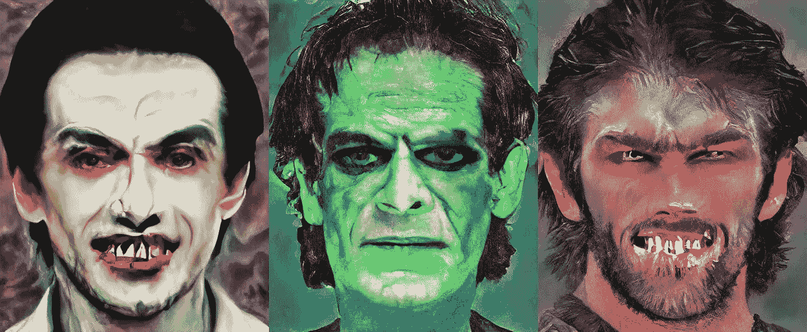

**来自斯布克根的样本图像**，作者图像

使用文本短语引导生成性对抗网络(gan)生成新图像的趋势日益增长。当 OpenAI 推出他们的 CLIP [1]系统来比较文本和图片时，它是用于文本到图像生成的自然选择。两种流行的 GAN 是来自 Nvidia 的 style gan 2[2]和 Esser 等人的 VQGAN[3]。有开源项目来指导这两个 gan 生成图像。例如，O. Patashnik 等人的 Style CLIP[4]和凯瑟琳·克劳森的 VQGAN+CLIP 分别与 Style GAN 2 和 VQGAN 一起工作。在对这两种系统进行试验后，我发现它们各有利弊。但是同时使用这两种 GANs 会提供最好的结果。

本文将展示 CLIP 如何指导 StyleGAN 2 和 VQGAN 创建恐怖面孔，即吸血鬼和怪物。然后我将展示如何使用这些图像来制作“噩梦”视频。我称系统为间谍。

# 间谍概述

这里有一个图表，显示了间谍网的主要组成部分。您可以在以下章节中阅读组件的详细内容。

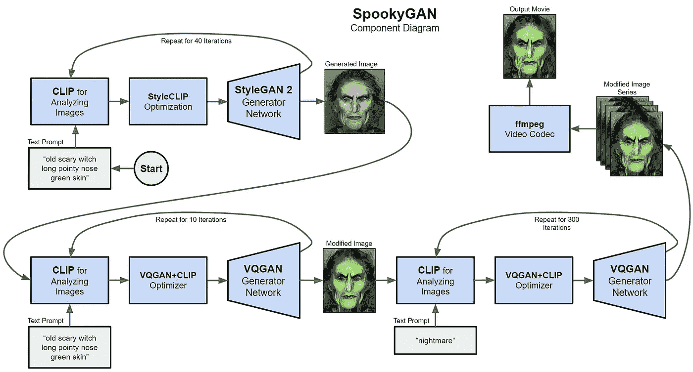

**斯布克干成分，**作者图

创建过程从使用 StyleCLIP 指导的 StyleGAN 2 生成图像开始。你可以输入一个像“老可怕的女巫长尖鼻子绿色屏幕”的文本提示，系统会在一些迭代后生成一个图像，像 40。StyleGAN 2 系统使用的模型是用 Flickr [5]中真人的脸训练出来的，所以输出看起来并不可怕。

下一步是获取输出图像，并按照 Adam 优化器使用 CLIP 的指示，使用 VQGAN 对其进行修改。您可以使用与生成初始图像相同的提示，也可以根据需要对其进行修改。只需要大约 10 次迭代就能“惊吓”图像。

最后一步是再次使用 VQGAN 和 CLIP 生成视频。系统将使用简单的文本提示“噩梦”修改可怕的图像 300 次，并将图像写入一系列文件。 [FFmpeg](https://www.ffmpeg.org/) 编解码器将图像压缩成 mp4 电影供观看。

# 系统详细信息

以下部分将更详细地描述每个组件。

## StyleGAN 2

NVidia 对 StyleGAN 的第二次迭代写在他们的论文《分析和改善 StyleGAN 的图像质量》[2]中。他们说…

> …我们改进的模型重新定义了无条件图像建模的技术水平，既包括现有的分布质量度量，也包括感知的图像质量。— T. Karras，et al .

一般来说，GANs 由发电机网络和鉴别器网络组成。在训练过程中，生成器试图创建逼真的图像，鉴别器试图辨别哪些图像是真实的，哪些图像是假的。我用于初始幽灵图像的 GAN 是使用来自 NVidia 的 Flickr-Faces-HQ 数据集的图像训练的。

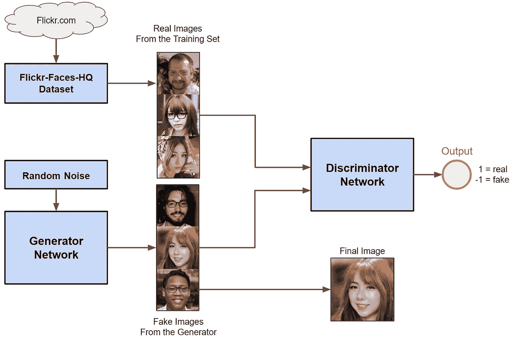

**生成性对抗网络中的组件**，作者图片

## 夹子

对比语言-图像预训练(CLIP)是 OpenAI 的一对编码器，在他们的论文“从自然语言监督中学习可转移的视觉模型”[1]中进行了描述。在论文中，作者…

> ...证明预测哪个标题与哪个图像搭配的简单预训练任务是一种高效且可扩展的方法，可以在从互联网收集的 4 亿(图像、文本)对的数据集上从头开始学习[最先进的]图像表示。亚历克·拉德福德等人。

经过训练后，剪辑图像编码器可以将图像转换为 512 个数字的列表，称为图像嵌入，它捕获图像的“特征”。剪辑文本编码器可以将文本短语转换为类似的数字列表，该列表可以捕获文本的特征。

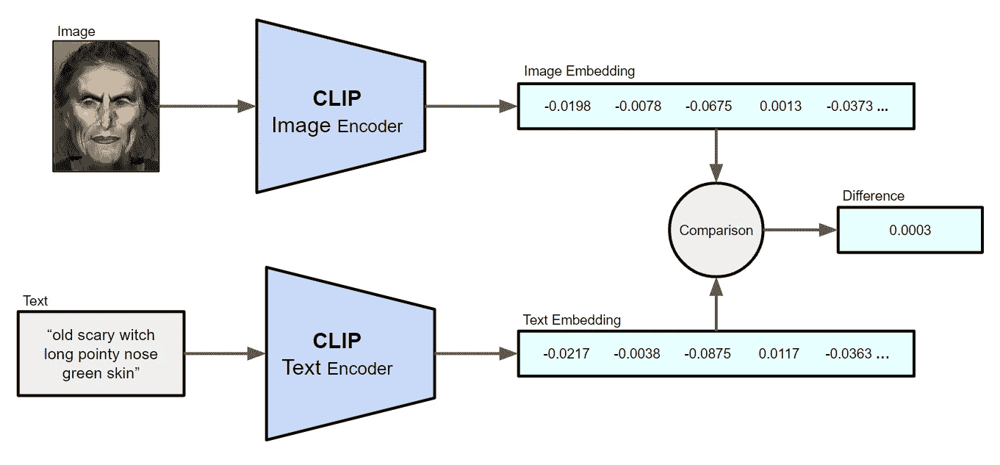

**剪辑组件图**，图片作者

如果一幅图像和一个短语描述了大致相同的东西，那么在数学上比较时，嵌入将是相似的。这两个编码器模型可用于使用 GANs 增量地从文本生成图像。

## 样式夹

正如您可能从名称中猜到的那样，StyleCLIP 是一个使用剪辑编码器来控制 StyleGAN 2 从文本短语生成图像的系统。在他们的论文“StyleCLIP:文本驱动的 StyleGAN 图像处理”中，作者…

> …引入优化方案，利用基于剪辑的损失来修改输入潜在向量，以响应用户提供的文本提示。—或者帕塔什尼克等人。

StyleCLIP 通过迭代地将输入更改为样式 GAN 2 来控制生成的图像，以匹配 CLIP 测量的文本提示。

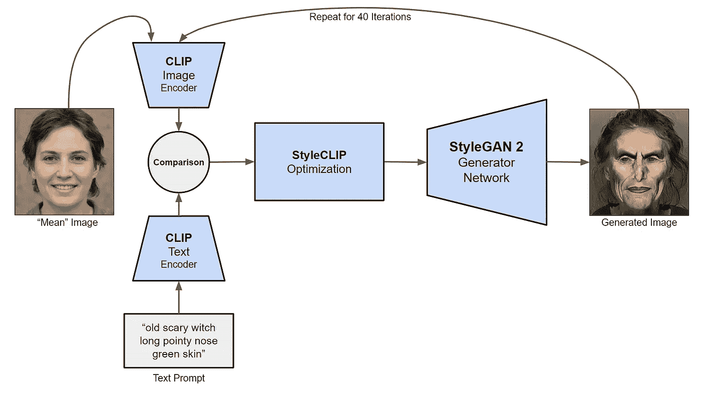

**style clip 细节，**作者配图

系统从发送到剪辑图像编码器的 StyleGAN 2 模型定义的平均图像开始。文本提示被发送到剪辑文本编码器，并且两个嵌入被比较。然后，StyleCLIP 优化器控制生成器创建图像，这些图像逐渐接近提示中描述的功能。StyleCLIP 通过在每次迭代中最小化图像嵌入和文本嵌入之间的差异来实现这一点。在这个阶段，学习率被设置为 10%,因此每次迭代中的变化可能很大。大约经过 40 次后，图像将开始看起来像提示所描述的那样。

正如在概述中提到的，StyleGAN 2 模型是使用 Flickr 上发布的真实人脸进行训练的。输出通常看起来像真人，而不是万圣节的坏人，像女巫或怪物。但是 VQGAN 可以带我们去那里。

## VQGAN

大多数 gan 使用卷积神经网络(CNN)作为发生器，使用反向 CNN 作为鉴别器。然而，在论文“驯服用于高分辨率图像合成的变压器”[3]中描述了一种新的混合变压器-GAN，称为矢量量化生成对抗网络(VQGAN)。作者…

> …演示如何将 CNN 的感应偏置效率与变压器的表现力相结合，使其能够建模并合成高分辨率图像。帕特里克·埃塞尔等人。

我使用的 VQGAN 模型是在来自 WikiArt.org 的数万张图片上训练出来的。下图显示了 VQGAN 的主要组件。

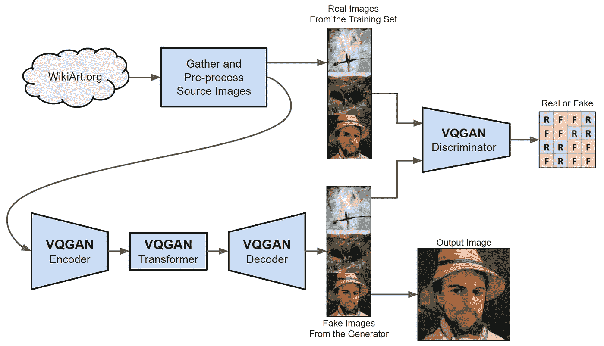

**VQGAN 组件**，作者提供的图表

VQGAN 在概念上像编解码器一样工作，因为它被训练成将图像编码到嵌入式空间中，其中变换器用于定义子图像部分的“码本”。然后，解码器创建一个与原始图像非常相似的输出图像。

在训练期间，VQGAN 鉴别器查看网格中的子图像，并评估每个部分作为改进的反馈。这使得模型非常灵活，可以创建多种类型的图像。然而，它的缺点之一是 VQGAN 需要帮助从头生成新图像。这就是 CLIP 的用武之地。

## VQGAN+CLIP

类似于 StyleGAN 2 可以被引导从文本提示创建图像的方式，VQGAN 可以由 CLIP 控制来修改输入图像，以更接近短语所描述的内容。凯瑟琳·克劳森，一个在 GitHub 上被称为[克劳森 kb](https://github.com/crowsonkb) 的开发者，为此创造了一些 Python 代码。下图显示了 VQGAN 和 CLIP 如何协同工作来迭代修改图像。

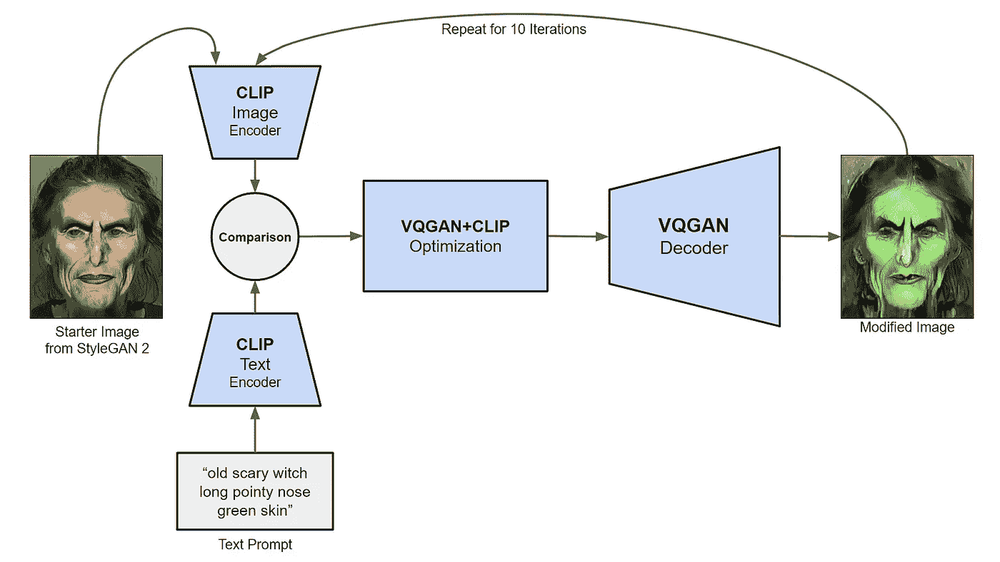

**VQGAN 和剪辑**，作者配图

系统从 StyleGAN 2 创建的输出图像开始，并被发送到剪辑图像编码器。类似于 StyleCLIP 的过程运行大约十次，图像看起来甚至更像提示所描述的。

## 创作电影

我发现我可以通过使用 VQGAN 和 CLIP 来创建图像的视频，只需使用一个通用的文本提示，如“噩梦”,并降低优化器的学习速度。我把学习率调低到 1%来创建视频，所以帧会慢慢变化。这是一张展示电影制作要素的图表。

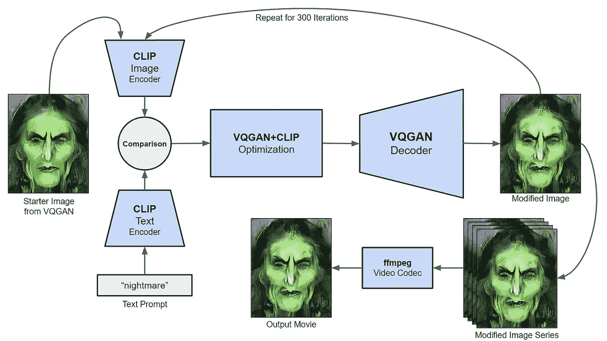

**用 VQGAN 和剪辑**制作电影，图片作者

这一次，系统从 VQGAN 创建的修改图像开始，并被发送到剪辑图像编码器。提示简直是“噩梦。”该系统运行 300 帧，以每秒 30 帧的速度生成 10 秒的视频。

ffmpeg 编解码器用于生成 mp4 电影文件。下面是创建电影的命令。

```
ffmpeg -r 30 -i /content/steps/%4d.png -c:v libx264 witch.mp4
```

-r 选项指定帧速率为 30 fps。-i 选项指示图像的位置，而-c-v 选项指定 H.264 视频编解码器。

这是视频。

**斯布克根女巫，**作者视频

你可以看到女巫的脸是如何变成看起来像一个眼睛里有牙齿的头骨的。对我来说这看起来就像一场噩梦！😲

# 可疑结果

以下是来自斯布克根的更多结果。图像来自左边的 StyleGAN 2 和右边的 VQGAN。文字提示显示在标题中。请务必查看附录以查看更多视频。

## 幽灵女巫

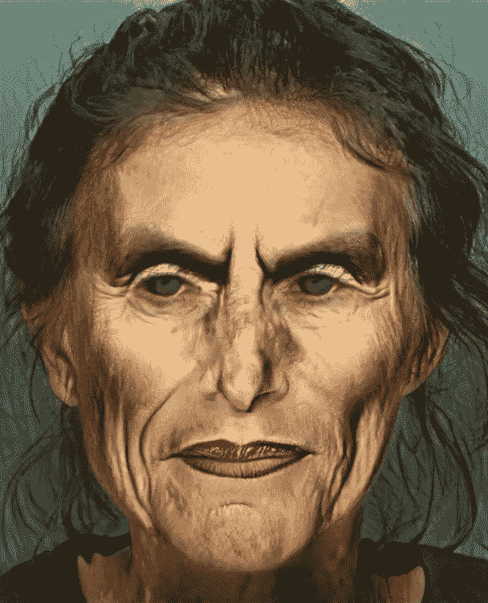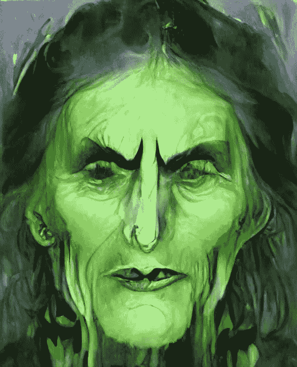

**古灵精怪的女巫长着尖尖的鼻子绿色的皮肤**，图片作者

## 怪异的吸血鬼

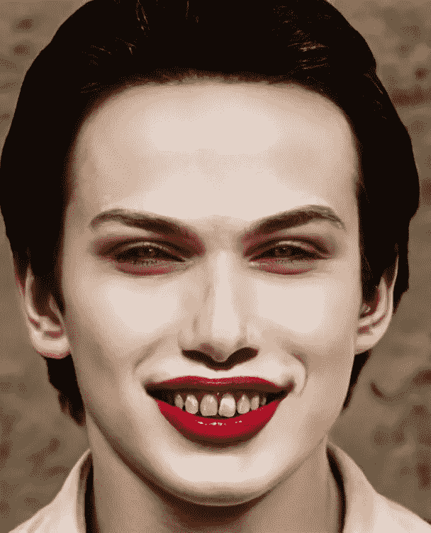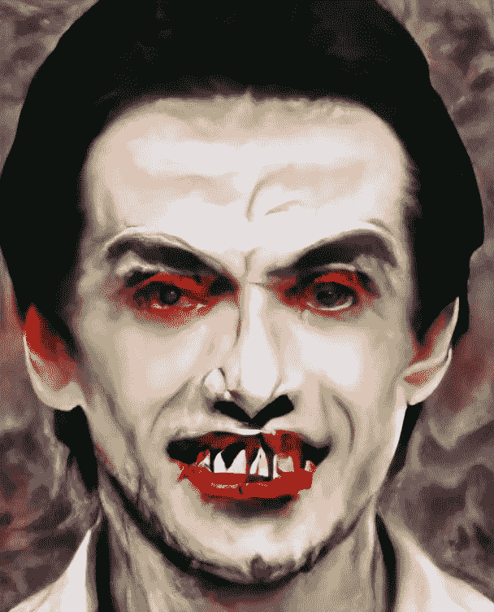

**德拉库拉肌肉发达的老年男性脸色苍白皮肤尖牙向后梳头发**，图片作者

## 怪异的弗兰肯斯坦怪物

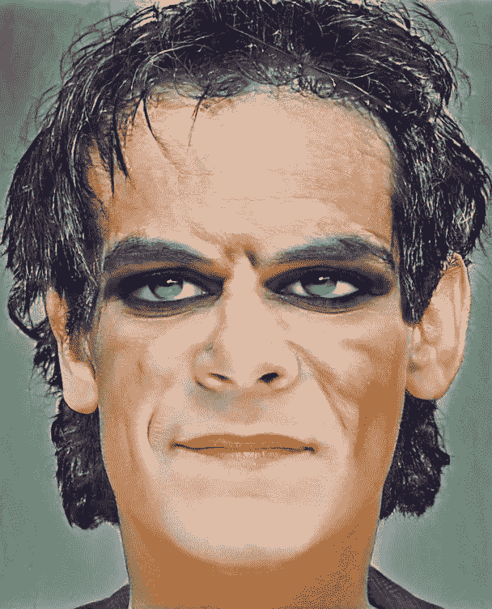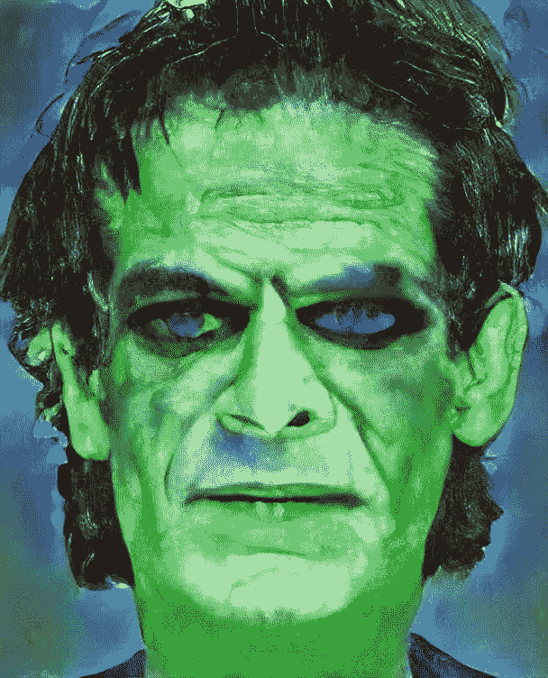

**阴森森的弗兰肯斯坦怪物大眉毛高额头绿色皮肤**，图片由作者提供

## 幽灵狼人

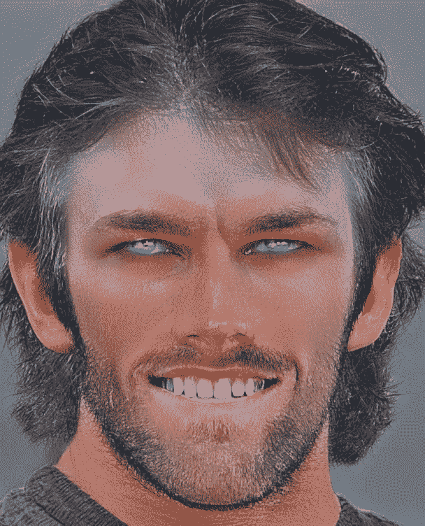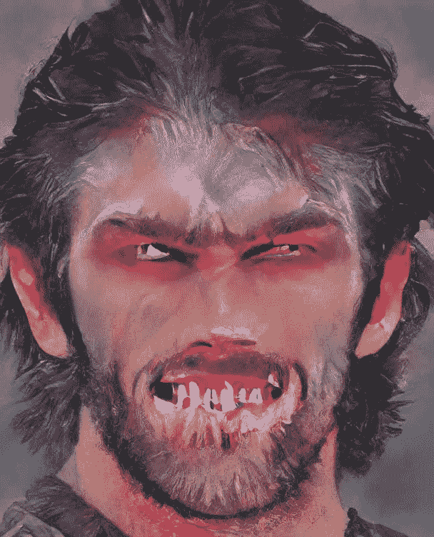

**阴森森的狼人男性浓密的胡须鬓角獠牙发光的眼睛**，图片由作者提供

# 源代码

使用 SpookyGAN 的 Google Colabs 在这里是。

# 感谢

我要感谢詹尼弗·林和奥利弗·斯特瑞普对这个项目的帮助。

# 参考

[1]a .拉德福德等人的剪辑，[从自然语言监督中学习可转移的视觉模型](https://cdn.openai.com/papers/Learning_Transferable_Visual_Models_From_Natural_Language_Supervision.pdf) (2021)

[2]t . Karras、S. Laine、M. Aittala、J. Hellsten、J. Lehtinen 和 T. Aila 的 StyleGAN 2，[分析和改善 StyleGAN 的图像质量](https://arxiv.org/pdf/1912.04958.pdf) (2020)

[3]p . Esser、R. Rombach 和 B. Ommer 的 VQGAN，[驯服高分辨率图像合成的变压器](https://arxiv.org/pdf/2012.09841.pdf) (2020)

[4]o . Patashnik，Z. Wu，e .，D. Cohen-Or 和 D. Lischinski 的 StyleCLIP， [StyleCLIP:文本驱动的 StyleGAN 图像处理](https://arxiv.org/pdf/2103.17249.pdf) (2021)

[5]t . Karras，J. Hellsten 编写的 FFHQ， [Flickr-Faces-HQ](https://github.com/NVlabs/ffhq-dataset) (2018 年)

# 附录

下面是三个视频，来自提示“噩梦”，学习率设置为 1%的 VQGAN+剪辑优化器。

**幽灵吸血鬼**，作者视频

**斯布克根·弗兰肯斯坦的怪物**，视频作者

**幽灵狼人**，视频作者

为了无限制地访问 Medium 上的所有文章，[成为会员](https://robgon.medium.com/membership)，每月支付 5 美元。非会员每月只能看三个锁定的故事。