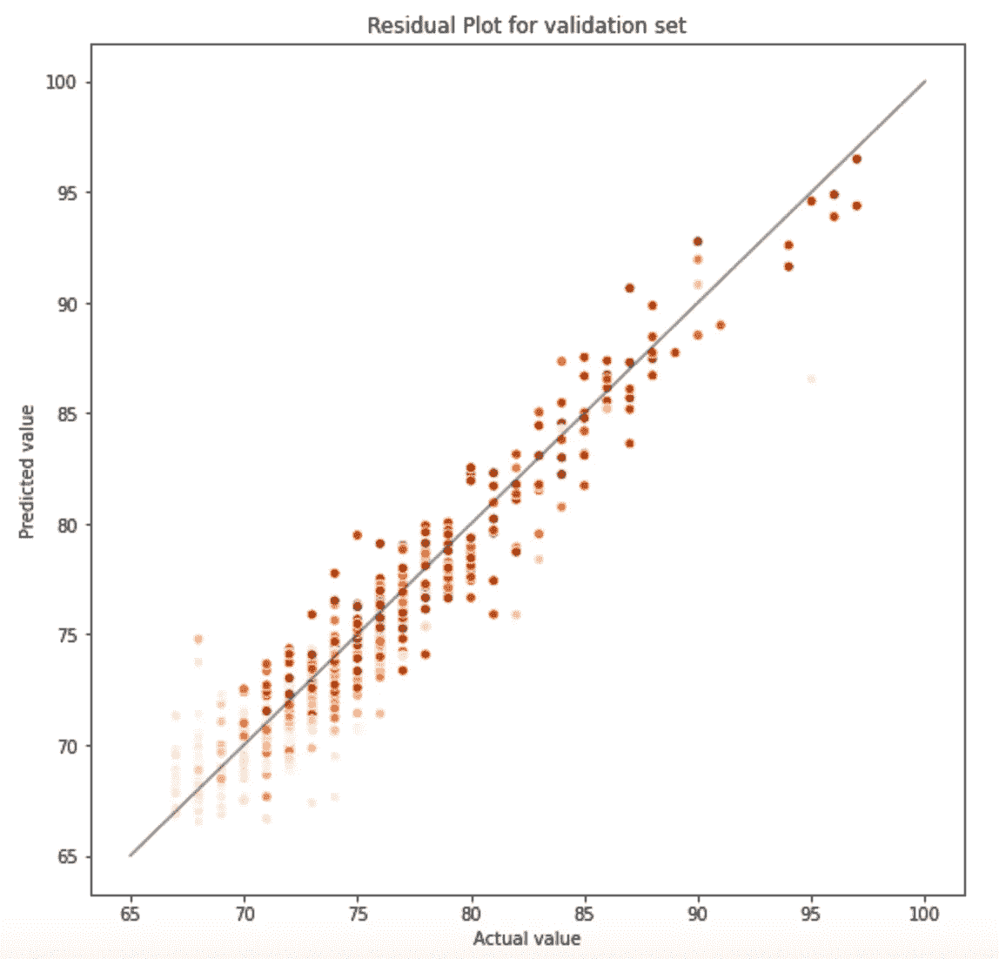

# 体育分析— NBA 2K 收视率预测

> 原文：<https://towardsdatascience.com/sport-analytics-nba-2k-ratings-prediction-b7b72e2e72eb?source=collection_archive---------63----------------------->

## 下一个 2K22 评级是什么？是不是有些队伍被编辑高估了？哪些统计数据对评分影响最大？让我们找出这些答案。

在 [Unsplash](https://unsplash.com?utm_source=medium&utm_medium=referral) 上 [NeONBRAND](https://unsplash.com/@neonbrand?utm_source=medium&utm_medium=referral) 拍摄的照片

作为一名对体育，尤其是篮球充满热情的数据科学家，我正在撰写一系列与**体育分析**相关的文章。它将从经典的回归或分类问题发展到更高级的计算机视觉应用。

NBA 2K 是自 1999 年以来开发的一系列篮球运动模拟视频游戏，每年发行一次。最新版是 2K21，2020 年 9 月 4 日发行。视频游戏现在由 2K Sports 发布。

在每一个版本中，所有 NBA 现役球员和一些传奇人物都被单独**评分为 99 分**。那些评级总是会引起讨论、辩论、反应…甚至是来自玩家自己。

这篇文章的目的是建立一个模型来预测每个玩家的 99 分等级，使用与玩家本身相关的特征和上一年的游戏统计数据。当我们试图预测一个数字时，这是一个*回归*问题。

## 数据源

当谈到 NBA 的数据时，大量各种各样的公开数据存在，这些统计数据被联盟本身广泛使用。数据是 NBA 文化的一部分。

从 2K14 到 2K21，NBA 2K 收视率在 https://hoopshype.com/nba2k/[提供。这 8 年将是我们的项目范围。](https://hoopshype.com/nba2k/)

我们观察到，自 2015 年以来，评级的分布非常相似，中位数在[74.5；76.9]和相当恒定的四分位数。

在 2K14 中，分数处于更广阔的空间，中位数更低(71.4)。这种演变可能是由于 2K 体育改变了收视率策略。这是一个需要注意的重要信息，因为它可能会引入偏差并降低模型性能。

关于 NBA 球员的统计数据，可以在[https://www.basketball-reference.com/leagues](https://www.basketball-reference.com/leagues)上检索到。我们将只废弃 2013–2014 至 2020–2021 赛季，以便与 2K 数据周期保持一致。

网站上有许多视图，这里我们只关注*总计*和*高级*选项卡。

数据集中的要素类型:

*   年龄、职位和团队
*   已玩和已开始的游戏数，获胜百分比，已玩时间
*   投篮得分(3 分，2 分，罚球…)
*   篮板，助攻，犯规，盖帽，抢断…

为了丰富我们的数据集，我们将通过组合变量来执行**特征工程**，特别是通过按分钟和所玩游戏以及位置和团队 one-hot 编码进行标准化。

## 建模

数据集在与时间相关的训练/测试/验证中被分割，以避免模型中的**泄漏**。请注意，我们删除了 2014 年，因为评级分布与随后几年差异太大。

许多算法可以用来执行回归:从基本的线性回归到高级的树方法。

比较不同的算法性能，我们将选择 XGBoost 并用网格搜索进行超参数调优。

在**验证集**(对应于 2K21 评级)上，我们获得了 1.75 的 MSE 和 1.33 的 MAE，残差如下:

圆点的颜色代表玩游戏的次数。我们观察到，主要的异常值是在上一个赛季没有打足够比赛的球员(例如 2019/20 赛季的斯蒂芬·库里)。在这种情况下，统计数据可能很难代表真实的玩家价值，这种偏差被校正了 2K。

## 模型解释

现在我们有了一个性能合理的模型，我们可以打开*黑盒*并转向可解释的机器学习。

目标是分析模型背后的东西，以及哪些特征对评级预测**有更大的影响**。换句话说，我们可以突出显示哪些玩家属性将对他们的 2K 评级产生最大影响(无论是积极的还是消极的)。

> SHAP (SHapley 附加解释)的目标是通过计算每个特征对预测的贡献来解释实例 x 的预测。
> 
> [可解释的机器学习](https://christophm.github.io/interpretable-ml-book/)

使用 SHAP 库，我们可以绘制出**前 10 个最重要的特性**(左)和**特性重要性与特性效果的组合**(右)。

这两大特点反映了球员在球队中的重要性，他的平均上场时间和在前五场比赛中的百分比。我们还注意到，整体团队表现(赢得份额的百分比)对个人玩家评级有积极影响。

任何位置(后卫、中锋……)都有利于获得更高的收视率，并且该模型似乎也不倾向于特定的球队(出现在特征重要性图中的第一个球队是排名第 27 位的金州勇士队)。

最后，我们可以探索两个特定玩家的 **SHAP 解释力图**，以直观显示哪些功能产生了积极影响(=红色评分增加)和消极影响(=蓝色评分减少)。

鲁迪·戈贝尔，犹他爵士队的中锋，两届年度最佳防守球员，对他的球队有很大的影响(个人得分率，%GS，%MPPG，DWS)，但是他的低得分降低了他 0.44 的评分

蒙特雷兹·哈雷尔赢得 **2020 年 NBA 年度第六人**。我们观察到%GS 降低了他的得分，这被他在球场上花费的时间和他的高进攻影响力所抵消(FGPM，PTSPM，PER)

**结论**

使用玩家统计数据，我构建了一个 XGBoost 模型，该模型可以很好地预测 2K 收视率。这说明 2K 记谱法是全局**公正**和**诚实地代表了球场上的现实**。可以发现一些例外，例如当一名球员在赛季中受伤时。

操纵篮球数据非常有趣，模型解释非常有趣，可以正确理解每个预测并深入了解球员的属性。

2K 评分预测是一个非常具体的用例，但体育分析是一个无限的游乐场，有许多未充分利用的数据**我将在我的数据科学之旅中继续探索。**

所有代码都可以在 [Github](https://github.com/benrallet/NBA-2K-rating) 中找到。

## 参考

[1] NBA 2K，[维基百科](https://fr.wikipedia.org/wiki/NBA_2K) (2020)

[2] Christoph Molnar，[可解释的机器学习](https://christophm.github.io/interpretable-ml-book/) (2021)